# Git学习

## 1.git及git仓库介绍

### 1.1git核心部分介绍

> 概念：
>
> Git 是一个开源的分布式版本控制系统，用于敏捷高效地处理任何或小或大的项目。
>
> Git 是 Linus Torvalds 为了帮助管理 Linux 内核开发而开发的一个开放源码的版本控制软件。
>
> Git 与常用的版本控制工具 CVS, Subversion 等不同，它采用了分布式版本库的方式，不必服务器端软件支持。

### 1.2github仓库介绍

**GitHub** **简介:**

GitHub，分为两个单词“Git”和“Hub”。Git是指分布式版本控制，即协同开发者不需要连接同一个网络，可以直接通过Git来实现同一项目由世界各地的程序员完成。而Hub指中心。两个词合起来，就是一个可以存放许多用Git进行版本控制的项目的网站。

 

**GitHub** **使用：**

GitHub的注册过程就不说了。用户分为收费和免费。收费可以提供私有仓库的使用权，免费用户可以使用私有仓库。

   注册完毕后，可以先阅读GitHub自带的guide

由于GitHub是国外网站，访问速度很慢，这里就不演示如何注册海外版的代码仓库了

### 1.3码云仓库（Gitee）介绍

[Gitee 帮助中心](https://gitee.com/help) / [快速开始](https://gitee.com/help/categories/19)/ 帮助详情

#### 关于 Gitee

[快速入门](https://gitee.com/help/labels/34) [Git 入门](https://gitee.com/help/labels/35)

Gitee 是开源中国社区2013年推出的基于 Git 的代码托管服务，目前已经成为国内最大的代码托管平台，致力于为国内开发者提供优质稳定的托管服务。

#### 主要功能

Gitee 除了提供最基础的 Git 代码托管之外，还提供代码在线查看、历史版本查看、Fork、Pull Request、打包下载任意版本、Issue、Wiki 、保护分支、代码质量检测、PaaS项目演示等方便管理、开发、协作、共享的功能。

#### Git 版本控制入门

不了解Git请查看权威Git书籍 [ProGit（中文版）](http://git.oschina.net/progit/)。

一份很好的 Git 入门教程，[点击这里查看](http://www.liaoxuefeng.com/wiki/0013739516305929606dd18361248578c67b8067c8c017b000/001373962845513aefd77a99f4145f0a2c7a7ca057e7570000)。

Git客户端下载地址： [官方Git](http://git-scm.com/downloads) － [TortoiseGit](http://tortoisegit.org/download/) － [SourceTree](https://www.sourcetreeapp.com/)

> 总结：
>
> git主要分为两部分，一部分是操作仓库的核心代码部分，另一部分是git仓库，git仓库分为本地仓库和远程仓库，Gitee和GitHub都属于远程仓库
>
> 远程仓库还分为公有和私有两种，Gitee和GitHub属于公有仓库，因为他们是放在互联网上面向大众 用户的，我们以后上班的公司中大部分会使用本地搭建的远程git仓库，这种仓库只能通过公司的指定域名或者网络环境才能访问，所以这种仓库属于私有仓库，经常使用的就是开源的gitlab或者gitblit等

## 2.git安装

windows安装地址

https://npm.taobao.org/mirrors/git-for-windows/

访问当前地址下载最新版本的git安装环境

安装成功之后再控制台输入

```sh
 git --version
```

输出了版本号说明安装成功了

## 3.创建在线仓库

### 3.1以Gitee码云为例子我们在码云上注册一个账号

打开码云官方网站

https://gitee.com/

首先注册一个账号

https://gitee.com/signup

注册成功之后登陆个人账号


登陆成功之后会出现如下页面

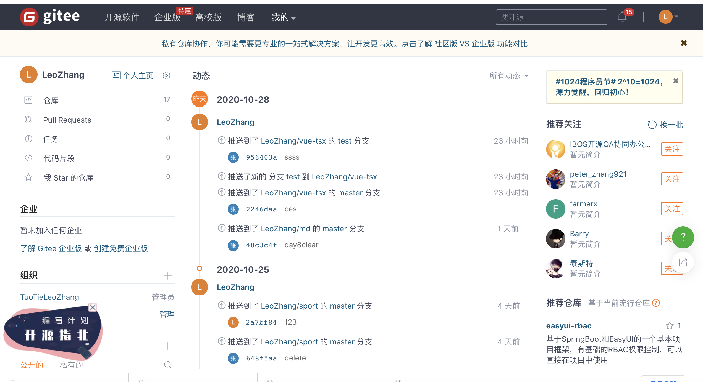

左侧就是功能部分，中间是仓库动态，右面是推荐信息。

### 3.2在码云中创建个人仓库

点击仓库，打开仓库页面，在仓库页面就可以看见我们已有的仓库

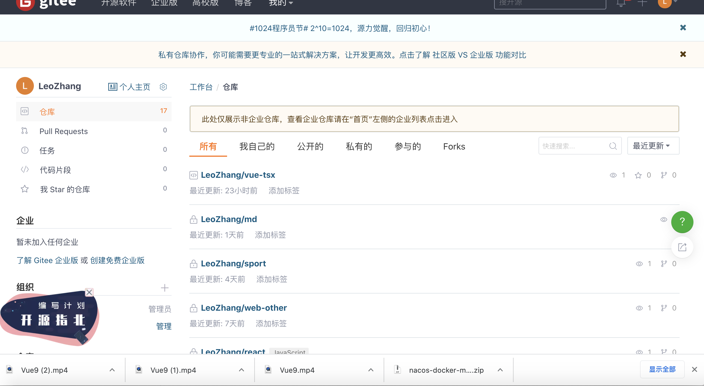

在仓库的左侧往下拉，找到仓库列表，如图所示

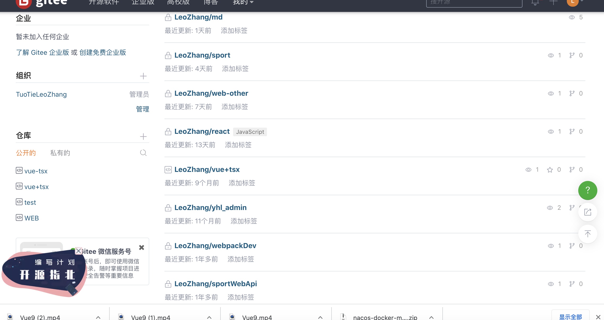

点击左侧仓库部分标题右边的➕来创建仓库

我们按照页面的内容填写并创建一个私有的个人仓库

仓库名可以填写为web-test，

描述可以随便填写，

使用readme初始化仓库

语言使用javascript

并且选择单分支模型

创建完毕之后如下图所示

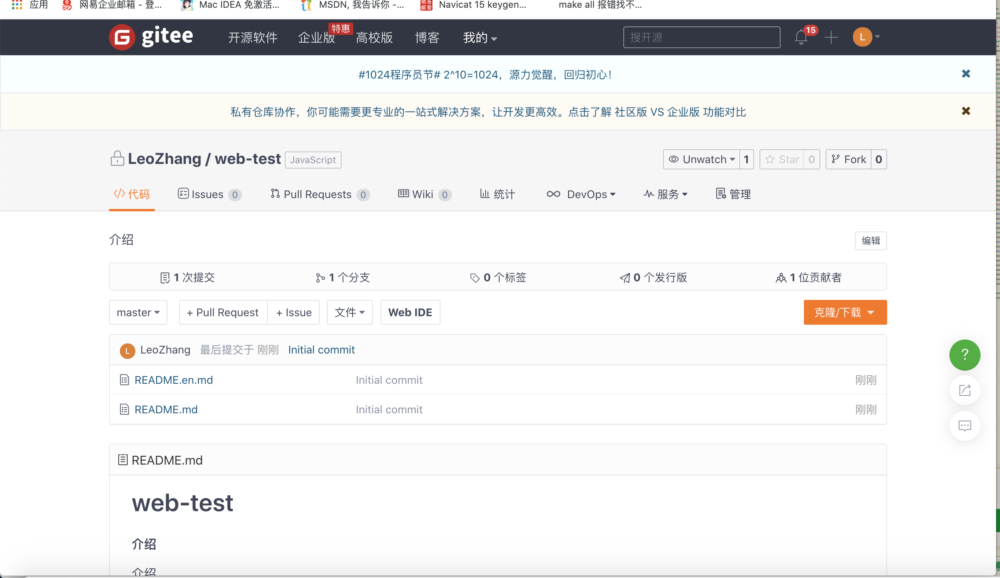

### 3.3删除个人仓库

在仓库中点击管理，打开如下的页面

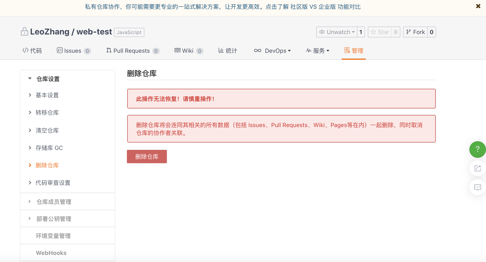

然后点击删除仓库，会产生如下图效果

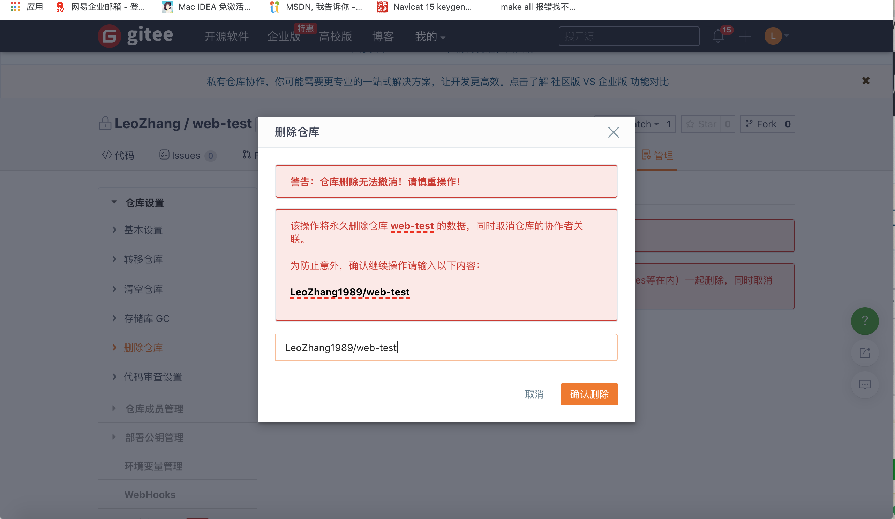

点击确认删除时候会继续有下一步提示

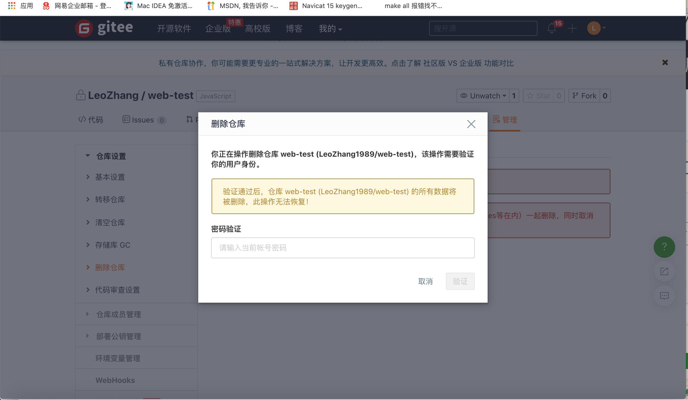

这里要输入个人账号的密码。输入正确之后会出现如下字样

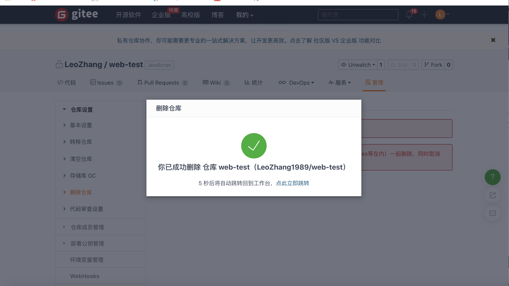

代表删除成功。

## 4.个人仓库的常用操作

可以成功在远程仓库创建和删除仓库之后我们重新创建一个名为web-test的个人仓库并且不删除他。然后我们来学习一下如何在本地使用远程仓库来同步代码。

### 4.1在本地项目中克隆远程仓库

在自己的编辑器中新创建一个空项目名为git

然后使用命令行工具打开git文件夹并在其内部输入

```sh
 git clone 自己的码云仓库地址
```

地址就是打开你仓库之后的浏览器上的url。

第一次访问会提示输入账号密码

```sh
Cloning into 'web-test'...
Username for 'https://gitee.com': 
```

账号输入完毕之后会提示输入密码

```
Cloning into 'web-test'...
Username for 'https://gitee.com': keader
Password for 'https://keader@gitee.com': 
```

输入正确的用户名密码之后就会出现下载项目的进度和日志

```sh
oracle@cpe-172-115-253-49 git % git clone https://gitee.com/keader/web-test
Cloning into 'web-test'...
Username for 'https://gitee.com': keader
Password for 'https://keader@gitee.com': 
remote: Enumerating objects: 4, done.
remote: Counting objects: 100% (4/4), done.
remote: Compressing objects: 100% (4/4), done.
remote: Total 4 (delta 0), reused 0 (delta 0), pack-reused 0
Unpacking objects: 100% (4/4), done.

```

成功之后在git文件夹内部就会出现web-test文件夹，内部就会出现与远程仓库一样的readme文件。

如果出现账号密码错误会出现如下界面

```sh
Cloning into 'web-test'...
Username for 'https://gitee.com': keader
Password for 'https://keader@gitee.com': 
remote: keader: Incorrect username or password (access token)
fatal: Authentication failed for 'https://gitee.com/keader/web-test/'
oracle@cpe-172-115-253-49 git % git clone https://gitee.com/keader/web-test
```

这时重新使用clone命令下载即可。

如果登陆了不是该项目的账号密码，本地会出现如下提示

```sh
oracle@cpe-172-115-253-49 git % git clone https://gitee.com/keader/web-test
Cloning into 'web-test'...
Username for 'https://gitee.com': oracle
Password for 'https://oracle@gitee.com': 
remote: You do not have permission to pull the repository
fatal: unable to access 'https://gitee.com/oracle/web-test/': The requested URL returned error: 403

```

这种情况表示你当前的git账号可用但是不具备下载次项目的权限，这时不要惊慌，我们需要清除本地自动保存的git账号密码

Mac用户在钥匙串访问中找到如下数据删除即可

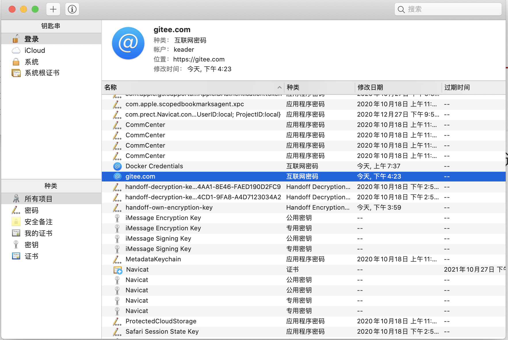

windows系统解决方法：

打开 控制面板->用户账户->凭据管理器

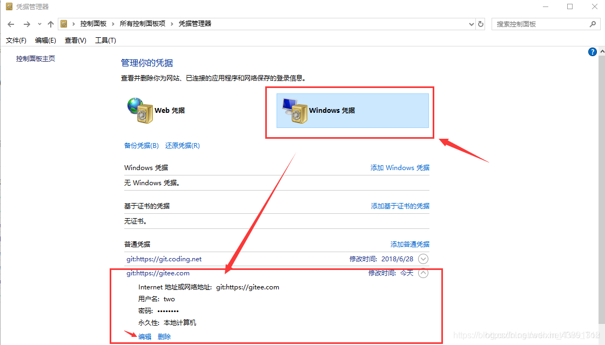

打开发现，果然是之前第一次填写错误时的用户名和密码，之后点击编辑进行更新即可。

### 4.2第一次提交代码

然后使用命令行打开web-test文件夹

首先创建本地提交人员的昵称和邮箱

```sh
git config user.name "oracle"
git config user.email "oracle@qq.com"
```

这个设置主要功能就是设置提交代码的人的昵称和邮箱。

可以通过以下命令来查看已经配置的基本信息

```sh
git config --list
```

在命令行内编写下面代码

```sh
git commit -a -m "第一次提交" 
```

首先会展示如下内容

```sh
 git commit -a -m "第一次提交" 
On branch master
Your branch is up to date with 'origin/master'.

nothing to commit, working tree clean
```

因为我们当前没有对文件做任何更改所以无需提交这时git会告诉我们当前无需提交。

然后我们对README.MD文件的内容稍作修改

这是在调用一次刚才的提交指令

```sh
git commit -a -m "第一次提交"
[master 6debdee] 第一次提交
 1 file changed, 1 insertion(+), 1 deletion(-)
```

此时会检测到一个文件有变化

该命令代表将当前的改动提交保存到本地代码仓库，此时我们查看网页中码云的仓库是不会有任何变化的。

然后我们继续在命令行运行

```sh
git push
```

代表将本地的代码仓库推送到远程代码仓库上

```sh
 git push
Enumerating objects: 5, done.
Counting objects: 100% (5/5), done.
Delta compression using up to 8 threads
Compressing objects: 100% (3/3), done.
Writing objects: 100% (3/3), 331 bytes | 331.00 KiB/s, done.
Total 3 (delta 1), reused 0 (delta 0)
remote: Powered by GITEE.COM [GNK-5.0]
To https://gitee.com/keader/web-test
   301579c..6debdee  master -> master

```

会打印如下信息，代表当前的数据已经推送到了云端

这时我们再打开浏览器中的代码仓库并且刷新就能看见仓库中有更新的数据了。

我们可以在提交详情中查看提交的内容

这里的最后一次提交代码的用名就变成我们在本地设置的自己的名字了

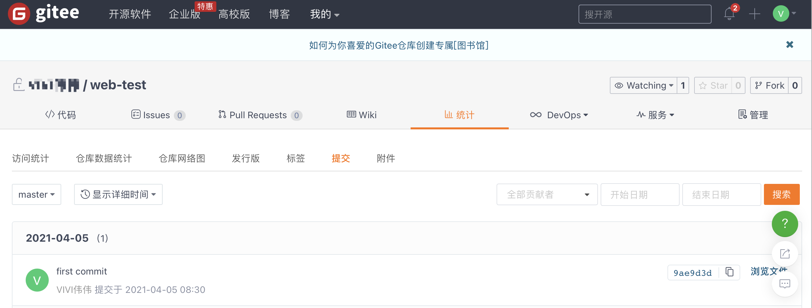

下面我们在本地创建一个新的文件test.html

然后我们执行

```sh
git commit -a -m "增加了一个文件"
```

-a是代表add，把所有的change加到git

-m是代表添加消息

会发现控制台报如下错误

```sh
oracle@cpe-172-115-253-49 web-test % git commit -a -m "增加了一个文件"
On branch master
Your branch is up to date with 'origin/master'.

Untracked files:
	test.html

nothing added to commit but untracked files present
```

这是因为我们的commit命令使用-a只能识别所有项目中已有文件的改动不能识别当前项目中新创建的文件。所以想要新创建的文件能直接提交到远程仓库需要执行如下命令

```sh
git add . #将该文件夹下的所有新文件增加到git中
```

此时在执行

```sh
oracle@cpe-172-115-253-49 web-test % git commit -a -m "增加了一个文件"
[master 28c4c3c] 增加了一个文件
 1 file changed, 9 insertions(+)
 create mode 100644 test.html
```

会发现git检测到有新文件添加了

然后我们执行

``` sh
git push
```

就会出现如下内容

```sh
oracle@cpe-172-115-253-49 web-test % git push
Enumerating objects: 4, done.
Counting objects: 100% (4/4), done.
Delta compression using up to 8 threads
Compressing objects: 100% (3/3), done.
Writing objects: 100% (3/3), 407 bytes | 407.00 KiB/s, done.
Total 3 (delta 0), reused 0 (delta 0)
remote: Powered by GITEE.COM [GNK-5.0]
To https://gitee.com/keader/web-test
   6debdee..28c4c3c  master -> master
```

代表提交成功。我们可以去浏览器线上查看结果

删除文件

```shell
git rm test.html
git commit -m "删除test.html"
git push
```


我们可以测试一下删除一个文件再提交

### 4.3vue项目的仓库使用

1.首先在个人账号中新建一个名为vue-demo的仓库

2.然后将他克隆到本地

3.然后我们将一个写好的vue项目放到这个文件夹

4.这里我们着重查看`.gitignore`文件的内容

它代表当前项目会忽略提交的文件。

我们可以浏览里面的内容个，脚手架项目一般都会自动生成一个忽略文件。

为什么要使用忽略文件。因为代码仓库中我们一般只会提交源代码和依赖列表，并不会把项目的所有依赖文件同时提交到服务器因为依赖文件数量多占用空间大，不光传输慢而且依赖是会更新的，我们不同阶段的依赖包版本号都会有变更所以，依赖文件不需要提交到代码仓库，还有就是打包生成的dist文件也不需要提交到代码仓库。

这里我们先使用

```sh
npm install
```

安装依赖，然后尝试运行

```sh
git add .
```

首先增加所有文件到提交队列

然后执行

```sh
git commit -a -m '测试忽略文件是否生效'
```

等待处理文件并提交到本地仓库然后执行

```sh
git push
```

执行完毕后查看线上的仓库，发现并没有node_module文件夹说明我们的忽略文件生效了

这个就是真实项目在git仓库的第一种使用方式。

接下来我们学习一下如何创建分支。

首先在命令行输入

```sh
 git branch -a
```

看到的结果如下

```sh
oracle@cpe-172-115-253-49 vue-demo % git branch -a
* master
  remotes/origin/HEAD -> origin/master
  remotes/origin/master
```

这个代表当前的本地分支只有一个master，带remotes不是本地分支可忽略不计。

首先了解一下什么是分支

### 4.4分支的概念

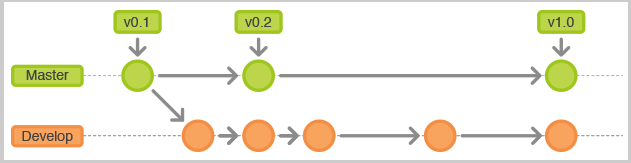

在团队开发中或者个人开发中，我们的同一个项目可能会衍生成多个分支版本，比如三个人合作一个项目一般不允许直接在master分支上开发，而是先在主分支上克隆一份，等你个人开发完毕之后在合并到主分支，这样可以防止直接对主分支造成破坏。在个人项目中，比如一个app肯能有一个标准版一个个性版或者其他的开发版本，但是程序主体大部分都一样。这样就可以将相同部分开发完毕之后通过创建分支的方式创建出多个版本。

那么如何创建分支呢。

```sh
git branch  分支名
```

这样就可以创建一个分支，然后可以通过

```sh
git branch -a #查看分支列表
```

来查看是否创建成功如果我们运行了

```sh
git branch test
```

查看列表的时候就会看见如下效果

```sh
oracle@cpe-172-115-253-49 vue-demo % git branch -a  
* master
  test
  remotes/origin/HEAD -> origin/master
  remotes/origin/master
```

带✳️号的代表当前所在的分支，test就是我们创建的新的分支

如何切换到新的分支呢。

```sh
git checkout 分支名
```

例如我们

```sh
git checkout test
git branch -a	
```

这时我们发现我们已经切换到当前的分支上了

```sh
oracle@cpe-172-115-253-49 vue-demo % git branch -a
  master
* test
  remotes/origin/HEAD -> origin/master
  remotes/origin/master
```


这样我们就可以通过将当前的代码推送到新的分支上

```sh
git push --set-upstream origin test
```

并且查看新建的分支到底是什么样的，我们打开线上页面在分支部分选择test查看，发现代码与master分支上的一样。

> tips:
>
> 1.git branch 既可以使用--set-upstream又可以使用--set-upstream-to，但是前者已经被弃用
>
> 用法：git branch --set-upstream-to=origin/mybranch1 mybranch1
>
> 作用：追踪远程分支origin/mybranch1到本地分支mybranch1，如果远程没有mybranch1会报错，需要先创建远程分支
>
> 2.git push只可以使用--set-upstream，等价与使用 -u
>
> 用法：git push -u origin mybranch1
>
> 作用：
>
> 1.推送本地分支mybranch1到远程主机origin的mybranch1分支
>
> 2.追踪远程分支，远程没有mybranch1就自动创建一个
>
> 3.设置origin为默认主机

下面我们改造一下test分支在本地目录随便新建个文件并提交到test分支上

我们在根目录创建一个test.js在里面随便写点什么

然后运行下面的代码

```sh
git add .
git commit -a -m "test分支新代码"
git push
```

全部执行完毕之后我们去仓库查看test分支的代码发现test.js已经提交到test分支了，并且master分支上没有新建的文件

#### 4.2 将分支的代码合并到主分支（master）上

执行

```sh
git checkout master
```

可以通过

```sh
git branch -a
```

查看当前是否已经切换到了master分支。

并且此时要查看一下项目的目录，发现切换会master分支之后刚才新建的test.js就没有了，这是因为git上各个分支的代码都是独立管理的，每一个分支的变化不会互相影响。

如果我们想将test.js分支的代码合并到master分支上可以在master分支上执行以下代码

```sh
git merge test #当前分支与test分支代码合并
```

然后就发现test.js已经成功的合并到了本分支

然后我们可以执行

```sh
git push
```

这样远程仓库的代码也就跟着合并起来了。

到此为止git的基本使用创建仓库，代码管理以及分支管理我们就都学会了。

## 5.团队仓库的常用操作

刚才我们学习的主要是个人仓库中如何使用代码。

下面我们来学习一下如何在团队仓库中使用代码。

### 5.1创建一个仓库

这次我们采用每桌一个人创建仓库的形式，每桌挑一个桌长，创建一个仓库名为vue-team

下一步就是在页面中点击管理

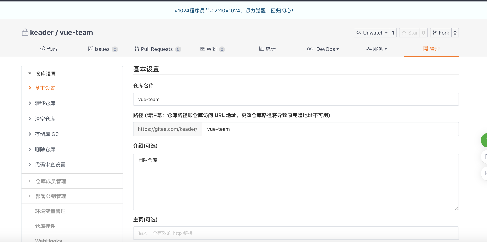

然后我们找到`仓库成员管理`这一项,点击并点击`所有`

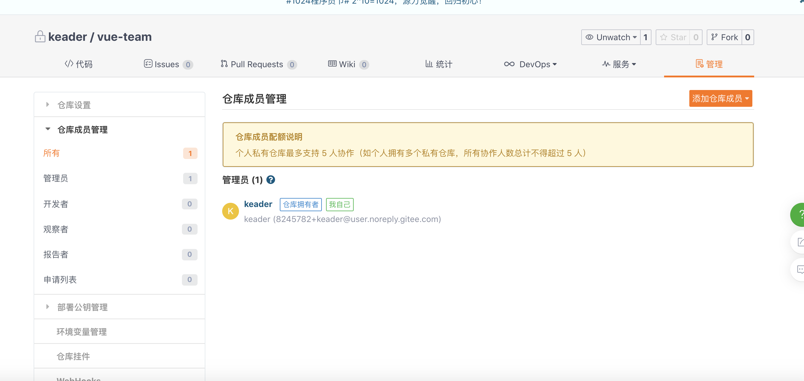

然后点击右侧橙色的 `添加仓库成员`

然后点击邀请用户

出现如下图片

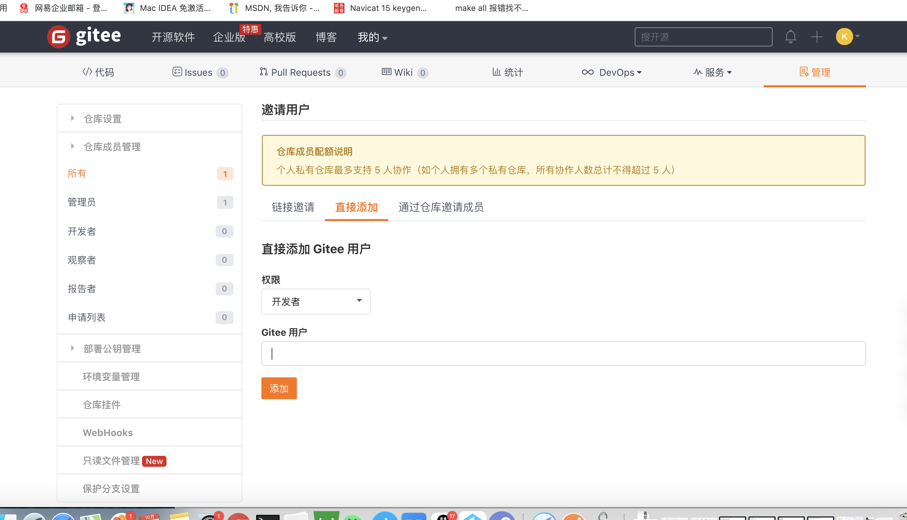

这里选择直接添加，添加开发者，并且gitee用户输入你同桌的账号来搜索搜索成功会出现这个人的账号如下图

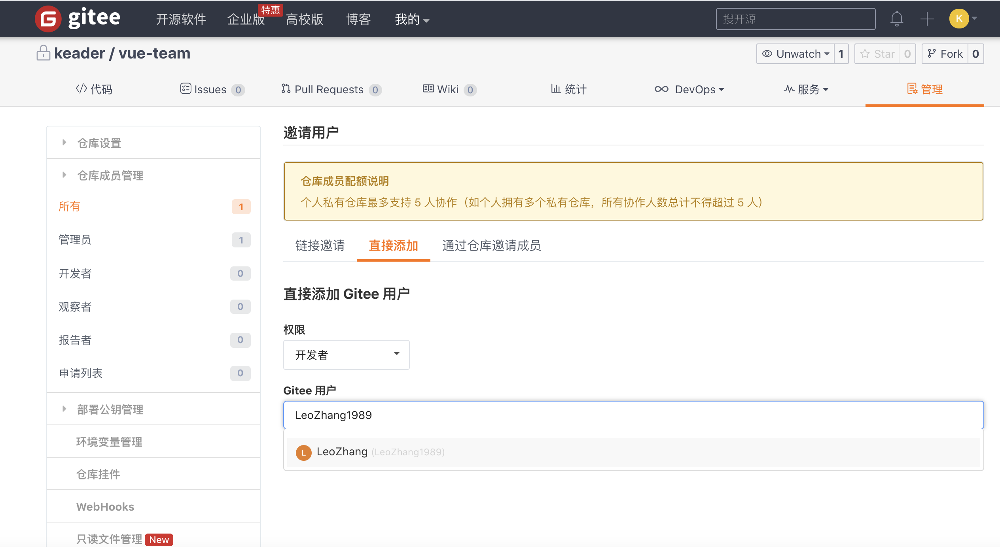

点击下拉菜单并且

点击添加,会出现确认框，如下图

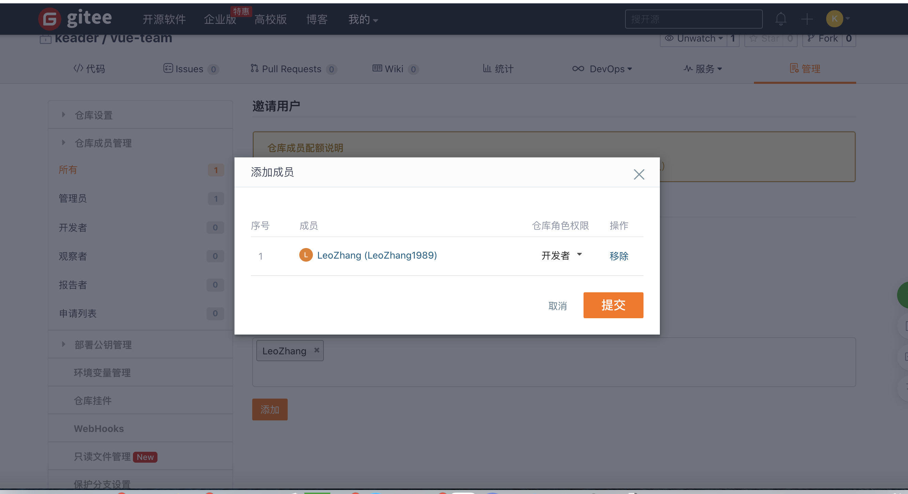

然后点击提交后出现添加成功，并且关闭，最后刷新本页，就能看见你添加的同桌的账号了。

添加的同桌也会看到通知🔔图标有提示

然后将当前项目仓库的访问路径发送给你的同桌

同桌就可以直接通过

```sh
git clone 地址
```

的方式来克隆项目了，现在的项目就是几个人共有的项目。

这时桌长就在项目中创建一个test.js文件随便写点内容

然后提交到主分支上

```sh
git add
git commit -a -m "桌长提交"
git push
```

提交完毕之后，同桌就在自己的本地项目目录拉取更新。

```sh
git pull
```

这时就会发现同桌的项目中可以拿到桌长提交的test.js

这时同桌可以更改本地的一些代码或创建文件重复刚才桌长提交的动作。

然后桌长再拉取一下更新

这个就是一般情况下的多人共用一个分支的拉取和提交方式。

### 5.2文件冲突

然后我们模拟一下出现了冲突怎么解决。

首先桌长先在test.js中将代码改为如下内容并推送到远程仓库

```js
//test.js
var a = 1;
var b = 2;
var c = 3
console.log(a,b,c)
```

然后同桌下载代码保持所有人目前都是一样的test.js

-------


这时桌长继续修改test.js为如下代码

```js
//test.js
var a = 1;
var b = 2;
var c = 3
var d = 4
console.log(a,b,c,d)
```

非桌长的同桌也修改自己的test.js为如下

```js
//test.js
var a = 1;
var b = 2;
var c = 3
var e = 5
console.log(a,b,c,e)
```

然后桌长先提交本地代码，然后推送到远程仓库

```sh
git commit -a -m "修改test.js" #先同步到本地仓库
git pull #尝试合并远程仓库的更新
git push #将新的代码推送到远程仓库
```

桌长操作完之后同桌操作如下步骤

```sh
git commit -a -m "也修改了test.js"
git pull #尝试合并远程仓库的更新
```

更新完之后我们会发现当前代码变成了如下模样

```js
//test.js
var a = 1;
var b = 2;
var c = 3
<<<<<<< HEAD
var e = 5
console.log(a,b,c,e)
=======
var d = 4
console.log(a,b,c,d)
>>>>>>> 9b35809c3e4df171fc625f84176a0a41857b6f2e

```

这是由于两个人同时操作了一个文件的变更这时就相当于我们的协作产生了冲突，这个时候git不知道到底要使用哪个人的变更改变这个文件，并且git无法自己处理人类主观思维产生的输入。所以他会将文件中两个人提交的不同的部分通过<<<<<< HEAD ====== >>>>>>>包裹起来

这样我们拉取代码冲突的同学可以根据两个不同的部分自己处理冲突并重新合并代码

如何解决冲突：我们可以这么做，**非桌长的同桌的一个同学来处理这个问题**

找一个不是桌长的有冲突的同学将文件改为

```js
//test.js
var a = 1;
var b = 2;
var c = 3
var e = 5
console.log(a,b,c,e)
var d = 4
console.log(a,b,c,d)
```

根据冲突部分合并两个人的代码

然后执行

```sh
git commit -a -m "修复冲突"
git pull
git push
```

只要提交成功了所有的桌长和同桌就一起更新代码

这样就解决了冲突

接下来我们学习一下

### 5.3团队仓库的分支创建

每个人都在自己的代码中执行如下命令

```sh
git branch 你的名字 #如 git branch oracle
git branch -a #查看分支创建是否成功
git checkout oracle #切换到自己的分支
```

如果想删除自己创建的分支可以使用

```sh
git branch -d 分支名
```

我们创建完自己的分支之后将自己的分支推送到远端仓库中

```sh
git push --set-upstream origin 你分支的名字
```

然后我们可以每个人在自己的分支里创建一个自己名字的js文件来模拟工作中不同人开发不同的模块，如我就创建一个MyselfUser1.vue

其他人也创建自己名字的vue文件

```sh
git add . #增加所有新增文件到提交队列
git commit -a -m "添加自己的模块" #设置提交信息提交到本地仓库
git pull #拉取更新
git push #推送到远程仓库
```

所有人都操作完之后

所有人都在执行一次

```sh
git pull #保证本地拉取到了最新的代码
```

**这时我们各自查看自己的分支发现没有混入别人的分支。这个就是通过分支来隔离各自的业务模块。**

最后一步所有的桌长操作，将当前的分支合并到主分支上

桌长操作首先切换到主分支

```sh
git checkout master
```

切换成功之后会发现所有的自己的分支文件都不在

然后首先合并自己的分支到主分支上

```sh
git pull #拉取更新
git merge 自己分支的名字
```

然后合并其他人的分支

```sh
git merge origin/其他人分支的名字
```

完成之后我们查看主分支上就有所有人的提交文件了

这时就执行

```sh
git commit -a -m "合并到主分支"
git pull #拉取新代码
git push #推送到主分支
```

到此我们常用的团队协作模式也写完了。

然后我们总结一下使用git的规则

团队协作每次操作完毕之后的步骤

1. 先执行git add添加所有文件
2. 然后执行git commit提交并编写说明
3. 然后git pull拉取更新合并到本地仓库
   1. 如果有冲突就处理冲突之后重新提交
4. 然后git push推送更新到指定仓库
5. 最后需要小组长将每个人的更新合并到master分支上

## 6.hbuilderX上的git插件的使用（选学）

