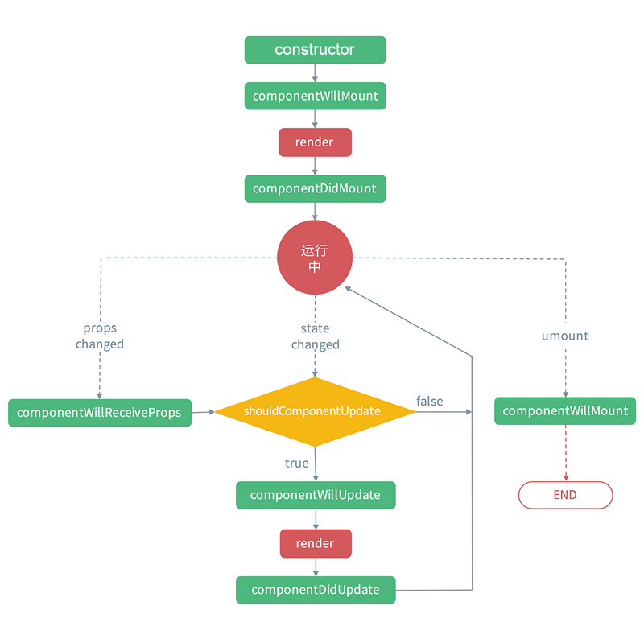

# React基础01

## 今日内容

1. react介绍
2. 在html中使用react
3. 在create-react-app中使用react

## 1.react介绍

### 1.1简介

> 官方文档:https://react.docschina.org/内部集成了详细的介绍

react是一款类似于vue的前端框架，他是由facebook团队进行构建和维护的，所以react属于公司开源项目。而vue属于个人开源项目。

react与vue一样有着完善的生态以及大量的插件，并且在web前端领域的使用率也是非常的广泛。目前市场上大多数的前端spa项目都是由react来开发的。

### 1.2react与vue的比较

> 相同点

react与vue都是致力于spa项目开发的框架都是通过虚拟dom去做的页面渲染，都是通过diff算法来优化，都是基于组件化开发的工程化框架，都分为核心库，路由，状态管理库这几个核心部分。都具备成熟的生态以及海量的成熟案例。

> 不同点

vue是基于尤雨溪开发的一套html-template模版语法来做页面表示层描绘的，而react是基于JSX模版引擎来做页面表示层描绘的。

vue通过他模版提供的语法糖通过环型数据流实现了双向绑定数据的效果，并且vue2/3分别通过了Object.defineProperty和Proxy对象在全局编写了监听，可以通过对象的值改变而实现关联性的改变。而react并没有实现双向绑定的语法糖，react的页面更新不是基于值的改变，是基于事件驱动，也就是在react中如果想改变页面的结果需要通过调用函数的方式来更新值。

vue是致力于让开发者把注意力全部集中在业务开发而不需要考虑框架复杂的数据流所以提供了内置的优化方案以及更亲近于初学者的api。而react是相对来说对成手开发人员提供的一套页面的渲染引擎，他本身只提供了一套基于数据渲染页面的方案，所以其他的优化方案以及快速实现功能的语法糖等内容都需要使用框架的程序猿根据自身的经验来进行优化

## 2.在html中使用react

在对react的基本介绍有了初步的了解之后我们来体验一下如何使用react框架编写代码。

### 2.1helloWorld

打开项目中的[01hello.html](/react/day1/案例/hello.html)

仿照hello.html自己创建文件编写，注意脚本类型是babel，因为jsx的语法需要babel解析。

```html
<script type="text/babel" >
```


### 2.2JSX介绍

```jsx
const element = <h1>Hello, world!</h1>;
```

这个有趣的标签语法既不是字符串也不是 HTML。

它被称为 JSX，是一个 JavaScript 的语法扩展。我们建议在 React 中配合使用 JSX，JSX 可以很好地描述 UI 应该呈现出它应有交互的本质形式。JSX 可能会使人联想到模版语言，但它具有 JavaScript 的全部功能。

JSX与React并不是所属关系，任何符合JSX驱动的框架都可以通过JSX来编写，包括vue

### 2.3为什么使用JSX

1.React 认为渲染逻辑本质上与其他 UI 逻辑内在耦合，比如，在 UI 中需要绑定处理事件、在某些时刻状态发生变化时需要通知到 UI，以及需要在 UI 中展示准备好的数据。

2.React 并没有采用将**标记与逻辑进行分离到不同文件**， 这种人为地分离方式，而是通过将二者共同存放在称之为“组件”的松散耦合单元之中，来实现[*关注点分离*](https://en.wikipedia.org/wiki/Separation_of_concerns)。我们将在后面章节中深入学习组件。

React [不强制要求](https://react.docschina.org/docs/react-without-jsx.html)使用 JSX，但是大多数人发现，在 JavaScript 代码中将 JSX 和 UI 放在一起时，会在视觉上有辅助作用。它还可以使 React 显示更多有用的错误和警告消息。

还有一个原因就是react和vue不同他并没有提供自己的模版语法，所以他依赖jsx来让页面渲染更加的简洁。如果不使用jsx语法，react的写法与vue的函数组件完全一样式

**这里我们体验一下不使用jsx语法的react [02with-out-jsx.html](/react/day1/案例/with-out-jsx.html)**

> 总结react中如果不使用jsx的语法与vue的函数形式组件是完全一致的。

## 2.4react的基础语法

### 2.4.1react的插值表达式

#### 2.4.1.1使用{}

react中使用{}作为模版插值表达式，向虚拟DOM中动态的插值(可以插入元素内容中，也可以插入元素属性中)

他与vue中的{{}}用法类似，不同的是在react中使用class创建的对象中取值需要在{}中使用this.state.属性来进行取值。

{ }的部分相当于在jsx表达式中使用javascript语法的作用域，在表达式中可以使用变量，表达式语法，自执行函数等。

1. 查看案例中的[03value.html]()（查看取值的方式，并且尝试在浏览器的控制台中修改js中的变量查看页面是否会自动更新）
2. 通过练习我们发现react中的取值语法与vue类似，但是更加灵活
   1. 凡事在当前作用域中的js变量都可以使用{}来展示
   2. 使用{}输出json时**必须**使用JSON.stringfy进行转换
   3. 我们通过控制台修改a等变量发现页面并不会更新,说明不是双向绑定的。
   4. jsx中过的{}的本质就是在html语法中开辟一个编写js的空间并且可以将返回值输出到页面上

#### 2.4.1.2使用dangerouslySetInnerHTML渲染html文档（类似vue的v-html）

我们在{}表达式的学习中学会了如何在jsx代码中展示js的变量，但是这个与vue中的{{}}类似不能实现渲染html标签。他会渲染出来一个纯text节点。如果我们在react中有类似富文本的要求，就需要在html文档中渲染带标签的字符串了，这样直接使用{}是无效的，这里就要借助dangerouslySetInnerHTML这个属性来实现

打开案例中的[04value1.html]()来查看一下如何编写代码留下文档牢记这个语法

### 2.4.2react中的数据响应结构

使用到现在我们发现react在上面的使用中仅仅是一门在html中编写js的模版语法

不具备vue中的响应式，页面更新以及方便的模版语法

实际上react中也具备一些基本的模版渲染能力以及半响应式的页面更新能力

不同的是vue是基于对data中数据的监听实现页面的自动更新，而react是通过**`事件驱动`**的一门模版语法，整个更新流程更加自由 但是也更加复杂一些

#### 2.4.2.1类的方式定义组件

```jsx
//在react中需要定义一个类，对象要求包含【构造函数】和【render函数】
//才能具备vue中的一些基本能力
class App extends React.Component{
  //构造函数，在react对象中定义数据的地方
  //这里的props是当App作为组件时传入的参数对象
  constructor(props){
    //super代表父类对象
    super(props)
    //this.state组件的状态，存储值。
    //相当于vue中的data选项，在这里
    //设置的属性可以具备更新页面的能力
    this.state = {
      name:'hello'
    }
  }
  //render函数相当于vue中的模版语法部分
  //通过return返回一个jsx对象所有的state中的数据以及
  //当前作用域的js数据都可以通过{}在本部分渲染
  render(){
    return (
    	<div>{this.state}</div>
    )
  }
}
```

#### 2.4.2.2案例练习

了解了一个react对象的基本结构之后我们打开

[05state.html]()查看案例并且做练习

> 除了使用class类的方式定义组件，后面课程还有函数式的方式创建组件

```jsx
<div id="root"></div>
<script type="text/babel" >
  function App(props){
    return (
      <p>函数式组件 {props.name}</p>
    )
  }
  ReactDOM.render(
  <App name="我是根组件传入的name"/>,
  document.querySelector('#root')
  );
</script>
```


### 2.4.3 属性（state数据）绑定

我们在学习vue的时候了解到如何在一个html标签或者自定义组件上绑定data中创建的属性

在react中也有类似的数据绑定方式，不过他是一个通用写法，react并没有对他提供一个良好的模版语法进行支持

属性绑定的语法为

```jsx
//语法为 属性={绑定的值}
<a href={url}></a>
```

参考案例，打开案例中的[06state1.html]()

### 2.4.4事件绑定

react的jsx模版语法我们已经熟悉了一部分，下面我们来学习事件的绑定，事件绑定的格式就是on事件名={}

这个事件绑定经历了两个阶段

第一个是使用如下语法

```jsx
handleClick(event){
  console.log(event)
}
<button onClick={this.handleClick.bind(this)}></button>
```

以上方式的事件绑定是在早期经常使用的了解即可，但是由于考虑this绑定混乱问题后续过渡为第二种方式

```jsx
handleClick(event){
  console.log(event)
}
<button onClick={event => {this.handleClick(event)}}></button>
```

这种方式的好处是无需考虑this上下文对象的跨层传递还能保证函数参数优雅的传输

下面我们去实例的[07event.html](/react/day1/案例/event.html)中进行学习。

### 2.4.5 style样式绑定

体验了evnet.html中的练习之后我们学习了绑定事件的标准写法以及如何传入参数

来学习一下如何对元素绑定样式,

react的样式绑定与vue类似，还是使用json的数据格式传入参数使用{}绑定数据的语法

```jsx
this.state = {
  style:{
    width:'100px',
    height:'100px',
    'background-color':'blue'
  }
}
<div style={style}></div>
```

下面我们打开案例中的[08style.html](/react/day1/案例/style.html)

#### 2.4.5条件渲染

我们在学习vue时知道vue中存在v-if和v-show来实现根据变量的值展示数据内容那么jsx中是怎么实现条件渲染的呢？JSX中 不能使用if else语句，但是可以使用三元运算表达式来代替

 打开[09if.html](/react/day1/案例/if.html)运行并查看内部的代码和注释

> 总结：
>
> 1. jsx中不存在条件渲染语法，条件渲染是通过在{}中编写表达式来实现条件渲染的
> 2. {}中不仅可以写表达式还可以使用自执行函数，但是这种方式无法通过切换属性的值进行更新
> 3. jsx中绑定style也是通过json格式书写css语法来进行赋值的

仿照上面的例子自己创建文件写一写条件渲染

#### 2.4.6列表渲染

在vue中存在v-for的语法来实现列表渲染这样我们可以实现通过v-for指令来进行渲染

那么jsx模版中如何进行列表渲染的呢？

 打开[10for.html](/react/day1/案例/for.html)运行并查看内部的代码和注释细细体会

学习并完成练习

> 总结：
>
> 1. 这里的练习涉及到对每行数据增加删除按钮
>
> 2. 列表渲染一定要通过map循环来实现因为map循环是可以改造数组的每一项并返回新的值

## 2.5react的组件

### 2.5.1组件的基本使用（类作为组件）

下面我们打开 [11component.html](/react/day1/案例/component.html)来学习一下react的组件的使用

仔细阅读内部的代码和注释

> 总结：
>
> 1. react的取值表达式是{}
> 2. 只有声明在state中的数据通过setState函数改变才能触发页面的更新,注意setState是异步的。
> 3. react的props是只读对象不可以更改
> 4. react的点击事件是onClick这种驼峰形式的写法其他事件同理，标签上的属性也通过{}来赋值这点与vue不同

仿照组件的使用自己创建文件体验一下react组件的写法

### 2.5.2组件的父子传参数（父传子）

props介绍：props是react自定义组件的参数属性，在vue中我们自定义组件中需要在vue对象的props中声明参数的类型，参数是否必填，参数的默认值等。

在react中组件的参数是假设他存在，直接在props对象中引入，只要在自定义组件的标签上填写的属性都可以在props中获取到。

props对象是一个只读属性，所以标签传入的属性只能在组件的模版语法中取值，不可以对其进行赋值操作。这点和vue中的props是完全一样的。

下面我们查看一下组件传递参数的案例

打开案例中的[12props.html]()

> 总结：
>
> 学习了props传递参数我们得知了props与vue的用法完全不同
>
> 首先是不需要在组件中自己定义属性（vue用props），以传入为准，在组件中创建属性
>
> 就是假设组件传递了这个参数，然后使用this.props.属性来获取值
>
> 自定义组件中的id，style，class都需要在组件中单独处理否则无法绑定
>
> class在组件中要使用className来命名

### 2.5.3子父组件的参数传递（子传父）

在vue中我们学习过从子组件中向父组件传递参数，使用的是this.$emit(函数名,参数...)来实现对标签上绑定的事件进行调用并传递参数，在react中自定义组件的事件也需要我们自己在组件中创造。不同的是这个事件仍然应用props属性来驱动

react中，本身没有提供主动的子传父方法，实现方式就是回调函数。由父组件通过props传递给子组件一个方法，然后通过子组件调用这个方法实现子传父通讯。

下面我们来看一下[13props1.html]()

> 总结：
>
> 根据当前的案例我们发现了，在react中自定义组件绑定事件和传递参数使用同一个对象，他的触发机制还是对原生html标签绑定html的原始事件，然后通过把props中的属性当作函数去调用就可以实现触发自定义标签上传递的自定义事件，并且可以将参数动态的设置进去，这个流程与vue的自定义组件绑定事件的原理类似只是写法有差别，props中的属性虽然是只读的不能对其赋值，但是如果我们把它当作函数调用是可以让绑定在这个属性上的函数执行的。

### 2.5.4react中特殊的input组件

我们在vue中使用过v-model来实现对input等标签输入的值进行双向绑定来映射数据，但是表单控件在react中是有一个特殊效果的，这里我们着重先学习input组件

打开案例中的[14input.html]()

我们来学习一下特殊的input组件

> 总结：
>
> 我们学习这个案例之后发现input文本框如果不绑定值可以正常输入，但是我们没法拿到其中输入的值，如果我们绑定了一个变量，文本框就无法继续输入了，这个是每次调用render时读取当前变量值渲染的问题，所以react中使用input一定要记住绑定value的同时使用onChange来动态的修改绑定的值这是一个固定的套路，也相当于react中的v-model、

牢记固定写法：

```jsx
handleChange(e){
  console.log(e)
  // 获取到当前文本框本次输入的值
  let val = e.target.value
  //将本次的值设置到state的title中并更新页面
  this.setState({
    title:val
  })
}
<input type="text" 
       value={this.state.title}
       onChange={(e) => this.handleChange(e)}/>
```


### 2.5.5react的组件嵌套和传递参数

下面我们打开 [15component1.html](/react/day1/案例/component1.html)来学习一下react的组件的使用

仔细阅读内部的代码和注释

> 总结：
>
> 1. react要区分好props和state，外部传入的props不可以直接更改。他相当于vue自定义组件中的props，state相当于vue中的data
> 2. 被state的值绑定value的input标签默认情况是无法输入的，因为react是通过render函数渲染的,就算触发了重新渲染，state.value的值如果还是原来的值那么input的值就不会改变
> 3. 如果想要实现绑定了属性触发input变化必须通过绑定onChange事件来通过事件改变state.value的值这样才能实现手动修改组件内部的值
> 4. Input组件内部实现了可输入之后，内部的state.value发生的变化不会让app中传入的inputStr发生变化

仿照上面的练习自己创建一个嵌套组件

### 2.5.6双向数据流

我们在学习vue时知道通过v-model可以快速的实现对input绑定data中的变量并且绑定后input输入变化后变量也会发生改变，但是react中不存在这种提供好的语法糖所以我们通过 [16component2.html](/react/day1/案例/component2.html)来学习组件如果像外部返回新的数据

打开案例查看代码和注释仔细阅读

> 总结：
>
> 1. react想要实现父子组件共享一个数据的话父子组件都需要声明对应的state变量
> 2. 在子组件的值变化时虽然无法直接更改props中的参数，但是可以通过执行props中的函数以参数的形式将变化通知到父组件，父组件在监听变化后更新自己的state
> 3. 他的数据流方式与vue中的类似但是全是通过自定义函数的执行来驱动的

## 2.6常用表单控件

表单的写法目前以了解为主，他们的用法与input几乎一致，所以我们主要掌握input的使用方式

我们打开[17form.html](/react/day1/案例/form.html)学习里面的代码

### 2.7slot插槽的使用

参考[18slot.html](/react/day1/案例/slot.html)来学习react的插槽,{this.props.children}

### 2.8生命周期

由于react本身的生命周期错综复杂,他与vue的生命周期类似，但是里面多了一步可以人为控制的地方

首先查看生命周期的图片



然后我们打开案例中的[19life-circle.html]()查看生命周期的代码