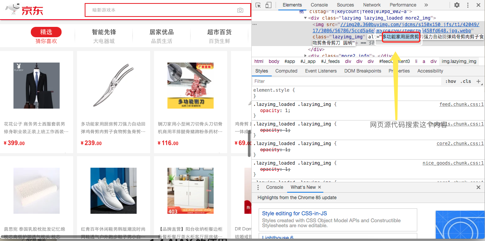
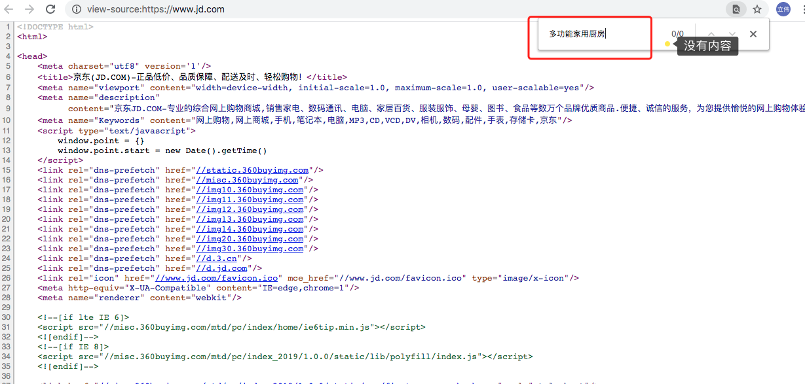
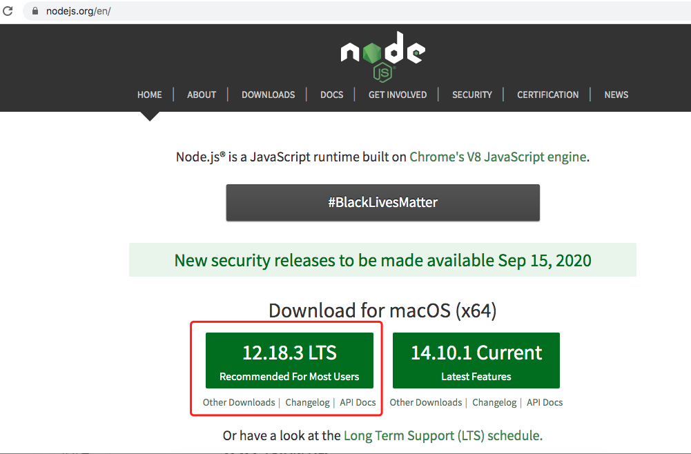
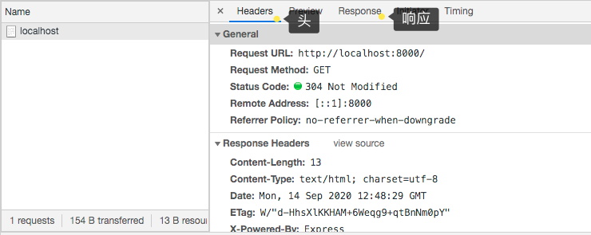
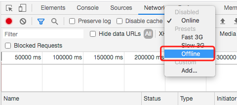
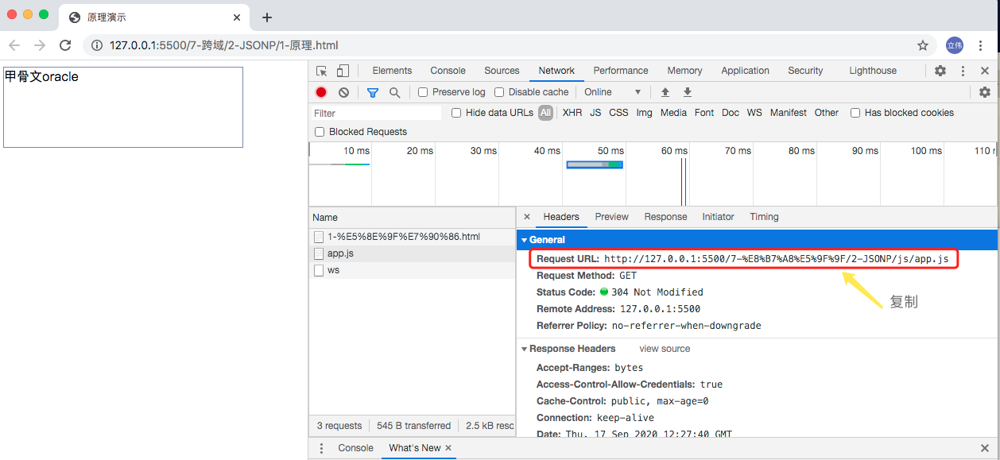
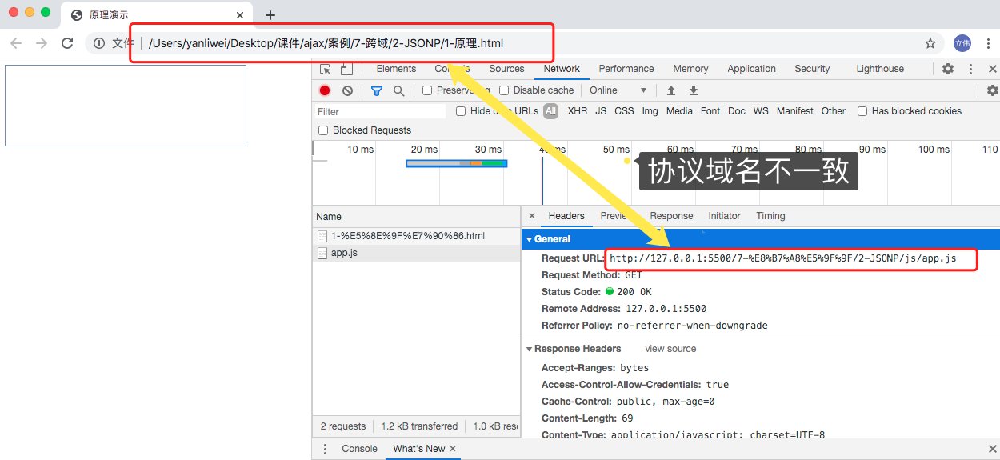
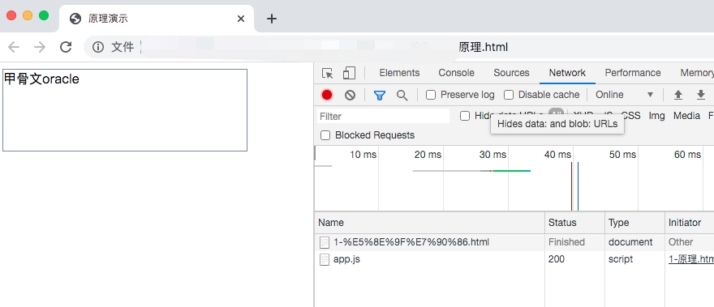
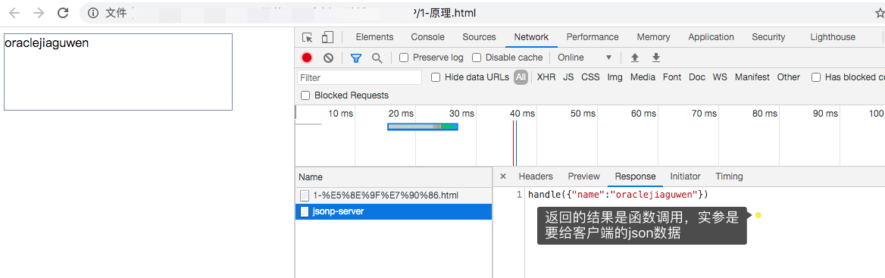

# **AJAX** **课程** 

优点，演示ajax案例网站

# **第** **1** **章：原生** AJAX

## **1.1 AJAX** **简介** 

AJAX 全称为 Asynchronous JavaScript And XML，就是异步的 JS 和 XML。 

通过 AJAX 可以在浏览器中向服务器发送异步请求，最大的优势：无刷新获取数据。 

AJAX 不是新的编程语言，而是一种将现有的标准组合在一起使用的新方式。 

## **1.2 XML** **简介** 

XML 可扩展标记语言。 

XML 被设计用来传输和存储数据。 

XML 和 HTML 类似，不同的是 HTML 中都是预定义标签，而 XML 中没有预定义标签， 

全都是自定义标签，用来表示一些数据。 

```xml
比如说我有一个学生数据： 
name = "孙悟空" ; age = 18 ; gender = "男" ; 
用 XML 表示： 
<student> 
  <name>孙悟空</name>
  <age>18</age>
  <gender>男</gender>
</student>
```

现在已经被 JSON 取代了。

```js
用 JSON 表示：
{"name":"孙悟空","age":18,"gender":"男"}
```

## 1.3 什么是JSON？

**JSON 是存储和传输数据的格式。**

**JSON 经常在数据从服务器发送到网页时使用。**

### 1.3.1 什么是 JSON？

- JSON 指的是 **J**ava**S**cript **O**bject **N**otation
- JSON 是轻量级的数据交换格式
- JSON 独立于语言 *****
- JSON 是“自描述的”且易于理解

\* JSON 的语法是来自 JavaScript 对象符号的语法，但 JSON 格式是纯文本。读取和生成 JSON 数据的代码可以在任何编程语言编写的。

### 1.3.2 JSON 实例

JSON 语法定义了一个雇员对象：包含三条员工记录的数组（对象）：

JSON 实例

```
{
"employees":[
    {"firstName":"Bill", "lastName":"Gates"}, 
    {"firstName":"Steve", "lastName":"Jobs"},
    {"firstName":"Alan", "lastName":"Turing"}
]
}
```

### 1.3.3 JSON 格式评估为 JavaScript 对象

JSON 格式在语法上与创建 JavaScript 对象的代码相同。

由于这种相似性，JavaScript 程序可以很容易地将 JSON 数据转换成本地的 JavaScript 对象。

#### JSON 语法规则

- 数据是名称/值对
- 数据由逗号分隔
- 花括号保存对象
- 方括号保存数组

#### JSON 数据 - 名称和值

JSON 数据的书写方式是名称/值对，类似 JavaScript 对象属性。

名称/值对由（双引号中的）字段名构成，其后是冒号，再其后是值：

```
"firstName":"Bill"
```

JSON 名称需要双引号。JavaScript 名称不需要。

### 1.3.4 JSON 对象

JSON 对象是在花括号内书写的。

类似 JavaScript，对象能够包含多个名称/值对：

```
{"firstName":"Bill", "lastName":"Gates"} 
```

## 1.3.5 JSON 数组

JSON 数组在方括号中书写。

类似 JavaScript，数组能够包含对象：

```
"employees":[
    {"firstName":"Bill", "lastName":"Gates"}, 
    {"firstName":"Steve", "lastName":"Jobs"}, 
    {"firstName":"Alan", "lastName":"Turing"}
]
```

在上面的例子中，对象 "employees" 是一个数组。它包含了三个对象。

每个对象代表一个人的一条记录（带有名和姓）。

### 1.3.6 把 JSON 文本转换为 JavaScript 对象(字符串->对象)

JSON 的通常用法是从 web 服务器读取数据，然后在网页中显示数据。

为了简单起见，可以使用字符串作为输入演示。

首先，创建包含 JSON 语法的 JavaScript 字符串：

```
var text = '{ "employees" : [' +
'{ "firstName":"Bill" , "lastName":"Gates" },' +
'{ "firstName":"Steve" , "lastName":"Jobs" },' +
'{ "firstName":"Alan" , "lastName":"Turing" } ]}';
```

然后，使用 JavaScript 的内建函数` JSON.parse() `来把这个字符串转换为 JavaScript 对象：

```
var obj = JSON.parse(text);
```

最后，请在您的页面中使用这个新的 JavaScript 对象：

实例

```html
<p id="demo"></p>

<script>
document.getElementById("demo").innerHTML =
obj.employees[1].firstName + " " + obj.employees[1].lastName;
</script> 
```


## **1.4 AJAX** **的特点** 

### **1.4.1 AJAX** **的优点** 

1) 可以无需刷新页面而与服务器端进行通信。 

2) 允许你根据用户`事件`来更新部分页面内容。 表单事件，按钮事件

### **1.4.2 AJAX** **的缺点** 

1) 没有浏览历史，不能回退 

2) 存在跨域问题(同源) 

3) SEO 不友好 






因为这些数据是通过ajax加载的


# 第 2 章 准备

# HTTP

HTTP（`H`yper`T`ext `T`ransport `P`rotocol）协议『超文本传输协议』，协议详细规定了浏览器和万维网服务器之间互相通信的规则。
协议就是一种约定, 规则

## 2.1请求报文

**重点是格式与参数**

```
第一部分：行      POST  /s?ie=utf-8  HTTP/1.1 
                ↑        ↑          ↑
                请求类型  url路径    http版本 
第二部分：头      Host: oracle.com    
        				Cookie: name=oracle
        				Content-type: application/x-www-form-urlencoded
        				User-Agent: chrome 83
第三部分：空行
第四部分：体      username=admin&password=admin
```

## 2.2响应报文

```
行      HTTP/1.1  200  OK
头      Content-Type: text/html;charset=utf-8
        Content-length: 2048
        Content-encoding: gzip
空行    
体      <html>
            <head>
            </head>
            <body>
                <h1>oracle</h1>
            </body>
        </html>
```

* 404
* 403
* 401
* 500
* 200

## 2.3 chrome网络控制台查看通信报文

## 2.4 安装nodejs



## 2.5 express框架介绍与基本使用

因为AJAX需要服务端发请求，简单，内容比较少，借助基本的功能

### 2.5.1安装express

新建文件夹 ajax

> npm init -y
>
> npm i express

目录结构


### 2.5.2创建服务

server.js

```js
//1. 引入express
const express = require('express');

//2. 创建应用对象
const app = express();

//3. 创建路由规则
// request 是对请求报文的封装
// response 是对响应报文的封装
app.get('/', (request, response)=>{
    //设置响应
    response.send('HELLO EXPRESS');
});

//4. 监听端口启动服务
app.listen(8000, ()=>{
    console.log("服务已经启动, 8000 端口监听中....");
});
```

> node index.js
>
> http://localhost:8000

可以在网页看到hello express

可以查看chrome浏览器的network中的请求和响应



## 2.6ajax 案例准备

准备html页面代码

```html
<!DOCTYPE html>
<html lang="en">
<head>
    <meta charset="UTF-8">
    <meta name="viewport" content="width=device-width, initial-scale=1.0">
    <title>AJAX GET 请求</title>
    <style>
        #result{
            width:200px;
            height:100px;
            border:solid 1px #90b;
        }
    </style>
</head>
<body>
    <button>点击发送请求</button>
    <div id="result"></div>
</body>
</html>
```

点按钮发请求，把结果显示到div中，页面不刷新

server.js

修改路由,这里有一个跨域，后面再讲

```js
//3. 创建路由规则
// request 是对请求报文的封装
// response 是对响应报文的封装
app.get('/server', (request, response) => {
    //设置响应头  设置允许跨域
    response.setHeader('Access-Control-Allow-Origin', '*');
    //设置响应体
    response.send('这是我的第一个Ajax');
});
```

**如果不用express框架当做服务端可以使用vuejs课件中的shop-service服务，如何使用？**

启动shop-service， npm run start:dev

客户端使用vue脚手架创建项目vue create xxxxproject, 新建好的vue项目需要配置反向代理，才可以实现跨域访问。

vue.config.js

```js
module.exports = {
	publicPath: process.env.NODE_ENV === 'production' ? '' : '/',
	lintOnSave: false,
	// 配置反向代理，所有访问在/shop-service/v1的地址全都转发到http://localhost:3000这个地址上
	devServer: {
		proxy: {
			'/shop-service/v1': {
				target: 'http://localhost:3000',
				changeOrigin: true
			},
			'/public': {
				target: 'http://localhost:3000',
				changeOrigin: true
			},
			'/api':{
				target: 'http://localhost:3000',
				changeOrigin:true
			}
		}
	}
}
```

这样配置好了，让你的客户端服务和服务端同源了，当你访问这三个路径的时候，相当于访问的是3000服务端的路径。

vue的项目目录结构中有一个public文件夹是静态网页的存放路径, 把html代码放在这个目录里测试访问。

在浏览器输入网址的时候，输入http://localhost:8080/client.html,不要输入http://localhost:8080/#/client.html

# 第 3 章 原生AJAX **的使用** 

## 3.1核心对象 

XMLHttpRequest，AJAX 的所有操作都是通过该对象进行的。 

## 3.2使用步骤

1) 创建 XMLHttpRequest 对象 

var xhr = new XMLHttpRequest(); 

2) 设置请求信息 

xhr.open(method, url); 

//可以设置请求头，一般不设置

xhr.setRequestHeader('Content-Type', 'application/x-www-form-urlencoded'); 

3) 发送请求 

xhr.send(body) //get 请求不传 body 参数，只有 post 请求使用 

4) 接收响应 

//xhr.responseXML 接收 xml 格式的响应数据 

//xhr.responseText 接收文本格式的响应数据 

xhr.onreadystatechange = function (){ 

if(xhr.readyState == 4 && xhr.status == 200){ 

var text = xhr.responseText; 

console.log(text); 

} 

} 

点击按钮的事件响应

```js
<script>
  //获取button元素
  const btn = document.getElementsByTagName('button')[0];
const result = document.getElementById("result");
//绑定事件
btn.onclick = function(){
  //1. 创建对象
  const xhr = new XMLHttpRequest();
  //2. 初始化 设置请求方法和 url
  xhr.open('GET', 'http://127.0.0.1:8000/server');
  //3. 发送
  xhr.send();
  //4. 事件绑定 处理服务端返回的结果
  // on  when 当....时候
  // readystate 是 xhr 对象中的属性, 表示状态 0 1 2 3 4
  // change  改变
  xhr.onreadystatechange = function(){
    //判断 (服务端返回了所有的结果)
    if(xhr.readyState === 4){
      //判断响应状态码 200  404  403 401 500
      // 2xx 成功  2开头的状态吗都代表成功
      if(xhr.status >= 200 && xhr.status < 300){
        //处理结果  行 头 空行 体
        //响应 
        // console.log(xhr.status);//状态码
        // console.log(xhr.statusText);//状态字符串
        // console.log(xhr.getAllResponseHeaders());//所有响应头
        // console.log(xhr.response);//响应体
        //设置 result 的文本
        result.innerHTML = xhr.response;
      }else{

      }
    }
  }
}
</script>
```

## 3.3传参数

之前都是在地址栏中传参数

使用问号， 使用&分割例如

> http://127.0.0.1:8000/server?a=100&b=200&c=300

可以通过请求头查看参数

## 3.4post请求方式处理

鼠标滑过div做post请求,包含post请求设置参数,包含设置请求头

```html
<!DOCTYPE html>
<html lang="en">
<head>
    <meta charset="UTF-8">
    <meta name="viewport" content="width=device-width, initial-scale=1.0">
    <title>AJAX POST 请求</title>
    <style>
        #result{
            width:200px;
            height:100px;
            border:solid 1px #903;
        }
    </style>
</head>
<body>
    <div id="result"></div>
    <script>
        //获取元素对象
        const result = document.getElementById("result");
        //绑定事件
        result.addEventListener("mouseover", function(){
            //1. 创建对象
            const xhr = new XMLHttpRequest();
            //2. 初始化 设置类型与 URL
            xhr.open('POST', 'http://127.0.0.1:8000/server');
            //设置请求头
            xhr.setRequestHeader('Content-Type','application/x-www-form-urlencoded');
            xhr.setRequestHeader('name','xxswkl');//自定义请求头，不是预定义的会出错，浏览器安全机制，需要在后端设置//响应头
    //response.setHeader('Access-Control-Allow-Headers', '*');
            //3. 发送
            xhr.send('a=100&b=200&c=300');
            // xhr.send('a:100&b:200&c:300');
            // xhr.send('1233211234567');
            
            //4. 事件绑定
            xhr.onreadystatechange = function(){
                //判断
                if(xhr.readyState === 4){
                    if(xhr.status >= 200 && xhr.status < 300){
                        //处理服务端返回的结果
                        result.innerHTML = xhr.response;
                    }
                }
            }
        });
    </script>
</body>
</html>
```

server.js 文件的post处理,  

```js
//可以接收任意类型的请求 
app.post('/server', (request, response) => {
    //设置响应头  设置允许跨域
    response.setHeader('Access-Control-Allow-Origin', '*');
    //响应头
    response.setHeader('Access-Control-Allow-Headers', '*');
    //设置响应体
    response.send('HELLO AJAX POST');
});

或
//可以接收任意类型的请求 
app.post('/server', (request, response) => {
    //设置响应头  设置允许跨域
    response.setHeader('Access-Control-Allow-Origin', '*');
    //响应头
    response.setHeader('Access-Control-Allow-Headers', '*');
    //设置响应体
    response.send('HELLO AJAX POST');
});
```


## 3.5服务端响应json

server.js

```js
//JSON 响应
app.all('/json-server', (request, response) => {
    //设置响应头  设置允许跨域
    response.setHeader('Access-Control-Allow-Origin', '*');
    //响应头
    response.setHeader('Access-Control-Allow-Headers', '*');
    //响应一个数据
    const data = {
        name: '学习使我快乐'
    };
    //对对象进行字符串转换
    let str = JSON.stringify(data);
    //设置响应体
    response.send(str);
});
```

html 实现效果，在网页任意位置点击触发，请求服务端返回数据

```html
<!DOCTYPE html>
<html lang="en">
<head>
    <meta charset="UTF-8">
    <meta name="viewport" content="width=device-width, initial-scale=1.0">
    <title>JSON响应</title>
    <style>
        #result{
            width:200px;
            height:100px;
            border:solid 1px #89b;
        }
    </style>
</head>
<body>
    <div id="result"></div>
    <script>
        const result = document.getElementById('result');
        //绑定键盘按下事件
        window.onkeydown = function(){
            //发送请求
            const xhr = new XMLHttpRequest();
            //设置响应体数据的类型
            xhr.responseType = 'json';
            //初始化
            xhr.open('GET','http://127.0.0.1:8000/json-server');
            //发送
            xhr.send();
            //事件绑定
            xhr.onreadystatechange = function(){
                if(xhr.readyState === 4){
                    if(xhr.status >= 200 && xhr.status < 300){
                        //
                        // console.log(xhr.response);
                        // result.innerHTML = xhr.response;
                        // 1. 手动对数据转化
                        // let data = JSON.parse(xhr.response);
                        // console.log(data);
                        // result.innerHTML = data.name;
                        // 2. 自动转换
                        console.log(xhr.response);
                        result.innerHTML = xhr.response.name;
                    }
                }
            }
        }
    </script>
</body>
</html>
```


## 3.6**解决** **IE** **缓存问题** 

问题：在一些浏览器中(IE),由于缓存机制的存在，ajax 只会发送的第一次请求，剩 

余多次请求不会在发送给浏览器而是直接加载缓存中的数据。 

解决方式：浏览器的缓存是根据 url 地址来记录的，所以我们只需要修改 url 地址 

即可避免缓存问题 

xhr.open("get","/testAJAX?t="+Date.now()); 


## 3.7 请求超时与网络异常

给用户完好体验

html代码，判断延迟

```html
<!DOCTYPE html>
<html lang="en">
<head>
    <meta charset="UTF-8">
    <meta name="viewport" content="width=device-width, initial-scale=1.0">
    <title>请求超时与网络异常</title>
    <style>
        #result{
            width:200px;
            height:100px;
            border:solid 1px #90b;
        }
    </style>
</head>
<body>
    <button>点击发送请求</button>
    <div id="result"></div>
    <script>
        const btn = document.getElementsByTagName('button')[0];
        const result = document.querySelector('#result');

        btn.addEventListener('click', function(){
            const xhr = new XMLHttpRequest();
            //超时设置 2s 设置
            xhr.timeout = 2000;
            //超时回调
            xhr.ontimeout = function(){
                alert("网络异常, 请稍后重试!!");
            }
            //网络异常回调
            xhr.onerror = function(){
                alert("你的网络似乎出了一些问题!");
            }

            xhr.open("GET",'http://127.0.0.1:8000/delay');
            xhr.send();
            xhr.onreadystatechange = function(){
                if(xhr.readyState === 4){
                    if(xhr.status >= 200 && xhr.status< 300){
                        result.innerHTML = xhr.response;
                    }
                }
            }
        })
    </script>
</body>
</html>
```

server.js

故意延迟3秒返回

```js
//延时响应
app.all('/delay', (request, response) => {
    //设置响应头  设置允许跨域
    response.setHeader('Access-Control-Allow-Origin', '*');
    response.setHeader('Access-Control-Allow-Headers', '*');
    setTimeout(() => {
        //设置响应体
        response.send('延时响应');
    }, 3000)
});
```

测试onerror回调，需要借助chrome浏览器的offline功能




## 3.8取消请求

```html
<!DOCTYPE html>
<html lang="en">
<head>
    <meta charset="UTF-8">
    <meta name="viewport" content="width=device-width, initial-scale=1.0">
    <title>取消请求</title>
</head>
<body>
    <button>点击发送</button>
    <button>点击取消</button>
    <script>
        //获取元素对象
        const btns = document.querySelectorAll('button');
        let x = null;

        btns[0].onclick = function(){
            x = new XMLHttpRequest();
            x.open("GET",'http://127.0.0.1:8000/delay');
            x.send();
        }

        // abort
        btns[1].onclick = function(){
            x.abort();
        }
    </script>
</body>
</html>
```

## 3.9重复请求

```html
<!DOCTYPE html>
<html lang="en">
<head>
    <meta charset="UTF-8">
    <meta name="viewport" content="width=device-width, initial-scale=1.0">
    <title>重复请求问题</title>
</head>
<body>
    <button>点击发送</button>
    <script>
        //获取元素对象
        const btns = document.querySelectorAll('button');
        let x = null;
        //标识变量
        let isSending = false; // 是否正在发送AJAX请求

        btns[0].onclick = function(){
            //判断标识变量
            if(isSending) x.abort();// 如果正在发送, 则取消该请求, 创建一个新的请求
            x = new XMLHttpRequest();
            //修改 标识变量的值
            isSending = true;
            x.open("GET",'http://127.0.0.1:8000/delay');
            x.send();
            x.onreadystatechange = function(){
                if(x.readyState === 4){
                    //修改标识变量
                    isSending = false;
                }
            }
        }

        // abort
        btns[1].onclick = function(){
            x.abort();
        }
    </script>
</body>
</html>
```


## 3.10 AJAX请求状态

xhr.readyState 可以用来查看请求当前的状态 

https://developer.mozilla.org/zh-CN/docs/Web/API/XMLHttpRequest/readyState 

0: 表示 XMLHttpRequest 实例已经生成，但是 open()方法还没有被调用。 

1: 表示 send()方法还没有被调用，仍然可以使用 setRequestHeader()，设定 HTTP 请求的头信息。 

2: 表示 send()方法已经执行，并且头信息和状态码已经收到。 

3: 表示正在接收服务器传来的 body 部分的数据。 

4: 表示服务器数据已经完全接收，或者本次接收已经失败了

# **第**  3 章：jQuery中的AJAX

## 3.1 get** **请求** 

$.get(url, [data], [callback], [type]) 

url:请求的 URL 地址。 

data:请求携带的参数。 

callback:载入成功时回调函数。 

type:设置返回内容格式，xml, html, script, json, text, _default。 

## 3.2 post** **请求** 

$.post(url, [data], [callback], [type]) 

url:请求的 URL 地址。 

data:请求携带的参数。 

callback:载入成功时回调函数。 

type:设置返回内容格式，xml, html, script, json, text, _default。 

```html
<!DOCTYPE html>
<html lang="en">
<head>
    <meta charset="UTF-8">
    <meta name="viewport" content="width=device-width, initial-scale=1.0">
    <title>jQuery 发送 AJAX 请求</title>
    <link crossorigin="anonymous" href="https://cdn.bootcss.com/twitter-bootstrap/3.3.7/css/bootstrap.min.css" rel="stylesheet">
    <script crossorigin="anonymous" src="https://cdn.bootcdn.net/ajax/libs/jquery/3.5.1/jquery.min.js"></script>
</head>
<body>
    <div class="container">
        <h2 class="page-header">jQuery发送AJAX请求 </h2>
        <button class="btn btn-primary">GET</button>
        <button class="btn btn-danger">POST</button>
        <button class="btn btn-info">通用型方法ajax</button>
    </div>
    <script>
        $('button').eq(0).click(function(){
            $.get('http://127.0.0.1:8000/jquery-server', {a:100, b:200}, function(data){
                console.log(data);
            },'json');
        });

        $('button').eq(1).click(function(){
            $.post('http://127.0.0.1:8000/jquery-server', {a:100, b:200}, function(data){
                console.log(data);
            });
        });

        $('button').eq(2).click(function(){
            $.ajax({
                //url
                url: 'http://127.0.0.1:8000/jquery-server',
                //参数
                data: {a:100, b:200},
                //请求类型
                type: 'GET',
                //响应体结果
                dataType: 'json',
                //成功的回调
                success: function(data){
                    console.log(data);
                },
                //超时时间
                timeout: 2000,
                //失败的回调
                error: function(){
                    console.log('出错啦!!');
                },
                //头信息
                headers: {
                    c:300,
                    d:400
                }
            });
        });

    </script>
</body>
</html>
```

server.js

```js
//jQuery 服务
app.all('/jquery-server', (request, response) => {
    //设置响应头  设置允许跨域
    response.setHeader('Access-Control-Allow-Origin', '*');
    response.setHeader('Access-Control-Allow-Headers', '*');
    // response.send('Hello jQuery AJAX');
    const data = {name:'oracle'};
    response.send(JSON.stringify(data));
});
```


# 第 4 章 Axios发送AJAX请求

https://github.com/axios/axios

前端最热门的JAJAX请求包， vue,react都会用到

1. 从浏览器中创建XMLHttpRequests
2. node.js创建http请求
3. 支持Promise API
4. 拦截请求和响应
5. 转换请求数据和响应数据
6. 取消请求
7. 自动换成json
8. 客户端支持保护安全免受 XSRF 攻击；

这里我们不在npm下载包，在页面直接引用

```html
<script src="https://cdn.jsdelivr.net/npm/axios/dist/axios.min.js"></script>
国内cdn会快，从bootcdn上找
<script src="https://cdn.bootcdn.net/ajax/libs/axios/0.2.0/axios.min.js"></script>
```

如果怕警告添加属性,引入跨域的脚本（比如用了 apis.google.com 上的库文件），如果这个脚本有错误，因为浏览器的限制（根本原因是协议的规定），是拿不到错误信息的。当本地尝试使用 `window.onerror` 去记录脚本的错误时，跨域脚本的错误只会返回 `Script error`。

```html
<script crossorigin="anonymous" src="......"></script>
```


## 4.1服务端代码

server.js

```js
//axios 服务
app.all('/axios-server', (request, response) => {
    //设置响应头  设置允许跨域
    response.setHeader('Access-Control-Allow-Origin', '*');
    response.setHeader('Access-Control-Allow-Headers', '*');
    // response.send('Hello jQuery AJAX');
    const data = {name:'oracle'};
    response.send(JSON.stringify(data));
});
```

## 4.2客户端代码

查看git上的文档可以看到demo

```html
<!DOCTYPE html>
<html lang="en">

<head>
    <meta charset="UTF-8">
    <meta name="viewport" content="width=device-width, initial-scale=1.0">
    <title>axios 发送 AJAX请求</title>
    <script crossorigin="anonymous"></script>
    <script crossorigin="anonymous" src="https://cdn.bootcdn.net/ajax/libs/axios/0.19.2/axios.js"></script>
</head>

<body>
    <button>GET</button>
    <button>POST</button>
    <button>AJAX</button>

    <script>
        // https://github.com/axios/axios
        const btns = document.querySelectorAll('button');

        //配置 baseURL
        axios.defaults.baseURL = 'http://127.0.0.1:8000';

        btns[0].onclick = function () {
            //GET 请求
            axios.get('/axios-server', {
                //url 参数
                params: {
                    id: 100,
                    vip: 7
                },
                //请求头信息
                headers: {
                    name: 'oracle',
                    age: 20
                }
            }).then(value => {//数据返回结果
                console.log(value);
            });
        }
      /*post请求*/
        btns[1].onclick = function () {
          //post函数的第二个参数是请求体 axios.post(url[, data[, config]])
          //第三个参数其他配置  
          axios.post('/axios-server', {
                username: 'admin',
                password: 'admin'
            }, {
                //url 
                params: {
                    id: 200,
                    vip: 9
                },
                //请求头参数
                headers: {
                    height: 180,
                    weight: 180,
                }
            });
        }
    
        
    </script>
</body>

</html>
```

## 4.3通用方式发送请求

```js
btns[2].onclick = function(){
            axios({
                //请求方法
                method : 'POST',
                //url
                url: '/axios-server',
                //url参数
                params: {
                    vip:10,
                    level:30
                },
                //头信息
                headers: {
                    a:100,
                    b:200
                },
                //请求体参数
                data: {
                    username: 'admin',
                    password: 'admin'
                }
            }).then(response=>{
                //响应状态码
                console.log(response.status);
                //响应状态字符串
                console.log(response.statusText);
                //响应头信息
                console.log(response.headers);
                //响应体
                console.log(response.data);
            })
        }
```


# 第5章  fetch发送AJAX请求

https://developer.mozilla.org/zh-CN/docs/Web/API/Fetch_API/Using_Fetch

全局函数，返回ES6的promise方式

```html
<!DOCTYPE html>
<html lang="en">
<head>
    <meta charset="UTF-8">
    <meta name="viewport" content="width=device-width, initial-scale=1.0">
    <title>fetch 发送 AJAX请求</title>
</head>
<body>
    <button>AJAX请求</button>
    <script>
        //文档地址
        //https://developer.mozilla.org/zh-CN/docs/Web/API/WindowOrWorkerGlobalScope/fetch
        
        const btn = document.querySelector('button');

        btn.onclick = function(){
            //第一个参数 url
            fetch('http://127.0.0.1:8000/fetch-server?vip=10', {
                //请求方法
                method: 'POST',
                //请求头
                headers: {
                    name:'oracle'
                },
                //请求体
                body: 'username=admin&password=admin'
            }).then(response => {//响应体
                // return response.text();
                return response.json();
            }).then(response=>{
                console.log(response);
            });
        }
    </script>
</body>
</html>
```


server.js

```js
//fetch 服务
app.all('/fetch-server', (request, response) => {
    //设置响应头  设置允许跨域
    response.setHeader('Access-Control-Allow-Origin', '*');
    response.setHeader('Access-Control-Allow-Headers', '*');
    // response.send('Hello jQuery AJAX');
    const data = {name:'oracle'};
    response.send(JSON.stringify(data));
});
```


# **第** 6 章：跨域

## 6.1同源策略

同源策略(Same-Origin Policy)最早由 Netscape 公司提出，是浏览器的一种安全策略。

同源： 协议、域名、端口号 必须完全相同。 

违背同源策略就是跨域。 

演示同源

```js
const express = require('express');

const app = express();

app.get('/home', (request, response)=>{
    //响应一个页面
    response.sendFile(__dirname + '/index.html');
});

app.get('/data', (request, response)=>{
    response.send('用户数据');
});

app.listen(9000, ()=>{
    console.log("服务已经启动...");
});
```

index.html

```html
<!DOCTYPE html>
<html lang="en">
<head>
    <meta charset="UTF-8">
    <meta name="viewport" content="width=device-width, initial-scale=1.0">
    <title>首页</title>
</head>
<body>
    <h1>oracle</h1>
    <button>点击获取用户数据</button>
    <script>
        const btn = document.querySelector('button');

        btn.onclick = function(){
            const x = new XMLHttpRequest();
            //这里因为是满足同源策略的, 所以 url 可以简写
            x.open("GET",'/data');
            //发送
            x.send();
            //
            x.onreadystatechange = function(){
                if(x.readyState === 4){
                    if(x.status >= 200 && x.status < 300){
                        console.log(x.response);
                    }
                }
            }
        }
    </script>
</body>
</html>
```

> 访问http://localhost:9000/home 点击按钮

index.html的请求是同一个IP地址，页面和服务端都是从9000端口来的

## **6.2** **如何解决跨域** 

### **6.2.1 JSONP** 

#### 1) JSONP 是什么 

​	JSONP(JSON with Padding)，是一个非官方的跨域解决方案，纯粹凭借程序员的聪明才智开发出来，只支持 get 请求。 


#### 2) JSONP 怎么工作的？ 

​	在网页有一些标签天生具有跨域能力，比如：img link iframe script。 

​	JSONP 就是利用 script 标签的跨域能力来发送请求的。 

​    举例：axios的例子中引入的cdn服务器的axios.js文件就是跨域请求，而远程的协议是`https`的协议，路径域名都不一样，但是这个跨域请求没有影响，还可以使用这个js文件

​    以下验证<script>标签有跨域的功效

​    app.js

```js
const data = {
    name: '甲骨文oracle'
};
console.log(data);
```

原理.html

```html
<!DOCTYPE html>
<html lang="en">
<head>
    <meta charset="UTF-8">
    <meta name="viewport" content="width=device-width, initial-scale=1.0">
    <title>原理演示</title>
</head>
<body>
    <script src="js/app.js"></script>
</body>
</html>
```

使用Live Server预览



复制全URL连接

```html
<!DOCTYPE html>
<html lang="en">
<head>
    <meta charset="UTF-8">
    <meta name="viewport" content="width=device-width, initial-scale=1.0">
    <title>原理演示</title>
</head>
<body>
    <script src="http://127.0.0.1:5500/7-%E8%B7%A8%E5%9F%9F/2-JSONP/js/app.js"></script>
</body>
</html>
```

这时候通过本地协议访问网页，验证<script>标签是可以跨域的




继续。。。下面实现，把app.js中的data放到div中，而这个app.js和文件是两个域名和协议

修改app.js

```js
const data = {
    name: '甲骨文oracle'
};
//处理数据
function handle(data) {
    //获取 result 元素
    const result = document.getElementById('result');
    result.innerHTML = data.name;
}
handle(data);
```

原理.html

```html

    <style>
        #result {
            width: 300px;
            height: 100px;
            border: solid 1px #78a;
        }
    </style>
</head>
<body>
    <div id="result"></div>
    <script src="http://127.0.0.1:5500/7-%E8%B7%A8%E5%9F%9F/2-JSONP/js/app.js"></script>
</body>
</html>
```

可以看到实现了



接下来把写入div中的函数从app.js移动到html页面中

app.js

```js
const data = {
    name: '甲骨文oracle'
};

handle(data);
```

原理.html

```html

<body>
    <div id="result"></div>
    <script>
        //处理数据
        function handle(data) {
            //获取 result 元素
            const result = document.getElementById('result');
            result.innerHTML = data.name;
        }
    </script>
    <script src="http://127.0.0.1:5500/7-%E8%B7%A8%E5%9F%9F/2-JSONP/js/app.js"></script>
```

这个例子可以看出通过app.js调用了网页中的函数，并传对象给网页

#### 3）jsonp实践

server.js  服务端URL,简单的一个输出

```js
//jsonp服务
app.all('/jsonp-server',(request, response) => {
    response.send('hello jsonp-server');
});
```

原理.html, 在网页中使用script标签请求jsonp-server 这个url

```html
<script src="http://127.0.0.1:8000/jsonp-server"></script>
```


出错因为返回的字符串解析不了。修改代码

```js
app.all('/jsonp-server',(request, response) => {
    response.send('console.log("hello jsonp")');
});
```

重新请求没出错，说明script标签需要函数调用的结果，上面输出的字符串并不能执行的JS代码

再次修改server.js代码中的jsonp-server路由

```js
app.all('/jsonp-server',(request, response) => {
    const data = {
        name: 'oraclejiaguwen'
    };
    //将数据转化为字符串
    let str = JSON.stringify(data);
    //返回结果
    response.end(`handle(${str})`);
});
```

访问测试




#### 4) 原生的JSONP 的使用 

案例说明：文本框失去焦点后验证用户名是否可用，改变input框的颜色

server.js

```js
//用户名检测是否存在
app.all('/check-username',(request, response) => {
    const data = {
        exist: 1,
        msg: '用户名已经存在'
    };
    //将数据转化为字符串
    let str = JSON.stringify(data);
    //返回结果
    response.end(`handle(${str})`);
});
```


html代码

```html
<!DOCTYPE html>
<html lang="en">
<head>
    <meta charset="UTF-8">
    <meta name="viewport" content="width=device-width, initial-scale=1.0">
    <title>案例</title>
</head>
<body>
    用户名: <input type="text" id="username">
    <p></p>
    <script>
        //获取 input 元素
        const input = document.querySelector('input');
        const p = document.querySelector('p');
        
        //声明 handle 函数
        function handle(data){
            input.style.border = "solid 1px #f00";
            //修改 p 标签的提示文本
            p.innerHTML = data.msg;
        }

        //绑定事件
        input.onblur = function(){
            //获取用户的输入值
            let username = this.value;
            //向服务器端发送请求 检测用户名是否存在
            //1. 创建 script 标签
            const script = document.createElement('script');
            //2. 设置标签的 src 属性
            script.src = 'http://127.0.0.1:8000/check-username';
            //3. 将 script 插入到文档中
            document.body.appendChild(script);
        }
    </script>
</body>
</html>
```


​	1.动态的创建一个 script 标签 

​		var script = document.createElement("script"); 

​	2.设置 script 的 src，设置回调函数 

​		script.src = "http://localhost:3000/testAJAX?callback=abc"; 

​		function abc(data) { 

​			alert(data.name); 

​		}; 

   3.将 script 添加到 body 中 

​	  document.body.appendChild(script); 

​    4.服务器中路由的处理 

​		router.get("/testAJAX" , function (req , res) { 

​				console.log("收到请求"); 

​				var callback = req.query.callback; 

​				var obj = { 

​						name:"孙悟空", 

​						age:18 

​					}

​				res.send(callback+"("+JSON.stringify(obj)+")"); 

​		}); 

#### 5) jQuery 中的 JSONP

server.js

```js
app.all('/jquery-jsonp-server',(request, response) => {
    // response.send('console.log("hello jsonp")');
    const data = {
        name:'甲骨文',
        city: ['北京','上海','深圳']
    };
    //将数据转化为字符串
    let str = JSON.stringify(data);
    //接收 callback 参数
    let cb = request.query.callback;

    //返回结果
    response.end(`${cb}(${str})`);
});
```

html

```html
<!DOCTYPE html>
<html lang="en">
<head>
    <meta charset="UTF-8">
    <meta name="viewport" content="width=device-width, initial-scale=1.0">
    <title>jQuery-jsonp</title>
    <style>
        #result{
            width:300px;
            height:100px;
            border:solid 1px #089;
        }
    </style>
    <script crossorigin="anonymous" src='https://cdn.bootcss.com/jquery/3.5.0/jquery.min.js'></script>
</head>
<body>
    <button>点击发送 jsonp 请求</button>
    <div id="result">

    </div>
    <script>
        $('button').eq(0).click(function(){
            $.getJSON('http://127.0.0.1:8000/jquery-jsonp-server?callback=?', function(data){
                $('#result').html(`
                    名称: ${data.name}<br>
                    校区: ${data.city}
                `)
            });
        });
    </script>
</body>
</html>
```


# 第 7 章 CORS 

https://developer.mozilla.org/zh-CN/docs/Web/HTTP/Access_control_CORS 

## 1) CORS 是什么？ 

CORS（Cross-Origin Resource Sharing），跨域资源共享。CORS 是`官方`的跨域解决方 

案，它的特点是不需要在客户端做任何特殊的操作，完全在服务器中进行处理，支持 

get 和 post 请求。跨域资源共享标准新增了一组 HTTP 首部字段，允许服务器声明哪些 

源站通过浏览器有权限访问哪些资源 

## 2) CORS 怎么工作的？ 

CORS 是通过设置一个响应头来告诉浏览器，该请求允许跨域，浏览器收到该响应 

以后就会对响应放行。 

## 3) CORS 的使用 

主要是服务器端的设置： 

router.get("/testAJAX" , function (req , res) { 

//通过 res 来设置响应头，来允许跨域请求 

//res.set("Access-Control-Allow-Origin","http://127.0.0.1:3000"); 

res.set("Access-Control-Allow-Origin","*"); 

res.send("testAJAX 返回的响应"); 

});

server.js

```js
app.all('/cors-server', (request, response)=>{
    //设置响应头
    response.setHeader("Access-Control-Allow-Origin", "*");
    response.setHeader("Access-Control-Allow-Headers", '*');
    response.setHeader("Access-Control-Allow-Method", '*');
    // response.setHeader("Access-Control-Allow-Origin", "http://127.0.0.1:5500");
    response.send('hello CORS');
});
```

html

```html
<!DOCTYPE html>
<html lang="en">
<head>
    <meta charset="UTF-8">
    <meta name="viewport" content="width=device-width, initial-scale=1.0">
    <title>CORS</title>
    <style>
        #result{
            width:200px;
            height:100px;
            border:solid 1px #90b;
        }
    </style>
</head>
<body>
    <button>发送请求</button>
    <div id="result"></div>
    <script>
        const btn = document.querySelector('button');

        btn.onclick = function(){
            //1. 创建对象
            const x = new XMLHttpRequest();
            //2. 初始化设置
            x.open("GET", "http://127.0.0.1:8000/cors-server");
            //3. 发送
            x.send();
            //4. 绑定事件
            x.onreadystatechange = function(){
                if(x.readyState === 4){
                    if(x.status >= 200 && x.status < 300){
                        //输出响应体
                        console.log(x.response);
                    }
                }
            }
        }
    </script>
</body>
</html>
```


