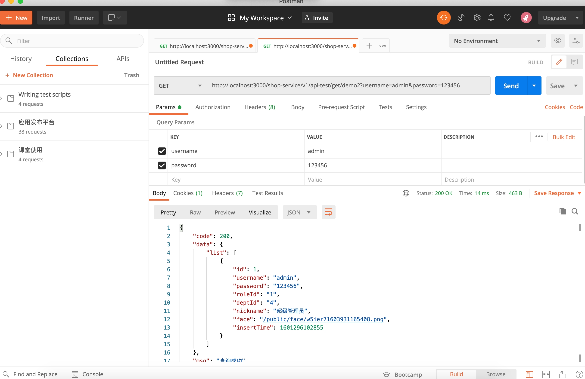
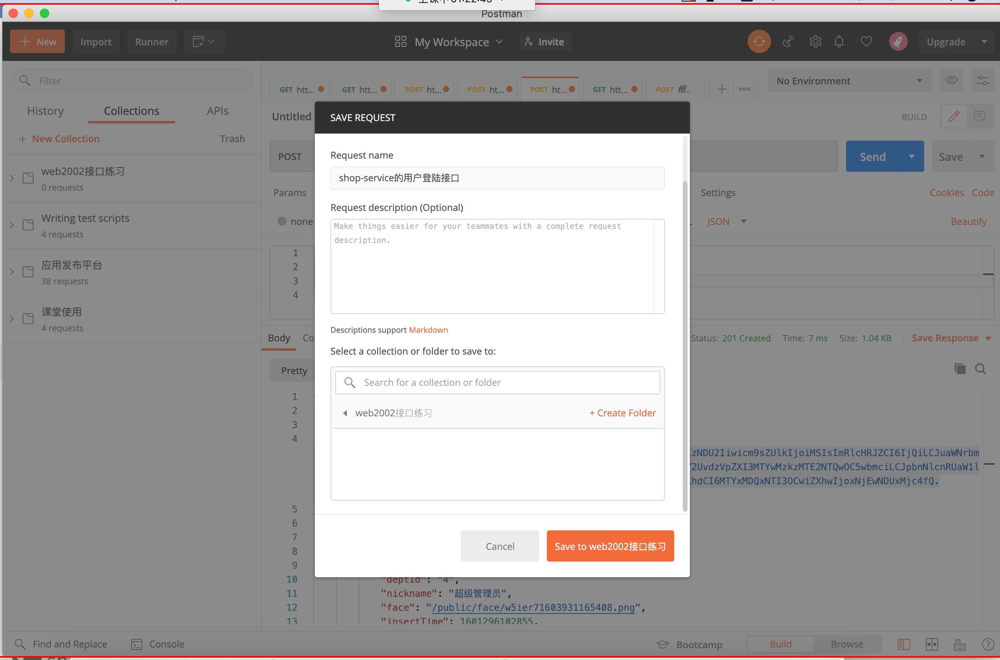

# Vue项目实战5

## 今日内容

1. postman的简单使用
2. 结合昨天的作业2，完成商品类型的增删改查
3. 增删改查练习，完成`优惠券类型管理`,`会员类型管理`,`卡类型管理`

# 1.postman的使用

简介：

我们在项目开发中前端程序员都会依赖接口文档进行开发，通过接口文档来了解当前模块的业务，以及参数等内容，但是在公司的开发中不一定所有的公司都有像shop-service一样的在线可调试的接口文档，有可能只有文字描述，描述url，method，以及参数等，这样我们就没法在开发前对接口有一个完整的了解，也无法测试接口。所以在开发中前端程序员都会使用postman来进行接口的调试。

所以postman就是一个相当于我们的在线文档中的调试接口的一个工具。
1. postman的安装

   下载地址https://www.postman.com/downloads/

   选择windows 64位的软件

   下载成功之后点击setup.exe然后就会自动安装并打开软件

   弹出如下效果

   

   这里需要我们注册一下，使用邮箱和账号去注册

   

   注册成功后会出现如下图页面

   

   在此页面第一个框中随便输入

   第二个随便选一个点击continue

   然后会进入下一个页面，下一个页面直接点击右侧最下面的灰色按钮跳过就可以

   

   最终会进入如下的页面

   

   看见上面的页面就代表登陆成功了

# 2.postman的简单接口调用方式

   接下来我们关闭goodmorning然后变成如下图

   

   点击右侧部分主体上面的小➕就可以创建一个调用接口的页面

   

   这个图就是postman调用接口调试的基本页面

   在第一行可以设置请求的method和url地址

   下面可以设置参数根据请求的接口的不同定义我们在不同的模块设置参数

   比如我们现在就拿最基本的get无参数的接口进行练习

   打开接口文档访问shop-service的接口文档

   然后我们回到postman中查看第二行部分的参数属性

   params代表请求的url中携带的参数（get方式传递参数的主要位置）

   Authorization代表鉴权参数所放置的位置

   headers代表请求头中携带的参数

   body代表请求体中携带的参数（get以外传递参数的主要位置）

   接下来我们就拿接口练习部分的第一个无参数get方式的接口

   做一个最简单的postman的调用练习

   在url中输入http://localhost:3000/shop-service/v1/api-test/get/demo1

   然后点击蓝色的send按钮查看页面的变化

   

   > 小贴士：
   >
   > postman是一个发送请求的客户端，他并不是浏览器所以他发送请求时不存在跨域问题，直接访问接口的地址就可以了。以后如果我们开发的是客户端app这些软件只要不是从网页中发出的请求都不存在跨域问题

   我们下一步再测试一下
## 1.get方式传递参数的接口

   所以我们点击小加号新创建一个调用接口的小窗口然后把get传递参数的接口地址粘贴

   ```
   http://localhost:3000/shop-service/v1/api-test/get/demo2
   ```

   粘贴之后我们再打开页面中的params部分将username和password两个参数传入

   

   出现如上图效果就代表请求成功了。这个就是params传递参数的方式

##  2.post方式

   然后我们再测试一下post方式传递参数的接口如何填写

   找到接口文档中的

   ```
   http://localhost:3000/shop-service/v1/api-test/post/demo2
   ```

   然后点击小加号新建一个小窗口

   首先还是将地址粘贴到地址栏，并且选择post，接下来我们编写参数的部分

   要点击下一行的body一项，然后再下一行点击raw，最右侧会出现一个可点击的Text或者JSON要选择JSON，这里容易看错，默认是Text，应该选择JSON，否则查不出来

   

   参数必须严格按照json标准编写，然后我们点击发送

   

   以上就是使用body传递参数的方式

   也可以选择`x-www-form-urlencoded`，输入key和value也可以

## 3.path的方式

   接下来我们再练习一下使用path传递参数的接口如何调用

   ```url
http://localhost:3000/shop-service/v1/api-test/path/demo1/username/{username}/password/{password}
   ```

   这种url路径的接口直接就将要替换传递的username和password的值写到url路径中然后放到postman中调用即可,如下

   ```
   http://localhost:3000/shop-service/v1/api-test/path/demo1/username/admin/password/123456
   ```

   然后我们新建一个小窗口，然后呢将这个地址粘贴进去

   

   

## 4.postman的鉴权配置

以上就是我们常用的几种接口的调用的方式，剩下的接口只需要按照method和对应的参数位置进行调整测试就可以了。

接下来我们学习一个重点，在postman中如何调用带鉴权的接口。

首先我们要新建一个新窗口然后在新窗口中调用一次登陆接口

```
http://localhost:3000/shop-service/v1/user/login
```


然后我们会得到这个用户的token，得到token之后我们还是复制token中的字符串

然后我们再新开一个小窗口，随便调用一个有鉴权无参数的接口比如

获取所有的角色列表这个接口

```
http://localhost:3000/shop-service/v1/role/list/all
```

如下


暂时还是401，因为我们还没有加入鉴权内容

接下来我们加入鉴权内容，将之前的token复制一份，然后呢在新的小窗口中打开Authorization选项

在左侧的type的下啦列表中选择bearer token这一项

如下图


然后将当前的token内容粘贴到右侧的token的输入框中再点击send


以上就是postman中使用jwt鉴权的方式

其他的鉴权方式需要在公司开发时咨询公司的后端程序员

4. postman保存配置

   第一步操作，在左侧选择collections然后点击New Collection

   输入一个标题，然后点击右下角的create就会创建一个新的接口集合菜单

   

   出现菜单以后我们就找到刚才创建的几个接口的小窗口，比如登陆的接口

   我们在窗口选中后输入Ctrl+S保存

   会弹出如下窗口，我们在第一行输入接口的名称，最下面的栏目中选择web2002点击一下，最后再点击保存，左侧的web2002中就会出现刚才的接口信息

   

   

# 3.商品类型的增删改查

结合昨天的作业

## 3.1增删改查步骤大全

> 回顾一下keep-alive

以system/user/user.vue模块为例子,其他模块将目录和文件名替换就可以

如系统管理-用户管理代表的就是 views/system(对应系统管理)/user(对应用户管理)/user.vue

1. 根据文件结构创建user.vue查询页面,user-add.vue新增页面,user-edit.vue编辑页面

2. 给所有的vue页面在router/index.js中注册路由

3. 在user目录中创建user-model.js并在其中填写基础内容

   ```js
   export default {
     //model文件中必须使用namespaced为true来让model可以命名否则是无法注册到store中的
     namespaced:true,
     state:{
       list:[],
       page:[]
     },
     mutations:{
       setList(state,list){
         state.list = list
       },
       setPage(state,page){
         state.page = page
       }
     },
     getters:{},
     actions:{
       //以下是基础内容，剩下的自行根据需求添加
       async getListForPage({commit},queryForm){
         
       },
       async insert({commit},addForm){
         
       },
       async findById({commit},id){
         
       },
       async update({commit},addForm){
         
       },
       async deleteById({commit},id){
         
       },
     }
   }
   ```

4. 在store/index.js中的module中注册user-model.js导入的对象

5. 在api中定义user-api.js

   1. 这里第一步先查看shop-service的api接口文档
   2. 根据api接口文档的所有接口名，接口参数，method，在postman中测试接口
   3. 在api中的user-api.js中导入我们封装的axios对象并且定义接口调用函数，格式可以找现成的仿写

6. 完成goods-type.vue查询

   1. 完成表格数据的展示
      1. 在api/user-api.js中找到定义的查询接口
      2. 在user-model.js中定义查询接口调用逻辑以及list和page对象
   2. 增加条件查询表单
      1. 将queryForm绑定在条件查询表单中
      2. 将表格构建出来，将model中的list和page对象映射到vue页面
      3. 将分页器的函数定义到methods里面
      4. 将model中的getListForPage映射到methods里面
      5. 调用查询实现查询的业务
      6. 将数据渲染到table中
      7. 将条件查询的按钮事件完成绑定，完成条件查询
   3. 增加分页组件
      1. 通过page对象将分页信息展示出来
      2. 增加分页的psize和pno变更事件
      3. 完成跳页查询
   4. 完成增加和修改按钮以及删除按钮并添加点击事件

7. 完成goods-type-add.vue添加

   1. 完成添加按钮跳转页面
   2. 完成表单的构建和验证
   3. 完成添加数据的提交
      1. api/user-api.js中找到定义的提交接口
      2. 在user-model.js中定义提交接口的调用逻辑
      3. 在user-add中增加mapActions并完成调用
      4. 跳回查询页

8. 完成goods-type-edit.vue修改

   1. 将user-add.vue的内容粘贴到修改页面，改名。
   2. 给修改按钮的绑定事件
   3. 跳转到修改页面，并传入id
   4. 在api/user-api.js找到定义的根据id查询数据的接口
   5. 在user-model.js定义调用根据id查询数据的接口调用函数
   6. 将接口函数映射到user-edit.vue的mapAction中
   7. 将数据根据id查询数据的接口返回值附给addForm
   8. 在api/user-api.js找到定义的根据修改数据接口函数
   9. 在user-model.js定义调用的业务函数
   10. 将接口函数映射到user-edit.vue的mapAction中
   11. 将提交保存部分调用的函数改为新的update函数

9. 完成删除操作

   1. 点击事件传入id
   2. 增加confirm确认框
   3. 在api/user-api.js找到定义的根据id删除数据的接口函数
   4. 在user-model.js传递业务函数并调用删除函数
   5. 将函数通过mapAction映射到user.vue中
   6. 在点击事件中调用删除业务函数以及查询业务函数

# 3.增删改查练习

完成`优惠券类型管理`,`会员类型管理`,`卡类型管理`

> 自己动手为主，结合问题讲解

今天的任务特别的单纯就是要把增删改查的流程和逻辑缕顺，所以通过三个类型管理来训练增删改查。让大家对这个流程巩固下来，整体环节和步骤按照第一章的内容严格操作即可，细节需要参考上一节课和上上节课的内容来查阅。