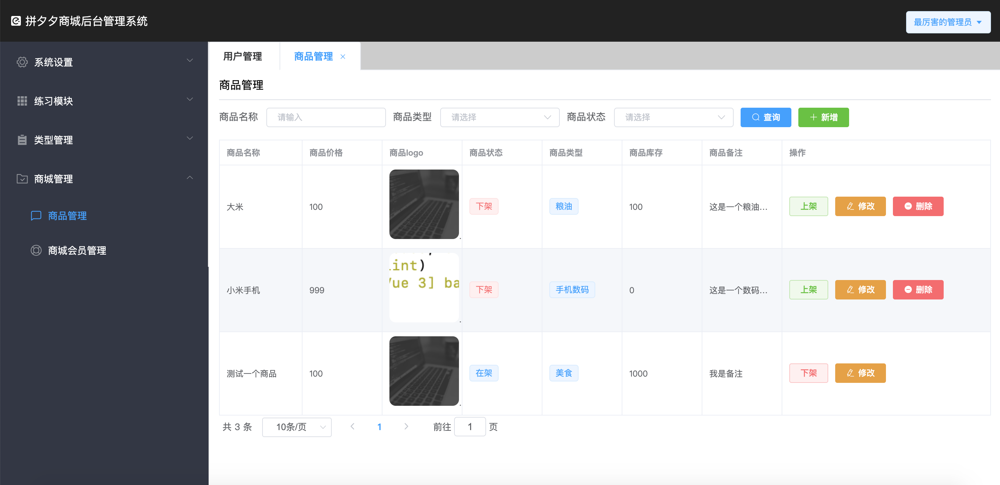
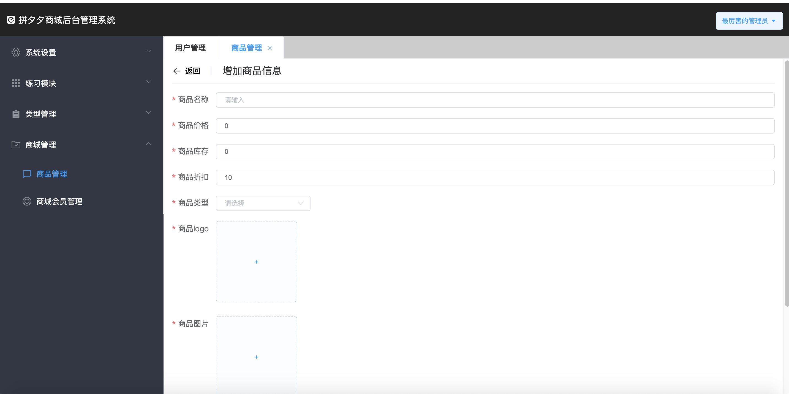
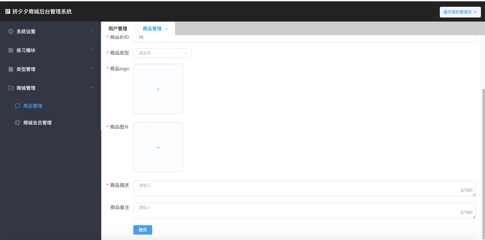
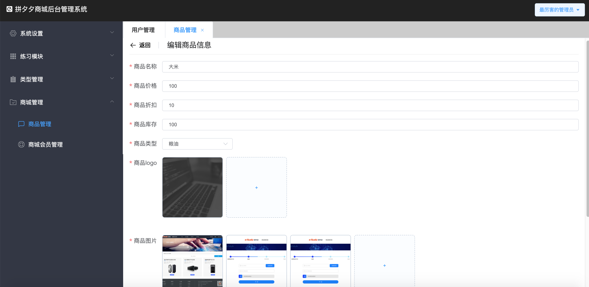

# Vue项目实战6

## 今日内容

1. 介绍文件上传和el-upload组件
2. 给系统设置-用户管理增加头像
3. 给练习模块中的用户管理练习增加头像上传和预览功能
4. 开发商城管理-商品管理模块实现增删改查图片上传

## 1.介绍文件上传和el-upload组件

> 为什么要上传？
>
> 因为我们平时在网页中直接在项目内部引用的图片等静态资源属于，服务器上的固定静态资源，是死的。用户如果想将一个自定义图片添加到一样的系统里。这时如果他在本地修改网页中图片引用的路径是没有任何作用的，当他自己能访问时也只有自己能访问，如果这个网页给了别人，别人是无法访问的。所以如果想让个人的新添加的图片能让所有用户都可以正常查看，就需要将这个图片先保存到互联网的服务器上，让他拥有一个公共的网络地址，这样每个人都能通过网络看到一样的图片。

文件上传是在项目中常用的一种操作，我们在开发web应用时经常会有上传用户头像，或者上传身份证照片等功能，这些就依赖后台的文件上传接口和前端的上传组件

这里我们首先打开后台的api文档学习上传接口

找到`文件接口`发现有三个接口

两个上传接口和一个删除文件接口，其实总结起来就两个接口一个是上传，一个是删除，有这两个接口之后我们就可以实现上传需要的文件，或者通过接口删除无用的文件。

首先查看上传接口这里有两个但是参数都一样，差别就是一个是有鉴权一个是没有鉴权，也就是一个可以直接通过地址调用，另一个需要登录用户拿到token之后才能调用

我们在看一下参数说明，有两个参数，一个是file代表上传的文件对象，一个是folder代表存储文件的文件夹名

总结一下请求的method是post ，ContentType是multipart/form-data，有两个参数。

然后我们使用postman尝试调用这三个接口先体验一下效果并且查看返回值

具体怎么使用这个接口我们启动admin-demo项目找到练习中的文件上传练习。

我们通过练习来学习element-ui的el-upload组件。

> 由于el-upload组件业务复杂，初学者很难直接掌握
>
> 所以公司总结了他的通用的使用方式，做成了示例，我们以读懂即可，
>
> 需要使用时可以直接在这里粘贴代码自行改造使用

下面我们打开菜单中的`文件上传练习`，  然后找到代码中test/upload文件夹的upload.vue查看。按照代码中的注释提示按顺序学习。

学习完以上的内容，我们接下来就要通过p-upload自定义组件来实现给用户管理模块增加头像上传功能

## 2.给系统设置-用户管理增加头像

打开系统管理-用户管理

### 2.1改造增加页面

然后打开接口文档，看用户接口部分的增加和修改。我们发现其实接口中还包含一个叫face的参数，字符串类型，代表用户头像那么我们现在就找到views/system/user-add对addForm增加一个face属性，并且在表单最后增加一个el-form-item

```vue
<!-- label是左侧标题 prop是表单验证对象rules的key -->
<el-form-item size="mini" label="头像" prop="face"></el-form-item>
```

由于头像部分我们要上传图片所以这里我们需要把我们的p-upload组件引入

由于p-upload组件的v-model代表的是fileList和face属性， 

不能直接对应所以这个form-item中我们就不绑定addForm.face

```vue
<el-form-item size="mini" label="头像" prop="face">
<!--
list-type：设置组件样式有三个，text,picture,picture-card
limit:设置最大上传图片的数量必须传数字类型
v-model:放置一个数组数组中包含上传成功的文件的全部信息
action：上传接口的地址，前面通用的部分已经设置好了，直接写/file开头
before-upload：是上传前触发的回调函数可以在上传之前做拦截或者验证操作
on-error：上传失败的回调如果不失败就不会触发
-->
  <!-- 
	关于fileList中的内容，如果图片是自己上传的，fileList中会包含大量的图片文件信息，
这里面我们只需要关心内容中的name和url属性，这两个属性是必须有的，其他的都是可以没有的
-->
	<p-upload 
     list-type="picture-card" 
     :limit="1"
     v-model="fileList"
     action="/file/upload"
     :before-upload="handleBeforeUpload"
     :on-error="handleError">
  </p-upload>
</el-form-item>
```

然后我们创建对应的函数和属性

```js
//不要全复制！！！找到对应的data和methods中的函数放到项目中的制定位置
export default{
  data(){
    return {
      fileList:[],//+++++++++++++++
      addForm:{
        username:'',
        password:'',
        nickname:'',
        roleId:'',
        face:''//+++++++
      },
    }
  },
  methods:{
    handleBeforeUpload(file){//+++++++++++
      // 判断当前的文件类型如果不是这些类型的文件就弹出错误提示并中断上传操作
      if(!(file.name.indexOf('png') != -1
           ||file.name.indexOf('jpg') != -1
           ||file.name.indexOf('jpeg') != -1
           ||file.name.indexOf('gif') != -1)){
        this.$notify({
          title:'提示',
          message:'只能上传图片格式的文件',
          type:'error'
        })
        // 通过return Promise.reject()可以实现中断上传操作，不在触发上传的函数
        // 注意组件内部会自动处理已经传入的fileList，在选择文件的时候就会对fileList增加一个
        // 本地数据，当我们中断上传时，组件内部会自动自行删除fileList，这样就会触发下面的beforeRemove和remove
        return Promise.reject()
      }
    },
    handleError(err){//+++++++++++++++
      this.$notify({
        title:'提示',
        message:'上传失败',
        type:'error'
      })
    }
  }
}
```

以上操作完成我们可以测试一下是否上传可用，然后我们将handleAdd函数改造一下

```js
async handleAdd(){
  let valid = await this.$refs.addForm.validate().catch(err => err);
  if(valid){
    console.log(this.addForm)
    //⬇️⬇️⬇️⬇️⬇️⬇️注释掉保存数据的代码⬇️⬇️⬇️⬇️⬇️⬇️⬇️⬇️
    // this.subLoading = true
    // await this.insert(this.addForm)
    // this.subLoading = false
    // this.handleBack()
  }
}
```

我们在表单中填一组数据并上传图片然后点击提交查看打印信息，发现face并没有值。

这是因为我们的头像暂时绑定在fileList中。

还有一点需要注意，当我们不传图片并且点击提交时，头像部分是没有验证的。

由于我们对头像部分绑定了prop="face"我们可以在rules中对face增加自定义验证

```js
data(){
  //将本页的this对象放到_this中这样在验证器中可是使用
  let _this = this;//++++++++++
  return {
    rules:{
      username:[{
        required:true,
        message:'账号不可以为空'
      }],
      password:[{
        required:true,
        message:'密码不可以为空'
      }],
      nickname:[{
        required:true,
        message:'昵称不可以为空'
      }],
      roleId:[{
        required:true,
        message:'角色不可以为空'
      }],
      //将face的校验增加到代码中
      face:[{//++++++++++
        required:true,//required为true时会自动增加*，并且不与自定义验证冲突
        validator(rules,value,callback){
          //由于validator中的this对象不是本页面vue对象的实例
          //但是我们的data数据是一个函数，所以我们可以在data中把本页的this赋值给_this
          //这样我们就可以在验证器中拿到本页的fileList
          if(_this.fileList.length>0&&_this.fileList[0].url!=undefined){
            callback()
          }else{
            callback(new Error('请上传一个头像'))
          }
        }
      }]
    },
    fileList:[],
    addForm:{
      username:'',
      password:'',
      nickname:'',
      roleId:''
    },
    subLoading:false
  }
},
```

我们完成这段代码之后可以在页面中做一个测试，不上传头像点击提交，然后在上传头像点击提交

发现已经可以验证头像是否上传了。

下一步我们只需要在提交时将fileList中的url放到addForm的face中就可以了

```js
async handleAdd(){
  let valid = await this.$refs.addForm.validate().catch(err => err);
  if(valid){
    //将头像放在addForm的face中
    this.addForm.face = this.fileList[0].url
    this.subLoading = true
    await this.insert(this.addForm)
    this.subLoading = false
    this.handleBack()
  }
},
```

完成后我们可以做一个测试，新增一个带头像的数据，然后回到查询页面翻到最后一页，查看控制台的network，并且查看最后一个数组有没有face属性。我们发现face已经上传成功。

### 2.2改造修改页面

我们这几天做增删改查的经验告诉我们增加和修改有很多部分是一样的，所以我们首先将刚才在添加页面写的部分代码转移到修改页面

1. 将form-item中新增的部分，粘贴到修改页面
2. 将data中新增的部分粘贴到修改页面
3. 将methods新增的部分粘贴到修改页面
4. 以及提交事件中的变更，以及其他部分有变更的部分
改造完的代码如下

```vue
<!-- user-edit.vue页面代码 -->
<template>
	<div>
		<el-page-header @back="handleBack" content="编辑用户信息"></el-page-header>
		<el-row>
			<el-col :span="24">
				<el-form 
					:model="addForm" 
					label-width="auto" 
					ref="addForm" 
					:rules="rules">
					<el-form-item size="mini" prop="username" label="账号">
						<el-input placeholder="请输入" clearable v-model.trim="addForm.username" ></el-input>
					</el-form-item>
					<el-form-item size="mini" prop="password" label="密码">
						<el-input placeholder="请输入" clearable v-model.trim="addForm.password" ></el-input>
					</el-form-item>
					<el-form-item size="mini" prop="nickname" label="昵称">
						<el-input placeholder="请输入" clearable v-model.trim="addForm.nickname" ></el-input>
					</el-form-item>
					<el-form-item size="mini" prop="roleId" label="角色">
						<el-select placeholder="请选择" clearable v-model.trim="addForm.roleId">
							<el-option v-for="item in roleList" 
								:key="item.id"
								:label="item.name"
								:value="item.id"></el-option>
						</el-select>
					</el-form-item>
					<el-form-item size="mini" label="头像" prop="face">
						<p-upload list-type="picture-card" :limit="1"
							 v-model="fileList"
							 action="/file/upload"
							 :before-upload="handleBeforeUpload"
							 :on-error="handleError">
						</p-upload>
					</el-form-item>
					<el-form-item size="mini">
						<el-button :loading="subLoading" @click="handleAdd" type="primary">提交</el-button>
					</el-form-item>
				</el-form>
			</el-col>
		</el-row>
	</div>
</template>

<script>
	import { mapActions,mapState } from 'vuex';
	export default{
		name:'user-edit',
		data(){
			let _this = this;
			return {
				rules:{
					username:[{
						required:true,
						message:'账号不可以为空'
					}],
					password:[{
						required:true,
						message:'密码不可以为空'
					}],
					nickname:[{
						required:true,
						message:'昵称不可以为空'
					}],
					roleId:[{
						required:true,
						message:'角色不可以为空'
					}],
					face:[{
						required:true,
						validator(rules,value,callback){
							//由于validator中的this对象不是本页面vue对象的实例
							//但是我们的data数据是一个函数，所以我们可以在data中把本页的this赋值给_this
							//这样我们就可以在验证器中拿到本页的fileList
							if(_this.fileList.length>0&&_this.fileList[0].url!=undefined){
								callback()
							}else{
								callback(new Error('请上传一个头像'))
							}
							
						}
					}]
				},
				fileList:[],
				addForm:{
					username:'',
					password:'',
					nickname:'',
					roleId:'',
          face:''
				},
				subLoading:false
			}
		},
		async created(){
			let id = this.$route.query.id;
			await this.getRoleListAll()
			let res = await this.findById(id)
			this.addForm = res;
		},
		computed:{
			...mapState('userModel',['roleList'])
		},
		methods:{
			...mapActions('userModel',['getRoleListAll','findById','update']),
			handleBack(){
				this.$router.history.go(-1)
			},
			async handleAdd(){
				let valid = await this.$refs.addForm.validate().catch(err => err);
				if(valid){
					//将头像设置回addForm中的face里
					this.addForm.face = this.fileList[0].url
					this.subLoading = true
					await this.update(this.addForm)
					this.subLoading = false
					this.handleBack()
				}
			},
			handleBeforeUpload(file){
				// 判断当前的文件类型如果不是这些类型的文件就弹出错误提示并中断上传操作
				if(!(file.name.indexOf('png') != -1
						 ||file.name.indexOf('jpg') != -1
						 ||file.name.indexOf('jpeg') != -1
						 ||file.name.indexOf('gif') != -1)){
					this.$notify({
						title:'提示',
						message:'只能上传图片格式的文件',
						type:'error'
					})
					// 通过return Promise.reject()可以实现中断上传操作，不在触发上传的函数
					// 但是这里要注意的是，组件内部会自动处理已经传入的fileList，在选择文件的时候就会对fileList增加一个
					// 本地数据，当我们中断上传时，组件内部会自动自行删除fileList，这样就会触发下面的beforeRemove和remove
					return Promise.reject()
				}
			},
			handleError(err){
				this.$notify({
					title:'提示',
					message:'上传失败',
					type:'error'
				})
			}
		}
	}
</script>

<style scoped="scoped" lang="scss">
</style>
```

完成后我们可以做一个测试随便修改一组数据，上传头像保存

然后我们在打开控制台的network，再次回到这个修改页面，我们看根据id查询一条返回的数据中是否包含face，如果有face说明保存成功

然后我们发现进入修改页面时，已有头像的数据在upload中也看不见头像，这个我们要怎么办呢

这是由于我们已有头像的数据默认在addForm.face中是有图片路径的，但是进入页面时upload组件是靠fileList来展示已上传图片的，我们需要在跳转到修改页面的created方法中将查询回来的addForm中的face设置到fileList中

具体做法如下

```js
//改造修改页面的created函数
async created(){
  let id = this.$route.query.id;
  await this.getRoleListAll()
  let res = await this.findById(id)
  this.addForm = res;
  //当头像已经上传了就设置到fileList中
  if(this.addForm.face!=undefined&&this.addForm.face!=''){
    let file = {
      //将数据中的头像放到file对象中
      url : this.addForm.face,
      //从url中截取文件名
      name : this.addForm.face.substring(this.addForm.face.lastIndexOf('/')+1)
    }
    //将设置好的值放到fileList中
    this.fileList = [file]
  }
  
},
```

改造完毕后我们再来进入修改页面查看，发现进入有头像的修改页面就会自动显示头像，进入没有头像的修改页面就不显示头像。

### 2.3改造查询页面

修改和增加完成之后我们来在首页列表中展示一个可以预览的小图标

这里需要学习一个组件叫做el-image

https://element.eleme.cn/#/zh-CN/component/image

我们可以去官网看一下案例

然后在我们的user.vue中给表格增加一列

```vue
<el-table-column label="头像" >
  <template v-slot="{row}">
	<!-- 我们给组件使用行内样式定义一个固定尺寸
	fit:与css属性object-fit用法完全一样，可以设置图片的屏幕拉伸方式
	src:用于存放图片的访问路径
	preview-src-list:存放预览图的数组，必须是数组形式，数组内填写要预览的图片的路径
-->
<el-image style="width: 100px;height: 100px;border-radius:9px" 
          fit="cover" 
          :src="row.face"
          :preview-src-list="[row.face]"
          >
    </el-image>
  </template>
</el-table-column>
```

至此我们的头像上传夹图片预览全部练习完毕

## 3.给练习模块中的用户管理练习增加头像上传和预览功能

仿照刚才我们讲解的过程自己实现一遍。

## 4.作业，开发商城管理-商品管理模块实现增删改查图片上传

> 今天的作业内容涉及到的组件要结合官方文档查看用法，有一些是课上没有讲解的部分。

按照我们实现增删改查加图片上传的过程，

结合day8，day9，day10中的过程再次完成商城管理-商品管理模块的增删改册

接口参考http://localhost:3000/api中的`商品接口`

先用postman调用登录接口，然后拿到token，配置到postman的鉴权模块，

然后通过postman将所有接口的参数和返回值都尝试一下。

按照之前增删改查的逻辑实现。

具体需求：



查询页面要求有展示如下字段

|字段中文| 商品名称 | 商品价格 | 商品logo | 商品状态 | 商品类型 | 商品库存 |商品备注|操作|
|--------| -------- | -------- | -------- | -------- | -------- | -------- |-------- | -------- |
|字段英文| name | price | logo | isOnSale | goodsTypeName | count |remark|修改按钮，删除按钮，上架按钮，下架按钮|
|要求| 正常展示 | 正常展示 | 展示图片可预览 | 根据状态的数字展示成汉字 | 通过el-tag标签修饰 | 正常展示 |展示成带提示文字的||

> 条件查询说明

要求条件查询字段根据接口文档传入，条件查询中的goodsTypeId要与商品类型关联，通过商品类型的列表做成下拉选项,商品状态（isOnSale）在后台只识别0和1分别对应的就是0是已下架的商品，1是已经上架的商品

> 其他说明

当列表中的商品是下架状态时显示删除按钮，列表中的商品是上架状态时不显示删除按钮

当列表中的商品是下架状态时显示上架按钮，列表中的商品是上架状态时显示下架按钮





接下来查看增加页面，下面是表单验证规则和字段介绍

| 商品名称 | name        | 不可以为空                                                   | string |
| -------- | ----------- | ------------------------------------------------------------ | ------ |
| 商品价格 | price       | 不可以为空不可以是负数                                       | string |
| 商品折扣 | zheKou      | 不可以为空，只能是[1-10]的数字                               | number |
| 商品类型 | goodsTypeId | 不可以为空，要求通过下拉菜单选择，需要关联商品类型的获取所有商品类型接口 | number |
| 商品logo | logo        | 商品图片的url，要求使用p-upload实现上传，只能传1张，不可以为空 | string |
| 商品图片 | pics        | 商品图片的数组，要求同样适用p-upload实现上传，最多传3张，不可以为空 | array  |
| 商品描述 | description | 最多能输入300个字，要求用textarea展示，显示剩余可输入字数，不可以为空 | string |
| 商品备注 | remark      | 最多能输入300个字，要求用textarea展示，显示剩余可输入字数，可以为空 | string |
| 商品库存 | count       | 商品的库存默认是0要求不可以输入负数，必须是整数              | Number |
|          |             |                                                              |        |




修改页面按照图片形式实现，内容与添加页面一样

删除正常完成，

可以思考上架下架如何实现


