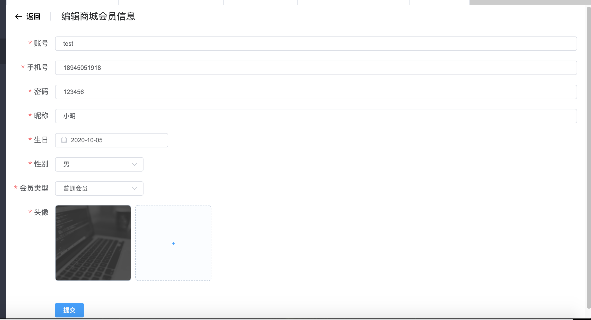

# Vue项目实战7

## 今日内容

1. 将昨天的作业2的增删改查讲解
2. 对商品模块增加功能
3. 作业：完成商城会员管理的增删改查

## 1.昨天的作业2的详细解读

按照之前学习的增删改查流程一步一步规范的演示。

讲解一下项目涉及到的没讲过的组件参数

针对出现问题比较多的地方详细讲解

## 2.对商品模块增加功能

### 2.1商品的上下架功能

完成了稍微复杂点的增删改查之后我们来实现上架下架功能。

1. 参考api文档，我们来看一下上架下架的接口是如何定义的
2. 在goods-api.js中定义调用接口的接口函数
3. 在goods-model.js中定义执行上下架接口的函数
4. 在页面中对上架和下架按钮增加相同的事件并传入当前行的对象row
5. 通过判断当前的行的状态来确定当前是要上架还是下架
6. 点击上下架按钮前弹出confirm提示框
7. 点击确定后按照参数调用model中的函数执行上下架
8. 再重新调用查询接口实现页面刷新

### 2.2table中长数据的处理

1. 通过学习table组件中的属性来实现

2. 通过popover实现更好的效果

   https://element.eleme.cn/#/zh-CN/component/popover popover文档

## 3.作业：完成商城会员管理的增删改查

需求：

查询要求有如下功能

冻结和解冻与商品的上下架一样

新增和修改要求如下效果

