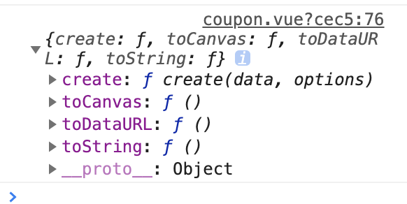

# Vue项目实战9

## 今日内容

1. 讲解昨天作业遇到的问题
2. 批量创建优惠券
3. 完成以二维码形式展示优惠券并且可以扫码查看
4. 从头复习所有的笔记

## 1.讲解昨天作业遇到的问题

1.从退卡和会员查看卡的逻辑开始讲解，将两个模块的功能完善并排除所有问题

2.快速实现优惠券业务的增删改查功能

## 2.批量创建优惠券

1. 与昨天的模块功能完全一样
2. 首先创建批量新增按钮
3. 然后增加点击事件
4. 在api文件中增加批量创建接口
5. 在model中引入
6. 创建coupon-add-multiple.vue
7. 将coupon-add的代码粘贴进去
8. 根据优惠券的接口整理表单内容
9. 将model中的函数替换进coupon-add-multiple
10. 测试批量增加

## 3.完成以二维码形式展示优惠券并且可以扫码查看

二维码是我们在互联网项目中使用最为广泛的一种图形码技术。可以在图形码中存储轻量的数据信息。

详细的二维码介绍可以查看百度百科

https://baike.baidu.com/item/%E4%BA%8C%E7%BB%B4%E7%A0%81/2385673?fr=aladdin

我们通常通过qrcode插件来实现二维码新增

```sh
#首先安装依赖
npm i qrcode -s
```

然后我们在查询页面的每一行增加一个查看二维码按钮

```vue
<el-button size="mini" icon="el-icon-edit" plain @click="handlePeviewQrcode(row)" type="warning">查看二维码</el-button>
					
```


查看二维码一定需要弹出一个窗口，所以这里使用我们之前用过的 dialog组件

```vue
<el-dialog
           title="二维码查看"
           width="200px"
           :visible.sync="dialogVisible">

</el-dialog>
```

在data中声明dialogVisible

然后在点击事件中测试是否能弹出提示框

然后我们模仿之前使用的经验首先创建一个中间变量

dialogForm:{info:""}

由于二维码内部的信息一定要为字符串所以我们这里就将每一行的所有数据的json对象转成字符串

然后放到dialogForm.info中

```js
handlePeviewQrcode(row){
  this.dialogForm.info = JSON.stringify(row)
  this.dialogVisible = true;
}
```

```vue
<el-dialog
			title="二维码查看"
			width="200px"
			:visible.sync="dialogVisible">
			{{dialogForm.info}}
		</el-dialog>
```

完成之后我们来引入qrcode库

```js
import qrcode from 'qrcode'
	console.log(qrcode)
```

查看对象内容



这里我们主要学习toCanvas就可以了

```js
//三个参数，第一个是canvas的html对象，第一个是二维码的内容，第三个是回调函数用来通知创建成功还是失败
qrcode.toCanvas(document.getElementById('canvas'), 'sample text', function (error) {
    if (error) console.error(error)
    console.log('success!');
})
```

需要在dialog中增加一个canvas

```vue
<el-dialog
					title="二维码查看"
					width="300px"
					style="text-align: center;"
					:visible.sync="dialogVisible">
				<canvas id="canvas"  
               ref="canvas" 
                width="200px"></canvas>
		</el-dialog>
```

然后在点击事件中

```js
handlePeviewQrcode(row){
  this.dialogForm.info = JSON.stringify(row)
  this.dialogVisible = true;
  //创建二维码
	//这里由于ref也能获取浏览器中的dom对象
  //所以优先使用ref
	//let canvas = document.getElementById('canvas')
  let canvas = this.$refs.canvas;
  qrcode.toCanvas(canvas,this.dialogForm.info,  (res)=>{
    console.log(res)
  })
}
```

然后我们测试一下，会发现第一次打开时看不见二维码，只有第二次之后能看见

因为在我们点击查看二维码的第一次相当于v-if让dialog展示，这样相当于canvas这个元素在我们点击时还没有创建完成，这种情况我们就需要使用

```js
//nextTick是相当于在vue本次渲染完成之后执行，专门用于一些动态插入元素的场景，防止在元素没创建完成时就执行元素的获取导致获取失败
this.$nextTick().then(()=>{ //函数主体})
  //我们经常会在async函数中如下使用
  async function(){
    await this.$nextTick()
    //这里的函数会延迟到本次页面更新之后才执行
  }
```

所以我们将handlePeviewQrcode改造

```js
async handlePeviewQrcode(row){
  this.dialogForm.info = JSON.stringify(row)
  this.dialogVisible = true;
  //让后面的代码在下一次渲染时执行
  await this.$nextTick()
  //创建二维码
  qrcode.toCanvas(document.getElementById('canvas'),this.dialogForm.info ,(res)=>{
    console.log(res)
  })
}
```

这样改造之后我们发现逻辑正常执行了，这时我们可以拿着手机扫描二维码查看二维码中有什么数据。可以得到本行的数据

在真正的工作中二维码的使用方式：

> 在生产环境中，我们通常生成的二维码是一个带参数的url链接
>
> url就是后台的某一个接口或页面地址，比如我们在扫码支付的时候，打开的就是一个付款网页的地址
>
> 在扫描二维码时二维码中除了url地址后面还会拼接上商家的基本信息，用户的个人信息，用来在付款网页中
>
> 通过接口查询到商户的信息，付款信息，付款金额等数据，所以了解了二维码的本质之后我们发现其实并没有那么神奇了。

## 阶段总结

这个阶段我们学习的内容有：

1. 什么vue框架，以及什么是mvvm，以及vue与传统的dom框架的对比
2. 学习了如何在html网页中使用vue来编写代码
3. 学习了vue的基础指令基础的选项，组件基础以及vue的一些高级的用法
4. 如何对vue进行工程化的开发。
5. vue的脚手架，以及脚手架的基本结构
6. vue的路由，如何分配页面，以及路由的基础理论是基于component动态组件
7. 进行了最简单的一些业务开发
8. vuex对复杂业务进行拆分，还有vuex对数据的共享
9. element-ui视图框架，用来描绘页面，通过组件让页面的构图更加的简单化
10. 项目开发，熟悉增删改查的流程

## 4.作业：从头复习所有的笔记

到此为止我们vue阶段的所有新课就都结束了，今天的作业就是从第一天的笔记和案例开始复习

着重复习前面基础的概念问题，还有后面项目的增删改查逻辑如何编写。明天我们会通过笔试和项目测验来验收这个阶段的学习成果