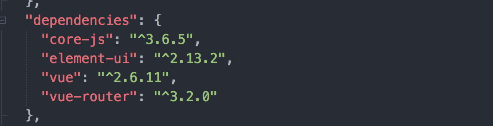

# Vue项目实战2

## 今日内容

1. Element-UI框架介绍
2. Element-UI在Vue脚手架中的使用
3. Element-UI的基本组件
4. 搭建项目登陆页面和主页面

## 1.Element-UI框架介绍

### 1.1Element-UI简介

Element-Ul是`饿了么`前端团队推出的一款基于`Vue.js 2.0` 的桌面端UI框架，所以我们也常称呼他为`饿了么UI`

Element-Ul由于功能完善，团队能力强在Vue领域使用及其广泛。到现在也是Vue领域最主流的UI框架之一。目前框架整体功能趋于稳定所以团队维护和更新的频率降低，但是作为Vue的学习过程Element-UI是上手UI框架的最佳选择之一，并且在生产中仍然被大量的公司应用。

在学习之前首先要了解一下框架的种类：

我们在最早学习的JQuery并不算JavaScript的一个框架，它相当于是一个对DOM操作进行封装的一套函数库。

后来我们学习了Bootstrap，它与Element-UI一样是一种UI框架。

之后我们又学习了Vue,VueRouter，他们属于基于js的模版渲染框架。

那么我们在学习ElementUI之前首先要了解一下什么是UI框架

#### 1.1.1什么是UI

*UI*即User Interface(用户界面)的简称，也就是说凡是带UI两个字的框架就是一个负责搭建和描绘用户界面的框架，也就是说UI框架专注于对界面的样式和结构的建设，核心功能在页面展示层级。而我们学习的Vue相关系列属于是基础层框架他们更多的作用域数据处理层面。

## 2.Element-UI在脚手架中的使用

既然Element-UI是基于Vue2.0实现的一套ui框架，那么一定是结合Vue去使用的，并且Element的数据层完全依赖于Vue，必须在引用了Vue的基础上Element才能生效。

> 小贴士：我们过去学习过Vue组件的封装，也封装过confirm组件，其实Element-UI就是一个基于Vue封装的一套自定义组件

### 2.1Element-UI的引入

在引入Element-UI之前，我们首先通过VueCli搭建一个项目

#### 2.1.1回顾Vue项目的搭建

在今天的案例文件夹目录上右键使用命令行打开执行如下代码

```sh
vue create element-demo
```

由于之前我们自己保存过

```sh
? Please pick a preset: (Use arrow keys)
❯ vue-auto ([Vue 2] dart-sass, babel, router, eslint) #在昨天的课程中我们保存过之前创建项目的配置。所以今天我们可以直接使用这个方案来创建项目，如果有没有保存上的同学可以打开昨天的课程2.1.5从头创建一次
  Default ([Vue 2] babel, eslint) 
  Default (Vue 3 Preview) ([Vue 3] babel, eslint) 
  Manually select features 
```

回顾完项目创建流程之后我们已经成功的创建了一个项目接下来我们来改造一下项目结构

改造之前我们把之前项目中的vue.config.js文件粘贴到当前的项目中

1. 将views中的About.vue和Home.vue文件删除

2. 将components中的HelloWorld.vue删除

3. 将App.vue中只保留router-view如下代码

   ```vue
   <template>
     <div id="app">
       <router-view/>
     </div>
   </template>
   
   <style lang="scss">
   
   
   </style>
   
   ```

4. 在项目中的src/views文件夹中创建Index.vue文件（首字母大写）

   ```vue
   <template>
     <div>
       index
     </div>
   </template>
   
   <script>
     export default{
       name:'index'
     }
   </script>
   
   <style>
   </style>
   ```

5. 在router/index.js中改造只保留Index.vue的路由配置，Index采用同步引用的方式配置

   ```js
   //router/index.js
   import Vue from 'vue'
   import VueRouter from 'vue-router'
   import Index from '../views/Index.vue'
   
   Vue.use(VueRouter)
   
   const routes = [
     {
       path: '/',
       name: 'Index',
       component: Index
     },
   ]
   
   const router = new VueRouter({
     routes
   })
   
   export default router
   
   ```

6. 在element-demo目录下创建vue.config.js

   ```js
   //vue.config.js
   module.exports = {
     publicPath: process.env.NODE_ENV === 'production' ? '' : '/',
     lintOnSave:false
   }
   ```

7. 完成以上步骤之后关闭所有命令行窗口重新启动服务

   ```sh
   npm run serve
   ```

完成以上步骤页面出现index说明操作成功。

### 2.1.2Element-UI在Vue脚手架中的引入

首先我们需要先下载Element-UI框架的代码。

在案例中的**element-demo**上右键打开命令行然后执行

```sh
npm i element-ui -s #下载element-ui的依赖库并保存到package.json中
```

出现如下界面表示成功

```sh
➜  element-demo git:(master) ✗ npm i element-ui -s
+ element-ui@2.13.2
added 9 packages from 8 contributors in 25.52s

65 packages are looking for funding
  run `npm fund` for details
```

然后我们可以在检查一下package.json文件安装成功后在package.json文件的dependencies中会出现element-ui以及他的版本如下图所示



我们看到当前项目在打包时必需携带的依赖有core-js,element-ui,vue,vue-router

接下来我们来学习如何在Vue框架中引用Element-UI；

```javascript
//在main.js中改造
import Vue from 'vue';
import router from './router'
//引入ElementUI全局对象
import ElementUI from 'element-ui';
//引入ElementUI的css样式文件
import 'element-ui/lib/theme-chalk/index.css';
import App from './App.vue';
//通过将ElementUI安装到Vue上
Vue.use(ElementUI);

new Vue({
  router,
  render: h => h(App)
}).$mount('#app')
```

我们将上面的代码整体粘贴替换掉main.js原有的代码

如何验证是否引入成功呢？

我们来学习第一个组件 `<el-button><el-button>`

在index.vue中输入加入

```vue
<template>
	<div>
    <el-button>按钮</el-button>
  </div>
</template>
```

引入按钮组件之后如果页面出现了一个带样式的白色按钮就说明element-ui已经成功的运行了。

## 3.Element-UI的基本组件

element为我们提供了类似bootstrap的全套页面构建组件以及基本主题，我们可以借助于他自身封装的功能快速的搭建web页面而将更多的精力放在业务的实现上而不需要注重ui的编写，element-ui的组件统一定义的风格为`<el-组件名></el-组件名>`这样做首先具备代表性，其次是防止其他框架混用时产生组件的命名冲突。接下来我们学习一下element的常用组件

学习按钮之前首先介绍一下element-ui的官方文档https://element.eleme.cn/#/zh-CN/，官方文档对该框架的使用以及注意事项等做了全方位特别详细的介绍，以及代码实例的提供，所以我们可以根据官方文档快速的进行element-ui框架的开发。

简单浏览完element-ui的官网之后我们来进行常用组件的学习。

### 3.1按钮el-button

由于官方文档写的非常详细所以我们挑项目中最常见的一些组件在课程中学习。首先学习`el-button`

首先我们在刚才创建的项目中src/views中新建一个Button.vue文件并添加到路由中，然后在Index.vue页面中增加一个跳转到Button中的菜单。内容可以参考下面的代码。

```vue
<!-- Button.vue -->
<template>
  <div>
    <h4>按钮</h4>

  </div>
</template>

<script>
</script>

<style>
</style>

```

```vue
<!-- Index.vue -->
<template>
  <div>
    <router-link to="/button">按钮简介</router-link>
  </div>
</template>

<script>
  export default{
    name:'index'
  }
</script>

<style>
</style>

```

```javascript
//router/index.js
import Vue from 'vue'
import VueRouter from 'vue-router'
import Index from '../views/Index.vue'

Vue.use(VueRouter)

const routes = [
  {
    path: '/',
    name: 'Index',
    component: Index
  },
  {//新增部分
    path: '/button',
    name: 'Button',
    component: () => import('../views/Button.vue')
  },
]

const router = new VueRouter({
  routes
})

export default router

```

接下来我们在Button.vue中引用第一个按钮

```vue
<el-button type="default">第一个按钮</el-button>
```

这个就是按钮的一个基础用法

#### 3.1.1按钮的type属性

增加完按钮之后我们来学习按钮的type属性，这个是el-button提供的一个自定义参数。它相当于bootstrap中的按钮样式btn-primary系列，所以type的值有如下几个可以使用的

```vue
<el-button type="default">第一个按钮</el-button>
<el-button type="primary">主要按钮</el-button>
<el-button type="success">成功按钮</el-button>
<el-button type="info">信息按钮</el-button>
<el-button type="warning">警告按钮</el-button>
<el-button type="danger">危险按钮</el-button>
<el-button type="text">文字按钮</el-button>
```

通过type传入不同的值来实现按钮的样式发生变化，下面我们在Button.vue中实践一下。

#### 3.1.2按钮的plain属性（朴素按钮）

在这里我们在学习一个`el-row`组件这个组件主要是布局组件，功能就是行组件每一个`el-row`都会另起一行，配合`el-col`使用，具体用法我们在学习`el-col`时候进行详解

我们

```vue
<el-row>
  <!-- 
		自定义组件的属性如果是boolean类型可以简写为只写属性名称 
		plain 相当于:plain="true"以便于让代码更加简洁
  -->
	<el-button plain>朴素按钮</el-button>
  <el-button type="primary" plain>主要按钮</el-button>
  <el-button type="success" plain>成功按钮</el-button>
  <el-button type="info" plain>信息按钮</el-button>
  <el-button type="warning" plain>警告按钮</el-button>
  <el-button type="danger" plain>危险按钮</el-button>
</el-row>
```

#### 3.1.3按钮的半圆属性round

```vue
<el-row>
  <!-- round属性仍然是boolean类型 -->
	<el-button round>朴素按钮</el-button>
  <el-button type="primary" round>主要按钮</el-button>
  <el-button type="success" round>成功按钮</el-button>
  <el-button type="info" round>信息按钮</el-button>
  <el-button type="warning" round>警告按钮</el-button>
  <el-button type="danger" round>危险按钮</el-button>
</el-row>
```

#### 3.1.4圆按钮属性 circle

```vue
<el-row>
  <!-- 圆按钮不要输入文字会破坏圆形按钮的样式 -->
  <el-button icon="el-icon-search" circle></el-button>
  <el-button type="primary" icon="el-icon-edit" circle></el-button>
  <el-button type="success" icon="el-icon-check" circle></el-button>
  <el-button type="info" icon="el-icon-message" circle></el-button>
  <el-button type="warning" icon="el-icon-star-off" circle></el-button>
  <el-button type="danger" icon="el-icon-delete" circle></el-button>
</el-row>
```

#### 3.1.5按钮图标属性icon

上面在圆按钮中我们发现在按钮中还可以使用一个icon属性传入了样式名就可以实现图标的展示。

element-ui为我们提供了一套字体图标系统，我们可以在任何地方使用他的图标包括按钮。

我们首先看一下element对我们提供了多少图标，打开https://element.eleme.cn/#/zh-CN/component/icon查看，本页的所有图标我们都可以使用

首先学习图标的单独引用方式

```vue
<i class="el-icon-orange"></i>
```

我们可以放到Button.vue中运行一下，多创建几个图标体验一下

然后我们学习普通按钮对图标的使用

在按钮上使用图标我们不用通过`<i>`标签进行引用，直接通过icon属性引用图标的className就可以了

```vue
<el-row>
	<el-button type="primary" icon="el-icon-orange" round>主要按钮</el-button>
  <el-button type="success" icon="el-icon-orange" round>成功按钮</el-button>
  <el-button type="info" icon="el-icon-orange" round>信息按钮</el-button>
  <el-button type="warning" icon="el-icon-orange" round>警告按钮</el-button>
  <el-button type="danger" icon="el-icon-orange" round>危险按钮</el-button>
</el-row>
```

#### 3.1.6按钮的disabled属性

disabled仍然是个boolean类型的属性通过他可以让按钮变成禁用状态

```vue
<el-row>
  <!-- 
		自定义组件的属性如果是boolean类型可以简写为只写属性名称 
		plain 相当于:plain="true"以便于让代码更加简洁
  -->
	<el-button plain disabled>朴素按钮</el-button>
  <el-button type="primary" disabled plain>主要按钮</el-button>
  <el-button type="success" disabled plain>成功按钮</el-button>
  <el-button type="info" disabled plain>信息按钮</el-button>
  <el-button type="warning" disabled plain>警告按钮</el-button>
  <el-button type="danger" disabled plain>危险按钮</el-button>
</el-row>
```

#### 3.1.7按钮的size属性

element在按钮中提供了四种尺寸`normal` `medium` `small` `mini`默认为normal

```vue
<el-row>
  <el-button size="normal">普通按钮</el-button>
  <el-button size="medium">中等按钮</el-button>
  <el-button size="small">小按钮</el-button>
  <el-button size="mini">迷你按钮</el-button>
</el-row>
```

#### 3.1.8按钮事件

我们在学习自定义组件的时候了解到当我们的组件为自定义组件时，默认的事件会消失，只有组件暴露出来的事件可以使用。el-button的按钮已经默认暴漏了所有按钮可以使用的事件，最常用的就是click事件使用方式也和普通的事件绑定一样@click来绑定事件，

现在我们在Button.vue中随意找一个按钮随便绑定一个点击事件并随意输出点内容。

#### 3.1.9按钮的加载状态

我们在未来的生产环境开发时经常会通过点击按钮搜索服务器上的数据或者执行一些远程操作，但是这些操作并不会马上产生结果需要有一定的联网时间，所以在这个过程中如果没有一些提示会造成用户体验的下降所以button为我们提供了一个属性叫做`loading`同样也是boolean类型

首先我们先在项目中添加一个loading按钮

```vue
<el-row>
  <el-button loading>
    按钮
  </el-button>
</el-row>
```

我们看到当前的按钮前面自动添加一个转圈加载的图标，当前按钮不可点击，这个属性经常会配合js中的boolean值来切换状态处理。

下面我们来模拟一个点击变成加载中的状态案例

在Button.vue中增加一个loading属性,以及点击事件

```js
export default{
  data(){
    return {
      loading:false
    }
  },
  methods:{
    handleClick(){
      //我们做一个定时处理，首先让loading变成true，1秒之后在变成false
      let _this = this;
      this.loading = true
      setTimeout(function(){
        //注意在非Vue框架本身的回调函数里如果使用了function方法体
        //那么在这个function的内部的this与function外部的this指向的内容是不一样的
        //如果我们想要在setTimeout的function中使用Vue的this需要在方法外先将他附给一个变量
        //如let _this = this;此时的_this才相当于Vue的对象
        _this.loading = false
      },1000)
      //setTimeout(()=>{
        //在箭头函数 中this不需要处理
       // this.loading = false
      //},1000)
    }
  }
}
```

然后我们在一个按钮上绑定:loading="loading" 并增加点击事件

```vue
<el-button @click="handleClick" :loading="loading">加载按钮</el-button>
```

我们在页面中点击这个按钮来尝试，会发现点击按钮的时候他会变成加载状态，在1秒后恢复，这种加载状态是我们非常常用的。

> 小贴士：
>
> 我们在vue中如果使用了非Vue自带的回调函数并且方法体使用了function一定要注意this对象指向发生变化这个问题，所以在回调函数中要随时测试this对象是否发生变化如果发生变化可以通过在回调外部this没变之前把它赋值给_this变量来保证对象的一致性。

### 3.2输入框el-input

element提供了超级实用的input组件，通过他我们可以大幅度的节省开发时所需要的代码.

下面我们新建一个Input.vue(I是大写的),并且将他添加到router/index.js中并且在首页创建菜单

这里就不在贴出创建步骤了参照Button.vue的创建步骤自己实现一下。

#### 3.2.1最基本的输入框

完成创建后我们学习最基本的输入框组件

```vue
<el-row>
	<el-input></el-input>
</el-row>
```

将输入框创建到页面里

我们会发现一个非常大的文本框类似bootstrap的样式铺满了整个一行。

为了美观的展示输入框我们在这里来学习布局组件`el-col`

之前我们使用了`el-row`并简单的介绍了他是配合`el-col`使用的组件。`el-col`与bootstrap中的col-系列样式是相同的用法

首先学习他的基本属性span

```vue
<!--
	element-ui同样有自己的网格布局系统，不同于bootstrap将一个单元分成12份，element-ui是将一个单元分成了24份所以span=12的时候相当于占用了一半的空间由于span的类型是Number，我们需要将带有Number类型的属性传入组件需要通过v-bind方式来传入
-->
<el-row>
	<el-col :span="12">
  	1
  </el-col>
  <el-col :span="12">
  	2
  </el-col>
</el-row>
```

关于这两个组件的详细用法我们可以通过

> 先确认学习重点：col的span属性 row的gutter属性其他属性作为了解性学习。

https://element.eleme.cn/#/zh-CN/component/layout查阅官方文档来学习。

学习完el-row和el-col之后我们来通过他继续学习el-input组件

#### 3.2.2输入框的placeholder属性

该属性与原生属性用法完全一样

```vue
<el-row>
	<el-col :span="4">
  	<el-input placeholder="请输入"></el-input>
  </el-col>
</el-row>
```

#### 3.2.4输入框的v-model指令

我们发现上面的输入框是没法输入数据的。

el-input可以像普通的表单控件一样通过v-model绑定变量，并且必须结合v-model才能实现正常的输入功能

在项目中定义一个inputStr并体验该属性

```vue
<el-row>
	<el-col :span="4">
  	<el-input placeholder="请输入" v-model="inputStr"></el-input>
  </el-col>
</el-row>
{{inputStr}}
```

#### 3.2.4输入框的disabled，和readonly属性

```vue
<el-row>
	<el-col :span="4">
  	<el-input placeholder="请输入" disabled></el-input>
    <el-input placeholder="请输入" readonly></el-input>
  </el-col>
</el-row>
```

#### 3.2.5输入框的clearable属性

输入框的clearable属性设置之后只要文本框有输入内容就会出现清除按钮

```vue
<el-row>
	<el-col :span="4">
  	<el-input placeholder="请输入" clearable></el-input>
  </el-col>
</el-row>
```

#### 3.2.6输入框的图标属性prefix-icon和suffix-icon

该图标的用法与按钮图标一样只需要在属性中引用icon的className就可以了

prefix-icon：输入框左侧图标

suffix-icon：输入框右侧图标

```vue
<el-row>
	<el-col :span="4">
  	<el-input placeholder="请输入" prefix-icon="el-icon-user" clearable></el-input>
    <el-input placeholder="请输入" prefix-icon="el-icon-remove" clearable></el-input>
  </el-col>
</el-row>
```

#### 3.2.7输入框的size属性

与button的用法一样。

#### 3.2.8输入框的type属性

与原生的type用法一样在组件中增加了一个type="textarea"

当type="textarea"时el-input会被渲染成textarea标签。

#### 3.2.9其他详细的用法*（其他用法在后续开发中会陆续遇到并有针对性学习）

参考官方文档中对input的介绍作为了解性学习

https://element.eleme.cn/#/zh-CN/component/input

### 3.3通知组件Notify

element-ui为我们提供了很多弹窗类组件，其中最为常用组件就是通知组件。通知组件是一个全局的Javascript API，在安装了Element对象之后就会对this绑定$notify对象

```javascript
//常用方式
this.$notify({
  type:'success',//success/warning/info/error
  title:'通知的标题',
  message:'通知的内容',
  position:'top-right'//默认可不填写top-right/top-left/bottom-right/bottom-left
})
```

下面我们在项目中创建一个Notify.vue，并添加到路由中，在Index.vue中增加菜单

然后在Notify.vue中创建

```vue
<el-button @click="handleShowNotify">点我弹出提示</el-button>
```

在js部分增加点击事件并在点击事件练习弹窗的常用方式

```javascript
export default{
  methods:{
    handleShowNotify(){
      this.$notify({
        type:'warning',
        title:'提示',
        message:'我是一个通知'
      })
    }
  }
}
```

体验完基础练习之后剩余内容我们可以结合

https://element.eleme.cn/#/zh-CN/component/notification

官网文档的说明进行学习。

### 3.4confirm询问框组件

我们在学习自定义组件的通过vue自己封装过一个询问框的组件，element为我们提供了更完善的询问框组件。在ElementUI安装到Vue中时ElementUI在全局的this对象上绑定了$confirm对象。他可以实现为我们提供询问框的功能。

```javascript
//confirm的经典用法
this.$confirm('我是询问框的内容','标题',{
  type:'success',//success / info / warning / error
  showClose:false,//true/false 是否右上角的关闭按钮
  showCancelButton:true,//默认为true是否显示取消按钮
  showConfirmButton:true,//默认为true是否显示确认按钮
  cancelButtonText:'取消',//取消按钮的文本，取消按钮的文本
  confirmButtonText:'确认',//确认按钮的文本，确认按钮的文本
}).then(res => {
  //点击确认时的回调，res为confirm
}).catch(err=>{
  //点击取消时的回调，err为cancel
})

//由于该方法为Promise封装的所以可以在async修饰的函数中使用await语法来同步化
async function(){
  let res =await this.$confirm('我是询问框的内容','标题',{
    type:'success',//success / info / warning / error
    showClose:false,//true/false
    showCancelButton:true,//默认为true
    showConfirmButton:true,//默认为true
    cancelButtonText:'取消',//取消按钮的文本
    confirmButtonText:'确认',//确认按钮的文本
  }).catch(err => err)
  //这种格式的写法点击确认时res为confirm点击取消事res为cancel
}
```

下面我们在项目中新建一个Confirm.vue文件，在router/index.js中添加路由配置，在Index.vue中添加菜单，在Confirm.vue中创建按钮通过点击事件实现一个confirm组件的使用案例。

练习完以上案例之后我们可以参考

https://element.eleme.cn/#/zh-CN/component/message-box

查看官网给的完整案例，由官方文档得知$confirm是message-box中的其中一种实现方式

### 3.5容器布局组件----管理系统专用

我们在项目中新建一个Container.vue页面，并且添加到路由和菜单中，菜单就叫容器布局。然后我们学习容器布局的几个基本组件

`<el-container>`：[外层容器](https://element.eleme.cn/#/zh-CN/component/container)。当子元素中包含 `<el-header>` 或 `<el-footer>` 时，全部子元素会垂直上下排列，否则会水平左右排列。

`<el-header>`：顶栏容器。

`<el-aside>`：侧边栏容器。

`<el-main>`：主要区域容器。

`<el-footer>`：底栏容器。

> 以上组件采用了 flex 布局，使用前请确定目标浏览器是否兼容。此外，`<el-container>` 的子元素只能是后四者，后四者的父元素也只能是 `<el-container>`。

我们先学习一个示例

```vue
<!-- 典型的上左右结构页面布局 -->
<template>
  <div>
    <div class="p-layout">
      <el-header>
          我是标题栏目
      </el-header>
      <el-container>
        <el-aside>
          我是左侧菜单
        </el-aside>
        <el-main>
          我是主体
        </el-main>
      </el-container>
    </div>
  </div>
</template>

<script>
  export default{
    
  }
</script>

<style lang="scss" scoped="scoped">
  .p-layout{
    .el-header{
      background-color: #666666;
    }
    .el-container{
      height: 200px;
      .el-aside{
        background-color: #888888;
      }
      .el-main{
        background-color: #CCCCCC;
      }
    }
  }
</style>

```

> 学习完之后我们结合https://element.eleme.cn/#/zh-CN/component/container
>
> 官方文档对容器布局的介绍，着重学习一下每个组件的参数。以及官方示例

### 3.6form组件的基本使用

我们在学习了el-input的基本用法以及结合el-row和el-col的布局之后

下面我们学习一下element-ui的表单使用方式

#### 3.6.1表单的结构

element-ui推出了el-form和el-form-item组件他主要用于表单控件的布局使用

首先查看下面的代码示例

```vue
<template>
	<div>
    <!--form组件的垂直布局使用格式 -->
    <el-form>
      <el-form-item label="账号">
        <el-input></el-input>
      </el-form-item>
      <el-form-item label="密码">
        <el-input></el-input>
      </el-form-item>
    </el-form>
    <!--form组件的水平布局使用格式 -->
    <el-form inline>
      <el-form-item label="账号">
        <el-input></el-input>
      </el-form-item>
      <el-form-item label="密码">
        <el-input></el-input>
      </el-form-item>
    </el-form>
  </div>
	
</template>
```

> 总结：
>
> 1. 结合bootstrap我们可以理解为el-form相当于form的基本样式。el-form-item相当于bootstrap的form-group样式，这种嵌格式是固定格式。
> 2. el-form-item的基本属性label的值就是表单每一个部分的标题
> 3. el-from组件有inline属性，类型为boolean，用来决定表单的布局方式，表单有两种布局方式一种是水平布局方式（inline=true），一种是垂直布局方式（inline=false）

#### 3.6.2.表单的label控制

表单中el-form-item组件上设置的label可以通过在el-form组件上设置label-width来统一设置标题栏目的宽度，标题默认排列在左侧，表单控件排列在右侧。我们还可以通过在el-form上设置label-position来设置label的显示位置。下面查看示例

```vue
<template>
	<el-form label-width="100px" label-position="left">
  	<el-form-item label="账号">
      <el-input></el-input>
  	</el-form-item>
    <el-form-item label="密码">
      <el-input></el-input>
  	</el-form-item>
  </el-form>
</template>
```

> 总结：
>
> 1. label-width设置的是label内容部分的元素所占用的宽度，可以使用px为单位的值，如果label长度是未知的可以使用auto来设置
> 2. label-position可以设置label的展示位置，默认为left，可以设置top, right

#### 3.6.3.表单的size

我们学习的el-button和el-input都有size属性来设置`normal` `medium` `small` `mini`四个尺寸

并且element的所有表单组件都有size属性，由于在表单中我们在一个form-item中可能会使用多个表单组件所以 el-from-item上可以通过size属性来统一设置el-form-item内部的所有具有size属性的组件的大小

```vue
<template>
	<el-form label-width="100px" label-position="left">
    <!-- 这种做法在form-item内部的所有input都会按照form-item上面的size展示 -->
  	<el-form-item label="账号" size="mini">
      <el-input></el-input><el-input></el-input>
  	</el-form-item>
    <el-form-item label="密码" size="small">
      <el-input></el-input><el-input></el-input>
  	</el-form-item>
  </el-form>
</template>
```

以上就是我们今天要掌握的表单的内容。

详细介绍参考https://element.eleme.cn/#/zh-CN/component/form

表单验证部分目前不需要学习

### 3.7如何学习官方文档（重要的课后作业）

在课堂上我们对常用基本组件进行了简单的介绍，我们也掌握了项目中如何快速的使用element组件的方法。仅仅学习课堂上的内容只能保证我们对element-ui做一个基本的了解，如果想要深入的学习这个框架我们一定要掌握查阅官方文档的能力。

所以，我们今天采用讲解+查阅官方文档的方式来进行学习。接下来需要大家通过

https://element.eleme.cn/#/zh-CN/component/installation

阅读官方文档来进行独立学习部分。

要求着重学习以下组件（其他组件有多余精力可以自行查阅）

radio组件

https://element.eleme.cn/#/zh-CN/component/radio

checkbox组件

https://element.eleme.cn/#/zh-CN/component/checkbox

select组件

https://element.eleme.cn/#/zh-CN/component/select

tag组件

https://element.eleme.cn/#/zh-CN/component/tag

popover组件

https://element.eleme.cn/#/zh-CN/component/popover

dropdown组件

https://element.eleme.cn/#/zh-CN/component/dropdown

> 学习方式：
>
> 1. 组件学习第一步就是打开组件对应的文档页面查阅案例的基本使用
> 2. 然后拉到最下面查看组件中参数的介绍
>    1. Attribute就是组件可以使用的props
>    2. slot就是我们学习插槽时通过插槽传入组件的方式
>    3. Events就是组件提供的自定义事件通过@来执行的
>    4. 然后结合组件文档中介绍的实际案例去学习写法
>    5. 最后是在自己的项目中创建页面动手去仿写官方文档的案例


## 4.搭建项目的登陆页面和首页

### 4.1创建一个新的项目(作为课堂练习)

首先在`案例`文件夹中新建一个名为admin-demo-test的项目

```sh
vue create admin-demo-test
```

与上一节创建项目的步骤相同

1. 使用之前保存的配置创建项目
2. 创建vue.config.js文件并将基本配置信息填入
3. 删空views中的文件并创建Login.vue和Index.vue并在内部写入一些基本展示内容
4. 在router/index.js中删除默认的routes内的路由页面配置，并增加Login.vue和Index.vue的配置引入方式采用同步的引入方式
5. 删空App.vue的`template`标签并增加一个`div`嵌套`router-view`
6. 执行`npm i element-ui -s`安装element-ui的依赖包
7. 将element框架整合到Vue的main.js文件中。参考上一章学习的内容
8. 完毕后启动项目就可以了

### 4.2构建一个登陆页面

打开案例中的admin-demo项目用命令行打开,然后执行

```sh
npm install
```

```sh
#安装完成后运行
npm run serve
```

启动后访问http://localhost:8080/#/login会出现登陆页面

### 4.3完成登陆验证的练习

1. 查看案例中的代码，仅仅实现了页面样式并没有实现功能。
2. 项目中目前只有Login.vue和Index.vue两个页面
3. 我们要做的目标
   1. 账号和密码要绑定username和password两个变量
   2. 点击登录要有账号密码验证功能。
      1. 验证账号不可以为空，密码不可以为空
      2. 密码长度必须是6-8位前后包括
      3. 验证不通过要有通知栏提示原因
   3. 当账号和密码为admin,12345678的时候视为登录成功，要跳转到Index.vue并且在Index.vue中的el-header内部展示登录的账号和密码
   4. 账号和密码的输入框要求可以实现点击清除按钮清除输入内容
   5. 点击登录按钮时要求有0.5s的loading动画
4. 分析完成步骤
   1. 首先要在script中创建Vue实例的固定格式并在data中创建username和password两个变量，绑定在账号和密码的input上
   2. 给登录按钮绑定点击事件handleSubmit
   3. 给input绑定clearable属性来实现清除输入内容的功能
   4. 在handleSubmit中增加验证判断
   5. 当验证判断不满足时使用$notify来做错误提示
   6. 当验证判读通过时验证账号密码
   7. 当全部验证通过时，采用settimeout模拟请求等待时间0.5s
   8. 在data中创建loading属性默认为false，绑定在按钮上的loading属性中
   9. 当全部验证通过时设置loading为true
   10. 并在settimeout中设置成false，这里要注意this指向问题
   11. 在settimeout中使用$router对象跳转到Index.vue并通过params传参数
   12. 在Index.vue中创建username和password属性接收参数并显示在Index.vue中
   13. 以上完成变实现了所有需求

### 4.4在el-aside中增加菜单并在el-main中实现页面跳转

实现了登录验证之后我们跳转到Index.vue观察结构学习el-container的用法

1. 然后我们分析需求
   1. 需要点击左侧的菜单需要在右侧实现跳转
2. 实现步骤：
   1. 首先根据页面要求在views中定义Test1.vue和Test2.vue
   2. 然后根据我们之前学习的嵌套路由配置章节的内容来将Test1和Test2配置到router/index.js中，注意要配置在Index.vue中，因为他是Index.vue中的子页面
   3. 在el-main中增加一个router-view并且在网页中测试页面跳转是否好用
   4. 练习：可以对子页面跳转增加一个淡入淡出的动作

### 4.5扩展练习作业：退出登录按钮

需求：

1. 在el-header的右上角放一个按钮叫选项
2. 点击按钮弹出下拉菜单
3. 下拉菜单中只有一个选项叫退出登录
4. 点击退出登录弹出confirm确认框询问是否退出登录
5. 点击confirm的确认页面跳转回login
6. 点击confirm的取消按钮只关闭确认框

参考方案：

实现需要结合css布局将按钮定位到右上角

在通过自学下拉菜单实现下拉菜单的弹出

通过给下拉菜单绑定事件中练习confirm的使用

最后是this.$router跳页的练习

