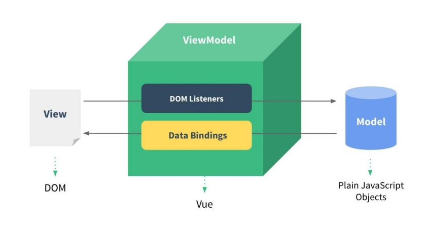
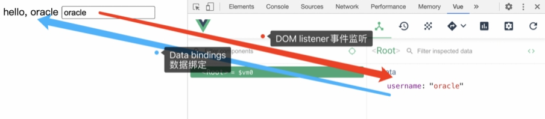
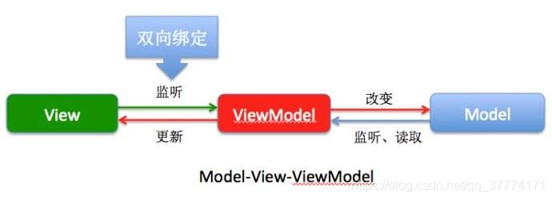
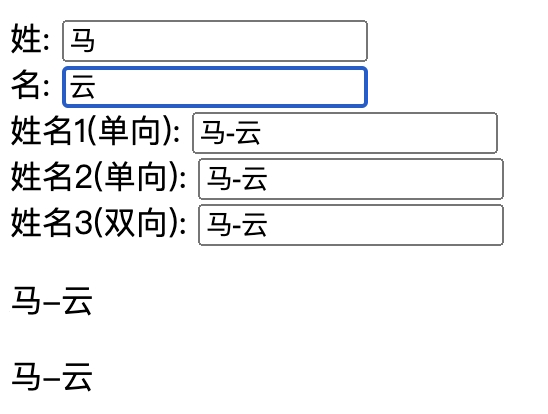
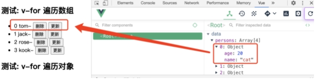
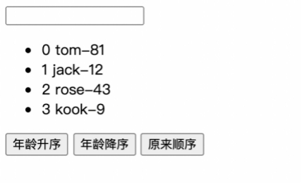
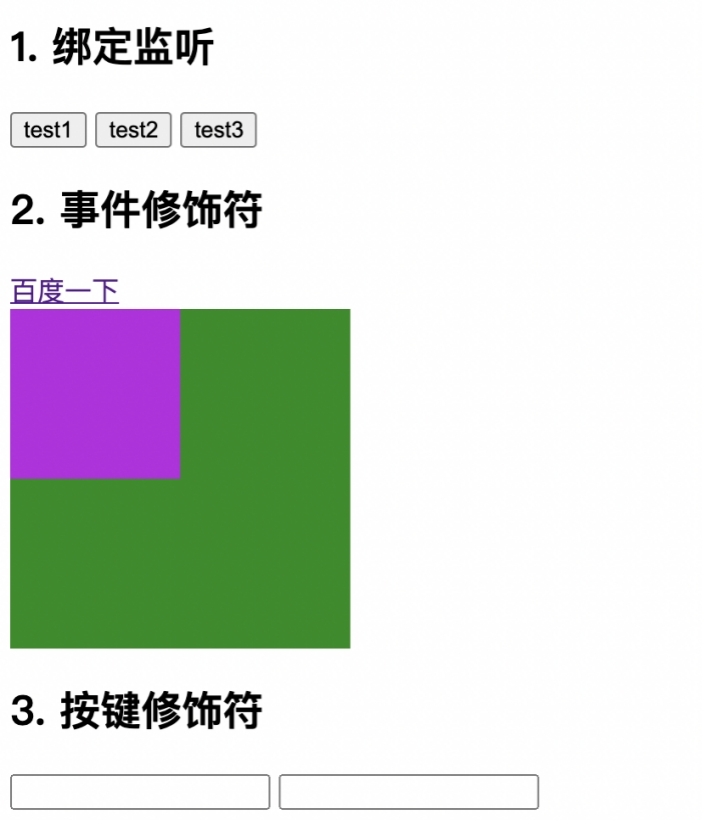
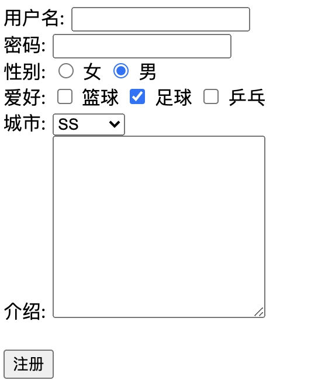
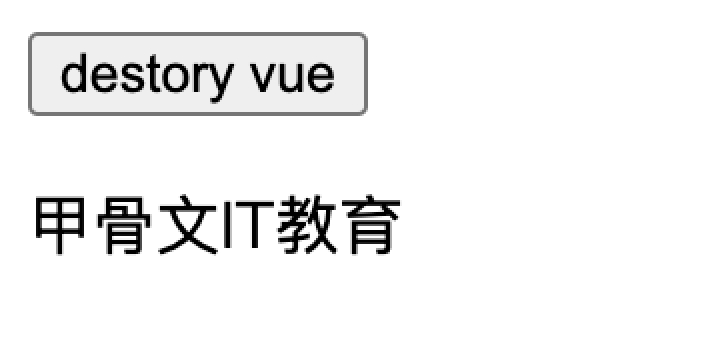
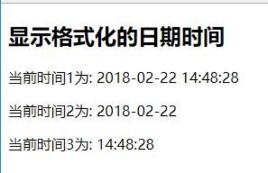

# 第一天 Vuejs基础

## 今日内容

1. vue基本知识
2. 模版语法
3. 计算属性和监视器
4. 样式
5. 条件渲染
6. 列表渲染
7. 事件处理
8. 表单输入绑定
9. vue实例生命周期
10. 过滤器
11. 内置指令

##  Vue的基本认识

### 官网

1) 英文官网:[ https://vuejs.org/](https://vuejs.org/)

2) 中文官网:[ https://cn.vuejs.org/](https://cn.vuejs.org/)

###  介绍描述

1) 渐进式 JavaScript 框架

2) 作者: 尤雨溪(一位华裔前 Google 工程师)

3) 作用: 动态构建用户界面

#### 1 Vue是什么

Vue就是一个js库，并且无依赖别的js库，跟jquery差不多。vue的核心库只关注视图层，非常容易与其它库或已有项目整合。Vue.js是一个轻巧、高性能、可组件化的MVVM库，以数据驱动页面渲染为核心的，为浏览器提供的模版渲染框架,同时拥有非常容易上手的API。

#### 2为什么要使用Vue

由于时代的发展，现代web项目中在网页中的项目规模持续膨胀，对前端项目的可维护性以及性能要求逐渐升高，传统的html+css+JQ(JQuery)的形式没有模块化开发的能力导致大型web项目中大量面向过程的代码在同一个网页中堆积降低了项目的___可维护性___和___持续迭代性___，并且大量的DOM操作降低了浏览器的渲染性能，而Vue等以数据为核心驱动页面渲染的MVVM框架更加适合复杂繁琐的现代项目

#### 3. Vue的特点

1) 遵循 MVVM 模式

2) 编码简洁, 体积小, 运行效率高, 适合移动/PC 端开发

3) 它本身只关注 UI, 可以轻松引入 vue 插件或其它第三库开发项目

#### 4. 与其它前端JS框架的关联

1) 借鉴 angular 的模板和数据绑定技术

2) 借鉴 react 的组件化和虚拟DOM技术

#### 5. Vue扩展插件

1) vue-cli: vue 脚手架

2) vue-resource(axios): ajax 请求

3) vue-router: 路由

4) vuex: 状态管理

5) vue-lazyload: 图片懒加载

6) vue-scroller: 页面滑动相关

7) mint-ui: 基于 vue 的 UI 组件库(移动端)

8) element-ui: 基于 vue 的 UI 组件库(PC 端)

# 1 Vue 的基本使用

  1.效果 (01_HelloWorld/test.html)

2. 编码

```html
<div id="app">
<input type="text" v-model="username">
<p>Hello, {{username}}</p>
</div>
<script type="text/javascript" src="../js/vue.js"></script>
<script type="text/javascript"> 
  new Vue({
    el: '#app', data: {
    username: 'oracle'
    }
  })
</script>
```

3. 使用vue 开发者工具调试

4. 理解Vue 的MVVM



View Model：视图模型，本质是vue实例，不是Vue,是创建出来的实例对象const vm = new Vue();

-Dom listeners:监视 视图(view)的改变，里面有个input的事件监听文本框的改变，会把这个数据保存到model中去。

-Data bindings: 数据绑定 数据从内存中显示到网页上去，要想实现数据绑定后面源码再分析

View : 页面

Model : 模型，其实就是数据对象。代表data

 

转化图：



我们不关心是怎么实现的监听和绑定。vue帮我们处理

有一个概念叫声明式开发，整个流程我们不需要处理。我们只要根据他的语法，写一些特定的东西。他就可以实现。

相对应还有一个命令式。jquery的写法。不仅知道怎么显示，还要去读dom。

打开案例中的 [vs-jquery.html](../案例/vs-jquery.html) 运行并阅读代码

继续强调



> tips(课后阅读)：
>
> 换句话说，我们不关注dom的结构，而是考虑数据该如何储存，用户的操作在view通过viewmodel进行数据处理，分情况是否通过ajax与model层进行交互，再返回到view层，在这个过程中view和viewmodel的数据双向绑定使得我们完全的摆脱了对dom的繁琐操作，而是专心于对用户的操作进行处理，避免了MVC中control层过厚的问题。
>
> 现在我们把一个网页应用抽象一下，视图(View)就是HTML中的DOM，一个网页就是通过DOM的组合与嵌套，形成了最基本的视图结构，再通过CSS的修饰，在基本的视图结构上“化妆”让他们看起来更加美观。接下来涉及到交互部分，就需要用到JavaScript来接受用户的交互请求，并且通过事件机制来响应用户的交互操作，并且在事件的处理函数中进行各种数据的修改，比如说修改某个DOM中的innerHTML或者innerText部分。
>
> 我们把HTML中的DOM就可以与其他的部分独立开来划分出一个层次，这个层次就叫做视图层。Vue 的核心库只关注视图层
> 我们为什么要把视图层抽取出来并且单独去关注它呢？
>
> 因为在像知乎这种页面元素非常多，结构很庞大的网页中，数据和视图如果全部混杂在一起，像传统开发一样全部混合在HTML中，那么要对它们进行处理会十分的费劲，并且如果其中有几个结构之间存在藕断丝连的关系，那么会导致代码上出现更大的问题，这什么问题呢？
>
> 你是否还记得你当初写JQuery的时候，有写过 $ (’#xxx’).parent().parent().parent()这种代码呢？当你第一次写的时候，你觉得页面元素不多，不就是找这个元素的爸爸的爸爸的爸爸吗，我大不了在注释里面写清楚这个元素的爸爸的爸爸的爸爸不就好了。但是万一过几天之后你的项目组长或者你的产品经理突然对你做的网页提出修改要求，这个修改要求将会影响页面的结构，也就是DOM的关联与嵌套层次要发生改变，那么$ (’#xxx’).parent().parent().parent()可能就会变成$(’#xxx’).parent().parent().parent().parent().parent()了。
>
> 这还不算什么，等以后产品迭代越来越快，修改越来越多，而且页面中类似的关联和嵌套DOM元素不止一个，那么修改起来将非常费劲。而且JQuery选择器查找页面元素以及DOM操作本身也是有性能损失的，可能到时候打开这个页面，会变得越来越卡，而你却无从下手。
>
> 当你在编写项目的时候遇到了这种问题，你一定会抱怨，为什么世上会有HTML这种像盗梦空间一样的需要无数div嵌套才能做出页面的语言，为什么当初学JQuery看中的是它简洁的DOM操作，现在却一点也不觉得它有多简洁，难道我学的是假的JQuery？为什么写个代码这么难，你想砸电脑，你想一键盘拍在产品狗的脑袋上，责怪他天天改需求才让你原本花清香茶清味的代码变得如此又臭又长。
>
> 这个时候如果你学过Vue.js，那么这些抱怨将不复存在。

# 2. 模板语法

准备：效果 (02_模板语法/test.html)

## 2.1. 模板的理解

1) 动态的 html 页面

2) 包含了一些 JS 语法代码   

a. 双大括号表达式

b. 指令(以 v-开头的自定义标签属性)

## 2.2. 双大括号表达式

数据绑定最常见的形式就是使用“Mustache”语法 (双大括号) 的文本插值：

1) 语法:	{{exp}},  或{{变量名.toUpperCase()}}

2) 功能: 向页面输出数据

3) 可以调用对象的方法

```html
<h2>1. 双大括号表达式</h2>
   <p>{{msg.toUpperCase()}}</p>
   <p v-text="link"></p>
   <p v-html="link"></p>
data(){
			return {
				msg: 'i m so good',
				link:"<a href='www.xxx.com'>oracle</a>"
			}
		}
```

## 2.3. 指令一: 强制数据绑定

1) 功能: 指定变化的属性值

2) 完整写法:	v-bind:xxx='yyy'	//yyy 会作为表达式解析执行

3) 简洁写法:	:xxx='yyy'

```html
<h2>2. 指令一: 强制数据绑定(对比区别)</h2>


data(){
		return {
			imgSrc:'img/dhp.jpg'
		}
}
```

## 2.4 指令二: 绑定事件监听

1) 功能: 绑定指定事件名的回调函数,

2) 完整写法:

v-on:keyup='xxx'

v-on:keyup='xxx(参数)' v-on:keyup.enter='xxx'

在Vue参数中的methods，内定义事件函数回调

3) 简洁写法:

@keyup='xxx' @keyup.enter='xxx'

```html
<button type="button" @click="handleclick">按钮</button>
<button type="button" @click="handleclickParam('oracle')">传参数的按钮</button>
<button type="button" @click="handleclickParam(location)">传参数的按钮</button>
handleclick(){
	console.log("i clicked here");
},
handleclickParam(params){
	console.log(params);
}
```

1.1.1. 编码

```html
<div id="app">
<h2>1. 双大括号表达式</h2>
<p>{{msg}}</p>
<p>{{msg.toUpperCase()}}</p>


<h2>2. 指令一: 强制数据绑定</h2>
<a href="url">访问指定站点</a><br><!--不能使用-->
<a v-bind:href="url">访问指定站点 2</a><br>
<a :href="url">访问指定站点 3</a><br>

<h2>3. 指令二: 绑定事件监听</h2>
<button v-on:click="handleClick">点我</button>
<button @click="handleClick">点我 2</button>

</div>


<script type="text/javascript" src="../js/vue.js"></script>
<script type="text/javascript"> new Vue({
el: '#app',
data: {// data 的所有属性都会成功vm 对象的属性, 而模板页面中可以直接访问
msg: 'NBA I Love This Game!', url: 'http://www.baidu.com'
},
methods: { handleClick () {
alert('处理点击')
}
}
})
</script>
```

# 3. 计算属性和监视

准备代码：效果 (03_计算属性和监视/test.html)



当输入姓和名的时候，自动组合在一起下面跟着变

1. 没有计算属性的效果

```html
data(){
	return {
		firstname:'马',
		lastname:'云',
		fullname1:'马 云'
	}
}
姓: <input type="text" placeholder="First Name" v-model="firstname"><br>
名: <input type="text" placeholder="Last Name" v-model="lastname"><br>
<!--fullName1是根据fistName和lastName计算产生-->
姓名1(单向): <input type="text" placeholder="Full Name1" v-model="fullname1"><br>
```


## 3.1. 计算属性

**使用计算属性实现“姓名1（单向）**

1) 在 computed 属性对象中定义计算属性的方法，方法的返回值作为属性值

2) 在页面中使用{{方法名}}来显示计算的结果

```html
//删除data中的fullname1
computed:{
	fullname1(){
		return this.firstname + this.lastname;
	}
}
姓名1(单向): <input type="text" placeholder="Full Name1" v-model="fullname1">
```

## 3.2 有参数计算属性

> 我们在做项目中有可能会遇到这样一种情况 比如A状态传递过来的是数字 我们需要使用switch来判断这个所属状态分别代表什么意思。例如已知的值是1，显示在页面中用户肯定看不懂1，我们显示预付款，如果是2，显示进度款,那么这个计算函数需要把数字作为参数传进去。

```js
typelist() {
						return function(i) {
							console.log(i);
							let res;
							switch (Number(i)) {
								case 6:
									res = "一次性付清";
									break;
								case 1:
									res = "预付款";
									break;
								case 2:
									res = "进度款";
									break;
								case 4:
									res = "押金";
									break;
								case 5:
									res = "其他";
									break;
								default:
									res = "";
								break;
							}
							return res;
						};
					},
```

显示测试：调用计算函数{{typelist(1)}}

## 3.3. 监视属性

**使用监视属性实现姓名2(单向):**

1) 通过通过 vm 对象的$watch()或 watch 配置来监视指定的属性

2) 当属性变化时, 回调函数自动调用, 在函数内部进行计算

```js
//添加fullname2数据
fullname2:''

姓名2(单向): <input type="text" placeholder="Full Name2" v-model="fullname1"><br>
watch:{
	//firstname发生改变
	firstname(newvalue, oldvalue){
		this.fullname2 = newvalue + this.lastname;
	},
	lastname(newvalue, oldvalue){
		this.fullname2 = this.firstname + newvalue;
	}
}

```


## 3.4. 计算属性高级

**使用高级计算属性实现姓名3（双向）**

1) 通过 getter/setter 实现对属性数据的显示和监视，注意不是函数，是一个对象

```js
fullname3:{
//计算并返回当前的值,当需要读取当前属性值时回调，根据相关的数据计算并返回当前的值
	get(){
		return this.firstname + “ ”+  this.lastname;
	},
//回调函数，当属性值发生改变时回调，更新相关的属性数据
	set(value){
		this.firstname = value.split(' ')[0]
		this.lastname  = value.split(' ')[1];
	}
}
姓名3(双向): <input type="text" placeholder="Full Name3" v-model="fullname3"><br>
```

2) 计算属性存在缓存, 多次读取只执行一次 getter 计算

```html
  <p>{{fullname1}}</p>
  <p>{{fullname1}}</p>
  <p>{{fullname1}}</p>
  <p>{{fullname1}}</p>
fullname1(){
	console.log("fullname1()");
	return this.firstname + this.lastname;
}
```

## 3.5 完整代码

```html
<div id="demo">
姓: <input type="text" placeholder="First Name" v-model="firstName"><br>
名: <input type="text" placeholder="Last Name" v-model="lastName"><br>
姓名 1(单向): <input type="text" placeholder="Full Name" v-model="fullName1"><br>
  姓名 2(单向): <input type="text" placeholder="Full Name" v-model="fullName2"><br> 
  姓名 3(双向): <input type="text" placeholder="Full Name2" v-model="fullName3"><br>
</div>

<script type="text/javascript" src="../js/vue.js"></script>
<script type="text/javascript"> var vm = new Vue({
el: '#demo', data: {
firstName: 'Kobe', lastName: 'bryant', fullName2: 'Kobe bryant'
},
computed: {


fullName: function () {
return this.firstName + " " + this.lastName
},
fullName3: {
get: function () {
return this.firstName + " " + this.lastName
},
set: function (value) {
var names = value.split(' ') this.firstName = names[0] this.lastName = names[1]
}
}
},
watch: {
lastName: function (newVal, oldVal) {
this.fullName2 = this.firstName + ' ' + newVal
}
}
})
vm.$watch('firstName', function (val) {
this.fullName2 = val + ' ' + this.lastName
})
```

# 4. class 与 style 绑定

 

 准备代码： (04_class 与style 绑定/test.html)

理解

1) 在应用界面中, 某个(些)元素的样式是变化的

2) class/style 绑定就是专门用来实现动态样式效果的技术

## 4.1. class 绑定

1) :class='xxx'  xxx引用变量

2) 表达式是字符串: 'classA', 引用样式名，例如 <p :class=“‘classA’”

3) 表达式是对象: {classA:isA, classB: isB}，  isA和isB是布尔类型，如果是true，样式留下，如果是false样式不留下

4) 表达式是数组: ['classA', 'classB'] 

## 4.2. style 绑定

1) :style="{ color: activeColor, fontSize: fontSize + 'px' }"

2) 其中 activeColor/fontSize 是 data 属性

## 4.3. 完整代码

```html

  <style>
    .classA {
      color: red;
    }
    .classB {
      background: blue;
    }
    .classC {
      font-size: 20px;
    }
  </style>
</head>
<body>
<div id="demo">
  <h2>1. class绑定: :class='xxx'</h2>
  <p :class="myClass">xxx是字符串</p>
  <p :class="{classA: hasClassA, classB: hasClassB}">xxx是对象</p>
  <p :class="['classA', 'classB']">xxx是数组</p>

  <h2>2. style绑定</h2>
  <p :style="{color:activeColor, fontSize}">:style="{ color: activeColor, fontSize: fontSize + 'px' }"</p>
  <button @click="update">更新</button>
</div>
<script type="text/javascript" src="../js/vue.js"></script>
<script type="text/javascript">
  new Vue({
    el: '#demo',
    data: {
      myClass: 'classA',
      hasClassA: true,
      hasClassB: false,
      activeColor: 'red',
      fontSize: '20px'
    },

    methods: {
      update () {
        this.myClass = 'classB'
        this.hasClassA = !this.hasClassA
        this.hasClassB = !this.hasClassB
        this.activeColor = 'yellow'
        this.fontSize = '30px'
      }
    }
  })
</script>
</body>
</html>
```

# 5. 条件渲染

准备代码： (05_条件渲染/test.html)

理解：条件渲染指令

1) v-if 与 v-else

2) v-show 

理解：比较v-if 与v-show

3) v-show只是不显示隐藏元素，v-if移除对象

4) 如果需要频繁切换 v-show 较好

5) 当条件不成立时, v-if 的所有子节点不会解析(项目中使用)

## 5.1 完整代码

```html
<script type="text/javascript" src="../js/vue.js"></script>
<script type="text/javascript"> 
    var vm = new Vue({
el: '#demo', data: {
ok: false
}
})
</script>

```

# 6. 列表渲染

 

准备代码：效果 (06_列表渲染/test.html)

```js
准备数组
persons:[
	{name:'tom', age:81},
	{name:'jack', age:12},
	{name:'rose', age:43},
	{name:'kook', age:9},
]
```

## 6.1 列表显示指令 

数组: v-for / index 

```vue
<li v-for=" (person,index) in persons" :key="index">{{index}}{{person.name}}</li>
```

对象: v-for / key（不常用）

```vue
<li v-for="(value,key) in persons[2]"> 	{{value}}--{{key}} </li>
```

## 6.2列表的更新显示删除 item

```js
this.persons.splice(index, 1)
```


## 6.3 更新条目

替换 item,此处有问题：

```js
<button @click="update(index, {name:'cat',age:20})">更新</button>
update(index, newp){
	console.log(index);
	//this.persons[index] = newp;//没有改变数组本身，数组内部发生了变化，但并没有调用变异方法，vue不会更新数据
	this.persons = [];//测试代码	发现数组变成新的了	
  this.persons.splice(index,1,newp)//调用变异方法实现更新数据
}
```



## 6.4 列表的高级处理



### 6.4.1 列表过滤

1.文本框绑定数据searchname

2.思考输入searchname，数组结果是变化的。这里采用计算属性，而不是过滤原来data中的数组

3.定义计算属性filterpersons。返回值是通过数组函数filter判断的

```js
computed:{
			filterpersons(){
				//取出相关的数据
				const {searchname, persons} = this;
				let fPersons;//最终要返回的数组
				fPersons = persons.filter(person =>{
					return person.name.indexOf(searchname)!=-1;
				})
				return fPersons;
			}
		}
```

### 6.4.2 列表排序

1.定义一个变量数据orderType:0,//0,原本， 1升序，2降序

2.并const {searchname, persons, orderType} = this;

3.判断值做排序

```js

if(orderType!==0){
	fPersons.sort((p1, p2)=>{
	if(orderType ===2){
		return p2.age - p1.age;
	}else{
		return p1.age - p2.age;
	}
	})
}
```

4.为按钮绑定事件

```vue
setOrderType(t){
	this.orderType = t;
}
<button type="button" @click="setOrderType(1)">年龄升序</button>
<button type="button" @click="setOrderType(2)">年龄降序</button>
<button type="button" @click="setOrderType(0)">原来顺序</button>
```

## 6.5.完整代码(列表)

```html
<div id="demo">
<h2>测试: v-for 遍历数组</h2>
<ul>
  <li v-for="(p, index) in persons" :key="index">
{{index}}--{{p.name}}--{{p.age}}
--
<button @click="deleteItem(index)">删除</button>
--
<button @click="updateItem(index, {name:'Jok',age:15})">更新</button>
</li>
</ul>


<h2>测试: v-for 遍历对象</h2>
<ul>
<li v-for="(value, key) in persons[0]">
{{ key }} : {{ value }}
</li>
</ul>
</div>


<script type="text/javascript" src="../js/vue.js"></script>
<script type="text/javascript"> 
  new Vue({
		el: '#demo',
    data: {
        persons: [
        {id: 1, name: 'Tom', age: 13},
        {id: 2, name: 'Jack', age: 12},
        {id: 3, name: 'Bob', age: 14}
        ]
			},


		methods: { 
      deleteItem(index) {
        this.persons.splice(index, 1)
      },
      updateItem(index, p) {
      // this.persons[index] = p // 页面不会更新
        this.persons.splice(index, 1, p)
      }
		}
})
</script>
```

## 6.6 完整代码（排序）

```html
<div id="demo">
<input type="text" name="searchName" placeholder="搜索指定用户名" v-model="searchName">
<ul>
<li v-for="(p, index) in filterPerson" :key="index">
{{index}}--{{p.name}}--{{p.age}}
</li>
</ul>
<button @click="setOrderType(1)">年龄升序</button>
<button @click="setOrderType(2)">年龄降序</button>
<button @click="setOrderType(0)">原本顺序</button>
</div>


<script type="text/javascript" src="../js/vue.js"></script>
<script type="text/javascript"> new Vue({
el: '#demo', data: {
orderType: 0, //0 代表不排序, 1 为升序, 2 为降序
searchName: '', persons: [
{id: 1, name: 'Tom', age: 13},
{id: 2, name: 'Jack', age: 12},
{id: 3, name: 'Bob', age: 17},
{id: 4, name: 'Cat', age: 14},
{id: 4, name: 'Mike', age: 14},
{id: 4, name: 'Monica', age: 16}
]
},
methods: {
setOrderType (orderType) {
this.orderType = orderType
}
},
computed: { filterPerson() {
let {orderType, searchName, persons} = this
// 过 滤
persons = persons.filter(p => p.name.indexOf(searchName)!=-1)
  // 排 序
if(orderType!==0) {
persons = persons.sort(function (p1, p2) {
if(orderType===1) {
return p1.age-p2.age
} else {
return p2.age-p1.age
}
})
}
return persons
}
}
})
</script>
```

# 7. 事件处理

准备代码：效果 (07_事件处理/test.html)



理解绑定监听:

1) v-on:xxx="fun"

2) @xxx="fun"

3) @xxx="fun(参数)"

4) 默认事件形参: event

5) 隐含属性对象: $event

```js
<button @click="test1">test1</button>
<button @click="test3('abcd', $event)">test3</button>
test1(event) {//没参数默认的有event对象
        alert(event.target.innerHTML)
 }
test3 (msg, event) {
        alert(msg+'---'+event.target.textContent)
 },
```

## 7.1 事件修饰符

准备代码，点击内部会弹出两次，第一次是内部，第二次是外部

```js
<div style="width: 400px;height: 400px;background-color: red;" @click="clickouter">
  	<div style="width: 200px; height: 200px; background-color: blue;" @click="clickinner">
  	</div>
  </div>

clickouter(){
	alert("outer");
},
clickinner(){
	alert("inner");
}
```

### 7.1.1 stop

.stop : 停止事件冒泡 event.stopPropagation()

改造代码

```html
<div style="width: 200px; height: 200px; background-color: blue;" @click.stop="clickinner">
  	</div>
```

### 7.1.2 prevent

 .prevent : 阻止事件的默认行为 event.preventDefault()

```html
<a href="http://www.baidu.com" @click.prevent="preventdemo">百度一下</a>
preventdemo(){
	alert("不能跳转百度了");
}
```

## 7.2. 按键修饰符

实现按回车的时候响应事件

原始的写法

```html
<input type="text" @keyup="keyenter"/>
keyenter(event){
	 if(event.keyCode === 13)
		alert(event.target.value);
}
```

1) .keycode : 操作的是某个 keycode 值的键

```html
<input type="text" @keyup.13="keyenter"/>
```

2) .keyName : 操作的某个按键名的键(少部分)

```html
<input type="text" @keyup.enter="keyenter"/>
```

## 7.3 完整代码

```html
<div id="example">


<h2>1. 绑定监听</h2>
<button v-on:click="test1">Greet</button>
<button @click="test1">Greet2</button>
<button @click="test2($event, 'hello')">Greet3</button>


<h2>2. 事件修饰符</h2>
<!-- 阻止事件默认行为 -->
<a href="http://www.baidu.com" @click.prevent="test3">百度一下</a>
<br/>
<br/>
<!-- 停止事件冒泡 -->
<div style="width: 200px;height: 200px;background: red" @click="test4">
<div style="width: 100px;height: 100px;background: green" @click.stop="test5"></div>
</div>
<h2>3. 按键修饰符</h2>
<input @keyup.8="test6">
<input @keyup.enter="test6">
</div>

<script type="text/javascript" src="../js/vue.js"></script>
<script type="text/javascript"> 
  new Vue({
    el: '#example', data: {
name: 'Vue.js'
},
methods: {
test1 (event) {
// 方法内 `this` 指向 vm
// alert('Hello ' + this.name + '!')
// `event` 是原生 DOM 事件
alert(event.target.innerHTML)
},
test2 (event, msg) { alert(event.target.innerHTML + '---' + msg)
},
test3() {
alert('阻止事件的默认行为')
},
test4() {
alert('out')
},
test5() { alert('inner')
},
test6(event) {
alert(event.keyCode + '---' + event.target.value)
}
}
})
</script>
```

# 8. 表单输入绑定

 

准备代码 效果 (08_表单输入绑定/test.html)



1.1.1. 使用v-model 对表单数据自动收集

1) text/textarea

2) checkbox

3) radio 

4) select

## 完整代码

```html

<div id="demo">
  <form action="/xxx" @submit.prevent="handleSubmit">
    <span>用户名: </span>
    <input type="text" v-model="username"><br>

    <span>密码: </span>
    <input type="password" v-model="pwd"><br>

    <span>性别: </span>
    <input type="radio" id="female" value="女" v-model="sex">
    <label for="female">女</label>
    <input type="radio" id="male" value="男" v-model="sex">
    <label for="male">男</label><br>

    <span>爱好: </span>
      <!--checkbox的value的值绑定到数组类型中，value必须有值，要不不知道赋什么值-->
    <input type="checkbox" id="basket" value="basket" v-model="likes">
    <label for="basket">篮球</label>
    <input type="checkbox" id="foot" value="foot" v-model="likes">
    <label for="foot">足球</label>
    <input type="checkbox" id="pingpang" value="pingpang" v-model="likes">
    <label for="pingpang">乒乓</label><br>

    <span>城市: </span>
    <select v-model="cityId">
      <option value="">未选择</option>
      <option :value="city.id" v-for="(city, index) in allCitys" :key="city.id">{{city.name}}</option>
    </select><br>
    <span>介绍: </span>
      <!-- 多行文本域的值要用v-model，不要用插值表达式写在标签里面，那样不能双向绑定值了-->
    <textarea rows="10" v-model="info"></textarea><br><br>

    <input type="submit" value="注册">
  </form>
</div>

<script type="text/javascript" src="../js/vue.js"></script>
<script type="text/javascript">
  new Vue({
    el: '#demo',
    data: {
      username: '',
      pwd: '',
      sex: '男',
      likes: ['foot'],
      allCitys: [{id: 1, name: 'BJ'}, {id: 2, name: 'SS'}, {id: 3, name: 'SZ'}],
      cityId: '2',
      info: ''
    },
    methods: {
      handleSubmit () {
        console.log(this.username, this.pwd, this.sex, this.likes, this.cityId, this.info)
        alert('提交注册的ajax请求')
      }
    }
  })
</script>
</body>
</html>
```

# 9. Vue 实例生命周期

## 9.1 vue 生命周期分析 

生命周期流程图


阅读图片后我们发现Vue主要的生命周期有以下几种

+ beforeCreate __在data选项内容创建之前执行__
+ created __data内数据创建完成执行__
+ beforeMount __在网页视图渲染前执行__
+ mounted __在网页视图渲染完成执行__
+ beforeUpdate __在网页视图发生变化前执行__
+ updated __在网页视图变化后执行__
+ beforeDestroy __在Vue对象销毁前执行__
+ Destroyed __在Vue对象销毁后执行__


[官网说明](https://cn.vuejs.org/v2/guide/instance.html#实例生命周期钩子)

准备代码： 效果 (09_Vue 实例_生命周期/test.html)

需求：点击按钮destroy vue （销毁vue实例），每隔一秒切换显示

 

思路：

1.显示或者“甲骨文it教育”应该为它添加以个布尔类型的值，定义一个isshow：true

2.使用v-show绑定isshow，

3.每隔1秒的定时器，应该写在哪里？外面？应该写在初始化中，初始化显示后立即调用。所以不写在created，写在mounted

```js
setInterval(()=>{
      console.log("-----");
this.isShow = !this.isShow;
},1000);
```

4.接下来销毁vm，首先给按钮绑定事件

```js
<button @click="destroyvm">destory vue</button>
destroyvm(){
			  this.$destroy()
		  }
```

5.虽然已经销毁，但是定时器还在输出，内存泄漏，在销毁vm之前，清除定时器

```js
//把定时器赋值给this
this.interval = setInterval 后面省略
beforeDestroy(){
	clearInterval(this.interval)
}
```

1.接下来看图说明生命周期函数

1) 初始化显示

 beforeCreate()

 created()

 beforeMount()

 mounted()

2) 更新状态: this.xxx = value

 beforeUpdate()

 updated()

3) 销毁 vue 实例: vm.$destory()

 beforeDestory()

 destoryed()

## 9.3 常用的生命周期方法

1) created()/mounted(): 发送 ajax 请求, 启动定时器等异步任务

2) beforeDestroy(): 做收尾工作, 如: 清除定时器 

1.1.2. 完整代码

```html
<div>
<button @click="destoryVue">destory vue</button>
<p v-show="isShowing">{{msg}}</p>
</div>


<script type="text/javascript" src="../js/vue.js"></script>
<script type="text/javascript"> var vue = new Vue({
el: 'div', data: {
msg: '甲骨文IT 教育', isShowing: true, persons: []
},
beforeCreate () {
console.log('beforeCreate() msg=' + this.msg)
  },
created () {
console.log('created() msg='+this.msg)


this.intervalId = setInterval(() => {
console.log('	') this.isShowing = !this.isShowing
}, 1000)
},


beforeMount () {
console.log('beforeMount() msg='+this.msg)
},
mounted () {
console.log('mounted() msg='+this.msg)
},


beforeUpdate() {
console.log('beforeUpdate isShowing='+this.isShowing)
},
updated () {
console.log('updated isShowing='+this.isShowing)
},


beforeDestroy () { console.log('beforeDestroy() msg='+this.msg) clearInterval(this.intervalId)
},


destroyed () {
console.log('destroyed() msg='+this.msg)
},


methods: { destoryVue () {
vue.$destroy()
}
}
})
</script>
```

# 10. 过滤器

 

准备代码 (11_过滤器/test.html)



理解过滤器 

1) 功能: 对要显示的数据进行特定格式化后再显示

2) 注意: 并没有改变原本的数据, 可是产生新的对应的数据

## 10.1 定义和使用过滤器

 

1) 定义过滤器

```js
Vue.filter(filterName, function(value[,arg1,arg2,...]){
    // 进行一定的数据处理
    return newValue

})
```

2) 使用过滤器

<div>{{myData | filterName}}</div>

<div>{{myData | filterName(arg)}}</div>

## 10.2 完整代码

```html
<div id="test">
<p>当前时间为: {{currentTime}}</p>
  <p>当前时间 1 为: {{currentTime | dateStr}}</p>
<p>当前时间 2 为: {{currentTime | dateStr('YYYY-MM-DD')}}</p>
<p>当前时间 3 为: {{currentTime | dateStr('HH:mm:ss')}}</p>
</div>


<script type="text/javascript" src="../js/vue.js"></script>
<script type="text/javascript" src="https://cdn.bootcss.com/moment.js/2.19.0/moment.js"></script>
<script>
// 注册过滤器
Vue.filter('dateStr', function (value, format) {
return moment(value).format(format || 'YYYY-MM-DD HH:mm:ss')
})


new Vue({
el: '#test', data: {
currentTime: new Date()
}
})
</script>
```


# 11.内置指令

##  效果 (11_指令/test.html)

## 11.1 常用内置指令

1) v-text :  更新元素的 textContent

2) v-html :  更新元素的 innerHTML

3) v-if : 如果为 true, 当前标签才会输出到页面

4) v-else: 如果为 false, 当前标签才会输出到页面

5) v-show : 通过控制 display 样式来控制显示/隐藏

6) v-for : 遍历数组/对象

7) v-on : 绑定事件监听, 一般简写为@

8) v-bind : 强制绑定解析表达式, 可以省略 v-bind

9) v-model : 双向数据绑定

10) ref : 指定唯一标识, vue 对象通过$refs 属性访问这个元素对象

11) v-cloak : 防止闪现, 在项目在开发中，经常会遇到当数据加载时vue的一些标签就会闪现，然后等数据加载完后消失，这时候就需要用到官网中提到的v-cloak来解决。与 css 配合: [v-cloak] { display: none }

## 11.2 完整代码

```html
<style>
  [v-cloak] {
    display: none
  }
</style>


<div id="example">
  <p v-text="url"></p>
	<p v-html="url"></p>
  
  <p>
  <span ref="message">oracle.com</span>
  <button @click="showMsg">显示左侧文本</button>
  </p>
	<p v-cloak>{{url}}</p>
</div>


<script type="text/javascript" src="../js/vue.js"></script>
<script type="text/javascript"> alert('模拟加载慢')
new Vue({
el: '#example', 
  data: {
    url: '<a href="http://www.oracle.com">甲骨文</a>',
    myid: 'abc123',
    imageSrc: 'http://cn.vuejs.org/images/logo.png'
	},
  methods: {
    showMsg: function () { 
      alert(this.$refs.message.textContent)
    }
  }
})
</script>
```

## 相关面试题

### 1.什么是vue的生命周期？

> Vue实例从创建到销毁的过程，就是生命周期。也就是从开始创建、初始化数据、编译模板、挂载DOM->渲染、更新->渲染、卸载等一系列过程，我们称这是Vue的生命周期。

### 2.vue生命周期的作用是什么？

> 它的生命周期中有多个事件钩子，让我们在控制整个vue实例的过程时更容易形成好的逻辑。
>
> mounted:  ajax异步请求的数据显示到网页上
>
> beforeDestory:  组件销毁前推出登录状态，清session

### 3.Vue生命周期总共有几个阶段？

> 它可以总共分为8个阶段：创建前/后,载入前/后，更新前/后，销毁前/销毁后

### 4.第一次页面加载会触发那几个钩子？

> 第一次页面加载时会触发beforeCreate,created,beforeMount,mounted

### 5.DOM渲染在哪个周期中就已经完成？

> DOM渲染在mounted中就已经完成了

### 6.生命周期钩子的一些使用方法：

```js
1.beforecreate:可以在加个loading事件，在加载实例是触发
2.created:初始化完成时的事件写在这里，如在这结束loading事件，异步请求也适宜在这里调用
3.mounted:挂载元素，获取到dom节点
4.updated:如果对数据统一处理，在这里写上相应函数
5.beforeDestroy:可以一个确认停止事件的确认框
6.nextTick:更新数据后立即操作dom
```

### 7.v-show与v-if的区别

> v-show是css切换，v-if是完整的销毁和重新创建
> 使用频繁切换时用v-show,运行时较少改变时用v-if
> V-if=’false’v-if是条件渲染，当false的时候不会渲染
> 使用v-if的时候，如果值为false，那么页面将不会有这个html标签生成
> v-show则是不管值是为true还是false，html元素都会存在，只是css中的display显示或隐藏
> v-show 仅仅控制元素的显示方式，将 display 属性在 block 和 none 来回切换；而v-if会控制这个 DOM 节点的存在与否。当我们需要经常切换某个元素的显示/隐藏时，使用v-show会更加节省性能上的开销；当只需要一次显示或隐藏时，使用v-if更加合理。

### 8.开发中常用的指令有哪些?

> v-model:一般用在表达输入，很轻松的实现表单控件和数据的双向绑定
> v-html：更新元素的innerHTML
> v-show与v-if：条件渲染，注意二者区别
> v-on:click:可以简写为@click,@绑定一个事件。如果事件触发了，就可以指定事件的处理函数
> v-for：基于源数据多次渲染元素或模板
> v-bind:当表达式的值改变时，将其产生的连带影响，响应式地作用于DOM语法
> v-bind:title=”msg”简写.  :title="msg"

### 9.**computed和watch有什么区别**

**computed**

> computed是计算属性，也就是计算值，它更多用于计算值的场景
> computed具有缓存性，computed的值在getter执行后是会缓存的，只有在它依赖的属性值改变之后，下一次获取computed的值时重新调用对应的getter来计算
> computed适用于计算比较消耗性能的计算场景
>
> 计算属性有缓存

**watch**

> watch更多的是[观察]的作用，类似于某些数据的监听回调，用于观察props $emit或者本组件的值，当数据变化时来执行回调进行后续操作
> 无缓存性，页面重新渲染时值不变化也会执行 
>
> 

**小结**

> 当我们要进行数值计算，而且依赖于其他数据，那么把这个数据设计为computed
> 如果你需要在某个数据变化时做一些事情，使用watch来观察这个数据变化。

### 10.vue事件中如何使用event对象

```js
<button @click="Event($event)">事件对象</button>
```

### 11.**Vue 组件中 data 为什么必须是函数**

> vue组件中data值不能为对象，因为对象是引用类型，组件可能会被多个实例同时引用。
> 如果data值为对象，将导致多个实例共享一个对象，其中一个组件改变data属性值，其它实例也会受到影响。

## 作业

1. 回顾今天学习的所有内容
2. 熟练背诵vue的生命周期以及常用指令
3. 查看vue的官方文档教程部分从介绍看到组件基础