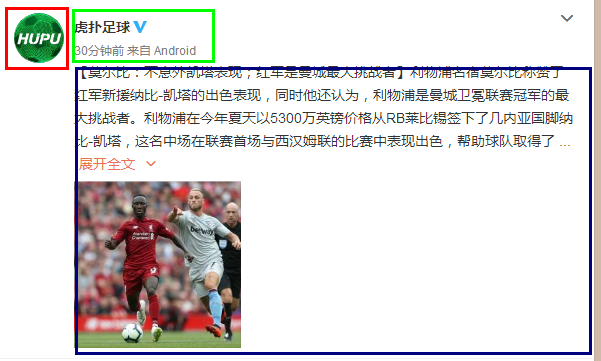
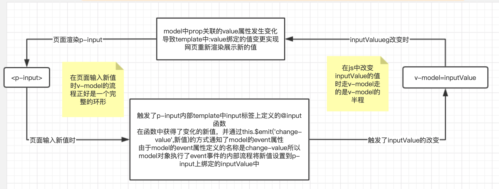
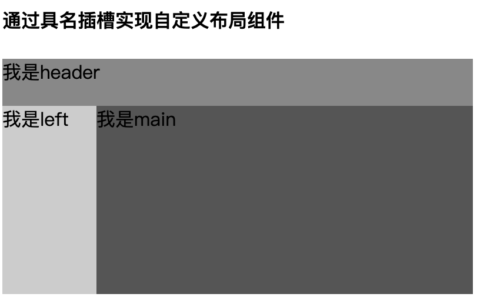

# Vue基础3

## 今日内容

1. Vue组件
2. Vue的其他常用功能

## 1.Vue组件

### 1.1什么是组件组件有什么好处

在之前的学习过程中我们只是学习了Vue的基础指令，和基本用法等内容已经初步的学会了Vue的使用，但是这并不是Vue真正的使用方式，在真正的项目开发过程中，网页的复杂度会非常的高,我们在公司做开发的时候并不是把所有代码都写在new Vue()这个对象中。所以Vue特别推出了组件化的思想，将所有的html页面元素都按照业务或功能分成独立的模块，不同的模块就是一个单独的组件。

组件在Vue中被称为Component，通俗的讲就是通过Vue实现的自定义html标签。

组件化的好处：

1. 可以让大型的复杂系统清晰化，每个功能和业务都是单独拆分并将逻辑写在独立的组件内部，这样代码就特别容易定位和维护。
2. 重复的功能抽离成组件之后可以在系统中复用，同样的功能只需要写一个组件在需要的地方使用就可以了
3. 每个组件都有独立的生命周期，我们在Vue的生命周期学习中体验了beforeUpdate和updated两个生命周期，当data中的值发生变化时就会触发Vue的重新渲染，抽离成组件之后组件内部的data数据更新只会触发组件内部重新渲染并不会让Vue对象将所有元素重新渲染一次，这样大大减小了页面渲染的开销

### 1.2在Vue中使用组件

[组件基础官方文档](https://cn.vuejs.org/v2/guide/components.html)


Vue的全局api中提供了自定义组件的注册方式:

```js
Vue.component('组件名',{
       //组件内容，常用属性有template, props, data, methods等
})
```


#### 1.2.1组件命名[规范](https://cn.vuejs.org/v2/guide/components-registration.html#组件名大小写)

组件名称就相当于我们定义的自定义标签的标签名。命名规范为全小写，多单词组合的名称用-分开

例如: toast,my-button。<toast>、<my-button>

**组件名称不可以是html元素中已存在的标签名，如：button,input等。**

#### 1.2.2组件内容定义

组件内容是一个json对象，与Vue实例中的对象类似可以使用data,computed,methods,watch以及生命周期。还有组件特有的属性，自定义组件不能直接操作网页html中的元素，所以自定义组件中提供了template属性来描述组件的html内容

```vue
<!-- 定义方式 -->
<div id="app">
  <!-- 当前组件最终会输出为<div>我是组件</div>-->
  <my-component></my-component>
</div>
<script>
  //定义一个名称为my-component的组件
	Vue.component('my-component',{
  	data(){
      return {
        title:'我是组件'
      }
    },
    template:'<div>{{title}}</div>',//template中只能有且只有一个根标签，其他内容都写在这个标签内部
    methods:{/**/},
    computed:{/**/},
    watch:{/**/}
  })
  new Vue({}).$mount('#app')
</script>

```

> 学习了以上组件的基本概念和定义方式，我们开始结合课堂案例进行代码的编写和体验

> 小贴士：template属性中需要编写html代码，需要注意的是template中的html代码必须有一个`根标签`包裹不可以在一个template中出现两个平级的根标签,这个根标签可以是任意标签
>
> ```json
> //正确的
> {
>   template:`
> 	<div>
> 		...内容
>   </div>`
> }
> //错误的(template中最外层必须有且只有一个标签)
> {
>   template:`
>     <div>...内容</div>
>     <div>...内容</div>`
> }
> ```
>
> 

打开案例中的[component.html](/md/day3/案例/component.html)运行并查看代码

> 总结：
>
> 在组件定义中，根结点如果一定要使用两个或多个
>
> 也是可以定义的，但是必须通过v-if或v-else-if来处理
>
> 通过条件来让组件只有一个能符合条件并被展示到网页中

熟悉了组件的基本定义之后我们来学习一下组件的自带功能和生命周期

打开[component1.html](/md/day3/案例/component1.html)运行并查看代码

> 思考如何拆分组件
>
>  
>
> 

#### 1.2.3组件的props选项（单向父传子）

我们已经学会了如何定义一个自定义组件，组件不是孤立存在的要和其他组件交互传值，如果想更好更灵活的运用这个组件我们需要对组件传递参数来让组件增强他的通用性，如何向组件传入参数呢？

props选项能够接收来自父组件数据。仅仅只能接收，props是单向绑定的，即只能父组件向子组件传递，不能反向。

可以参考一下的代码

```vue
<!-- 对组件传入参数的案例 -->
<div id="app">
  <!-- 组件定义了title参数之后就可以通过title对组件内部传参数，如果类型是字符串可以直接像html一样传值 -->
  <my-component title="你好"></my-component>
  <!-- 组件的参数同样可以通过v-bind绑定组件外部的data数据 -->
  <my-component :title="title"></my-component>
</div>
<script>
  Vue.component('my-component',{
   	//组件传参选项props,他可以是数组，或者对象
    //这里我们学习他的完整用法，对象用法
    props:{
      //props中定义参数名称key:{required:boolean,type:Type,default:function}
      title:{
        required:false,//该参数是否是必填参数
        type:String,//定义参数的类型如果允许多个类型可以使用[Stirng,Array]的写法，类型使用大写的对象名称
        default:function(){//组件的默认值，当required为true时不需要设置默认值
          return '我是默认值'
        }
      }
    },
    //props中定义的属性在组件中是与data同级别的，除了不可以更改之外其他用法与data中的属性相同
    template:'<div>{{title}}</div>'
  })
	new Vue({
    data(){
      return {
        title:'我是绑定的参数'
      }
    }
  })
</script>
```

> 下面我们进入课堂案例中查看更多的组件参数使用方法

打开案例中的[component2.html](/md/day3/案例/component2.html)


#### 1.2.4$emit（单向子传父）

在上一个案例中我们在容易出错的地方了解到自定义的组件是无法直接绑定click等常规事件的，主要的原因是因为自定义组件不是html原始标签，html的原始标签在dom对象中是存在一系列基本事件的，那么如果想给自定义组件绑定事件就需要在自定义组件中先定义事件。


上面1.2.3示例是父组件向子组件通信，而通过$emit 实现子组件向父组件通信。

对于$emit官网上也是解释得很朦胧，简单说是这样的:

```js
vm.$emit( event, arg )
```

$emit 绑定一个自定义事件event，当这个这个语句被执行到的时候，就会将参数arg传递给父组件，父组件通过@event监听并接收参数。

具体操作先看下面的示例：

```vue

	<body>
		<div id="app">
		  <my-component @parentclick="handleClick"></my-component>
		  <div>
		  	父组件的值：【{{parentValue}}】
		  </div>
		</div>
		<script src="https://cdn.jsdelivr.net/npm/vue/dist/vue.js" type="text/javascript" charset="utf-8"></script>
		<script>
		  Vue.component('my-component',{
			  data(){
			  	return {
			  		msg: "我是子组件的msg",
			  	}
			  },
		    //由于my-component组件最终渲染的是其内部定义的button标签，所以我们鼠标的点击其实发生在button标签上，想要让点击事件生效，首先要在button上定义点击事件。
		    template:'<button @click="handleClick">点我</button>',
		    methods:{
		      handleClick(){
		        //想要让my-component上定义的click事件执行需要通过$emit方法来通知到外部
		        //this.$emit('事件名',参数)
		        this.$emit('parentclick',this.msg)
		      }
		    }
		  })
			new Vue({
				data(){
					return {
						parentValue: '父组件的值'
					}
				},
		    methods:{
		    //在组件内部的click事件中$emit()执行了之后当前绑定在my-component上的click事件便会执行
			  //value是子组件传过来的参数
		      handleClick(value){
		        console.log('点击事件');
						this.parentValue = value;
		      }
		    }
		  }).$mount('#app')
		</script>
	</body>
```

再看一个例子证明 @func名字是自定义的， func是一个名字而已，子组件使用$emit调用父组件事件的名字

```html
<div id="app">
			<child @func="handleChange"></child>
			{{parentValue}}
		</div>
		<script type="text/javascript">
			Vue.component('child',{
				data(){
					return {
						msg: "我是子组件的msg",
					}
				},
				template:`<button @click="handleClick">go</button>`,
				props:{
					zhi:{
						required:false,
						type:String,
						default(){
							return '默认值'
						}
					}
				},
				methods:{
					//想要子组件定义的click事件执行需要通过$emit方法来通知到外部
					//this.$emit('事件名',参数)
					handleClick(){
						this.$emit('func', this.msg)
					}
				}
				
			})
			new Vue({
				data(){
					return {
						parentValue: '父组件的值'
					}
				},
				methods:{
					handleChange(value){
						this.parentValue = value;
					}
				}
			}).$mount('#app')
		</script>
```


> 下面结合实际的案例练习

打开案例中的[component3.html](/md/day3/案例/component3.html)来深入的学习自定义事件的使用方式

> @change事件
>
> 该事件和enter事件相似，在手机上都是要经过触发虚拟键盘的搜索键才会触发事件。使用方式同input事件。
>
> 注：在ios手机上会出现问题:
> 如果要的效果是输入值不用虚拟键盘触发方法就调查询接口进行查询，这时在安卓手机上没有问题，但是在ios手机上会出现多次触发的情况。
> 简单的解决办法：
> 对input的值进行监听（watch），把原本需要绑在input框的事件在监听变化时调用。


#### 1.2.4 使用v-model指令（父子双向绑定）

在自定义组件内部使用v-model是没有问题的，如果想和父组件互动传值需要[$emit](https://cn.vuejs.org/v2/api/#vm-emit)事件支持。

我们在之前的课程中学习过v-bind和v-model指令已经了解：

v-bind是从data到标签的单项绑定，只有当data中的值发生变化标签才会重新渲染，并不会通过页面的操作改变data中的值。

v-model可以实现双向绑定，我们操作页面的变化会触发data中绑定标签上的属性同时变化，我们改变data中绑定的属性页面也会随之变化。

但是v-model有一个限制是他只能在表单控件中使用，默认绑定的是表单控件的value属性，并且我们通过学习自定义组件的过程中又了解了v-model在组件中不能使用props内的值进行绑定，那么基于以上的结论如果我们想通过自定义组件做一个可输入的input标签，没有v-model属性最好的办法只能靠$emit执行函数依赖返回值来实现双向绑定，但是这个写法并不优雅，所以Vue也针对自定义组件实现了v-model的自定义方案


> 下面我们先直接通过案例来体验v-model如何在自定义组件中使用

下面我们通过自定义v-model的案例来理解v-model的使用方式以及运行原理

先浏览案例，查看完案例后我们来看下面的总结

打开案例中的[component4.html](/md/day3/案例/component4.html)运行并查看代码

官方API说明[model](https://cn.vuejs.org/v2/api/#model)

```js
model: {
      prop: 'value',  // props接受的变量名称
      event: 'change'  //定义一个方法
    }
```


通过下面的案例，理解props和自定义事件的数据流向

追加案例[component5.html](/md/day3/案例/component5.html)

> 总结：通过案例我们了解到v-model实现的双向绑定流程如下

> 1. Vue的父子组件双向绑定本质上是一个环形链，本质并不是通过一个值去实现的。
> 2. v-model相当于定义了一个value属性当绑定在v-model上的inputValue的值发生变化时会触发my-input中template中input标签的value变化导致重新渲染，这是从组件外到内部的变化这是改变inputValue值时从组件外部改变了组件内部的过程。
> 3. 当我们在页面输入新的数据时是通过执行了组件内部文本框的输入事件，在每次事件执行的时候又通过model绑定的change-value事件来将每次文本框的新值传到了v-model绑定的inputValue里。inputVlaue的值发生变化又会执行第2步的流程。
> 4. 所以v-model的本质其实是一个圈我们结合图片理解一下2和3的过程
>



> 总结：通过自定义v-model的案例我们可以推导Vue自带的v-model的运行方式，和自定义是一样的，深刻的理解这个环形的流程有助于我们更好的理解vue中数据绑定的本质
>
> __重点：基于这个环形的流程的理解，我们要对Vue中数据双向绑定做一个重新的定义，也就是说Vue实际上是通过一个单向的环形数据流实现的双向绑定。这里是面试加分项__

### 1.3组件的总结

​		作为整个VUE文档中篇幅最大的部分，组件可是相当的添彩，组件有易于复用，不易污染的特性。
打个比方，我们现在要做一个有一百个页面的项目，其中有三十三个导航栏是A，六十七个导航栏是B，这其中三十三个A导航栏中有一个模块与众不同，可以分为A1,A2,A3,A4……
这个如果用jQuery解决的话，就得自己封装模板插件，且要么写(A,B,A1,A2，An).length个模板，要么模板套模板。
​		换成VUE的模板就简单的多，我们先算好要多少个组件，然后看看组件之间有没有相互嵌套，把所有需要的地方都先挖上坑（写好组件标签），并且在组件标签中写好要传入组件的参数，再分别写好各种组件的实现，简简单单的就写好了，即使是嵌套也只是组件标签中套一个组件标签，更简单的改一个传参能够实现。

还记得在传统前端开发的时候，我们都是每个人做一个页面，然后最后套入各种后端模版引擎，比如说PHP的Smarty或者Java的JSP等等。

​		但是现在我们做单页应用，页面交互和结构十分复杂，一个页面上就有许许多多的模块需要编写，而且往往一个模块的代码量和工作量就非常庞大，如果还按照原先的方法来开发，那么会累死人。而且遇到以后的产品需求变更，修改起来也非常麻烦，生怕动了其中一个div之后，其他div跟着雪崩，整个页面全部乱套，或者由于JavaScript的事件冒泡机制，导致修改一些内层的DOM事件处理函数之后，出现各种莫名其妙的诡异BUG。

​		在面向对象编程中，我们可以使用面向对象的思想将各种模块打包成类或者把一个大的业务模块拆分成更多更小的几个类。在面向过程编程中，我们也可以把一些大功能拆分成许多函数，然后分配给不同的人来开发。

在前端应用，我们是否也可以像编程一样把模块封装呢？这就引入了组件化开发的思想。

Vue.js通过组件，把一个单页应用中的各种模块拆分到一个一个单独的组件（component）中，我们只要先在父级应用中写好各种组件标签（占坑），并且在组件标签中写好要传入组件的参数（就像给函数传入参数一样，这个参数叫做组件的属性），然后再分别写好各种组件的实现（填坑），然后整个应用就算做完了。

## 2.Vue的其他常用功能

### 2.1slot插槽


[slot](https://cn.vuejs.org/v2/api/#slot)元素作为组件模板之中的内容分发插槽。注意事在组件中使用的元素，`<slot>` 元素自身将被替换。

```html
<slot></slot>
```


考虑一种情况，之前我们学习的自定义组件都是通过参数像组件内部传递参数，但是html标签还有一种特性就是可以通过父子标签嵌套的形式展示，那么我们先做一个试验看一下自定义标签是否可以实现嵌套其他标签。

> 案例试验: 什么情况下需要slot？

打开课堂案例的[slot.html](/md/day3/案例/slot.html)运行并查看代码

结合课堂案例的结果我们发现了，在自定义组件中间编写的html代码是无法被渲染到网页中的。

__这个现象我们可以结合传递props参数来分析，在组件内部未定义props的时候我们只能传入简单的参数如id和class这些是Vue为我们提供的初始功能，那么横向类比，既然参数需要定义才能传入的话标签中间的子元素如果想传入自定义组件仍然需要我们在组件内部定义某些属性或事件来实现接参并渲染。__

接下来这里需要用到的就是slot插槽组件

#### 2.1.1slot基本使用方式

> slot是Vue全局提供的一个专门为组件处理嵌套写法的一个通道组件

```vue
<!-- slot的写法示例 -->
<div id="app">
  <my-component>
    <div>
      我是传入的内容
    </div>
  </my-component>
</div>
<script>
  Vue.component('my-component',{
    //写在my-component标签中间的所有html元素以及自定义组件都会渲染到slot上
    template:'<div><slot></slot></div>'
  })
	new Vue({}).$mount('#app')
</script>
```

接下来我们结合课堂案例来查看slot的基本使用方式

打开[slot1.html](/md/day3/案例/slot1.html)运行代码

> 从案例我们可以得知slot插槽的本质就是自定义标签内部传入内容的一个替换体，通过slot我们来指定自定义组件内部的子元素所有内容替换到组件内部的什么位置

#### 2.1.2具名插槽

上述案例我们学习到了什么是slot插槽，接下来我们来学习一下插槽的高级用法。

我们在使用嵌套形式的标签时可以通过slot来将子孙元素注入到标签内部，其实slot标签还有一个name属性用来指定组件内部的插槽分配到哪里去使用（默认不使用name属性的slot的name为default），也就是说我们可以通过slot的name属性来指定自定义组件子孙元素的分配规则。下面我们来看一下具名插槽的写法

```vue
<!-- 参考写法 -->
<div id="app">
  <my-component>
    <!-- v-slot:名称 代表当前的元素内容会指定显示到自定义组件中定义的name=title的插槽中 -->
    <template v-slot:title>
      我是标题
    </template>
    <!-- v-slot:名称 代表当前的元素内容会指定显示到自定义组件中定义的name=content的插槽中 -->
    <template v-slot:content>
			我是正文
    </template>
  </my-component>
</div>
<script>
  Vue.component('my-component',{
    template:`
			<div>
				<div class="title"><slot name="title"></slot></div>
    		<div class="content"><slot name="content"></slot></div>
			</div>`,
  })
	new Vue({}).$mount('#app')
</script>
```

> 小贴士：上述内容中使用的template标签是一个无实际意义的标签他负责包裹html模版内容，主要使用于分配插槽的场景

下面我们结合一个案例来具体体验一下具名插槽的用法

讲解拆分组件，先有静态布局，再拆分组件



打开案例中的[slot2.html](/md/day3/案例/slot2.html)运行并查看代码

通过以上案例我们已经完成了slot的基础的更高级的使用方式slot标签在自定义组件中用处很多一定要掌握

#### 2.1.3作用域插槽*（只体验不必深入学习）

作用域插槽是slot更高级的用法，他可以实现将组件内部的值传递到组件外部。

我们来通过例子体验一下即可,打开[slot3.html](/md/day3/案例/slot3.html)

> 看一下总结：结合例子我们可以看到作用域插槽是用来开发高级组件使用的一种语法糖，他可以让开发者更集中的开发组件的核心能力，在ui渲染层面只需要提供一套基础方案，组件的使用者可以通过template拿到组件关键点中返回的组件数据并自定义ui界面，这个就是作用域插槽的核心用途。

### 2.2 ref指令的使用*(初步体验需要掌握基本用法)

ref同样是Vue中相对比较常用的指令之一，ref指令的核心用途是用来在Vue中获得html脚本中的标签对象。

被ref修饰的标签可以通过this.$refs.ref的值的方式来得到当前标签的对象，如果ref修饰的是html标签那么得到的就是html的dom对象（相当于用document抓取到的对象）。如果ref修饰的是Vue中的自定义组件，那么通过this.$refs获取到的对象就是当前自定义组件的实例。

ref的核心用途有两点：

1. 补偿Vue中未知的不足，因为Vue是以数据为核心的来驱动页面渲染的框架，所以我们操作界面极多的情况是通过data中的数据或computed以及其他模版语法等来操作。但是这种方式可能对一些极端的情况不能很好的支持，比如如果我们想知道某个元素当前的宽高位置等信息，这种情况还需要抓去dom元素，这样不仅增大了开销而且语法上与Vue写法差异过大，所以Vue直接提供了通过ref可以直接得到想要节点的能力。
2. 扩展自定义组件的能力，我们通过ref修饰的自定义组件返回的对象是自定义组件的本身实例也就是这样使用的话我们同样可以在组件外部通过ref对象来调用自定义组件的事件。这种在某些高级开源组件中经常会使用。

> 使用示例

```vue
<!-- 参考写法 -->
<div id="app">
  <div ref="d">
    内容
  </div>
</div>
<script>
	new Vue({
    mounted(){
      //会输出div这个dom对象
      console.log(this.$refs.d)
    }
  }).$mount('#app')
</script>
```

__通过观察以上示例我们强调一点，ref必须在mounted(页面渲染完成)之后来使用否则无法获取当前元素的对象，这点与js的dom操作类似__

下面我们来通过案例体验ref的用法[ref.html](/md/day3/案例/ref.html)

### 2.3函数式组件*（作为了解性学习）

我们今天学习了如何定义一个组件并且学习了Vue组件的基本特性，下面我们要了解一个Vue的高阶组件用法：`函数式组件`。

函数式组件是通过函数创建html元素的方式来实现的组件它本身不存在template模版。这种写法的优点是Vue可以省略将template中的字符串html语法转换成函数式渲染的过程。

也就是说我们平时编写普通组件其实在解析的时候是会变成函数式组件的。

下面我们来通过案例理解函数式组件的工作方式。

下面打开案例中的[render.html](/md/day3/案例/render.html)

通过示例我们学习到了带render函数的自定义组件可以通过h函数创建html元素或者渲染其他自定义组件他主要用于高阶组件的编写，我们作为了解知道有render函数这个形式即可


## 作业:完成今天课堂上讲的组件部分的学习。（可以结合回放，可以结合笔记）

要求：要把所有的案例从头到尾理解透，并且自己尝试写代码

