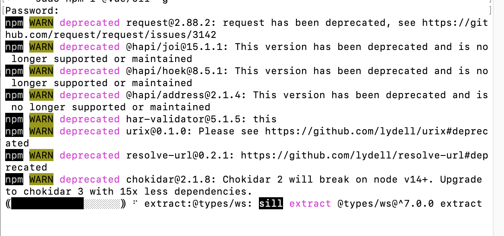
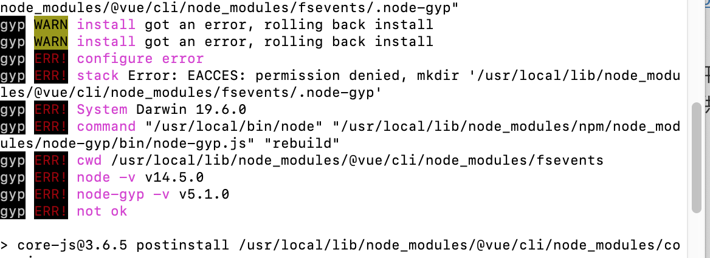
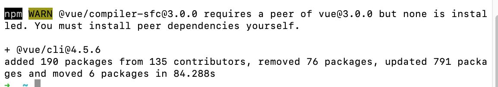
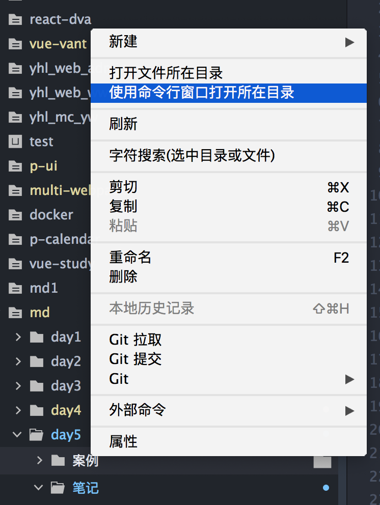
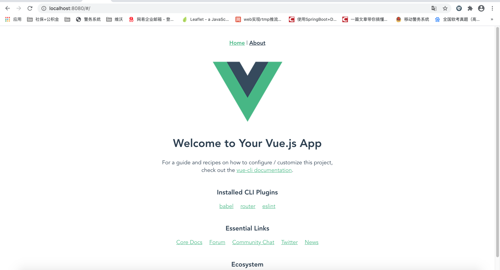

# Vue项目实战1

## 今日内容

1. SPA介绍
2. Vue脚手架的搭建和使用
3. VueRouter的使用

## 1.SPA介绍

### 1.1什么是SPA

#### 1.1.1定义：S-P-A:Single-Page-Application单页面应用。

> 解释：单页面应用并不是只有一个页面，他是只有一个页面的物理文件，项目可以有很多页面，项目的页面是通过js动态生成的并没有对应的物理文件，这个结构和传统的html项目是完全不同的。
>
> 即单页面应用一般情况下只有一个html文件

> SPA大前端时代兴起的一种新的前端应用架构。我们把过去传统的html网页开发架构称为
>
> MPA (Multiple-Page-Application)多页面应用。

#### 1.1.2SPA与MPA的区别

> 单页面应用和多页面应用的核心区别在于对页面的定义。传统的多页面应用将一个html文件视为一个页面，一个项目由多个html文件结合js与css实现一套web应用。而单页面应用是将项目中的一切抽象成组件。每个组件都可以组成一个页面，或者多个组件组成一个页面，单页面应用在一个项目中只有一个html文件，所有的页面都是由js抽象的组件形成的。

以上介绍理解之后我们对比一下SPA和MPA

SPA:

1. 整个项目只有一个html文件，整个项目的核心由js驱动。
2. 页面由js创造的组件实现通过Vue的模版语法渲染到同一个html文件中通过动态组件的形式进行跳页，所以SPA的页面并不是物理存在的而是由js代码进行管理的
3. SPA 将一切都看作是组件，一个页面可以是一个组件或多个组件组成的。

MPA：

1. 整个项目由多个html文件结合js，css组成，核心是html构建页面架构
2. 每个页面是一个物理文件，每个页面🈶️自身的js和css，MPA的核心是按照页面内容来区分页面的，部分重复功能可以通过抽取js来实现复用

由此我们总结一下他们各自的优缺点

SPA：

优点：由于整个项目不管多大只有一个html，所以SPA占用的存储资源会更小。由于一切皆抽象成组件，所以SPA的项目在项目结构和功能划分是非常清晰的，维护性很高。同样的由于只有一个html文件，跳页都是由js来操作，所以SPA的的跳页不会触发html页面的重新加载，会提高跳页的速度，并且通过js模拟的页面可以实现跳页的动画特效。

缺点：由于整个项目只有一个html文件所有业务和功能都需要依赖js来驱动所以第一次加载网页时需要下载的资源量非常大，如果优化不好会造成第一次访问的长时间白屏

MPA：

优点：项目架构起源很早，上手容易。对于轻量级项目开发快，可以快速的通过html语法描述出页面。兼容性强，在web开发的沉淀下html文件在市面所有浏览器的兼容都是很好的不会出现特别大的编译差异。结合css和js的配合一个小菜鸟也可以快速的实现网页的搭建并实现好看的效果。

缺点：由于html以物理文件为核心，在一个大规模应用中会产生大量的html文件，导致占用存储空间大。每次跳页都需要加载新的html文件，虽然本地会有缓存，但是如果页面量特别多的项目用户在第一次访问时每次跳页都相当于重新加载网页。由于html网页开发并没有严格的工程化规范，并且大量都依赖于JQuery来开发所以复杂页面的代码再后期的维护和功能扩展会由于代码量大以及结构混乱导致难以良性的扩展。

> 总结针对以上的学习我们发现了单页面应用和多页面应用的特点，以及他们适合的应用场景。单页面应用由于体积小只有一次加载，便于维护的特点更适合现在时代的大型web应用开发。而多页面应用由于上手快，开发快，兼容性好等特点更加的适合简单的门户网站和过去的一些企业站的开发。

## 2.Vue-cli脚手架的搭建和使用

在学习了什么是单页面应用之后我们来回忆一下之前学习的Vue是在html文件中编写的，但是我们之前是通过html跳页来实现的不同案例切换，使用的其实是传统的多页面应用模式来实现的。也就是说在真正的工作中我们并不会直接在html文件中去编写Vue代码。

那么Vue的页面应用模式是通过什么来操作的呢？

这里我们就需要结合功能强大的NodeJS来进行本地环境的创建了。

在学习Vue的脚手架之前我们首先要了解什么叫脚手架？

脚手架：顾名思义，在建筑或装修行业常见的词汇，在现场施工的时候工人们经常会用木头，铁等材料组装一个叫`脚手架`的架子，并且将常用的工具摆在上面，方便工人进行快速的高空和特殊位置的作业。所以在软件行业的脚手架就是__一个集成了框架的常用功能，并且可以快速的编译和构建项目的工具__。脚手架的出现可以让程序员专注使用框架开发应用上，而避免了很多复杂的编译和优化操作。


脚手架的主要功能：

1. 帮助程序员构建和编译项目。

   由于大前端时代发展的特别迅速，很多新型的技术并不能快速的被浏览器直接使用，如sass，less，es6-10等。如果我们想要应用这些新型的技术进行前端开发，就无法像过去一样直接在html文件中编写代码了所以我们需要通过一个环境来帮我们把新型的语法和框架转换成浏览器支持的html+js+css。这些工作是webpack做的，vue-cli脚手架包含。
2. 帮助程序员处理单页面应用常用的优化
3. 集成了测试工具和语法检测工具规范程序员的开发
4. 让程序员将注意力集中在业务开发上，不需要花费多余的精力在研发和优化上。降低了开发人员的技术要求。
   1. 这里讲解一下业务开发和研发的区别。
   2. 业务开发的程序员大多数时候可以在不懂原理的情况下使用工具进行可视化应用的快速搭建，也就是说业务开发人员相当于汽车制造厂最后一步的组装工人。
   3. 而研发相当于是在系统层或应用层对业务开发人员使用的工具和框架进行研发的人员，他们相当于汽车制造过程中的各种零件和加工工具的生产厂商
   4. 由此对比我们理解一下，业务开发人员相对于研发人员更容易上手，门槛更低。而研发人员需要对专业领域的某些方向有特别深的造诣。
   5. 业务开发人员可以通过自己的努力在工作的过程中升级为某一个领域的研发人员。

### 2.1Vue脚手架的介绍和快速入门

了解了脚手架和一些开发的基础知识之后我们来了解一下Vue的脚手架。

#### 2.1.1Vue脚手架介绍

Vue CLI 是一个基于 Vue.js 进行快速开发的完整系统。Vue的脚手架叫做@vue/cli。官方文档地址：https://cli.vuejs.org/zh/guide/

Vue CLI 致力于将 Vue 生态中的工具基础标准化。它确保了各种构建工具能够基于智能的默认配置即可平稳衔接，这样你可以专注在撰写应用上，而不必花好几天去纠结配置的问题。

#### 2.1.2Vue脚手架的快速搭建

首先需要在我们的电脑上安装@vue/cli

windows系统右键点击开始菜单，在运行框中输入cmd弹出命令行工具，然后输入

> nrm的介绍，nrm是用来切换npm下载依赖的源使用的一个快捷插件
>
> nrm ls 是用来查看当前可以切换的npm数据源列表会提供一系列的名称
>
> 我们可以通过nrm use taobao 来讲npm的下载源切换成淘宝国内的地址

在nrm安装之前我们先学习一下如果使用命令直接切换npm的下载源

防止nrm安装失败，我们先使用命令行直接的切换源，再下载

```sh
#将npm的下载源地址切换为淘宝的地址
npm config set registry https://registry.npm.taobao.org
```

如何查看设置的下载源是否已经变化

```sh
#获取现在系统上的npm下载源
npm config get registry
```

如果再npm命令中提示如下内容需要我们更新npm

```sh
 ╭─────────────────────────────────────────────────────────────────╮
 │                                                                 │
 │      New patch version of npm available! 6.14.8 → 6.14.11       │
 │   Changelog: https://github.com/npm/cli/releases/tag/v6.14.11   │
 │                Run npm install -g npm to update!                │
 │                                                                 │
 ╰─────────────────────────────────────────────────────────────────╯
```

更新命令为

```sh
npm i npm -g
```


nrm安装

```sh
npm i nrm -g
```

nrm展示数据源列表

```sh
nrm ls
```

nrm切换淘宝数据源

```sh
nrm use taobao
```

windows系统右键点击开始菜单，点击运行，输入cmd，在打开的命令行窗口输入


```sh
npm i @vue/cli -g
```

MacOS系统点击小🚀图标-其他-终端，会弹出命令行工具，然后输入

```sh
sudo npm i @vue/cli -g
```

mac电脑由于系统部分写入需要管理员权限所以需要使用sudo指令并输入电脑的用户密码来实现正常安装。

安装过程中如果提示类似下图的警告和错误可以忽略只要安装没有被打断就不要担心





当出现下图的内容就代表安装完成



安装成功后可以在命令行程序中输入

```sh
vue -V
```

如果出现

```sh
vue -V
@vue/cli 4.5.6
```

代表安装成功。

#### 2.1.3通过Vue脚手架快速创建一个Vue项目

1. 在`案例`文件夹上右键，选择使用命令行窗口打开目录，如图:

   

2. 在弹出的终端中输入

   ```sh
   vue create vue-demo
   ```

   会提示一下内容

   ```sh
   Vue CLI v4.5.6
   ? Please pick a preset: (Use arrow keys)
   ❯ Default ([Vue 2] babel, eslint) 
     Default (Vue 3 Preview) ([Vue 3] babel, eslint) 
     Manually select features 
   ```

   这里我们可以通过键盘的上下来操作光标的选项。

   第一栏代表我们要创建一个Vue2.X依赖的项目，并包含babel和eslint

   第二栏代表我们要创建一个Vue3的项目，并包含babel和eslint

   第三个代表由我们自己选择创建的项目中要包含哪些功能

   所以我们应该选择第三个。将光标移动到第三个点击`回车`按钮

   接下来我们会看见如下界面

   ```sh
   Vue CLI v4.5.6
   ? Please pick a preset: Manually select features
   ? Check the features needed for your project: (Press <space> to select, <a> to toggle all, <i> to invert selection)
   ❯◉ Choose Vue version #选择vue的版本
    ◉ Babel #通过babel编译代码
    ◯ TypeScript #应用TypeScript语法
    ◯ Progressive Web App (PWA) Support #加入PWA（移动浏览器小程序）插件
    ◯ Router #加入VueRouter路由管理器
    ◯ Vuex #加入Vuex状态管理器
    ◯ CSS Pre-processors #加入css 预处理器
    ◉ Linter / Formatter #加入格式校验工具
    ◯ Unit Testing #加入单元测试工具
    ◯ E2E Testing #加入E2E测试工具
   ```

   这里我们需要勾选的有Choose Vue version，Babel，Router，CSS Pre-processors，Linter / Formatter

   通过键盘操作光标上下选择，然后在要供选的位置使用`空格`键来进行勾选

   对比下面的结果，一定要选择的完全一样

   ``` sh
   Vue CLI v4.5.6
   ? Please pick a preset: Manually select features
   ? Check the features needed for your project: 
    ◉ Choose Vue version
    ◉ Babel
    ◯ TypeScript
    ◯ Progressive Web App (PWA) Support
    ◉ Router
    ◯ Vuex
   ❯◉ CSS Pre-processors
    ◉ Linter / Formatter
    ◯ Unit Testing
    ◯ E2E Testing
   ```

   勾选为如下情况之后点击`回车`继续

   ```sh
   Vue CLI v4.5.6
   ? Please pick a preset: Manually select features
   ? Check the features needed for your project: Choose Vue version, Babel, Router, CSS Pre-processors, Linter
   ? Choose a version of Vue.js that you want to start the project with (Use arrow keys)
   ❯ 2.x 
     3.x (Preview) 
   ```

   接下来进入上面的菜单，选择第一个之后点击`回车`继续

   ```sh
   Vue CLI v4.5.6
   ? Please pick a preset: Manually select features
   ? Check the features needed for your project: Choose Vue version, Babel, Router, CSS Pre-processors, Linter
   ? Choose a version of Vue.js that you want to start the project with 2.x
   ? Use history mode for router? (Requires proper server setup for index fallback in production) (Y/n) 
   
   ```

   这个界面输入`n`之后点击`回车`继续

   ```sh
   Vue CLI v4.5.6
   ? Please pick a preset: Manually select features
   ? Check the features needed for your project: Choose Vue version, Babel, Router, CSS Pre-processors, Linter
   ? Choose a version of Vue.js that you want to start the project with 2.x
   ? Use history mode for router? (Requires proper server setup for index fallback in production) No
   ? Pick a CSS pre-processor (PostCSS, Autoprefixer and CSS Modules are supported by default): (Use arrow keys)
   ❯ Sass/SCSS (with dart-sass) 
     Sass/SCSS (with node-sass) 
     Less 
     Stylus 
   
   ```

   到这个步骤选择第一个之后点击`回车`继续

   ```sh
   Vue CLI v4.5.6
   ? Please pick a preset: Manually select features
   ? Check the features needed for your project: Choose Vue version, Babel, Router, CSS Pre-processors, Linter
   ? Choose a version of Vue.js that you want to start the project with 2.x
   ? Use history mode for router? (Requires proper server setup for index fallback in production) No
   ? Pick a CSS pre-processor (PostCSS, Autoprefixer and CSS Modules are supported by default): Sass/SCSS (with dart-sass)
   ? Pick a linter / formatter config: #选择一个语法检测的配置
     ESLint with error prevention only 
     ESLint + Airbnb config 
   ❯ ESLint + Standard config 
     ESLint + Prettier 
   ```

   到达此步骤选择第三个之后点击`回车`继续

   ```sh
   Vue CLI v4.5.6
   ? Please pick a preset: Manually select features
   ? Check the features needed for your project: Choose Vue version, Babel, Router, CSS Pre-processors, Linter
   ? Choose a version of Vue.js that you want to start the project with 2.x
   ? Use history mode for router? (Requires proper server setup for index fallback in production) No
   ? Pick a CSS pre-processor (PostCSS, Autoprefixer and CSS Modules are supported by default): Sass/SCSS (with dart-sass)
   ? Pick a linter / formatter config: Standard
   ? Pick additional lint features: (Press <space> to select, <a> to toggle all, <i> to invert selection)
   ❯◉ Lint on save #在每次保存时候进行语法检测
    ◯ Lint and fix on commit #在每次提交和修复时进行语法检测
   ```

   到达上面步骤选择第一个之后点击`回车`继续

   ```sh
   Vue CLI v4.5.6
   ? Please pick a preset: Manually select features
   ? Check the features needed for your project: Choose Vue version, Babel, Router, CSS Pre-processors, Linter
   ? Choose a version of Vue.js that you want to start the project with 2.x
   ? Use history mode for router? (Requires proper server setup for index fallback in production) No
   ? Pick a CSS pre-processor (PostCSS, Autoprefixer and CSS Modules are supported by default): Sass/SCSS (with dart-sass)
   ? Pick a linter / formatter config: Standard
   ? Pick additional lint features: Lint on save
   ? Where do you prefer placing config for Babel, ESLint, etc.? (Use arrow keys)
   ❯ In dedicated config files #将Vue的核心配置文件放到vue.config.js中
     In package.json #将Vue的核心配置文件放在package.json中
   
   ```

   然后提示如上述代码的步骤择第一个之后点击`回车`继续

   ```sh
   Vue CLI v4.5.6
   ? Please pick a preset: Manually select features
   ? Check the features needed for your project: Choose Vue version, Babel, Router, CSS Pre-processors, Linter
   ? Choose a version of Vue.js that you want to start the project with 2.x
   ? Use history mode for router? (Requires proper server setup for index fallback in production) No
   ? Pick a CSS pre-processor (PostCSS, Autoprefixer and CSS Modules are supported by default): Sass/SCSS (with dart-sass)
   ? Pick a linter / formatter config: Standard
   ? Pick additional lint features: Lint on save
   ? Where do you prefer placing config for Babel, ESLint, etc.? In dedicated config files
   ? Save this as a preset for future projects? (y/N) #是否保留此次的选择为快捷配置
   ```

   这里可以选择y或者N如果选择N本次项目创建的配置将不会保存，下一次创建项目仍然持续以上步骤。

   如果选择了y（这里要确保前面的操作全部正确，否则要重新进行之前的操作再保存）

   ```sh
   
   Vue CLI v4.5.6
   ? Please pick a preset: Manually select features
   ? Check the features needed for your project: Choose Vue version, Babel, Router, CSS Pre-processors, Linter
   ? Choose a version of Vue.js that you want to start the project with 2.x
   ? Use history mode for router? (Requires proper server setup for index fallback in production) No
   ? Pick a CSS pre-processor (PostCSS, Autoprefixer and CSS Modules are supported by default): Sass/SCSS (with dart-sass)
   ? Pick a linter / formatter config: Standard
   ? Pick additional lint features: Lint on save
   ? Where do you prefer placing config for Babel, ESLint, etc.? In dedicated config files
   ? Save this as a preset for future projects? Yes
   ? Save preset as: #该配置保存为
   ```

   出现了上面的页面输入名称就会保存本次创建项目的所有配置

   现在我们输入vue-auto之后点击`回车`继续

   ```sh
   Vue CLI v4.5.6
   ✨  Creating project in /Users/zhangyunpeng/Documents/HBuilderProjects/md/day5/案例/vue-demo.
   ⚙️  Installing CLI plugins. This might take a while...
   
   ⸨ ░░░░░░░░░░░░░░░░░⸩ ⠦ fetchMetadata: sill pacote version manifest for util@0.10.3 fetched in 1ms
   ```

   命令行会出现类似如下界面的展示方式进行项目的创建和相关依赖的自动下载。

   ```sh
   
   54 packages are looking for funding
     run `npm fund` for details
   
   🚀  Invoking generators...
   📦  Installing additional dependencies...
   
   added 117 packages from 60 contributors in 12.973s
   
   65 packages are looking for funding
     run `npm fund` for details
   
   ⚓  Running completion hooks...
   
   📄  Generating README.md...
   
   🎉  Successfully created project vue-demo.
   👉  Get started with the following commands:
   
    $ cd vue-demo
    $ npm run serve
   
   ➜  案例 git:(master) ✗ 
   ```

   当出现以上目录的时候我们查看`案例`文件夹中会多出一个vue-demo的目录

   我们先不继续进行，再运行一次vue create xxx不要和之前的重名

   ```sh
   Vue CLI v4.5.6
   ? Please pick a preset: (Use arrow keys)
   ❯ vue-auto ([Vue 2] dart-sass, babel, router, eslint) 
     Default ([Vue 2] babel, eslint) 
     Default (Vue 3 Preview) ([Vue 3] babel, eslint) 
     Manually select features 
   ```

   这时我们刚才保存的额vue-auto就会在目录中出现，以后我们创建项目便可以直接选择他，VueCli就会按照这次的配置直接生成项目了。

3. 下一步我们要进入项目的目录进行项目的启动了

   1. 首先我们在vue-demo文件夹中打开package.json文件查看以下内容

      ```json
      /*
      	package.json是一个前端项目的基本描述文件，
      	他包含了项目的名称，版本号，项目的启动命令，项目在开发和生产两个环境需要引入的依赖包等基本信息
      */
      //注意事项：不要在项目中的package.json中增加注释，因为该文件不允许插入注释项目启动会报错
      {
        "name": "vue-demo",//项目名称
        "version": "0.1.0",//项目当前的版本号
        "private": true,//是否是私有项目
        "scripts": {//项目启动脚本，在该属性中定义的命令可以通过npm run 命令的形式执行
          "serve": "vue-cli-service serve",//项目的启动命令 npm run serve
          "build": "vue-cli-service build",//构建项目的命令 npm run build
          "lint": "vue-cli-service lint"//执行语法检测的命令 npm run lint
        },
        "dependencies": {//项目发布到生产环境必要的依赖包
          "core-js": "^3.6.5",
          "vue": "^2.6.11",
          "vue-router": "^3.2.0"
        },
        "devDependencies": {//项目在开发环境必要的依赖包
          "@vue/cli-plugin-babel": "~4.5.0",
          "@vue/cli-plugin-eslint": "~4.5.0",
          "@vue/cli-plugin-router": "~4.5.0",
          "@vue/cli-service": "~4.5.0",
          "@vue/eslint-config-standard": "^5.1.2",
          "babel-eslint": "^10.1.0",
          "eslint": "^6.7.2",
          "eslint-plugin-import": "^2.20.2",
          "eslint-plugin-node": "^11.1.0",
          "eslint-plugin-promise": "^4.2.1",
          "eslint-plugin-standard": "^4.0.0",
          "eslint-plugin-vue": "^6.2.2",
          "sass": "^1.26.5",
          "sass-loader": "^8.0.2",
          "vue-template-compiler": "^2.6.11"
        }
      }
      ```

4. 下一步我们来进行项目的启动和打包两个操作

5. 首先我们在vue-demo目录右键用命令行窗口打开

   1. ```sh
      Last login: Mon Sep 28 10:15:08 on ttys001
      ➜  vue-demo git:(master) ✗ 
      ```

   2. 出现如下内容

6. 然后在命令行`npm run serve`

   1. ```sh
       App running at:
        - Local:   http://localhost:8080/ 
        - Network: unavailable
         
        Note that the development build is not optimized.
        To create a production build, run npm run build.
      ```

   2. 出现上面的内容后在浏览器访问http://localhost:8080/ 

   3. 出现之后说明项目启动成功了

7. 下面我们来介绍如何停止项目运行

   1. 项目启动成功相当于我们通过nodejs启动了一个服务器，服务器实现了编译和解析项目，我们访问的路径就是本地服务器启动的路径，所以这个命令行窗口只要运行着我们就能通过http://localhost:8080/ 访问到这个项目。

   2. 想要停止项目运行我们需要打开正在运行项目的这个命令行窗口执行Ctrl+c的操作（windows系统应该需要点击两次Ctrl+c）的操作

   3. 直到命令行出现

      ```sh
      App running at:
        - Local:   http://localhost:8080/ 
        - Network: unavailable
      
        Note that the development build is not optimized.
        To create a production build, run npm run build.
      
      ^C%            
      ➜  vue-demo git:(master) ✗ 
      
      ```

      继续输入的状态。这时我们再访问http://localhost:8080/ 如果打不开网页，说明项目关闭成功

   4. 这个是正常关闭的方式，还有一种关闭的方式是直接关闭命令行窗口也会导致项目关闭。

#### 2.1.4脚手架的基本配置和构建

通过上面的学习我们已经掌握了如何通过VueCli创建并启动一个项目，现在我们继续学习项目的基本配置和发布。首先我们进入vue-demo项目中查看目录结构。

```sh
├── README.md #该项目的说明文件
├── babel.config.js #babel模块的配置文件
├── package-lock.json #package.json的依赖锁定目录
├── package.json #项目的整体描述文件
├── public #项目的静态资源目录（也就是写在public文件夹中的文件可以通过localhost:8080/index.html）这种方式进行访问
│   ├── favicon.ico
│   └── index.html #项目的html本体文件
└── src #项目的源代码目录
    ├── App.vue #项目的根组件
    ├── assets #源代码中的静态资源目录(src下的文件是无法在浏览器直接访问到的)
    │   └── logo.png #在源代码中引用的图片都放在这里，并且通过相对路径进行引用
    ├── components #项目中的自定义组件目录
    │   └── HelloWorld.vue #自定义组件
    ├── main.js #项目的入口文件，也就是当我们运行npm run serve的时候会执行当前的js文件中的内容
    ├── router #项目的虚拟页面配置文件VueRouter路由的配置目录
    │   └── index.js #VueRouter路由页面的配置
    └── views #Vue路由分配的页面文件，在router/index.js中配置的页面对应的Vue文件
        ├── About.vue #Vue页面的文件
        └── Home.vue #Vue页面的文件
```

了解了以上的目录结构之后我们在文件中增加一些简单的配置。

首先关闭之前启动的所有服务，在案例的vue-demo文件夹右键重新打开一个命令行界面。

然后在vue-demo目录中新建一个`vue.config.js`文件

在其中输入如下代码

```javascript
//vue.config.js
//此内容为VueCli的配置文件
module.exports = {
  //publicPath为项目在构建之后引入的头部路径
  //process.env.NODE_ENV代表当前构建时的环境名称
  //production为生产环境即运行npm run build时process.env.NODE_ENV的值为production
  //development为开发环境即运行npm run serve时process.env.NODE_ENV的值为development
  publicPath:process.env.NODE_ENV === 'production'? '':'/',
  //lintOnSave是关闭脚手架的代码格式校验保证不会因为代码编写风格报错
  lintOnSave:false
}
```

完成后我们回到命令行界面输入

```sh
npm run build #该代码意思为将项目进行构建（发布到生产环境使用）
```

在此步骤操作之后会出现以下内容

```sh

  File                                 Size               Gzipped

  dist/js/chunk-vendors.8e163017.js    117.61 KiB         41.39 KiB
  dist/js/app.9df1c102.js              6.11 KiB           2.23 KiB
  dist/js/about.8366e14e.js            0.44 KiB           0.31 KiB
  dist/css/app.2f20bce4.css            0.42 KiB           0.26 KiB

  Images and other types of assets omitted.

 DONE  Build complete. The dist directory is ready to be deployed.
 INFO  Check out deployment instructions at https://cli.vuejs.org/guide/deployment.html
      
➜  vue-demo git:(master) ✗ 
```

当出现这个界面之后我们在回到vue-demo项目中查看，

在项目目录中会多出一个dist文件夹，该文件夹为项目通过VueCli构建之后生成的html项目，此项目用于发布生产环境。

打开dist文件夹并运行index.html文件，我们会发现当前网页显示的结果和npm run serve运行时相同，不同的是dist目录中只有html，css，js，以及静态资源文件。

这个就是我们__工程化开发__的一个启动项目和发布项目的流程。

### 2.2认识Vue单页面应用中的vue文件

我们在上一个小节主要学习了如何使用VueCli去构建和启动项目。熟悉了项目的基本结构和简单的使用方法。下面我们来学习一下Vue单页面应用的工程中的核心文件类型`*.vue`文件

#### 2.2.1熟悉项目的执行过程

下面我们打开vue-demo中的src文件打开main.js我们首先按照代码的编写顺序来熟悉项目的执行过程。

首先我们会看见如下代码。

```js
//main.js与public中的index.html存在自动引入关系，是通过VueCli在运行时自动关联的，所以无需在html中引入main.js启动项目就会自动执行这个文件
//从node_modules文件夹中引入vue的js依赖包并存放到Vue对象中
//此操作相当于在html文件中通过script标签引入vue的js代码
//在网页中Vue对象是自动的全局对象，由于main.js是通过node.js驱动运行的，本身并不存在window对象，所以需要在文件中声明Vue对象才能使用Vue对象
import Vue from 'vue' 
//引用App.vue文件中导出的对象
import App from './App.vue'
//引入router文件夹中的index.js文件 import * from './xxx'的写法相当于import * from './xxx/index.js'。import的过程中相当于执行了一遍index.js的代码
//所以这里引入了我们在router中定义的路由对象并且VueRouter也安装到了Vue中
import router from './router'
//设置为 false 以阻止 vue 在启动时生成生产提示。（这里不需要理解他的具体作用）
Vue.config.productionTip = false
//这里为我们最熟悉的地方实例化Vue对象并渲染到html中id为app的标签中
new Vue({
  router,//这表示将路由组件设置到Vue中
  render: h => h(App)//这里表示将App.vue中的内容渲染到Vue组件里，我们在学习函数式组件是了解过
}).$mount('#app')
```

阅读以上代码之后我们明白了main.js的执行过程，执行完main.js的基本代码之后Vue的实例就创建出来了，并且通过render函数渲染了App.vue中返回的这个对象。

> 默认情况下，使用vue-cli生成的项目，会有一个入口文件，那就是mian.js。
>
> 这个入口文件，可以修改为其他名字的文件，作用都是一样的。
>
> 入口文件的作用：
>
> 1. webpack打包资源时候的起点。
> 2. 该文件可以包含需要依赖的资源，供项目使用。
> 3. 告诉打包好的资源，最后挂载到哪里


下面我们来通过App.vue学习一下`*.vue`的文件结构

```vue
<!-- 
	把App.vue理解成Vue.component('App',{})这个形式的组件的话
  template这个标签就相当于组件中的template属性
	由于我们在html中编写自定义组件时template是字符串形式，没有语法补全和语法着色，这样不利于我们维护自定义组件
	所以我们在.vue文件中把它单独的模版化这样写在template标签内部的内容就相当于template的值方便我们进行维护
-->
<template>
  <div id="app">
    <div id="nav">
      <!--router-link是vue-router提供的跳页组件 to代表跳页路径路径对应的页面参考router文件夹中的index.js中的配置就可以找到跳转到哪个组件中 -->
      <router-link to="/">Home</router-link> |
      <router-link to="/about">About</router-link>
    </div>
    <!-- 
			router-view代表vue-router中配置的标签的容器，它相当于我们学习的component动态组件
			也就是说当我们点击Home的时候他展示的就是router中配置的Home.vue组件内容
		-->
    <router-view/>
  </div>
</template>
<script>
  //export default为固定写法意义为导出当前页面的js对象
  //该对象相当于Vue.component('app',{})中的json部分，写法就是Vue对象的正常写法，可以使用所有Vue选项和生命周期
	export default{
    name:'app'，//.vue文件中的组件名称定义name:app,他相当于自定义组件的名称。就相当于 Vue.component('app',{})
    data(){
      return {
        name:'hello'
      }
    }，
    methods:{},
    props:{},
    computed:{},
    watch:{}
  }
</script>
<!-- 
	style标签代表css样式书写的区域，每个组件内部可以编写组件自己的样式
  style有两个属性 lang="书写语法" 默认是css。由于项目引入了dart-sass
所以lang表示的语法为scss关于scss可以使用css的所有语法，并且可以通过样式嵌套来简化css的代码量
	style的另一个属性为scoped
	style标签默认书写的样式虽然是写在每个vue文件中的但是默认是全局生效的，不同的文件可能会由于样式相同导致冲突，所以style加入了scoped="scoped"这个属性，设置这个属性之后当前的style标签中书写的css样式只有该文件内部的标签可使用其他文件无法引用
	
-->
<style lang="scss">
#app {
  font-family: Avenir, Helvetica, Arial, sans-serif;
  -webkit-font-smoothing: antialiased;
  -moz-osx-font-smoothing: grayscale;
  text-align: center;
  color: #2c3e50;
  
}

#nav {
  padding: 30px;

  a {
    font-weight: bold;
    color: #2c3e50;

    &.router-link-exact-active {
      color: #42b983;
    }
  }
}
</style>

```

以上就是一个单页面应用中的核心文件`*.vue`文件的简单介绍

> 总结：
>
> 1. 一个vue文件中有三个作用域template,script,style
> 2. template相当于我们过去学习的组件中的template选项
> 3. script中书写的内容就相当于我们过去学习的自定义组件中的json配置部分，需要通过export default暴露出来
> 4. style相当于组件内部的样式文件，可以通过lang设置语法，通过scoped来决定影响的范围
> 5. 每一个vue文件都相当于一个独立的组件，所以也可以实现对组件传参数，双向绑定等自定义组件的功能

以上内容学习完毕之后我们便已经能开始掌握vue脚手架创建的工程项目的基本使用了

## 3.VueRouter的使用

### 3.1VueRouter简介

我们在之前的课程中学习过Vue的动态组件component，并且了解了动态组件充当一个容器用来动态的展示vue的组件内容，由此特性他可以作为页面切换容器，通过动态切换组件来实现不切换html文件的跳页。

VueRouter就是在此基础之上加以封装把跳页功能更健壮的进行实现，现在VueRouter已经成为了Vue项目中必不可少的辅助框架之一。

#### 3.1.1VueRouter路由的快速上手

首先打开vue-demo目录中的router文件夹中的index.js文件，我们来看一下内部的代码

```javascript
//引入vue对象
import Vue from 'vue'
//引入vue-router对象
import VueRouter from 'vue-router'
//引入Home.vue组件
import Home from '../views/Home.vue'
//Vue.use()是Vue提供的一个通用的安装接口，这里代表将路由框架安装到Vue中
Vue.use(VueRouter)
//定义路由的结构
const routes = [
  {
    //vue的路由跳转有两种方式
    //1.一种是通过path跳转页面
    //2.一种是通过name跳转页面
    path: '/',//通过path访问该页面的访问路径
    name: 'Home',//通过name访问该页面的访问路径
    component: Home //这个页面展示的Vue组件该方式是同步引用方式
  },
  {
    path: '/about',
    name: 'About',
    //这里是组件的异步加载方式，通过() => import(组件)的方式实现异步引用，其内部是基于Promise原理实现的
    //异步引用与同步引用的区别是异步引用会通过VueCli将该组件的代码拆分到单独的文件中，在项目启动时并没有加载当前组件的文件只有在第一次访问到about的页面时才加载当前组件的代码，这种做法在大型项目开发中非常常用，只有首页是直接引用，其他的子页面全部采用异步引用的方式来保证在项目第一次运行时只加载首页的代码这样可以提升单页面应用的加载速度。
    ///*webpacChunkName:"about"代表当项目打包时about.vue会被单独打包进about.js文件中而不会影响主程序加载*/
    component: () => import(/* webpackChunkName: "about" */ '../views/About.vue')
  }
]
//将定义好的路由结果传入VueRouter对象中并且实例化
const router = new VueRouter({
  routes
})
//模块暴漏router对象，用来给其他文件引用
export default router
```

以上写法为固定写法，主要用于创建全局的路由对象并且定义当前路由中的页面。

然后我们回到笔记__2.2.1__中重新阅读main.js和App.vue的说明。着重看router部分。

> 总结：定义路由的步骤
>
> 1. 需要创建一个vue组件
> 2. 需要在router/index.js中注册这个组件
> 3. 通过router-link标签的to属性与router中定义的path一一对应来实现路由的跳转指向
> 4. 通过router-view作为路由组件的页面容器来展示路由的页面

#### 3.1.2徒手创建一个新的页面

学习完路由的基础知识之后，我们现在来徒手在项目中追加一个页面。并且在菜单中增加一个跳转菜单。

首先我们在views文件夹中创建一个自己的页面起名为MyView.vue

在这里我们顺便提一下在VueCli项目中.vue文件的命名规范。

有两种：

1. 首字母大写驼峰形式如MyView.vue
2. 全小写通过-分词如my-view.vue
3. 根据喜好两种均可

创建完MyView.vue之后，我们将下面的代码粘贴到文件中

```vue
<template>
  <!-- template中遵循原则有且只有一个根标签 -->
  <div>
    <div class="title">
      {{name}}
      <button class="btn" @click="handleClick">点我</button>
    </div>

  </div>
</template>

<script>
  //Vue组件主体部分
  export default{
    data(){
      return {
        name:'我的第一个路由页面'
      }
    },
    methods:{
      handleClick(){
        this.name = '点了按钮'
      }
    },
    beforeCreate(){
      console.log('beforeCreate')
    },
    created(){
      console.log('created')
    },
    beforeMount() {
      console.log('beforeMount')
    },
    mounted() {
      console.log('mounted')
    },
    beforeUpdate() {
      console.log('beforeUpdate')
    },
    updated() {
      console.log('updated')
    },
    beforeDestroy() {
      console.log('beforeDestroy')
    },
    destroyed() {
      console.log('destroyed')
    }
  }
</script>
<!-- 声明sass语法，只对当前文件生效 -->
<style lang="scss" scoped="scoped">
  .title{
    font-weight: bold;
    background-color: red;
    .btn{
      border: none;
      background: green;
      color: #fff;
    }
  }
  // 这种嵌套写法会解析成
  /*
    .title{
      font-weight: bold;
      background-color: red;
    }
    .title .btn{
      border: none;
      background: green;
      color: #fff;
    }
  */
</style>
```

接下来我们在router文件夹中的index.js中追加如下代码

```json
{
  //这里涉及到path的命名规范由于path是url路径所以需要在前面加/
  //并且url路径遵循所有字母小写的原则所以我们的分词就使用-来分，MyView的path为my-path
  path:'/my-view',
  name:'MyView',//name属性相当于文件名可以直接写MyView，如果文件名采用my-view的方式那么name也为my-view，这里还要注意的是name不加/
  //component我们直接采用异步的方式引用通过相对路径进行引用根据router文件夹和views文件夹的相对路径为../views/MyView.vue
  component: () => import(/* webpackChunkName:"my-view" */ '../views/MyView.vue')
}
```

> 这里注意代码应该添加到哪里，不要添加错误位置

当以上两步操作无问题之后我们接下来就该进行最重要的步骤了就是在App.vue中增加一个菜单来实现通过点击页面跳转到我们创建的MyView中

```html
<!-- 在App.vue中增加一个router-link标签 -->
<!-- to对应的就是router/index.js中配置的path属性 -->
｜<router-link to="/my-view">MyView</router-link>
```

以上操作都完毕之后，我们先关闭所有的命令行窗口，在vue-demo目录上右键，使用命令行打开，然后输入

```sh
npm run serve
```

此时会出现如下错误

```sh
 error  in ./src/views/MyView.vue

Module Error (from ./node_modules/eslint-loader/index.js):

/Users/zhangyunpeng/Documents/HBuilderProjects/md/day5/案例/vue-demo/src/views/MyView.vue
  13:1   error  Expected indentation of 0 spaces but found 2  indent
  13:10  error  Expected space(s) after "default"             keyword-spacing
  14:1   error  Expected indentation of 2 spaces but found 4  indent
  14:9   error  Missing space before function parentheses     space-before-function-paren
  14:11  error  Missing space before opening brace            space-before-blocks
  15:1   error  Expected indentation of 4 spaces but found 6  indent
  16:1   error  Expected indentation of 6 spaces but found 8  indent
```

这是由于我们在项目中使用了eslint代码格式检测工具，他发现了我们在写代码的过程中有一些格式问题，导致项目无法正常编译。

> 下面有关闭语法检测的方法，vue.config.js配置文件，添加lintOnSave:false

想要解决这个问题我们需要在启动项目之前先运行一下

```sh
npm run lint
```

然后再启动项目这回我们发现项目启动成功了

项目启动成功之后访问http://localhost:8080/

然后我们再页面中会发现新增了一个MyView的菜单。首先打开浏览器的控制台，然后点击MyView查看打印信息

控制台会打印beforeCreate，created，beforeMount，mounted四个生命周期

当我们点击其他页面时控制台就会打印beforeDestroy，destroyed两个生命周期

当我们再MyView页面中点击按钮时控制台会打印beforeUpdate，updated两个生命周期

也就是说通过.vue文件实现的组件能独立经历所有的完整生命周期。

体验完这里之后，我们要在写代码之前做另一个改造。

刚刚我们自己写的代码语法并没有问题，但是格式有问题，所以导致项目无法启动。

但是在我们开发中会经常编写代码编调试，不可能保证代码格式百分之百的规范，所以这时我们需要改造一下vue.config.js让语法检测功能再开发时不可用。然后我们通过阶段性的使用npm run lint来整理代码格式。

具体做法如下：将vue.config.js改造成下面的模样。

```json
module.exports = {
  publicPath: process.env.NODE_ENV === 'production' ? '' : '/',
  lintOnSave: false//关闭在每次保存时检测代码格式的功能
}
```

完成之后我们关闭所有命令行窗口，重新再vue-demo上打开命令行并启动项目。

完成一个课堂练习：在MyView.vue中追加一个按钮，并在data中创建一个count属性默认值为0

点击这个自己创建的按钮每次让count+1并且展示在页面上。

完成练习并阅读本页代码三分钟，我们在写代码的过程中发现每次保存的时候不会因为格式的问题报错了，这个就是lintOnSave的作用。

### 3.2路由的详细使用

#### 3.2.1编程式路由

我们在上一节的内容中了解了路由的基本用法，学会了如何定义路由，如何在页面中跳转页面，路由的页面容器组件是什么等。这种用法与a标签的用法类似但是通过这种方式我们能够做到的能力很局限。

比如JavaScript为跳转页面提供了更加便利的方式就是通过`location.href`以及`history.go()`的方式来进行页面的跳转。

那么在VueRouter中也提供了js的跳页方式：编程式路由。主要的跳转方式分两种一种是通过path属性跳转，一种是通过name属性跳转

在VueRouter对象加载完成之后会在Vue实例中绑定`$router`和`$route`两个属性；这两个属性在所有Vue组件中都可以通过

```js
this.$router
```

和

```js
this.$route
```

获取，这两个对象就是路由的全局对象

##### 3.2.1.1 $router

:路由的动作对象，可以通过$router进行页面的跳转。

##### 3.2.1.2 $route

路由的数据对象，可以在该对象中获取到当前组件注册的path，name，以及跳转传递的参数等内容

下面我们结合案例学习一下编程式路由的使用方式

#### 3.2.2 跳转的写法

```javascript
//默认写法this.$router.push(path)传入的参数就是router定义的path
this.$router.push('/')
//指定path方式写法this.$router.push({path:path路径})传入的参数就是router定义的path
this.$router.push({path:'/'})
//指定name方式写法this.$router.push({name:name名称})传入的参数就是router定义的name
this.$router.push({name:'index'})
//Vue中后退专用的写法
this.$router.history.go(-1)
```

然后打开案例中的 `vue-router-study`项目，首先右键打开命令行，在vue-router-study这个根目录下执行

删除package-lock.json文件

```sh
npm install
```

该做法是根据package.json中的配置安装项目所需要的依赖包。

安装完成后项目中会出现一个名为`node_modules`的文件夹

然后启动项目

```sh
npm run serve
```

并且访问http://localhost:8080/

启动成功之后我们还是先浏览一下项目大概的结构

首先观察App.vue这个项目中的App.vue内容是空的只引用了一个router-view说明这个项目的所有页面均由动态组件加载，我们再来看router/index.js中的配置，配置了默认的首页path:/对应的是index.vue，在index.vue中声明了一个简易的菜单。这个就是我们在未来开发真正项目的一个基本的路由使用方式。

然后点击`编程式路由`我们进入`编程式路由`的模块结合代码查看案例并完成课堂练习。

完成课堂练习之后我们来学习下一个小节。

#### 3.2.2路由传参

我们学习了编程式路由的写法之后，vue的页面跳转就不在依赖于router-link这种固定模式了，但是为了更加便利的使用页面跳转，我们在很多情况可能跳转的是同一个页面，但是展示的内容是不同的，例如：我们在逛淘宝或者拼多多的时他们的商品都会有一个列表页面和一个详情页面，在列表页面展示的是不同种类的商品，点击每个商品的图标都会进入这个商品的详细介绍，那么一个商城有几万或者几百万种商品，当然不可能是做了几百万个静态页面，我们一般会把商品的详情页面整理成几种大类型，然后同样类型的商品详情的结构是一样的只是展示的内容不一样，那么我们在从列表跳转到详情时其实执行的是同一个页面文件只是数据展示不同而已。

那么基于这种情况我们在跳转页面的过程就一定会涉及到数据的传输。也就是路由传参。

结合上一节我们提到了两个全局对象一个是$router动作对象,一个是$route数据对象

在跳转页面的时候我们用到了$router对象，那么在传递参数的时候，我们就需要结合$route数据对象来实现数据的传递了。

传递参数有两种方式，一种是通过query对象（url）传递参数，一种是通过params对象传递参数

```javascript
//1.通过query传递参数，该方式的参数是通过url路径进行传递的
//通过path传递参数this.router.push({path:'path路径',query:{参数对象（json）}})
this.$router.push({path:'path路径',query:{name:'a',age:1}})
//通过这种方式跳转到目标页面之后在created或者mounted生命周期中我们就可以通过以下方式得到参数
this.$route.query//得到的就是{name:'a',age:1}

//2.通过params传递参数，该方式的参数是通过params对象进行传递的
//通过name传递参数this.router.push({path:'name名称',params:{参数对象（json）}})
this.$router.push({name:'name名称',params:{name:'a',age:1}})
//通过这种方式跳转到目标页面之后在created或者mounted生命周期中我们就可以通过以下方式得到参数
this.$route.params//得到的就是{name:'a',age:1}
```

下面我们还是打开vue-router-study项目，并进入`路由传参`进行学习，并完成课堂练习。

> 完成案例学习之后的总结：
>
> 1. 我们发现了通过query和params传参数有很大的区别
>    1. 通过query传递的参数会被拼到浏览器的url路径中整理成?key=value&key=value...的形式
>    2. 通过params传递的参数会被绑定到$route对象的params对象中
>    3. 通过query传递的参数是明文传输，由于绑定到了url上所以刷新页面不会消失
>    4. 通过params传递的参数是隐藏传输，但是页面刷新无法保留。
>    5. 通过query传递参数需要使用path做跳转路径
>    6. 通过params传递参数需要使用name做跳转路径
> 2. 一定要掌握$router和route的区别一定不要用混
>    1. $router对象相当于实现跳转动作的对象，所以跳页使用$router
>    2. $route对象相当于数据处理对象，可以通过$route获取传参的数据
> 3. 由以上特性得知的注意事项
>    1. 只想保留参数不消失，优先使用query传递参数。
>    2. query由于在url上传参，url有长度限制，所以不适合传递大量和长度过大的参数。
>    3. 由于query是明文传输所以通过query传递的参数不可以是敏感数据以及隐私数据。
>    4. 如果数据均为隐私数据必须使用params进行传输。
>    5. 如果想保证参数刷新不丢失可以通过params结合localStorage进行存储用来保证刷新不丢失

### 3.3 嵌套路由

研究完上述路由跳转和传至的内容学习之后我们再思考一下，当前我们学习的跳转方式只能支持我们从一个页面跳转到另一个页面，也就是当我的App.vue中只有`router-view`的时候我们只要跳页就相当于整个App.vue就变成另一个组件了，那么如果这个页面包含一个带有目录的子页面，子页面有三个菜单，去切换子页面的内容，那么我们就需要构建三个vue文件并且每个文件里都要声明出三个菜单，这种方式虽然可以实现但是无法让菜单复用，就算我们把菜单单独做成组件也需要再三个页面引入才能实现这个三模块子页面在互相切换时都能展示菜单。

显然这种用法不是特别友好，VueRouter对我们提供了另外一个高级功能就是嵌套路由，也就是说在当前的router-view中我们可以在当前路由的某一个页面组件内再创建一个router-view，这个router-view可以进行一个子页面的跳转这样的话如果想实现上述的需求，我们就只需要定义一个菜单就可以实现三个页面在一个子页面中切换并且共享同一个菜单了。

#### 3.3.1 如何使用嵌套路由

> 首先我们学习如何定义嵌套路由

我们先浏览一下子路由的声明方式，查看src/router/index.js

```json
//声明部分的创建方式
{
    path: '/router-children',
    name: 'router-children',
    component: () => import(/* webpackChunkName:"router-param"*/'../views/router-children.vue'),
  //当某一个路由的组件页面中想要在它的内部实现局部跳转，我们需要对这个路由的对象声明一个children属性children是一个数组，他的每一个元素就是一个普通的路由对象。这样就相当于我们在路由的声明过程中定义了页面的父子关系。children1，children2，children3就相当于router-children的子页面
    children:[
      {
  		//子页面的path定义规范为/父页面的path/子页面的path
  		//这样的声明方式可以让我们能通过url路径很好的识别页面的父子关系
        path: '/router-children/',
        name: 'router-children1',
        component: () => import(/* webpackChunkName:"router-param"*/'../views/router-children1.vue'),
      },
      {
        path: '/router-children/router-children2',
        name: 'router-children2',
        component: () => import(/* webpackChunkName:"router-param"*/'../views/router-children2.vue'),
      },
      {
        path: '/router-children/router-children3',
        name: 'router-children3',
        component: () => import(/* webpackChunkName:"router-param"*/'../views/router-children3.vue'),
      },

    ]
}
```

接下来我们看一下如何在页面中实现局部跳转

```vue
<!-- 该页面为router-children.vue -->
<template>
  <div>
    <h4>
      嵌套路由
    </h4>
    <div>
      <!-- 当前代表跳转到path为/router-children/的页面中也就是router-children的第一个子路由-->
      <router-link to="/router-children/">进入页面1</router-link>
      <router-link to="/router-children/router-children2">进入页面2</router-link>
      <router-link to="/router-children/router-children3">进入页面3</router-link>
      <!-- 在声明了子路由的组件中一定要引用router-view来作为子页面切换的组件容器这样才能实现点击切换上面三个页面的时候总的页面不发生变化只有当页的router-view内部发生跳转 -->
      <router-view></router-view>
    </div>
  </div>
</template>

<script>
  export default{
    name:'router-children'
  }
</script>

<style>
</style>

```

下面我们结合`vue-router-study`中的`嵌套路由`学习以下案例

> 总结：
>
> 1. 嵌套路由一定是出现在定义好的第一层路由中的某一个组件内部的。
> 2. 嵌套路由需要在router/index.js中声明在指定组件的children属性中，格式与普通路由相同
> 3. 嵌套路由的子组件需要在定义子路由的组件中创建router-view才能正常展示
> 4. 嵌套路由的path命名要在前面增加父级路由组件的path以便于开发者可以通过path识别嵌套关系

### 3.4 路由监听和过渡动画

我们掌握了路由的基本用法，接传值和嵌套之后下面我们来学习一下`路由监听`。路由的监听主要用于对跳页过程的处理，如果我们在开发中遇到一些需求，需要在指定的某一个或者某几个页面的跳转过程做一些拦截处理的时候如果在每个页面写相同的逻辑会造成维护上的复杂度增加，针对于这种情况，VueRouter提供了全局的监听。涉及到监听我们便想到了过去学习的`watch`选项。watch可以监听data和props中值的变化，同时也对路由对象提供了监听，具体写法为

```vue
<script>
export default{
	watch:{
		$route(to,from){
      ...处理逻辑
      //to中包含的是跳转目标页面的基本信息对象。
      //from中包含的是跳转的起始页面的基本信息对象
    }
  }
}
</script>
```

下面我们打开项目中的App.vue文件，查看js部分的watch，启动服务并随意点击页面跳转然后查看控制台和App.vue的代码。

> 总结：
>
> 1. 路由监听的核心其实就是对互相跳转的两个页面的$route数据对象进行监听。并在执行跳转动作的时候做一些拦截处理。
> 2. $route的的监听事件中也可以通过this.$router进行页面跳转
> 3. 路由监听通常都被放在项目的最顶级组件中也就是App.vue中，其实它也可以放在任何一个组件内部只是不常用而已

以上我们学习了路由的监听下面我们学习一下路由的跳转动画。

首先回忆一下我们在过去学习过transition动画，并知道transition是实现将两个状态转换的过程描述出来的动画效果的组件，通常是用v-if和v-show来控制。

在路由跳转过程中同样可以通过transition来实现动画效果，因为路由的跳转其实就相当于第一个组件隐藏，第二个组件显示，那么这个过程就可以动画化。

基本用法如下

```vue
<template>
<!-- 通过定义在transition上的name生成的生命周期样式，我们可以通过class或者通过animation的方式来实现动画效果 -->
	<transition name="fade">
  	<router-view></router-view>
  </transition>
</template>
```

下面我们打开项目，启动运行，并在菜单中点击路由动画栏目来查看

> 总结：
>
> 1. 在路由过渡的时候transition可以自动处理动画是因为路由切换其实就是两个组件一个隐藏一个显示，和过去的v-if原理一样，只是不需要我们来处理了
> 2. 需要注意的一点是路由切换时由于第一个组件的消失和第二个组件的展示是同时发生的这时我们需要处理元素的排列来优化动画效果
> 3. VueRouter的模式可以对路由进行动画处理，这个是单页面应用相对传统html项目的优点

### 3.5history和hash模式*（仅仅了解性学习）

> 首先介绍hash模式

我们在打开项目启动服务，观察网页的路径后发现当前的网页url中会包含一个/#/符号。

然后我们回想一下过去html页面的项目我们在做页面跳转时只要url发生改变浏览器就会去对应的路径寻找html物理文件，如果没有这个html文件那么我们就无法访问页面。而在Vue的项目中跳页的时候url路径也会发生改变但是html文件并没有发生跳转而且url路径上也没有.html文件。整个的路径是如下的样子

http://localhost:8080/#/

我们把url改造一下先理解为什么没有.html这个文件名了。

首先观察public文件夹我们项目运行时依赖的物理html文件是public中的index.html

所以其实我们在访问http://localhost:8080/#/的时候真实的路径是

http://localhost:8080/index.html/#/

当我们通过vue的路由跳页时变化的是#/后面的内容。#/在html学习锚点的时候我们了解到#/可以在页面内部进行跳转不会引发html的页面跳转

Vue路由跳转的本质就是通过js或者a标签修改#/后面的名称引发页面url的改变，通过全局的url变化监听来监听#/后面的url名称改变，并且通过这个名称匹配router中配置的Vue组件，将这个组件渲染到router-view组件中。

以上就是hash模式的路由工作流程和原理，我们可以使用npm run build构建项目，并在dist中运行index.html文件并且在网页内正常的执行跳页，刷新，会发现整体是没有问题的

总结：hash模式在使用起来除了url中带#之外，其他与正常的html项目无差别

> 下面我们在了解一下history模式

我们来看官方对history的解释

`vue-router` 默认 hash 模式 —— 使用 URL 的 hash 来模拟一个完整的 URL，于是当 URL 改变时，页面不会重新加载。

如果不想要很丑的 hash，我们可以用路由的 **history 模式**，这种模式充分利用 `history.pushState` API 来完成 URL 跳转而无须重新加载页面。

```js
const router = new VueRouter({
  mode: 'history',
  routes: [...]
})
```

当你使用 history 模式时，URL 就像正常的 url，例如 `http://yoursite.com/user/id`，也好看！

不过这种模式要玩好，还需要后台配置支持。因为我们的应用是个单页客户端应用，如果后台没有正确的配置，当用户在浏览器直接访问 `http://oursite.com/user/id` 就会返回 404，这就不好看了。

所以呢，你要在服务端增加一个覆盖所有情况的候选资源：如果 URL 匹配不到任何静态资源，则应该返回同一个 `index.html` 页面，这个页面就是你 app 依赖的页面。

了解了以上的内容之后我们可以找到我们项目中的router/index.js文件中

将这部分的mode改成history，结果如下

```js
const router = new VueRouter({
  mode:'history',
  routes
})
```

更改完毕之后我们重新启动项目点击页面跳转发现url上的#真的不见了。

这种模式的url路径相对来说非常美观，但是当我们使用npm run build构建项目之后再次打开dist中的index.html文件运行时会发现构建出来的静态页面是无法正常运行的

这是因为history在本地的能力有限，他同时需要服务端进行复杂的配置才能实现在构建之后正常使用。


> 总结：
>
> 1. 我们的项推荐优先使用hash模式来进行构建，非必要要求不采用history模式进行构建
> 2. hash和history的具体原理我们不必深究，在以后的就业指导内容中我们会通过仿写hash模式来实现一个路由让我们能直观的了解单页面应用的跳转原理

作业：

1. 路由项目的三个案例，仿照写一遍，在原项目中追加三个菜单，在菜单中对应实现三个案例的代码

2. 路由传参数的案例的练习题作为作业

3. 复习脚手架创建项目的整个流程，参考笔记再创建几个项目要求创建项目的流程要充分的熟悉

4. 使用嵌套路由实现下图

   

5. 阅读3.2.5history和hash模式*（仅仅了解性学习）

