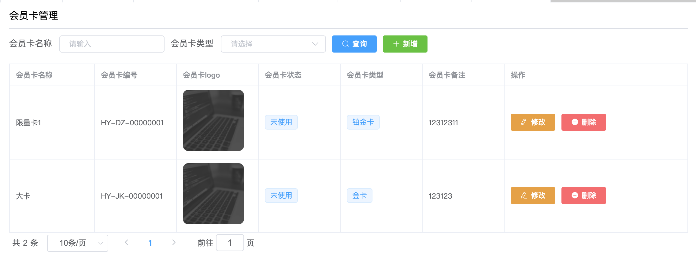
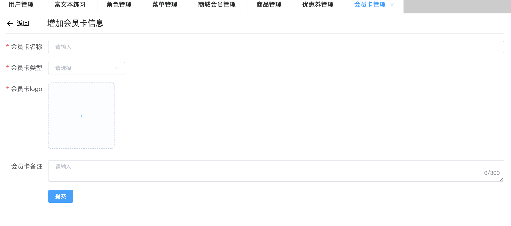

## Vue项目实战7

## 今日内容：

1. 讲解昨天作业中遇到的问题。
2. 完成新闻模块的增删改查，并学习富文本组件的使用，完成新闻预览
3. 作业：完成会员卡模块的练习

## 1.讲解昨天作业中遇到的问题。

今天我们快速的从0开始完成一套增删改查。

昨天作业的项目和昨天讲解的商品管理模式几乎一样，今天演示一下如何快速的通过复制粘贴修改

已经写好的类似模块来实现快速完成一套增删改查（在基础扎实之后是可以这么做的，基础不扎实还是要一点一点去写）

> 重点：在修改页面中结合日期组件使用的难点
>
> 后台返回的birthday是时间戳，我们在跳到修改页面时要给他转成字符串
>
> 冻结和解冻的思路和商品的上下架是完全一样的


在完成商城会员模块的过程中有疑问的地方要提出来逐一攻破

## 2.新闻模块的增删改查

### 2.1富文本组件学习

富文本组件主要用于在html网页中实现类似word功能的文本编辑器，

集成了排版功能，设置样式，以及引入图片视频等媒体文件。

由于涉及到新闻和资讯业务的项目在展示新闻和资讯时由于其内容不固定

板式不固定所以需要依赖富文本组件来实现数据的录入，数据会通过富文本编辑的内容

解释成html标签以及样式所以实现了自定义排版。

> 注意

目前网上的富文本组件非常多，但是功能健全的很少，本节课我们通过学习

tinymce编辑器来实现新闻资讯的录入

由于tinymce本身并不是免费产品，所以我们通过了一些复杂的手段集成了

tinymce+@tinymce/tinymce-vue两个富文本组件库结合之后高度封装成了富文本组件

所以这节课我们要学会最重要的就是如何使用封装好的富文本组件

> 使用步骤

由于本文已经引入完毕，当在其他项目使用时要牢记如下步骤

今天的案例中有一个editor安装包，里面就是富文本组件必要的本地内容

1. 在要使用的项目中安装tinymce

   ```sh
   npm i tinymce -s
   ```

2. 在安装@tinymce/tinymce-vue（这里使用3.2.3版本，由于新的tinymce已经更新到4.0.0这个新版本需要配合vue3.0使用所以这里我们指定版本安装）

   ```sh
   npm i @tinymce/tinymce-vue@3.2.3 -s
   ```

3. 然后将`editor安装包`中的js文件夹和tinymce文件夹粘贴到vue脚手架项目中的public目录中

4. 将Editor.vue粘贴到src/components目录中

5. 在需要使用富文本组件的页面

   ```js
   import PEditor from '@/components/Editor.vue'
   export default{
     components:{
       PEditor
     }
   }
   ```

6. 在页面上就可以通过

   ```vue
   <!-- 
   富文本组件说明
   v-model是富文本内部输入的内容，会得到html的源码
   height设置富文本组件的高度默认是100%
   img-type用来决定当前组件的图片上传是走接口上传还是转成base64编码，默认是base64
   这里因为我们学习了文件上传所以通过接口的形式上传文件
   由于富文本组件比较复杂，并且免费开源的很少，这里使用的富文本组件是封装了tinymce实现的
   tinymce本身是付费组件，这里通过了复杂的方式绕过了付费，所以学会如何使用就可以
   -->
   <p-editor v-model="str" height="300px" img-type="upload"></p-editor>
   ```

   来使用。

### 2.2练习调用富文本组件体验富文本玩法

打开项目中的练习模块-富文本练习

在里面体验一下如何使用

### 2.3完成新闻模块的增删改查

现场编写基本功能，演示通过goods模块直接改造成新闻模块

现成页面修改步骤：

 1.  先查看api接口文档

 2.  在api文件夹中创建news-api.js

 3.  直接复制goods-api.js将其中的内容按照接口文档改造

 4.  在views目录中指定位置创建news文件夹，直接将goods文件夹内的所有内容复制粘贴并改名

 5.  然后将news-model.js注册到store/index.js中

 6.  将vue文件注册到router/index.js中

 7.  到页面测试跳转，然后按照需求改造页面内容即可

 8.  整理查询页面的代码，完成新闻查询和删除

 9.  整理跳转新增和修改页面的按钮

 10.  根据增加接口整理新增页面的表单内容

 11.  将无用字段去掉，整理代码中的属性和函数，然后引入p-editor,并绑定到表单对象content上

      ```js
      //@表示从系统根路径到本项目的src文件夹部分的路径
      import PEditor from '@/components/Editor.vue'
      export default{
        components:{
        	PEditor
        }
      }
      ```

      ```vue
      <p-editor v-model="addForm.content" height="300px" img-type='upload'></p-editor>
      ```

	12. 完成后完善表单验证，然后测试新增是否可用

	13. 完成之后完善修改页面，操作方式仍然是通过news-add.vue粘贴改造

	14. 完毕之后我们对新闻查询页面的每一行增加一个预览按钮

     ```vue
     <el-button size="mini" @click="handlePreview(row.id)" plain type="primary" >预览</el-button>
     ```

	15. 然后创建news-preview.vue文件并注册到路由中,然后让handlePreview点击事件跳转到该页面并传id这个参数

     ```vue
     <template>
     	<div>
     		<el-page-header @back="handleBack" content="新闻预览"></el-page-header>
     		<div>
     			<div class="title">
     				{{addForm.name}}
     			</div>
     			<div class="info">
     				作者：{{addForm.author}} 日期：{{formatTime(addForm.insertTime)}}
     			</div>
     			<div class="description">
     				摘要：{{addForm.description}}
     			</div>
     			<div class="content" v-html="addForm.content">
     			</div>
     		</div>
     	</div>
     </template>
     
     <script>
     	import { mapActions } from 'vuex';
     	export default{
     		name:'news-preview',
     		data(){
     			return {
     				addForm:{},
     			}
     		},
     		computed:{
     			formatTime(){
     				return function(time){
     					let d = new Date(time);
     					return `${d.getFullYear()}-${d.getMonth()+1}-${d.getDate()} ${d.getHours()}:${d.getMinutes()}:${d.getSeconds()}`
     				}
     			}
     		},
     		async created(){
     			let id = this.$route.query.id
     			this.addForm = await this.findById(id);
     		},
     		methods:{
     			...mapActions('newsModel',['findById']),
     			handleBack(){
     				this.$router.history.go(-1)
     			}
     		}
     	}
     </script>
     
     <style scoped="scoped" lang="scss">
     	.title{
     		font-size: 24px;
     		text-align: center;
     		font-weight: bold;
     		line-height: 40px;
     	}
     	.info{
     		background-color: lightblue;
     		color: #666;
     		font-size: 12px;
     		text-align: center;
     		line-height: 20px;
     	}
     	.description{
     		color: #444;
     		font-size: 14px;
     		padding: 10px 15px;
     		border-bottom: 1px solid #eee;
     	}
     	.content{
     		padding: 10px 15px;
     	}
     </style>
     
     ```

	16. 完成之后，我们随便上网粘贴一篇新闻，然后再预览中查看一下

至此新闻模块便完成了


## 3.作业：完成会员卡模块的练习

查看接口文档，完成会员卡模块的练习，与商品模块类似

步骤不要忘记，还是先查看接口文档，在postman中挨个测试，然后在api中定义接口函数，然后根据接口的参数和值规划页面和表单内容。这个模块会涉及到卡类型，所以还要参考卡类型接口

> 注意一定要仔细查看接口文档，先看增加和修改查看实体中的对象具体在哪个操作中使用

需求：

查询页面要求如下效果



新增和修改页面要求如下效果

