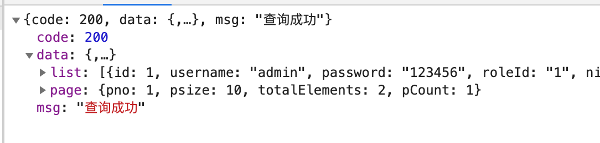

# Vue项目实战4

## 今日内容

1. 学习基于Vue+VueRouter+Vuex+ElementUI的后台管理系统半成品框架
2. 学习如何编写后台管理系统的增删改查（查询篇）

## 1.学习基于Vue+VueRouter+Vuex+ElementUI的后台管理系统半成品框架

### 1.1项目介绍

由于基础部分我们相对已经学习差不多了，所以今天开始我们采用与工作开发模式相近的方式进行学习。当我们达到初级工程师水平之后就可以进入公司进行开发，不过进入公司的初级和中级工程师所涉及的开发内容大多数是填空形式的。

我们一般情况下接手一个项目项目都是由架构师级别的工程师做好了一个完整的开发框架（条件差点的公司也会上网下载开源的项目框架）。这种框架的ui和核心依赖包都已经选择好并且建设完毕，我们只需要在半成品上进行改造和扩展开发即可。

> 下面我们来实际操作一下

1. 命令行打开md中的shop-service

2. ```sh
   #首先执行（如果已经install过就不需要了）
   npm install
   #然后执行让服务启动，启动完毕后输入http://localhost:3000/api查看是否打开接口文档界面
   npm run start:dev
   ```

3. 然后命令行打开案例中的admin-demo

4. ```sh
   #首先执行（如果已经install过就不需要了）
   npm install
   #然后执行 启动后访问http://localhost:8080/login看见登录页面说明成功
   npm run serve
   ```

5. 账号admin 密码123456

6. 执行登录动作，成功进入页面说明项目启动成功

### 1.2项目细节学习

成功打开项目之后我们来查看今天的项目文件目录，并且通过说明学习目录所放置的内容

```sh
├── README.md
├── babel.config.js
├── package-lock.json
├── package.json
├── public #静态资源文件夹
│   ├── favicon.ico
│   └── index.html
├── src#项目源代码目录
│   ├── App.vue#项目的最父级组件
│   ├── api#所有的axios请求接口都定义在这里，按照业务分成多个文件
│   │   ├── menu-api.js#菜单接口
│   │   ├── role-api.js#角色接口
│   │   └── user-api.js#用户接口
│   ├── assets#源代码部分的静态资源，在vue文件中使用，引入方式通过相对路径
│   │   ├── bg.jpg
│   │   └── logo.png
│   ├── components#项目的自定义组件
│   │   ├── Header.vue#自定义头部组件
│   │   ├── Menu.vue#自定义菜单组件
│   │   ├── PageHeader.vue#自定义页头组件
│   │   ├── Tabs.vue#自定义标签页组件
│   │   └── index.js#注册成公共组件需要的js
│   ├── http#项目发送请求的配置目录（axios的核心配置目录）
│   │   └── index.js
│   ├── main.js#项目启动的入口js文件
│   ├── router#项目的路由定义文件夹
│   │   └── index.js
│   ├── store#Vuex中数据定义的文件夹
│   │   └── index.js
│   └── views#项目的页面组件（就是访问页面）的文件夹，.vue结尾的文件相当于页面文件，-model.js的文件相当于每个页面处理业务代码的文件
│       ├── Index.vue
│       ├── Login.vue
│       ├── system
│       │   ├── menu
│       │   │   ├── icon-data.js
│       │   │   ├── menu-add-child.vue
│       │   │   ├── menu-add.vue
│       │   │   ├── menu-edit-child.vue
│       │   │   ├── menu-edit.vue
│       │   │   ├── menu-model.js
│       │   │   └── menu.vue
│       │   ├── role
│       │   │   ├── role-add.vue
│       │   │   ├── role-edit.vue
│       │   │   ├── role-menu.vue
│       │   │   ├── role-model.js
│       │   │   └── role.vue
│       │   └── user
│       │       ├── user-add.vue
│       │       ├── user-edit.vue
│       │       ├── user-model.js
│       │       └── user.vue
│       └── test
│           └── user
│               └── test-user.vue
└── vue.config.js#脚手架的配置文件

```

了解了每个目录都是做什么的之后我们继续下面的学习。

我们接下来还是先从main.js开始浏览

```js
import Vue from 'vue'
import App from './App.vue'
//引入路由组件
import router from './router'
//引入elementUI框架
import ElementUI from 'element-ui'
import 'element-ui/lib/theme-chalk/index.css'
//引入axios请求库
import http from './http'
//引入Vuex框架
import store from './store'
//引入自定义全局组件
import './components'
//安装请求库到Vue对象上
Vue.use(http)
//安装elementUI到Vue框架上
Vue.use(ElementUI)

Vue.config.productionTip = false

new Vue({
	store,//将Vuex数据注册到Vue的全局对象上
  router,//将路由的数据注册到Vue的全局对象上
  render: h => h(App)//渲染页面
}).$mount('#app')

```

> 详细的查看代码入口文件之后我们发现今天多了一个store的目录
>
> 这个目录就是以后我们要学习的Vuex的安装方式，下面再详细学习Vuex
>
> 在学习Vuex之前我们只需要了解Vuex是基于Vue.observable（vue的响应式对象）封装的一个响应式数据仓库库，他的用途与Vue.observable相同，可以实现跨组件来同步组件间的数据并且与data中定义的属性一样具备数据监听能力。
>
> 他还有一个重要的用途就是将.vue文件中调用接口实现业务处理的部分拆到外部去写，这样可以让每个vue页面的主代码更加简洁。具体的我们一会结合项目查看

接下来我们打开登录后的页面查看项目的页面结构

发现分成了上左右三部分，这是一个标准的后台管理系统的页面布局，布局是通过Index.vue实现的，并且在项目里上左右部分的代码均拆成了组件进行了单独引用这样方便维护。具体我们还是结合代码简单的浏览一下Index.vue中的内容，

> 接下来我们打开Index.vue并阅读内部的注释

阅读完这部分代码之后我们在页面上查看一下项目目前有的内容。

### 1.3业务模块介绍

#### 1.3.1系统设置-用户管理

用户管理是当前这个系统的所有管理员用户的一个管理模块，他主要包含

1. 用户查询：查看系统中所有的管理员数据
2. 新增用户：在系统中新增一个管理员并给他分配一个角色（角色用于关联当前这个用户所具有的菜单也就是权限）
3. 编辑用户：修改已有的管理员基本数据
4. 删除用户：删除系统中已存在的管理员

下面我们在系统中新建一个管理员账号和密码自己定义，角色必须分配为`系统管理员`

创建完成之后可以跳到最后一页或搜索自己创建的账号，然后点击右上角的图标，点击退出登录。并且登录自己创建的管理员账号尝试一下。

> 这个就是我们在系统中创建管理员的一个日常操作。

#### 1.3.2系统设置-角色管理

角色管理是配合用户管理和菜单管理一起使用的一个管理模块。

我们在用户新增和修改中选择的角色就是通过角色管理中创建的数据。

1. 角色查询：查询系统中已有的角色
2. 新增角色：在系统中新创建一条角色的数据
3. 编辑角色：修改在系统中创建的角色数据
4. 删除角色：删除系统中已存在的角色
5. 配置菜单：给角色分配菜单，配置完菜单之后，绑定了这个角色的用户登录以后就只能查看到当前配置的菜单

> 下面我们创建一个角色，首先点击新增，然后填写角色名称，点击保存。
>
> 然后在列表中找到自己创建的角色，点击配置菜单，在里面选择几个菜单。点击保存
>
> 然后在用户管理中把自己的账号的角色改成当前新建的角色，退出登录，重新登录看一下结果

#### 1.3.3系统设置-菜单管理

菜单管理就是用来管理系统中所有的功能模块，项目左侧的目录就是菜单定义的数据。

1. 菜单查询：查询当前创建的所有菜单
2. 新增菜单：新增一个父级菜单（我们的菜单结构是两级菜单，所以是父子嵌套的关系）
3. 新增子菜单：对一个父级菜单增加他的子菜单
4. 编辑菜单：修改一个父级菜单的数据
5. 编辑子菜单：修改一个子菜单的数据
6. 删除菜单：删除一个菜单，如果删除父级菜单，他的所有子菜单都会消失。

我们来实际创建一个新的父级菜单，并对其创建一个子菜单，然后在自己新建的角色中，点击绑定菜单，将新建的菜单绑定到角色中，这样我们退出登录自己创建的账号，再重新登录，左侧的菜单就会出现我们刚才创建的菜单了。所以菜单主要是配合角色使用用来定义项目中所具有的功能模块以及他对应的本地页面在哪里。

> 全部总结：

以上三个业务模块的简单学习，我们了解了一个后台管理系统必要具有的三个模块。这三个模块结合起来就可以让一个不懂程序的人能够通过操作页面进行管理员账号的创建，并且针对不同管理员的管理内容来对管理员进行菜单的分配。

### 1.4参考用户管理模块的所有代码和结构学习

浏览完页面功能并且已经掌握了基本的业务流程之后，我们找到项目的用户管理这个模块，来从查看他的代码开始学起。

1. 点击用户管理菜单，查看浏览器的url路径，我们发现他的path是/user
2. 找到router/index.js找到/user对应的vue文件，我们找到文件路径
3. 我们发现今天的页面不是只定义了一个文件而是定义了一个文件夹，里面有很多user-的文件
4. 所以我们以后定义vue页面的时候也要按照业务关系和层级来定义文件结构
5. 比如，当前用户管理是系统管理之下的文件并且用户管理还包含多个页面，所以我们定义用户管理的结构就是system->user->user的所有功能，当我们自己创建新的目录时也要按照这个规则创建文件

打开user.vue的文件，并查看代码和注释。

按顺序查看一遍页面的js和template部分

这里我们顺便结合

https://element.eleme.cn/#/zh-CN/component/table

https://element.eleme.cn/#/zh-CN/component/pagination

官方文档的说明来学习两个组件的基本用法，这里只看我们在项目中用到的属性足以

以上内容操作完毕之后我们来结合user-model.js看一下业务具体是怎么处理的,

所以现在我们重读一遍user.vue，读到使用user-model.js的部分跳转到user-model.js这个顺序去读，然后在整体读一遍user-model.js。

结合user-model.js的阅读我们要总结一下

> 1. 在大型应用开发中我们通过vuex来将vue页面中的复杂业务都拆分到store中去处理
>
> 2. 什么样的数据要放在model中写呢？
>    1. 通过api调用远程接口的函数
>    2. 通过接口函数返回的数据要定义在state中
>    3. 因为state中的数据是只读的。所以涉及到双向绑定，还有涉及到在页面中需要设置值的变量都只能定义在vue的data中，比如调用接口时传递的参数，表单绑定的数据，页面中输入的一些其他数据
>    4. 凡是接口返回的数据都要在model文件中的state中定义，这种是只用来在页面中展示的
>    
> 3. 不需要写在model中的内容有什么？
>    
>    1. 页面中的简单功能处理部分，如点击事件，发送请求的参数，以及需要使用v-model双向绑定的数据都需要定义在vue文件中
>    
> 4. model中是怎么工作的？
>    1. 首先在启动项目时通过main.js加载了vuex框架
>    2. 在store/index.js中引入了业务模块中的model.js并注册到了store中用来做业务数据的处理（注册的时候同时定义了模块的名字）
>    
> 5. 每个业务模块的model.js定义的格式
>
>    ```js
>    //xxx-model.js的基本结构
>    export default{
>      namespaced:true,//必须写的一个东西，这么写才能用map系列在vue文件中映射本页的数据
>      state:{},//state就是用来定义变量在vue页面展示数据用的
>      mutations:{},//mutations就是用来对state设置值的
>      actions:{},//actions就是用来调接口的
>      getters:{}//getters相当于业务模块state的计算属性，不是很常用
>      
>    }
>    ```
>
>    

在学习Vuex之前我们了解到这些就足够了

## 2.学习如何编写后台管理系统的增删改查（查询篇）

看另一篇笔记[vuex从零开始](vuex从零开始/vuex.md)

### 2.1Vuex的学习

我们刚刚初步的学习了后台管理系统项目的一个雏形并且浏览了用户管理模块的基本实现流程，现在我们就来学习一下如何在项目中进行完整的业务开发。

在上述的学习过程中我们了解了初步的业务形态和文件目录结构，并且知道了vuex和store，那么下面我们来对vuex做一个简单的介绍

#### 2.1.1Vuex 是什么？

Vuex 是一个专为 Vue.js 应用程序开发的**状态管理模式**。它采用集中式存储管理应用的所有组件的状态，并以相应的规则保证状态以一种可预测的方式发生变化。Vuex 也集成到 Vue 的官方调试工具 [devtools extension](https://github.com/vuejs/vue-devtools)，提供了诸如零配置的 time-travel 调试、状态快照导入导出等高级调试功能。

以上是官网对Vuex的介绍。

那么我们在用好理解的话总结一下：

Vuex就是针对Vue框架提供了一套响应式数据集，他可以实现Vue不同组件的跨模块数据共享（这里参考项目中Menu和Tabs组件的联动），还可以将项目中的业务进行分离，从而使项目结构变得更清晰业务更好维护。

#### 2.1.2Vuex的用法解读

依然是结合之前在代码中读过的内容我们将Vuex的核心代码部分做一个解读，然后着重学习Vuex在实际项目中是如何使用的

```js
//store/index.js中的结构解读
import Vue from 'vue'
import Vuex from 'vuex'
// 引入了user中的user-model.js
import UserModel from '../views/system/user/user-model.js'
//这里就是一个引入和安装
Vue.use(Vuex)
//全局的数据中心
const store = new Vuex.Store({
	// vuex中的核心数据存储对象，相当于Vue对象中的data属性，原理就是Vue.observable时学习的响应式对象
  
  state: {
    //他通过mapState在Vue中进行映射并绑定在computed中，绑定后就可以在vue中通过this.list直接调用
    list:[]//定义全局存储的数据或业务接口返回的数据
  },
	// mutations主要用于对state中声明的属性设置值，这种写法主要为了能让Vuex的数据流向不产生紊乱，
	//所以不推荐直接修改state中的值，一定要通过mutations去设置对应的state
  
  mutations: {
    //这里的state就是store中的state对象，所以可以通过state.list访问list
    //list就是调用setList时传入的参数，一般会通过actions中的commit('setList',参数)
    //来执行
    //他通过mapMutations在Vue中进行映射并绑定在methods中，绑定之后与函数用法一样，通过this.setList(参数)就可以直接调用并将参数保存到state的list中
		setList(state,list){
      state.list = list
    }
  },
	// getters相当于Vuex对象的计算属性也就是效果等同于Vue中的computed
  getters:{
    //所以getFirstList使用方式和state一样当作变量使用，他的作用就是computed一样的作用用于已有对象的扩展改造取值，并且state发生变化会触发getters的数据更新
    //他通过mapState在Vue中进行映射并绑定在computed中，绑定后与computed中的属性用法一样可以通过this.getFirstList来直接获得返回的值
		getFirstList(state){
      return state.list[0];
    }
  },
	// actions是Vuex中唯一可以使用异步语法的模块，用于编写业务逻辑
  //如后台接口的调用，并处理数据，所以这里我们可以叫他为业务函数
	actions:{
		//他通过mapActions绑定在vue组件的methods中绑定后与methods的函数一样可以通过
    //this.fetchMenuByRoleId(参数)来调用并执行逻辑
    //data就是外部传入的参数
    //commit是用来在这个函数内部执行store中的mutations内定义的函数用的如commit('setList',list)
    //dispatch是用来执行当前actions中其他函数的用法与commit格式完全一样
    //actions中的方法通常使用async来修饰用来简化promise函数.then嵌套的写法配合await可以使异步代码同步化
		async getList({commit,dispatch},data){
			let res = await findMenuList(data)
			if(res.data.code == 200){
				let list = res.data.data.list;
				// commit相当于调用了mutations中对应的方法
				commit('setList',list)
			}
		}
	},
  //当前的store对象是Vuex的全局根对象，其他业务模块的业务可以通过modules来注册到这里，这种做法可以将业务拆分的更加优雅，所有的业务代码随着vue组件定义，维护性更高
	modules:{
		// 将user-model.js注册到了store全局对象中，命名为userModel，
    //定义为模块的文件内部导出的对象与当前对象一样需要拥有state，getters，mutations，actions，并且要多定义一个namespaced为true，这样才能通过模块的名称映射到每个Vue组件中
    userModel:UserModel,
	}
})
export default store
```

#### 2.1.4在项目中定义一个新的业务模块，并且将基本目录和文件创建出来

首先打开项目页面，在菜单中的练习模块创建子菜单用户管理菜单，路由填/user-test,可能已经存在，是因为拷给你的shop-service中已经有记录了。

然后在角色模块对当前我们登录的账号的角色进行菜单配置，增加新增的菜单.

然后我们退出登录，重新登录，菜单的练习中就会出现我们刚才创建的模块。

创建完成之后点击`用户管理练习`会跳到空白页，我们观察url中的path为/user-test就说明准备工作完成了。

> 下一步就是创建文件

在项目views中找到test文件夹，在文件夹内部创建user-test文件夹并且在user-test文件夹内创建两个文件一个user-test.vue一个user-test-model.js

在user-test.vue中随便写点内容，然后我们先编辑user-test-model.js

```js
//粘贴到user-test-model.js中
export default{
  namespaced:true,//允许模块命名
  state:{//定义模块的属性
    list:[1]
  },
  mutations:{//定义为list赋值的方法
    setList(state,list){
      state.list = list
    }
  }
}
```

接下来我们打开store/index.js

在文件的上面引入我们创建的user-test-model.js

```js
import UserTestModel from '../views/test/user-test/user-test-model.js'
```

找到store/index.js中的module部分将其改造为如下代码

```json
modules:{
  // 将user-model.js注册到了store全局对象中，命名为userModel
  userModel:UserModel,
  roleModel:RoleModel,
  menuModel:MenuModel
  //引入我们自定义的model,这里就相当于我们自定义的模块引入全局store并且命名为userTestModel这样在项目启动之后我们自己定义的模块就会被执行并加载到vuex对象中
  userTestModel:UserTestModel
}
```

然后我们给user-test.vue改造一下

```vue
<!--将如下内容粘贴到user-test.vue中 -->
<template>
	<div>
		{{list}}
	</div>
</template>

<script>
  //从vuex对象中引入mapState模块
	import {mapState} from 'vuex';
	export default{
		name:'user-test',
		computed:{
      //...为es6解构赋值的写法，意义为将mapState执行并将返回值合并到computed中
      //mapState意义为state的映射对象，以下是mapState参数说明
      //mapState(模块名称，['state中的属性','state中的属性'...]),这个意思就是将我们自己定义的user-test-model.js中创建的state中的list加载到本组件的computed中
			...mapState('userTestModel',['list'])
		}
	}
</script>

<style>
</style>
```

最后一步我们将定义的user-test.vue注册到路由组件中也就是在router/index.js中创建一个对本页的路由关系，具体写法就不重复了，注意一点这里是子路由跳转所以要注册在Index.vue的children中。

完成以上操作之后我们在网页中访问`用户管理练习`

在页面中显示[1]就说明我们的页面基本搭建已经完成。

#### 2.1.5查询逻辑的实现

完成文件创建流程之后我们要把查询页面应该有的内容都描述出来，打开系统设置-用户管理我们参考已经做完的样子

页面大概分四部分：

1. 页面标题栏
2. 条件查询部分
3. table表格部分
4. 分页组件部分

>  首先我们来完成页面标题栏

参考/user页面的代码，我们发现在components中定义了一个自定义组件专门用来做页面标题栏的参我们可以去读一下components中定义的组件然后自己在user-test.vue中同样调用一下

```vue
<!-- 在页面添加如下代码 -->
<p-page-header title="用户管理练习"></p-page-header>
```

这里需要注意查看一下components/index.js这里是因为我们在index.js中通过Vue.component定义了全局组件所以使用p-page-header的时候不需要通过import引入使用

下一步正常是应该做条件查询部分，不过我们先来学习table表格部分

> table组件的使用

首先介绍一下table组件

https://element.eleme.cn/#/zh-CN/component/table

详细的使用方式在官方文档，我们来学习一下table的核心内容

首先改造一下user-test-model.js将list的值设置为如下内容

```json
state:{
  list:[
    {id:'1',username:'admin1',password:'1234561'},
    {id:'2',username:'admin2',password:'1234562'},
    {id:'3',username:'admin3',password:'1234563'},
  ]
}
```

然后我们学习一下table组件的定义

```vue
<!--
	el-table是一个嵌套组件，是通过json数组将数据以table表格的形式展示的一个渲染组件，table组件本身提供了非常丰富的功能，这里我们只需要掌握他的基础和必要功能
-->
<!-- 
	data属性就是table的数据参数，table内的数据通过data属性传入，格式为[{key:value,key:value}]必须是json数组
  size属性与其他表单组件的属性用法相同同样有normal medium small mini四个尺寸
	border是一个boolean属性所以可以直接写代表为true，当border设置时表格有边框，默认无边框
-->
<el-table 
  :data="list"
  border
  size="mini">
  <!--
		el-table-column是配合el-table组件共同使用的用来描述表格内容的组件
		el-table是以列为单位的，所以每一个el-table-column就相当于一列数据
		prop属性代表当前el-table-column这一列的值从data中的哪一列获取，prop的值对应的就是[{key:value,key:value}]中的key，所以为什么必须data是数组套json的格式的意义。
  -->
	<el-table-column prop="username" label="用户账号"></el-table-column>
  <el-table-column prop="username" label="用户账号">
    <!-- 
			el-table为我们提供了插槽进行自定义赋值，由于我们在data数据中只取结果的话table表格中只有数据，而有些时候我们可能像在表格中展示按钮，或者其他组件这个使用就需要对表格内容进行自定义，就需要template标签，在template中的内容就会显示在这一列的表格内，但是我们不光要在表格内部自定义内容还需要结合表格的数据，所以我们可以通过v-slot指令拿到row对象row对象代表的是表格当前行的所有内容，所以我们可以在template中通过row.key实现在自定义列中获取任何表格的数据并加工成例如按钮，图片等展示。
-->
  	<template v-slot="{row}">
    </template>
  </el-table-column>
</el-table>
```

我们掌握了组件的基本用法之后下面我们在user-test.vue中通过代码自己实现将user-test-model.js中声明的list展示到表格中。

```vue
<!--将如下内容粘贴到user-test.vue中 -->
<template>
	<div>
		<p-page-header title="用户管理练习"></p-page-header>
    <!-- 表格组件的练习-->
		<el-table :data="list" size="mini" border>
			<el-table-column label="id" prop="id"></el-table-column>
			<el-table-column label="账号" prop="username"></el-table-column>
			<el-table-column label="密码" prop="password"></el-table-column>
			<el-table-column label="我是自定义列">
				<template v-slot="{row}">
					账号是:{{row.username}},密码是{{row.password}}
				</template>
			</el-table-column>
			<el-table-column label="操作">
				<template v-slot="{row}">
					<el-button type="danger" size="mini">删除</el-button>
				</template>
			</el-table-column>
		</el-table>
	</div>
</template>

<script>
  //从vuex对象中引入mapState模块
	import {mapState} from 'vuex';
	export default{
		name:'user-test',
		computed:{
      //...为es6解构赋值的写法，意义为将mapState执行并将返回值合并到computed中
      //mapState意义为state的映射对象，mapState(模块名称，['state中的属性','state中的属性'...]),这个意思就是将我们自己定义的user-test-model.js中创建的state中的list加载到本组件的computed中
			...mapState('userTestModel',['list'])
		}
	}
</script>

<style>
</style>
```

然后我们来查看页面的展示并尝试自己写一下

> 接下来我们来将表格的数据变成从服务器获取

我们创建的模块只能展示我们在代码中定义的数据。如果想让每个用户访问的数据都是同步的，所访问的数据源必须是一样的，所以我们如果想在系统中查看系统有多少用户都是谁就需要像服务器索取我们需要的数据。

结合我们学习的接口调用首先我们还是先看后台接口文档

http://localhost:3000/api

找到用户接口部分，我们查看`分页查询用户列表`这个接口，查看他的请求类型，参数并且在文档中自己测试一下，由于这个是需要鉴权的接口所以，我们要在文档中再次调用登录接口并且简单配置一下，具体步骤不多做叙述。

测试完接口之后我们知道了接口的请求地址和参数都是什么，那么既然要像后台传入参数我们就需要在代码中定义请求的参数，从文档得知我们需要pno、psize、username三个参数那么我们就在user-test.vue中定义这三个参数在开发中我们一般会把一个业务需要的参数统一定义到一个对象中，如下所示

```json
//将以下结构定义到user-test.vue中
//这里为什么要这么定义，虽然我们可以以各种形式定义变量使用，但是通过queryForm包裹成对象的方式在开发中是比较常用的方式，以便于配合表单进行条件查询。这个就是一种固定写法要多练习，熟练掌握并牢记
queryForm:{
  pno:1,//页号
  psize:10,//每页多少条
  username:''//用户账号
}
```

接下来我们就要通过接口调用的方式来将服务器上的数据拿到并且放到网页中展示。

基于上面我们对vuex的学习我们了解了vue开发中的接口调用以及业务都需要定义在model中，接口返回的数据也要定义在model中，我们已经在state中定义了一个list属性，这个属性我们就要用来接收接口的返回数据，那么我们第一步就是要先调用接口。

在接口调用课程中我们学习到接口调用一般都会定义在api文件夹内，并且我们的用户管理模块已经开发完毕所以接口也已经调用完成。

我们找到api/user-api.js中getUserList这个接口调用的函数并查看，既然接口调用函数已经定义完毕那么我们这次就不自己写了，直接使用。

> 使用步骤

1. 在user-test-model.js中 

   ```js
   //导入查询用户列表的接口调用函数
   import { getUserList } from '../../../api/user-api.js'
   ```

2. ```js
   //完整实现步骤
   import { getUserList } from '../../../api/user-api.js'
   export default{
   	namespaced:true,
     state:{
       list:[
   			{id:'1',username:'admin1',password:'1234561'},
   			{id:'2',username:'admin2',password:'1234562'},
   			{id:'3',username:'admin3',password:'1234563'},
   		]
     },
     mutations:{
       setList(state,list){
         state.list = list
       }
     },
     //业务函数对象
     actions:{
       //根据业务名称定义异步函数
       async getListForPage({commit},queryForm){
         //在业务函数中执行接口调用函数,通过await来修饰
         let res = await getUserList(queryForm)
         
         //根据接口返回数据的结构，我们获取状态码进行判断
         if(res.data.code == 200){
           //如果接口调用成功，我们就将当前的接口中list的数据赋给state中的list，通过commit执行     
           //res是axios的返回对象，res.data中的内容才是我们服务器返回的数据
           //由于服务器返回的数据结构是{code:200,data:{},msg:''}
           //也就是res.data == {code:200,data:{},msg:''}
           //所以我们想获取服务器返回的data中的值就是res.data.data
           commit('setList',res.data.data.list)
         }
       }
     }
   }
   ```
   
3. 以上步骤操作完毕之后我们再回到user-test.vue中

   ```vue
   <!--将如下内容粘贴到user-test.vue中 -->
   <template>
   	<div>
   		<p-page-header title="用户管理练习"></p-page-header>
   		<el-table :data="list" size="mini" border>
   			<el-table-column label="id" prop="id"></el-table-column>
   			<el-table-column label="账号" prop="username"></el-table-column>
   			<el-table-column label="密码" prop="password"></el-table-column>
   			<el-table-column label="我是自定义列">
   				<template v-slot="{row}">
   					账号是:{{row.username}},密码是{{row.password}}
   				</template>
   			</el-table-column>
   			<el-table-column label="操作">
   				<template v-slot="{row}">
   					<el-button type="danger" size="mini">删除</el-button>
   				</template>
   			</el-table-column>
   		</el-table>
   	</div>
   </template>
   
   <script>
     //从vuex对象中引入mapState模块和mapActions模块
     //增加mapActions对象的引入，往computed计算属性里写 用来映射model中定义的业务函数
     //增加mapActions，往methods里写
   	import {mapState,mapActions} from 'vuex';
   	export default{
       //name属性用于在keep-alive中缓存当前页面
   		name:'user-test',
   		data(){
   			return {
   				queryForm:{
   				  pno:1,//页号
   				  psize:10,//每页多少条
   				  username:''//用户账号
   				}
   			}
   		},
   		computed:{
         //...为es6解构赋值的写法，意义为将mapState执行并将返回值合并到computed中
         //mapState意义为state的映射对象，mapState(模块名称，['state中的属性','state中的属性'...]),这个意思就是将我们自己定义的user-test-model.js中创建的state中的list加载到本组件的computed中
   			...mapState('userTestModel',['list'])
   		},
       methods:{
         //将mapActions合并到methods中，并且映射userTestModel模块将getListForPage这个函数一起合并到vue组件中，当前组件就可以使用这个函数了
         ...mapActions('userTestModel',['getListForPage'])
       },
       //由于被缓存的组件生命周期只有第一次生效所以这里我们在activated中调用接口，这样每次访问user-test.vue时都会执行一次查询
       async activated(){
         //这里就相当于调用了user-test-model.js中的getListForPage方法，也就是间接的调用了api中定义的接口函数并且将queryForm作为参数传入
         //这里依然使用async配合await的语法进行使用
         await this.getListForPage(this.queryForm)
       },
       //这里是为了防止页面刷新，如果在本页执行刷新操作，第一次刷新由于页面还没有缓存不会执行activated所以要定义一个created
       async created(){
         
         await this.getListForPage(this.queryForm)
       },
       
   	}
   </script>
   
   <style>
   </style>
   ```

4. 完成以上部分的代码编写之后我们保存代码访问当前的页面，数据变成了和系统设置-用户管理中一样的数据就说明我们的查询已经完成了

5. 然后我们需要对表格进行一个简单的改造将用户的昵称和创建时间还有角色名称展示出来

   ```vue
   <!--昵称非常简单正常使用就可以读取-->
   <el-table-column label="昵称" prop="nickname"></el-table-column>
   <el-table-column label="创建时间" prop="insertTime"></el-table-column>
   <el-table-column label="角色名称" prop="roleName"></el-table-column>
   ```

6. 我们加入这两列之后发现创建时间是一串数字，并不是日期，这里的日期其实是date生成的时间戳，我们想要展示成日期需要将他转换成日期对象

7. 这里其实我们在最初学习computed的时候就学习了通过计算属性格式化日期的例子

8. 并且我们分析这个是一个批量处理的计算属性，所以需要对他传入参数，我们在computed中定义一个formmatDate的函数

   ```js
   formmatDate(){
     return function(time){
       //将时间戳转成日期
       let d = new Date(time)
       return `${d.getFullYear()}-${d.getMonth()+1}-${d.getDate()} ${d.getHours()}:${d.getMinutes()}:${d.getSeconds()}`
     }
   }
   ```

9. 为了将日期展示到对应的列中我们就需要结合刚刚学的插槽功能将列值改造

   ```vue
   <el-table-column label="创建时间" prop="insertTime">
   	<template v-slot="{row}">
   	<!-- 将每行的时间传入计算属性并输出-->
     	{{formmatDate(row.insertTime)}}
     </template>
   </el-table-column>
   ```

10. 完成以上步骤之后我们在看表格展示的内容，已经非常好看了

11. 接下来我们使用el-tag组件将角色名称重点突出

    ```vue
    <el-table-column label="角色名称" prop="roleName">
    	<template v-slot="{row}">
    		<el-tag>
          {{row.roleName}}
        </el-tag>
      </template>
    </el-table-column>
    ```

12. 至此我们对table的基本使用以及接口调用整合vuex整合vue做查询的流程都有了初步的理解了。以后的日子我们会做很多的练习来巩固这个流程

> 创建条件查询对象

我们初步的完成了表格的展示，下一步我们要完成的就是条件查询，我们回到系统设置-用户管理中查看当前的条件查询部分是一个输入框一个按钮

所以我们需要定义一个form表单的结构并且是inline模式

```vue
<!-- 将以下代码插入到页面的合适位置 -->
<!-- 
	由于表单中通常有很多的属性，所以我们通常也会吧表单中使用的属性封装到json对象中，在这里我们就创建了一个queryForm对象来存放请求参数
	这里的model对象就是用来绑定当前表单数据的对象，绑定后可以将表单内部通过v-model指令双向绑定的对象中的值结合表单验证做处理，这里我们作为初步了解
-->
<el-form :model="queryForm" inline>
  <el-form-item size="mini" label="用户账号">
    <el-input placeholder="请输入账号" clearable v-model="queryForm.username"></el-input>
  </el-form-item>
  <el-form-item size="mini">
  	<el-button icon="el-icon-search" type="primary">查询</el-button>
  </el-form-item>
</el-form>
```

加入了条件查询之后我们要实现的功能就是当我们在用户账号内输入了内容时，点击查询按钮，下面的表格会展示出我们搜索相关的数据。

所以我们要给查询按钮绑定一个点击事件@click="handleSearch"

然后考虑，我们点击查询时要搜索我们输入的username相关的数据，也就是说我们点击查询按钮就应该调用接口访问后台并且将我们的username传到后台，由于v-model已经绑定了queryForm.username所以我们只要操作输入框queryForm的值就会自动变化所以我们要做的操作就是直接调用接口并传入所有的参数

由于我们点击查询按钮一般都会有一个请求时间所以我们要给查询按钮在绑定一个loading属性具体操作不详细列出了直接演示

```js
//定义的点击事件实现内容
async handleSearch(){
  //先让按钮变成加载中
  this.loading = true;
  //为了防止分页功能导致页号变更，保证每次条件查询都要从第一页开始展示结果
  this.queryForm.pno = 1;
  //然后调用查询接口，这里注意只有通过await修饰代码才会按照同步代码执行。
  //这个写法相当于我们过去通过this.http().then()的嵌套写法的升级版
  await this.getListForPage(this.queryForm)
  //查询完毕后让加载中取消
  this.loading = false;
}
```

以上步骤完成之后我们便完成了基本的列表展示和条件查询

下面我们可以在输入框中随便输入写内容点击查询，如果搜索列表中没有的数据列表就会变成空的如果输入关键字就会展示与输入匹配的内容

#### 2.1.6分页的实现

我们完成了上面的效果之后发现当前的查询没有问题但是只能展示最多10条内容，我们可以在系统设置-用户管理中随便增加10条数据然后回到我们自己实现的模块发现内容时无法完全展示的。

这里就需要学习一个新的组件：分页组件。

分页是项目中最常见的一种功能，因为我们在网站上浏览的数据很多模块都会有数百数千甚至万级以上的数据，这些数据我们不能一下全显示在网页里，这样不光浏览不方便还会引发性能问题所以我们一般会把很多条的数据分成多个页面显示

所以我们学习分页组件的用法

https://element.eleme.cn/#/zh-CN/component/pagination

可以先查看官方文档，对他有个初步了解

```vue
<！--分页组件的简介 -- >
<el-pagination
    @size-change="handleSizeChange" //当每页多少条发生变化时会触发handleSizeChange执行参数就是变化后每页多少条数据
    @current-change="handleCurrentChange"//当我们操作了上一页下一页或指定跳转到某个页面后会触发handleCurrentChange执行，参数是目标页的页号
    :current-page="currentPage4"//当前页的页号就是pno
    :page-sizes="[5, 10, 20, 50]"//每页多少条的选项
    :page-size="10"//每页展示的条数的值就是psize
    layout="total, sizes, prev, pager, next, jumper"//分页组件具备的功能，参考官方文档即可
    :total="totalElements"//一共有多少条数据>
</el-pagination>
```

分页组件都是固定用法，没有太多的逻辑，我们只需要记住每个属性的意思即可

下面我们就在项目中使用分页组件

首先我们回到网页中点击刚才的查询打开控制台查看接口的返回值



我们发现后台给我们返回了一个page对象

```json
{
  pno:1,//当前数据的页号
  psize:10,//当前数据每页的条数
  totalElements:2,//当前共有多少条数据
  pCount:1//当前有多少页
}
```

也就是说这些值正好就是分页组件需要的数据

所以我们在user-test-model.js中找到getListForPage

在函数中将返回的page对象也保存到我们的model中

所以我们在state中创建page对象,在mutation中创建setPage函数

```json
state:{
  page:{}
},
mutations:{
  setPage(state,page){
    state.page = page;
  }
}
```

在actions的函数中增加设置page

```js
commit('setPage',res.data.data.page)
```

这样我们的分页数据就保存到了page对象中

接下来我们进入user-test.vue

```js
//在mapState中增加page映射
...mapState('userTestModel',['list','page']),
```

```vue
<!--
	页面的下面增加分页组件
	current-page就是当前页号所以使用page.pno
	page-size就是当前每页展示多少条所以使用page.psize
  total就是总条数所以使用page.totalElements
	@size-change和@current-change
	分别就是pno和psize发生变化时触发的函数所以我们将
handleSizeChange和handleCurrentChange定义在methods中
-->
<el-pagination
			@size-change="handleSizeChange"
			@current-change="handleCurrentChange"
			:current-page="page.pno"
			:page-size="page.psize"
			layout="total, sizes, prev, pager, next, jumper"
			:total="page.totalElements">
</el-pagination>

```

```js
//分页组件的psize发生变化会触发并传入psize
handleSizeChange(psize){
  
},
  //通过分页组件触发跳页会执行并会传入pno
handleCurrentChange(pno){
  
}
```

接下来我们完善跳页触发事件的内容，

我们思考一下，跳页与条件查询思路其实一样，就是当页面发生变化将新的页号传给后台调用接口返回新页面的数据，所以我们在这两个事件中操作的其实就两步骤

1. 变更查询条件
2. 重新调用查询接口
3. 将函数变成异步函数

```js
//分页组件的psize发生变化会触发并传入psize
async handleSizeChange(psize){
  this.queryForm.pno = 1
  //将每页多少条的值重新设置
  this.queryForm.psize = psize
  //重新调用查询
  await this.getListForPage(this.queryForm)
},
  //通过分页组件触发跳页会执行并会传入pno
async handleCurrentChange(pno){
  //将新的页号设置到参数重
  this.queryForm.pno = pno
  //重新调用查询
  await this.getListForPage(this.queryForm)
}
```

到此我们就实现了一个真正项目中的查询模块

## 3.作业

找到页面中已经创建号的用户管理作业模块，页面已经创建完成，根据今天完成的查询模块重新自己实现一遍，可以参考课堂笔记一步一步操作，一定要掌握这个做项目的流程。

> 创建菜单的步骤
>
> 1.在菜单管理中找到练习模块，点击创建子菜单
>
> 2.创建菜单名称，选择图标，配置路由如/user
>
> 3.在角色管理中找到系统管理员，点击绑定菜单，在菜单列表中勾选新创建的菜单点击提交
>
> 4.重新登陆admin账号