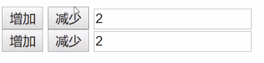
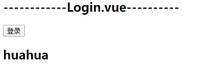
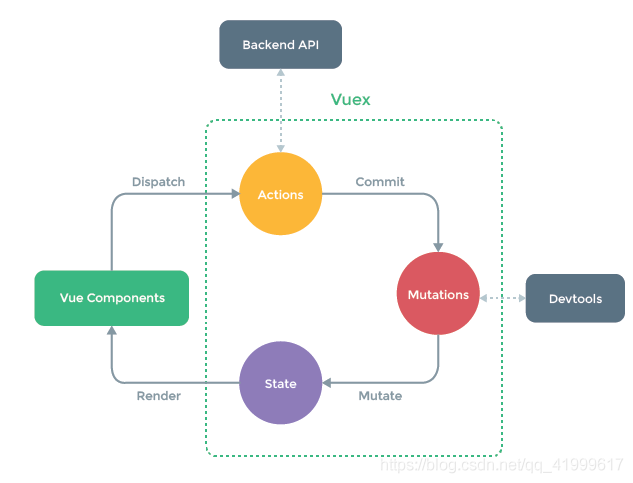
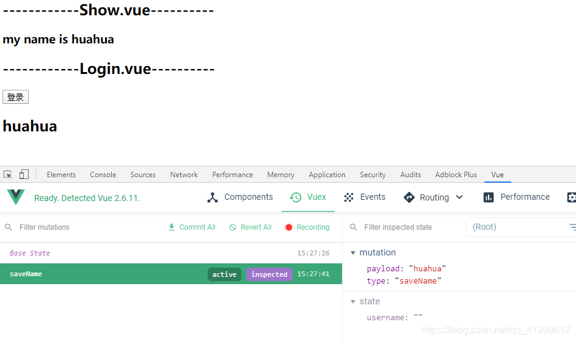
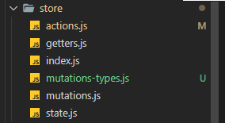
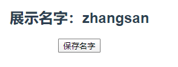

# 一、为什么用vuex

1.当前在企业开发中我们遇到了两个问题：
1.如果想要在子组件中使用祖先组件中的数据，那么就必须一层一层的传递（非常麻烦）。
2.兄弟组件之间不能直接传递数据，如果兄弟组件之间传递数据，那么就需要借助父组件
解决方案：provide/inject   和  eventbus   （非常麻烦）
# 二、Vuex是什么

vuex是专为vue应用程序开发的状态管理模式，你可以简单的将其看成是把多个组件需要共享的变量全部存储在一个对象里面，将这个对象放在顶层的vue实例中，让其他组件都可以使用，这样的话，我们是不是可以自己封装一个对象来管理呢？当然可以，但是vuejs给我们最大的便利就是响应式，如果我们自己封装一个对象可能稍微麻烦一些。

vuex是vue配套的公共数据管理工具， 我们可以将共享的数据保存到vuex中，方便整个程序中的任何组件都可以获取和修改vuex中保存的公共数据。

### 什么情况下使用vuex?

多个界面共享数据时使用，比如用户的登录状态，用户名称，头像等等，还有商品的收藏，购物车中的物品。

# 三、获取Vuex

https://vuex.vuejs.org/zh/  右上角的GitHub下载后，解压得到dist/vuex.js

# 四、导入到html文件中
先导入vue.js,  再倒入vuex.js
<script src="https://cdn.bootcdn.net/ajax/libs/vue/2.6.12/vue.js"></script>
# 五、开始使用Vuex

打开官方文档，[开始](https://vuex.vuejs.org/zh/guide/)
```js

const store = new Vuex.Store({
  state: {
    msg: 'vuex'
  }
})

```

state	共享数据都放这里

## 5.1实战

### 5.1.1 需求

**有爷爷 爸爸 儿子三个组件，让三个组件都可以访问到msg**

```js
Vue.component('grandfather',{
				template:`
					<div>
						<p>爷爷</p>
						<father></father>
					</div>
				`
})
			Vue.component('father',{
				template:`
					<div>
						<p>爸爸</p>
						<son></son>
					</div>
				`
			})
			Vue.component('son',{
				template:`
					<div>
						<p>儿子</p>
					</div>
				`
			})
```

### 5.1.2 解决办法

只要给祖先组件添加store属性，键是store ， 值是vuex对象就可以实现，后代组件都可以访问到共享数据。

### 5.1.3 如何访问vuex中的数据

this.$store.state.key

### 完整代码

```html
<!DOCTYPE html>
<html>
	<head>
		<meta charset="utf-8">
		<title></title>
	</head>
	<body>
		<div id="app">
			<grandfather></grandfather>
		</div>
		<script src="https://cdn.bootcdn.net/ajax/libs/vue/2.6.12/vue.js"></script>
		<script src="js/vuex.js" type="text/javascript" charset="utf-8"></script>
		<script type="text/javascript">
			const store = new Vuex.Store({
			  state: {
			    msg: '甲骨文'
			  }
			})
			Vue.component('grandfather',{
				template:`
					<div>
						<p>爷爷{{this.$store.state.msg}}</p>
						<father></father>
					</div>
				`,
				store
			})
			Vue.component('father',{
				template:`
					<div>
						<p>爸爸{{this.$store.state.msg}}</p>
						<son></son>
					</div>
				`
			})
			Vue.component('son',{
				template:`
					<div>
						<p>儿子{{this.$store.state.msg}}</p>
					</div>
				`
			})
			
			
			var vm = new Vue({
				el:'#app'
			})
		</script>
	</body>
</html>

```


# 六、兄弟之间共享

## 6.1准备代码

父组件，包含两个子组件,第一个子组件中添加两个按钮和一个输入框，要求通过按钮控制输入框中的输入+1和-1，第二个子组件只有一个空div,   在父组件中保存store

```js
const store = new Vuex.Store({
				state:{
					count:0
				}
			})
Vue.component('father',{
  template:`<div>
							<son1></son1>
            	<son2></son2>
            </div>`,
  store
})
Vue.component('son1',{
  template:`
          <div>
              <button>增加</button>
              <button>减少</button>
              <input type="text">
          </div>
  				`
})
Vue.component('son2',{
  template:`<div>

						</div>`
})
new Vue({

}).$mount('#app')
```

## 6.2绑定事件

为增加和减少添加事件

```js
					add(){
						this.$store.state.count = this.$store.state.count + 1;
					},
					sub(){
						this.$store.state.count = this.$store.state.count - 1;
					}
```

测试好使后

## 6.3 兄弟组件显示数据

在组件son2中显示数据count，测试兄弟组件可以显示共享数据。

```js
			Vue.component('son2',{
				template:`<div>
										{{this.$store.state.count}}
									</div>
								`
			})
```

## 6.4 vue的建议

不推荐直接修改共享数据，如果两个组件都有增减减少的按钮，都可以修改共享数据，将来程序出错不知道是哪个组件出的错。调试程序麻烦，每一个组件都需要检查一遍



## 6.5 mutations 修改数据

 mutation [mjuːˈteɪʃn] n. 突变；变化；

mutation是vuex属性专门用来保存修改共享数据的方法，接下来增加mutations方法

```js
			const store = new Vuex.Store({
				state:{
					count:0
				},
				mutations:{
					//在执行mutations中定义的方法的时候，系统会自动给这些方法传递一个state参数
					//state中就保存了共享数据
					mAdd(state){
						state.count = state.count + 1;
					},
					mSub(state){
						state.count = state.count - 1;
					}
				}
			})
```

定义好修改共享变量的方法，下面学习如何调用

```js
				methods:{
					add(){
						this.$store.commit('mAdd');
					},
					sub(){
						this.$store.commit('mSub');
					}
				}
```

总结： 这样就解决了，如果增减失败，直接去mutations里找错误，不用一个一个组件排查错误了。

# 七、getters属性

## 7.1回顾computed

和computed有些类似，计算属性的特点就是会将计算结果保存起来，可以缓存数据，只要数据没发生变化，就只计算一次，以后使用的时候，就是缓存中的数据：首先回顾

```html
<!DOCTYPE html>
<html>
	<head>
		<meta charset="utf-8">
		<title></title>
	</head>
	<body>
		<div id="app">
			<father></father>
		</div>
		<script src="https://cdn.bootcdn.net/ajax/libs/vue/2.6.12/vue.js"></script>
		<script src="js/vuex.js" type="text/javascript" charset="utf-8"></script>
		<script type="text/javascript">
			Vue.component('father',{
				template:`<div>
					{{format}}
					{{format}}
					{{format}}
					{{format}}
				</div>`,
				data(){
					return {
						msg:'甲骨文'
					}
				},
				computed:{
					format(){
						
						console.log("计算属性被执行了");
						return this.msg + "http://www.oracle.com/cn"
					}
				}
			})
			new Vue({
				
			}).$mount("#app")
		</script>
	</body>
</html>

```

多次调用format方法，控制台只输出一次。

## 7.2 改造

删掉组件中的data, computed和{{format}}代码，我们使用getters实现

第一步：创建vuex对象

```js
			const store = new Vuex.Store({
				state:{
					msg: '甲骨文'
				},
				mutations:{
					
				},
				getters:{
					format(state){
						return state.msg + "http://www.oracle.com"
					}
				}
			})
```

第二步在父组件上引用store

```js
Vue.component('father',{
		store,
	}
);
```

第三步调用的时候

```vue
{{this.$store.getters.format}}
```

# 八、单组件中使用Vuex

## 8.1 初级版（适合小白）：

安装Vuex

```shell
npm i vuex --dev-save
```

在src目录下新建一个文件夹store(仓库),在store文件夹下新建index.js：

1.index.js:

```js
import Vuex from 'vuex'
import Vue from 'vue'

//1.安装插件
Vue.use(Vuex)

const state = {
  // 应用启动时，username 置为空
  username: ''
}

const mutations = {
  // mutation 的第一个参数是当前的 state
  // 你可以在函数里修改 state,第二个参数传过来的参数
   saveName(state, name){
     state.username = name;
   }
}

//2.创建对象
const store = new Vuex.Store({
  state,
  mutations
})

export default store;
```


这里的state是一些自定义的变量，需要共享出去的变量，组件不允许直接修改vuex store的状态，因为我们想要让状态的每次改变都很明确且可追踪，vuex状态的所有改变都必须在store的mutation中进行修改

这里的mutations是用来触发事件，用来修改state状态的，用户需要触发这个方法，借此来修改state里面的状态，传入的第二个参数就是要赋值给state中的变量

2.main.js中引用

```js
import Vue from 'vue'
import App from './App.vue'
import router from './router'
import Store from './store'

Vue.config.productionTip = false

Vue.prototype.$store = Store//挂载在vue原型上，这样组件就可以通过this.$store.state来访问

new Vue({
  router,
  Store,
  render: h => h(App)
}).$mount('#app')


```

3.保存数据：（当我们点击登录时，我们需要把用户名存储到vuex中）

login.vue

```vue
<template>
  <div>
    <button @click="login">登录</button>
    <!-- 这里方便查看 -->
    <h2>{{$store.state.username}}</h2>
  </div>
</template>
<script>
  export default {
      methods: {
         login(){
           this.$store.commit('saveName','huahua')
         }
      },
  }
</script>
```

效果：



这里的第一个参数就是要触发的方法名，第二个参数是你要传递的数据

获取变量名：

```js
this.$store.state.变量名
```

一般获取变量名都是在计算属性里面获取：

Show.vue

```vue
<template>
  <div>
    <h3>my name is {{name}}</h3>
  </div>
</template>
 
<script>
  export default {
    computed: {
      name() {
        return this.$store.state.username
      }
    },
  }
</script>
```

## 8.2高级版（大型项目）：

模块化，适合有基础的人，也适合中大型项目

如果整个项目需要共享的数据之多，把这些数据和mutations写在一个文件夹的话，很难维护，耦合度高




先看这官方上的这张图，组件components派发任务到**actions**，**actions**再触发mutations中的方法，**mutations**再修改**state**中的数据，数据改变后响应推送给组件，组件渲染，所以上述中说到组件是不能直接修改state中的变量，并且state一定是通过mutations去修改的。

Devtools是浏览器扩展程序插件，专门用来调试vue的，可以追踪vuex中state状态的改变，如果组件跳过**mutations**直接去修改state中的状态，那么就追踪不到



**actions**是用于分发mutations函数，mutations只能进行同步操作，当想要执行异步操作时，请使用actions

### 8.2.1 高级用法的文件夹目录：



推荐写法:

1.state.js:保存所有的数据，以对象的形式导出

```js
//state.js
export default {
    username: "", //用户名
    token: "", //用户令牌
    role: "", //用户角色
    count: 10,
    info: {
      username: "kebi",
      age: 40,
      height: 1.95
    },
    students: [
      { id: 1, name: "zhangsan", age: 18 },
      { id: 2, name: "lisi", age: 20 },
      { id: 3, name: "xiaohua", age: 15 },
      { id: 4, name: "jinjin", age: 22 }
    ]
  };
```

2.mutations.js

```js
//mutations.js
export default {
    //第一个参数是store的state对象，第二个参数是传递过来的参数
    //名字使用全部大写，是为了和actions里面的方法名区分开
    SAVENAME(state, name) {
      state.username = name;
    }, //保存用户名
   
    SAVETOKEN(state, token) {
      state.token = token;
    }, //保存用户token
   
    SAVEROLE(state, role) {
      state.role = role;
    }, //保存用户角色
   
    UPDATEINFO(state, name) {
      state.info.username = name;
    }//异步修改用户信息
  };
  
  
```

3.actions.js

```js
//actions.js
export default {
    //payload是传递过来的参数
    saveName(context, payload) {
      context.commit("SAVENAME", payload);
    }, //触发保存用户名方法
    //也可以这样写
    // {commit}是对象的解构，本来这个参数是context上下文，也就是store对象，打印这个对象，你就会知道里面有很多东西，其中就有commit这个东西
    // saveName({commit}, payload) {
    //   commit("SAVENAME", payload);
    // } //触发保存用户名方法
   
    saveToken(context, payload) {
      context.commit("SAVETOKEN", payload);
    }, //触发保存用户token方法
   
    saveRole(context, payload) {
      context.commit("SAVEROLE", payload);
    }, //触发保存用户角色方法
    
    //action里面可以进行异步操作
    aUpdateInfo(context, payload) {
      return new Promise((resolve, reject) => {
        setTimeout(() => {
          context.commit("UPDATEINFO", payload);
          //这里告诉别人我已经做完了
          resolve("success");
        }, 1000);
      });
    }
  };
```

actions.js里面进行异步操作，然后触发mutations里面的方法。

修改store/index.js

```js
//store中的index.js
import Vue from 'vue'
import Vuex from 'vuex'
 
import state from './state'
import mutations from './mutations'
import actions from './actions'
 
Vue.use(Vuex)
 
const store = new Vuex.Store({
  state,
  mutations,
  actions
})
 
export default store;
```

这样分模块写，index.js里面就简洁多了。

vuex里面的几个核心还有getters,modules,都可以这样写，为了方便管理

### 8.2.2 在组件里面使用：

AdvancedShow.vue

```vue
<template>
  <div class="hello">
      <button @click="saveName">保存名字</button>
      <h2>展示名字：{{$store.state.username}}</h2>
  </div>
</template>
 
<script>
export default {
  name: 'HelloWorld',
  data () {
    return {
      
    }
  },
  methods: {
    saveName() {
         this.$store.dispatch('saveName', 'zhangsan')
     }
  },
}
</script>
```

actions是使用dispatch来分发任务，而mutations是使用commit来提交任务。

### 8.2.3 map映射

还可以这样使用：（这里会用到mapActions, mapState,还有mapMutations）

map就是映射，拓展，把actions映射拓展到当前组件当中，这样就省去了$store....

```js
<template>
  <div class="hello">
      <h2>展示名字：{{username}}</h2>
      <button @click="handleClick">保存名字</button>
  </div>
</template>
 
<script>
import {  mapActions, mapState, mapMutations } from 'vuex'
export default {
  name: 'HelloWorld',
  data () {
    return {
      
    }
  },
  computed: {
    ...mapState(['username'])//使用哪个就引入哪个，要映射到计算属性，以便响应式
  },
  methods: {
    ...mapActions(['saveName']),//使用哪个就引入哪个
    handleClick(){
        this.saveName('zhangsan');
    }
  },
}
</script>
```



# 九、总结


vuex几个核心参数：

## 9.1 state

state是一个对象，用于保存共享数据，只能供mutations去修改它，组件中可以使用$store.state.参数名来访问，也可以使用mapState映射到组件的计算属性中访问

## 9.2 mutations

是一个只能进行同步操作的对象，主要是去更改state，里面的方法第一个参数是state,第二个参数是传进来的参数，使用方法this.$store.commit('方法名'，参数|按需传参)，也可以使用mapMutations映射到组件方法中进行使用

## 9.3 actions

是一个可以进行异步操作的对象，可以触发mutations里面的方法，里面的方法第一个参数是context,第二个参数是payload传进来的参数，使用方法this.$store.dispatch('方法名'，参数|按需传参),也可以使用mapActions映射到组件方法中进行使用

## 9.4 getters

是vuex里面的计算属性，是对state进行过滤处理进行使用，里面的方法第一个参数是state,第二个参数是getters，是它本身，使用方法$store.getters.方法名，也可以使用mapGetters映射到组件的计算属性里面进行使用

## 9.5 modules

是在当应用变得非常复杂时，store变得相当臃肿，modules是来把store分割成模块，而每个模块都拥有自己的state,mutations,actions,getters等