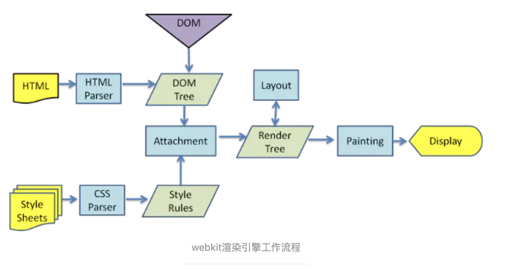

# Vue高级2

## 今日内容

1. 学习Proxy模式
2. 学习虚拟dom
3. 结合Proxy和虚拟dom实现仿真Vue
4. Vue3.0的学习


## 1.学习Proxy模式

### 1.1什么是Proxy模式

代理模式的定义：为其他对象提供一种[代理](https://baike.baidu.com/item/代理)以控制对这个对象的访问。在某些情况下，一个对象不适合或者不能直接引用另一个对象，而代理对象可以在客户端和目标对象之间起到中介的作用。

著名的代理模式例子为[引用计数](https://baike.baidu.com/item/引用计数)（英语：reference counting）指针对象。

当一个复杂对象的多份副本须存在时，代理模式可以结合[享元模式](https://baike.baidu.com/item/享元模式)以减少存储器用量。典型作法是创建一个复杂对象及多个代理者，每个代理者会引用到原本的复杂对象。而作用在代理者的运算会转送到原本对象。一旦所有的代理者都不存在时，复杂对象会被移除。 [1]

### 1.2js中的代理Proxy对象

代理模式最简单的理解就是watch函数，我们在vue中经常使用watch函数来监听变量，也就是我们通过代理模式，可以将一些取值赋值的操作用函数进行监听，只要有对应的操作就能触发我们的代理函数，这样实现我们对代码进行更加灵活的处理。

最直观的就是上一节课中我们学习到的Object.defineProperty函数。我们通过这个函数可以监听对象的取值和赋值来实现对页面的变更。也就是vue的基本原理。

但是我们在学习的过程中也发现了，使用Object.defineProperty我们必须注意的就是只能监听指定对象的指定属性或者指定数组的指定元素，我们没法监听到后创建的对象的属性比如我们创建了一个object = {name:"小明"}

那么我们只能对name进行监听，因为object如果动态添加的其他属性在添加之前我们是不知道的，所以我们就无法对其进行提前监听，这样就变成了vue提出的规则，data中的数据一旦观察过之后新创建的属性就不具备监听效果了。

所以vue3.0在创建的时候对底层进行了重构，放弃了Object.defineProperty模式的数据监听用了js的Proxy对象来实现数据的响应式监听。这个对象是h5之后浏览器新增的对象所以兼容性相对Object.defineProperty一定覆盖范围不如Object.defineProperty的。但是他的性能和体验就非常好，并且随着浏览器行业的发展他的兼容性也会越来越好，这样我们就需要学习这个新的Proxy对象

现在打开案例中的[index.html]()

我们体验一下Proxy的js对象到底是怎么使用的。

然后回来看总结

> 总结：
>
> Proxy对象在使用上与Object.defineProperty有相同之处与不同之处，首先他们都存在set和get监听函数，并且都可以在set和get中对值的操作做拦截处理。接下来就是不同之处。
>
> Proxy是通过new Proxy创建了一个代理对象，我们之后的操作需要直接操作这个代理对象才能触发监听而Object.defineProperty是建立在对obj原始对象的操作触发监听。
>
> Proxy中可以识别obj中未定义的属性的监听而Object.defineProperty是无法监听后创建属性的。

了解了Proxy对象之后我们在通过和Object.defineProperty相同的方式来模拟一下页面输入的双向绑定

打开[demo.html]()

学习完demo中的代码之后我们总结一下这个案例中我们学习到的一些内容。

>  总结：
>
> 使用了Proxy之后的双向绑定就不需要管过去的数据对象中是否有这个属性了，也就是我们可以随意动态的更新表单数据不用担心视图不会触发更新。这个就是将Object.defineProperty换成了Proxy之后我们得到的一些优势。牺牲的就是对低端浏览器的兼容性。

所以Vue3.x版本就使用了Proxy对象替代了Object.defineProperty来对数据响应进行监听，实现了更加灵活的数据绑定。

了解了这个对象的基本用法之后我们在学习什么叫做虚拟dom

## 2.学习虚拟dom

### 2.1、真实DOM和其解析流程？ 

  浏览器渲染引擎工作流程都差不多，大致分为5步，**创建DOM树——创建StyleRules——创建Render树——布局Layout——绘制Painting**

  第一步，用HTML分析器，分析HTML元素，**构建一颗DOM树**(标记化和树构建)。

  第二步，用CSS分析器，分析CSS文件和元素上的inline样式，生成页面的样式表。

  第三步，将DOM树和样式表，关联起来，构建一颗Render树(这一过程又称为Attachment)。每个DOM节点都有**attach方法，接受样式信息**，返回一个render对象(又名renderer)。这些render对象最终会被构建成一颗Render树。

  第四步，有了Render树，浏览器开始布局，为每个Render树上的节点确定一个在显示屏上出现的精确坐标。

  第五步，Render树和节点显示坐标都有了，就调用每个节点**paint方法，把它们绘制**出来。 

  **DOM树的构建是文档加载完成开始的？**构建DOM数是一个渐进过程，为达到更好用户体验，渲染引擎会尽快将内容显示在屏幕上。**它不必**等到整个HTML文档解析完毕之后才开始构建render数和布局。

  **Render树是DOM树和CSSOM树构建完毕才开始构建的吗？**这三个过程在实际进行的时候又不是完全独立，而是会有交叉。会造成一边加载，一遍解析，一遍渲染的工作现象。

  **CSS的解析是从右往左逆向解析的**(从DOM树的下－上解析比上－下解析效率高)，**嵌套标签越多，解析越慢。**



### 2.2、JS操作真实DOM的代价！

​    用我们传统的开发模式，原生JS或JQ操作DOM时，浏览器会从构建DOM树开始从头到尾执行一遍流程。在一次操作中，我需要更新10个DOM节点，浏览器收到第一个DOM请求后并不知道还有9次更新操作，因此会马上执行流程，最终执行10次。例如，第一次计算完，紧接着下一个DOM更新请求，这个节点的坐标值就变了，前一次计算为无用功。计算DOM节点坐标值等都是白白浪费的性能。即使计算机硬件一直在迭代更新，操作DOM的代价仍旧是昂贵的，频繁操作还是会出现页面卡顿，影响用户体验。

### 2.3、为什么需要虚拟DOM，它有什么好处?

​    Web界面由DOM树(树的意思是数据结构)来构建，当其中一部分发生变化时，其实就是对应某个DOM节点发生了变化，

​    虚拟DOM就是为了**解决浏览器性能问题**而被设计出来的。**如前**，若一次操作中有10次更新DOM的动作，虚拟DOM不会立即操作DOM，而是将这10次更新的diff内容保存到本地一个JS对象中，最终将这个JS对象一次性attch到DOM树上，再进行后续操作，避免大量无谓的计算量。**所以，**用JS对象模拟DOM节点的好处是，页面的更新可以先全部反映在JS对象(虚拟DOM)上，操作内存中的JS对象的速度显然要更快，等更新完成后，再将最终的JS对象映射成真实的DOM，交由浏览器去绘制。

### 2.4虚拟dom的学习

我们今天使用virtual-dom库来学习虚拟dom的整体工作流程和使用方式。所以我们首先打开项目中的v-dom项目，安装依赖。

然后运行

```sh
npm run serve
```

并且访问[http://localhost:8080/]()

他对应的页面为index.html以及index.js

在看代码之前首先我们要介绍一下virtual-dom的四大核心api

```js
//创建虚拟dom的对象与vue/react中render中的h函数相同
//var vdom对象 = h({})
var h = require('virtual-dom/h');
//创建视图对象，用来将vdom对象转换成dom对象 var dom对象 = createElement(vdom对象)
var createElement = require('virtual-dom/create-element');
//进行diff算法的对象，用来将改变之后的对象和改变前对象做对比的一个函数，他会返回一个结果用来给patch使用，var diff结果 = diff(旧的vdom对象,新的vdom对象)
var diff = require('virtual-dom/diff');
//patch用来更新页面视图patch(dom对象,diff结果)执行之后页面就会变更
var patch = require('virtual-dom/patch');


```

下面我们启动这个项目并且访问index.html来查看第一个案例理解一下虚拟dom和真实dom是怎么工作起来的

阅读代码和注释，并且操作页面。之后回来看总结

> 总结：
>
> 通过这个简单的例子，我们知道了虚拟dom想要将数据更新到页面上需要经历一个什么样的流程。
>
> 1. 首先通过h函数创建虚拟dom树结构
> 2. 通过createElement将虚拟dom树渲染到网页上
> 3. 如果有变更需要使用diff算法对新的虚拟dom和旧的虚拟dom进行对比并返回对比结果
> 4. 将对比结果通过patch函数更新到页面上

所以当我们使用vue和react这种mvvm框架之后页面渲染的流程就变成了如上的形式。

那么关于diff算法我们再做一个简单的介绍

### 2.5diff算法的介绍

diff算法是一种树型结构的同级比较算法，他遵循同层节点只跟同层节点对比，这样可以将对比次数与复杂度大幅度的缩减，提升对比速度和效率，具体实现流程如图所示


接下来我们查看一下vue的diff算法详细流程图


我们根据图的描述大概掌握了算法的计算过程。那么虚拟dom的核心已经被我们攻破了。

然后我们可以回想一下再列表渲染的时候vue会推荐我们设置唯一的key，这里主要就是因为diff算法会优先根据key做比较，这样如果key相同他就会继续执行patchVnode来对当前的元素进行深层的对比和替换，如果key不同的话他就不会进入深层对比，直接替换当前节点，这样效率会提升很多。

这里讲解一个小插曲我们再vue中书写代码的时候不光再for中使用key，其实在v-if中也应该使用key。

我们平时没有在v-if中使用key是因为我们开发的项目中的组件和标签的不同点比较多，判断的时候涉及到比较组件时区分的比较容易，所以不写key也可以。但是vue仍然推荐我们在v-if中使用key。

这里我们通过一个案例来演示一下不使用key的if在特殊情况下的bug。

打开案例文件夹中的[key.html]()查看内部的代码。

之后回来看总结

> 总结：
>
> key的主要作用就是用来帮助diff算法比较时进行条件筛选，引起input的bug的原因是因为我们不设置key的时候两个input标签完全一样他们并没有任何不同的属性这样的话vue就没法通过元素本身的区别来找到元素的不同，这个时候如果不设置key就会出现如果我们在第一个input中输入数据之后切换flag，输入的数据不消失的问题。这就是由于没有不同之处导致元素没有被更新，后面设置了key的input就能实现切换之后输入内容消失。所以要记住key的用途


## 3.通过虚拟dom系统+Proxy系统实现Vue

综合以上的知识点我们学习到了Vue3以及Vue2的核心原理。也就是掌握了以上内容之后我们便可以根据上面的内容简单的模拟一下Vue框架。

下面我们回到v-dom这个项目访问

[http://localhost:8080/demo]()

简单的 查看内部的代码和注释，体验一下网页内的案例，可以做一些简单的改动。

本次的示例只实现了v-model功能，并未实现点击事件等绑定功能。

阅读完代码之后我们总结一下。

> 总结：
>
> 通过Proxy做的代理可以直接监听本来没有在data上绑定的aaa的值，默认的时候aaa的不仅没有值也没有在data上，当我们对input的v-model="aaa"的地方设置值的时候我们可以发现这里的{{aaa}}就自动有值了。
>
> 也就说如果Vue用了Proxy那么它将变成特别灵活的一个框架。

## 4.Vue3.0的学习

### 4.1创建项目（不需要操作）

```sh
vue create 项目名
```

直接做如下选择

```sh
Vue CLI v4.5.8
? Please pick a preset: 
  p ([Vue 2] dart-sass, babel, router, eslint) 
  Default ([Vue 2] babel, eslint) 
❯ Default (Vue 3 Preview) ([Vue 3] babel, eslint) 
  Manually select features 
```

选择第二个直接创建一个Vue3的项目

成功之后我们运行

```sh
cd 项目名
npm run serve
```

启动项目

### 4.2Vue3与Vue2的对比

学会创建项目之后打开案例中的vue3项目安装依赖并运行。

首先我们打开App.vue读一下代码，发现这里使用了component动态组件来描绘的页面跳转

这里我们先查看传统写法。

由传统写法得知Vue3的编写方式与Vue2正常无二，就是说Vue3可以完全延续Vue2的方式进行开发。

下面我们打开`vue3体验`来学习一下Vue3的新写法

查看内部的代码学习setup混合api的写法。

这里需要注意的是新的Vue语法只有在Vue3中可以使用，Vue2中是无法直接使用的。

新语法的完整api暂时存储在

https://www.vue3js.cn/docs/zh/api/reactivity-api.html

详细内容可以在网站中进行学习，我们只需了解Vue3的基本新特性即可。

以上就是今天学习的全部内容