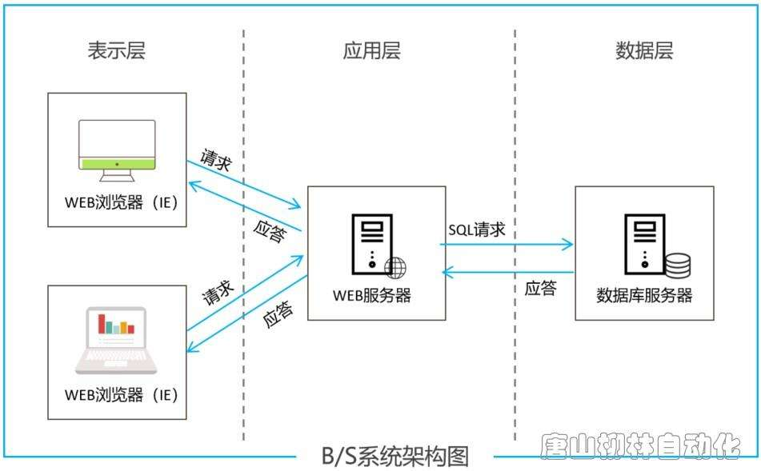
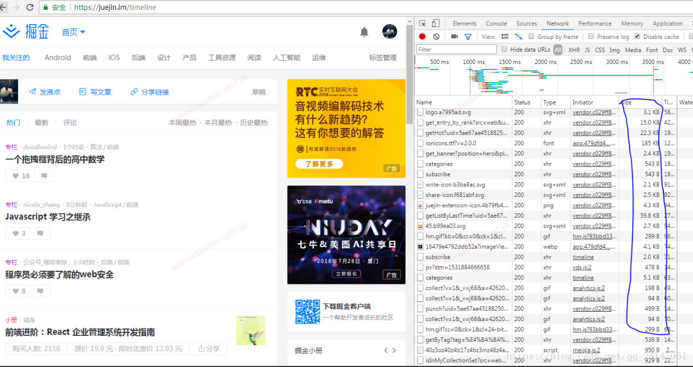
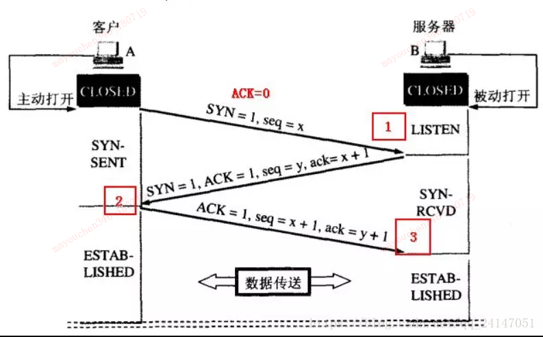

# WEB前端高级知识01

## 今日内容

1. BS架构
2. http原理
4. 节流和防抖
6. 箭头函数和普通函数

## 1.BS/CS架构

### 1.1简介

传统应用开发架构分为BS和CS两种架构。

#### 1.1.1CS架构：

服务器-客户机，即Client-Server([C/S](https://baike.baidu.com/item/C%2FS))结构。C/S结构通常采取两层结构。服务器负责数据的管理，客户机负责完成与用户的交互任务。

客户机通过局域网与服务器相连，接受用户的请求，并通过网络向服务器提出请求，对数据库进行操作。服务器接受客户机的请求，将数据提交给客户机，客户机将数据进行计算并将结果呈现给用户。服务器还要提供完善安全保护及对数据完整性的处理等操作，并允许多个客户机同时访问服务器，这就对服务器的硬件处理数据能力提出了很高的要求。

在C/S结构中，应用程序分为两部分:服务器部分和客户机部分。服务器部分是多个用户共享的信息与功能，执行后台服务，如控制共享数据库的操作等;客户机部分为用户所专有，负责执行前台功能，在出错提示、在线帮助等方面都有强大的功能，并且可以在子程序间自由切换。

C/S结构在技术上已经很成熟，它的主要特点是交互性强、具有安全的存取模式、响应速度快、利于处理大量数据。但是C/S结构缺少通用性，系统维护、升级需要重新设计和开发，增加了维护和管理的难度，进一步的数据拓展困难较多，所以C/S结构只限于小型的局域网 [1] 。

cs架构主要应用于超市收银台，早期的医院挂号系统等，以及pc电脑的桌面程序，现今主流应用于移动手机app中。

#### 1.1.2BS架构

随着网络技术的发展，特别随着Web技术的不断成熟，B/S 这种软件体系结构出现了。B/S（Browser/Server）架构也被称为浏览器/服务器体系结构，这种体系结构可以理解为是对 C/S 体系结构的改变和促进。由于网络的快速发展，B/S 结构的功能越来越强大。这种结构可以进行信息分布式处理，可以有效降低资源成本，提高设计的系统性能。B/S 架构是有更广的应用范围，在处理模式上大大简化了客户端，用户只需安装[浏览器](https://baike.baidu.com/item/浏览器/213911)即可，而将应用逻辑集中在服务器和中间件上，可以提高数据处理性能。在[软件](https://baike.baidu.com/item/软件/12053)的通用性上，B/S 架构的客户端具有更好的通用性，对应用环境的依赖性较小，同时因为客户端使用浏览器，在开发维护上更加便利，可以减少系统开发和维护的成本。面向未来，连排级单位可通过掌上电脑（[安卓系统](https://baike.baidu.com/item/安卓系统/10495226)），在训练场、演习场等环境下访问并使用该系统。

B/S 的特征和基本结构：在 B/S 结构中，每个节点都分布在网络上，这些网络节点可以分为浏览器端、服务器端和中间件，通过它们之间的链接和交互来完成系统的功能任务。三个层次的划分是从逻辑上分的，在实际应用中多根据实际物理网络进行不同的物理划分。

浏览器端：即用户使用的浏览器，是用户操作系统的接口，用户通过浏览器界面向服务器端提出请求，并对服务器端返回的结果进行处理并展示，通过界面可以将系统的逻辑功能更好的表现出来。

服务器端：提供数据服务，操作数据，然后把结果返回中间层，结果显示在系统界面上。

中间件：这是运行在浏览器和服务器之间的。这层主要完成系统逻辑，实现具体的功能，接受用户的请求并把这些请求传送给服务器，然后将服务器的结果返回给用户，浏览器端和服务器端需要交互的信息是通过中间件完成的。

> 总结：
>
> 也就是说我们web前端工作岗位的程序员目前大部分的工作都是在bs架构上进行开发的。cs架构相当于做手机app或者pc-app的工程师做的工作

### 1.2图解BS/CS架构



我们结合上面的图片来分析一下bs/cs架构的交互方式。其实我们平时无论是使用bs架构也好cs架构也好，最终的区别其实在于表示层的区别，bs架构的表示层以浏览器为主，cs架构的表示层以客户端为主。他们都是通过http协议像服务器请求数据与远程服务器做交互。

## 2.http原理

在学习了bs架构之后我们思考一个问题。

当我们在浏览器上敲击https://www.baidu.com然后敲击回车之后，一直到我们看到百度网页这个过程到底是经历了几步。发生了怎样的交互动作。

这个过程的描述也是面试时常见的问题之一。

### 步骤

`→` **1- 输入网址**
`→` **2- 缓存解析**
`→` **3- 域名解析**
`→` **4- tcp连接，三次握手**
`→` **6- 页面渲染**

**一：输入网址**

那肯定是输入你要访问的网站网址了，俗称url；

**二：缓存解析**

浏览器获取了这个url，当然就去解析了，它先去缓存当中看看有没有，从 **浏览器缓存-系统缓存-路由器缓存** 当中查看，如果有从缓存当中显示页面，然后没有那就进行步骤三；
缓存就是把你之前访问的web资源，比如一些js，css，图片什么的保存在你本机的内存或者磁盘当中。

（1） 在chrome浏览器中输入网址： chrome://chrome-urls/ chrome-urls是一个看到所有的Chrome支持的伪URL，找到其中的chrome://appcache-internals/ 可以看见chrome的本地缓存地址：Instances in: C:\Users\User\AppData\Local\Google\Chrome\User Data\Default (0)

（2）在chrome中访问www.baidu.com/，打开开发者模式，不勾选 Disable cache


圈出来的部分显示了资源的来源： from disk cache ： 将资源缓存到磁盘中，等待下次访问时不需要重新下载资源，而直接从磁盘中获取；
from memory cache ：将资源缓存到内存中，等待下次访问时不需要重新下载资源，而直接从内存中获取；
可以看见资源的来源是缓存当中，从缓存当中获取了这些就可以直接显示在页面中，不需要发送http请求；

**三： 域名解析**

和步骤二一样，做一个访问新页面的操作juejin.im/timeline，同样打开开发者模式，，不勾选 Disable cache



可以发现它的来源再也不是： from disk cache 或者from memory cache ，即发送http请求。
那么在发送http请求前，浏览器做了什么？

在发送http之前，需要进行DNS解析即域名解析。
DNS解析:域名到IP地址的转换过程。域名的解析工作由DNS服务器完成。解析后可以获取域名相应的IP地址

**四：tcp连接，三次握手**

在域名解析之后，浏览器向服务器发起了http请求，tcp连接，三次握手建立tcp连接。TCP协议是面向连接的，所以在传输数据前必须建立连接



（1）客户端向服务器发送连接请求报文；
（2）服务器端接受客户端发送的连接请求后后回复ACK报文，并为这次连接分配资源。
（3）客户端接收到ACK报文后也向服务器端发生ACK报文，并分配资源。

> 结合生活的理解：
>
> 你去亲戚家串门，
>
> 进门之前先问：有人吗（第一次握手）（你想要建立连接）
>
> 屋里人听到了你的问候回答：有人（第二次握手）（知道有人要连接我）
>
> 你听到了屋里人的回应：那我进去了（第三次）（屋里人准备开门，外面人准备进入）
>
> 之后进门的过程就是真正http访问时数据传输的过程，之前的三次是双方确认是否可以连接

这样TCP连接就建立了。
在此之后，浏览器开始向服务器发送http请求，请求数据包。请求信息包含一个头部（head）和一个请求体（body）。

**五：服务器收到请求**

服务器收到浏览器发送的请求信息，返回一个响应头和一个响应体。

**六：页面渲染**

浏览器收到服务器发送的响应头和响应体，进行客户端渲染，生成Dom树、解析css样式、js交互。

了解了以上内容之后我们知道了一个网页从输入域名到展示内容的过程到底发生了多少事情。并且浏览器是如何与服务器做到交互的。

接下来我们来学习一下http的原理。

### 2.1 HTTP 基本知识

#### 2.1.1 HTTP是什么？

HTTP是超文本传输协议，也就是HyperText Transfer Protocol。HTTP的名字「超文本传输协议」，它可以拆成三个部分：

1. 超文本
2. 传输
3. 协议

#### 2.1.2 HTTP 常见的状态码有哪些？

五大类HTTP状态码

| 大类 | 具体含义                                               | 常见的状态码  |
| ---- | ------------------------------------------------------ | ------------- |
| 1××  | 提示信息，表示目前协议处理的中间状态，还需要后续的操作 |               |
| 2××  | 成功，报文已经收到并被正确处理                         | 200、204、206 |
| 3××  | 重定向，资源位置发生变动，需要客户端重新发送请求；     | 301、302、304 |
| 4××  | 客户端错误，请求报文有误，服务器无法处理               | 400、403、404 |
| 5××  | 服务器错误，服务器在处理请求时内部发生了错误           |               |

**1××**

1××类状态码属于提示信息，是协议处理中的一种中间状态，实际用到的比较少。

**2××**

2××类状态码表示服务器成功处理了客户端的请求，也就是我们最愿意看到的状态。

「200 OK」是最常见的成功状态码，表示一切正常。如果是非HEAD请求，服务器返回的响应头都会有body数据。

「204 No Content」也是常见的成功状态码，与200OK基本相同，但是响应头没有body数据。

「206 Partial Content」是应用于HTTP分块下载或断电续传，表示响应返回的body数据并不是资源的全部，而是其中的一部分，也是服务器处理成功的状态。

**3××**

3××类状态状态码表示客户端请求的资源发生了变动，需要客户端用新的URL重新发送请求获取资源，也就是重定向。

「301 Moved Permanently」表示永久重定向，说明请求的资源已经不存在了，需改用新的URL再次访问。

「302 Moved Temporarily」表示临时重定向，说明请求的资源还在，但暂时需要用另一个URL来访问。

301和302都会在响应头里面使用字段Location，指明后续需要跳转的URL,浏览器会自动重定向新的URL.

「304 Not Modified」不具有跳转的含义，表示资源未修改，重定向已存在的缓冲文件，也称缓存重定向，用于缓存控制。

**4××**

4××类状态码表示客户端发送的报文有误，服务器无法处理。

「400 Bad Request」表示客户端请求的报文有错误，但只是个笼统的错误。

「403 Forbidden」表示服务器禁止访问资源，并不是客户端的请求错误。

「404 Not Found」表示请求的资源在服务器器上不存在或未找到，所以无法提供给客户端。

**5××**

5××类状态码表示客户端请求报文正确，但是服务器处理时内部发生了错误，属于服务器端的错误码。

「500 Internal Server Error」与400类型，是个笼统通用的错误码，服务器发生了什么错误，我们并不知道。

「501 Not Implemented」表示客户端请求的功能还不支持，类似“即将开业，敬请期待”的意思。

「502 Bad Gateway」通常是服务器作为网关或代理时返回的错误码，表示服务器自身工作正常，访问后端服务器发生了错误。

「503 Service Unavailabe」表示服务器当前很忙，暂时无法响应服务器，类似“网络服务很忙，请稍后重试”的意思。

#### 2.1.3 HTTP常见字段有哪些？

- Host

客户端发送请求时，用来指定服务器的域名。

比如：Host:A.com

- Content-Length

服务器在返回数据时，会有Content-Length字段，表明本次回应的数据长度。

比如：Content-Length: 1000

表示本次服务器返回的数据长度是1000个字段。

- Connection

Connection字段最常用语客户端要求服务器使用TCP持久化连接，以便其他请求复用。

HTTP/1.1 版本的默认连接都是持久连接，但为了兼容老版本的HTTP，需要指定Connection首部字段的值为Keep-Alive.

比如：Connection:keep-alive

一个可以复用的TCP连接就建立了，直到客户端或服务器主动关闭连接。

- Content-Type

Content-Type字段主要用于服务器回应时，告诉客户端，本次数据是什么格式。

比如：Content-Type：text/html;charset=utf-8

上面的类型表明，发送的是网页，而且编码是UTF-8。客户端请求的时候，可以使用Accept字段声明自己可以接受哪些数据格式。

Accept: */*

上面代码中，客户端声明自己可以接受任何格式的数据。

- Content-Encoding 字段

Content-Encoding字段说明数据的压缩方法。表示服务器返回的数据使用什么压缩格式。

比如：Content-Encoding：gzip

上面表示服务器返回的数据采用gzip方式压缩，告知客户端需要用此方式解压。

客户端在请求时，用Accept-Encoding字段说明自己可以接受哪些压缩方法。

Accept-Encoding：gzip，deflate

### 2.2. GET和POST

#### 2.2.1 含义

**GET**方法的含义是请求从服务器获取资源，这个资源可以是静态的文本、页面、图片视频等。

**POST**方法则是相反操作，它向URI指定的资源提交数据，数据就放在报文的body里。

#### 2.2.2 GET 和POST方法是安全和幂等的吗？

安全和幂等的概念：

- 在HTTP协议中，所谓的「安全」是指请求方法不会「破坏」服务器上的资源。
- 所谓的「幂等」，意思是多次执行相同的操作，结果都是「相同」的。

GET 方法是安全且幂等的

POST方法是不安全的也不是幂等的

### 2.3.HTTP特性

`1996/5` HTTP/1.0

`1997/1` HTTP/1.1

1.1 版本最大变化，就是引入了持久连接（persistent conncetion），即TCP连接默认不关闭，可以被多个请求复用，不用声明`Connection: keep-alive`

客户端和服务器发现对方一段时间没有活动，就可以主动关闭连接。不过，规范的做法是，客户端在最后一个请求时，发送`Connection: close`,明确要求服务器关闭连接。

```
Connection: close
1
```

目前，对于同一个域名，大多数浏览器允许同时建立6个持久连接。

举例：

```
GET / HTTP/1.0

User-Agent: Mozilla/5.0 (Machintosh; Intel Mac OS X 10_10_5)

Accept: */*
12345
```

说明：第一行是请求命令，必须是在尾部添加协议版本（HTTPP/1.0）。后面是多行头信息，描述客户端的情况。

服务器的响应格式：

```
HTTP/1.O 200 OK
Content-Type: text/plain
Content-Length: 13784
Expires: Thu, 05 DEC 1997 15:55:28 GMT
Server: Apache 0.8.4

<html>
 <body>Hello Word</body>
</html>
123456789
```

说明：第一行是“协议版本 + 状态码（status code） + 状态描述”

HTTP 是「无状态、明文传输」

- **对于无状态的问题**，解决方案有很多种，其中比较简单的方式是用Cookie技术。Cookie通过再请求和响应报文中写入Cookie信息来控制客户端的状态。相当于，在客户端第一次请求后，服务器会下发一个装有客户信息的「小贴纸」，后续客户请求服务器的时候，带上「小贴纸」，服务器就知道了。
- **HTTP的安全问题**，可以用HTTPS的方式解决，也就是通过引入SSL/TLS层。

早期HTTP/1.0 性能上的一个很大问题，那就是每发起一个请求，都要建立一次TCP连接（三次握手），而且是串行请求，做了无畏的TCP连接建立和断开，增加了通信开销。

为了解决上述TCP连接问题，HTTP/1.1提出了长连接的通信方式，也叫持久连接。这种方式的好处在于减少了TCP连接的重复建立和断开造成的额外开销，减轻了服务器的负载。

持久连接的特点是，只要任意一端没有明确剔除断开连接，则保持TCP连接状态。

HTTP/1.1 版本引入了管道机制（pipelining）,即在同一个TCP连接里面，客户端可以同时发送多个请求。这样就进一步改进了HTTP协议的效率。

举例来说，客户端需要请求两个资源。以前的做法是，在同一个TCP连接里面，发送A请求，然后等待服务器做出回应，收到后再发出B请求。管道机制是允许浏览器同时发出A请求和B请求，但是服务器还是按照顺序，先回应A请求，完成后再回应B请求。问题，要是前面的回应特别慢，后面就会有许多请求排队等着。这称为「队头阻塞」。(注意：现代浏览器默认是不开启 HTTP Pipelining )

「队头阻塞」的模式加剧了HTTP的性能问题。总之HTTP/1.1 的性能一般般，后续的HTTP/2 和HTTP/3 就是在优化HTTP的性能。

```
容易混淆的概念
```

TCP的keep alive和HTTP的Keep-alive是不同层次的概念：

- TCP的keep alive是检查当前TCP连接是否活着；
- HTTP的Keep-alive是要让一个TCP连接活久一点

TCP keep alive的表现：

当一个连接“一段时间”没有通讯数据时，一方会发出一个心跳包（Keep Alive包），如果对方有回应，则表明当前连接有效，继续监控。这个“一段时间”可以设置，具体做法google。如下：

### 2.4HTTP与HTTPS

1. HTTP 是超文本传输协议，信息是明文传输，存在安全风险的问题。HTTPS则解决HTTP不安全的缺陷，在TCP和HTTP网络层之间加入了SSL/TLS安全协议，使得报文能够加密传输。
2. HTTP连接建立相对简单，TCP三次握手之后便可进行HTTP的报文传输。HTTPS在TCP三次握手之后，还需要进行SSL/TLS的握手过程，才可以加密报文传输。
3. HTTP的端口号是80，HTTPS的端口号是443.
4. HTTPS协议需要向CA(证书权威机构)申请数字证书，来保证服务器的身份是可信的。

HTTPS建立一个连接，要花费6次交互，先是建立三次握手，然后是TLS/1.3 的三次握手。QUIC直接把以往的TCP和TLS/1.3 的6次交互合并成3次，减少了交互次数。QUIC是在UDP之上的伪TCP+TLS+HTTP/2的多路复用协议。

### 2.5HTTP/1.0、HTTP/1.1、HTTP/2、HTTP/3演变

HTTP/1.1相比HTTP/1.0性能上的改进：

1. 使用TCP长连接的方式改善了HTTP/1.0短连接造成性能开销
2. 支持管道（pipeline）网络传输，只要第一个请求发出去了，不必等其回来，就可以发第二个请求出去，可以减少整体的响应时间

HTTP/1.1 自身的性能瓶颈：

1. 请求/响应头部（Header）未经压缩就发送，首部信息越多延迟越大。只能压缩Body的部分
2. 发送冗长的首部。每次互相发送相同的首部造成的浪费较多
3. 服务器是按请求的顺序响应的，如果服务器响应慢，会招致客户端一直请求不到数据，也就是队头阻塞
4. 没有请求优先级控制
5. 请求只能从客户端开始，服务器只能被动响应

HTTP/2协议是基于HTTPS的，所以HTTP/2的安全性是有保障的。

HTTP/2相比HTTP/1.1性能上的改进：

1. HTTP/2会压缩头（Header），如果你同时发送多个请求，他们的头是一样的或者是相似的，那么协议会帮你消除重复的部分。

2. HTTP/2不再像HTTP/1.1里的纯文本的报文，而是全面采用了二进制格式。头信息和数据体都是二进制，并且统称为帧（frame）：头信息帧和数据帧。

3. HTTP/2的数据包不是按顺序发送的，同一个连接里面连续的数据包，可能属于不同的回应。客户端还可以指定数据流的优先级。

4. HTTP/2的连接可以并发多个请求（多路复用），而不用按照顺序一一对应。移除了HTTP/1.1中的串行请求，不需要排队等待，不会再出现「队头阻塞」问题。

   比如：在一个TCP连接里，服务器收到了客户端A和B的两个请求，如果发现A处理过程非常耗时，于是就回应A请求已经处理好的部分，接着回应B请求，完成后，再回应A请求剩下的部分。

5. 服务器推送，HTTP/2在一定程度上改善了传统的「请求-应答」工作模式，服务不再是被动地响应，也可以主动向客户端发送消息。

   比如：在浏览器刚请求HTML的时候，就提前把可能用到的JS、CSS文件等静态资源主动发给客户端，减少延时的等待，也就是服务器推送（Server Push，也叫Cache Push）

HTTP/2有哪些缺陷？HTTP/3做了哪些优化？

1. HTTP/2主要的问题在于：多个HTTP请求在复用一个TCP连接，下层的TCP协议是不知道有多少个HTTP请求。所以一旦发生了丢包现象，就会触发TCP的重传机制，这样在一个TCP连接中的所有的HTTP请求都必须等待这个丢了包被重传回来。（区别：HTTP/1.1 的管道传输中，如果有一个请求阻塞，那么队列请求也统统被阻塞住了）
2. HTTP/3 把HTTP下层的TCP协议改成了UDP

### 2.6总结

我们花了大量的时间来研究原理的东西主要是为了更加的熟悉http协议的内容以及他相关的知识点。这里着重要学会http建立连接以及断开链接的步骤。

我们在介绍中详细的描述了http请求的三次握手，和https请求在三次握手基础上又增加了握手的次数。

关于更详细的握手介绍大家可以在百度上搜索更详细的介绍，因为涉及到连接握手和关闭连接握手涉及到的内容比较复杂，做成笔记文章会太长，所以关于http和https的连接和断开的详细描述我们可以结合百度上大家整理的文档进行理论学习。

## 3.节流和防抖

在前端开发的过程中，我们经常会需要绑定一些持续触发的事件，如 resize、scroll、mousemove 等等，但有些时候我们并不希望在事件持续触发的过程中那么频繁地去执行函数。

通常这种情况下我们怎么去解决的呢？一般来讲，防抖和节流是比较好的解决方案。

让我们先来看看在事件持续触发的过程中频繁执行函数是怎样的一种情况。


html 文件中代码如下,可以直接参考[demo.html]()

```xml
<div id="content" style="height:150px;line-height:150px;text-align:center; color: #fff;background-color:#ccc;font-size:80px;"></div>
<script>
    let num = 1;
    let content = document.getElementById('content');

    function count() {
  		console.log(num)
      content.innerHTML = num++;
    };
    content.onmousemove = count;
</script>
```

我们测试一下结果发现这个mousemove的函数执行频率特别高。所以如果我们在这里编写逻辑的话会让js代码大量的重复执行牺牲浏览器的运行效率，所以我们需要使用某种手段让他的执行频率下降。针对不同的场景衍生出了`节流`和`防抖`两种方案，下面我们看一下节流和防抖的介绍

### 3.1介绍

防抖（debounce）：**所谓防抖，就是指触发事件后在 n 秒内函数只能执行一次，如果在 n 秒内又触发了事件，则会重新计算函数执行时间。**

节流（throttle）：**所谓节流，就是指连续触发事件但是在 n 秒中只执行一次函数。**节流会稀释函数的执行频率。

### 3.2防抖

防抖的用途主要体现的就是输入，或者滚动场景。我们首先拿输入场景举个例子。

打开案例中的[demo1.html]()

读完demo1.html的案例之后我们打开

[demo2.html]()阅读代码并且查看注释

> 总结：
>
> 防抖主要用于性能优化上，在频繁触发的函数中让最后一次触发的函数能正常执行，中间触发的函数都被过滤掉这样在对应的场景，如百度搜索时触发的自动匹配关键字列表这个效果，通过防抖就能让函数只在有效的时候执行这样大大节省了运行的性能开销

下面做一个练习。

在[demo3.html]()中将最初的demo.html中的效果改成只有鼠标停止300毫秒之后才会变更页面展示的数字

### 3.3节流

节流主要应用于降低mousemove以及scroll等事件的执行频率。比如我们在使用鼠标移动事件以及屏幕滚动事件时经常会在事件中处理很多的功能和业务逻辑这样的话如果不使用节流控制的话默认的mousemove以及scroll事件触发的频率是极高的这样容易降低浏览器的运行性能。所以需要使用节流函数来降低运行性能

```js
//节流函数示例
function throttle(callback,wait){
  var timeout = 0
  return function(){
    var context = this;
    var arg = arguments;
    let now = new Date().getTime()
    if(now-timeout >=wait){
      timeout = now
      callback.apply(context,arguments)
    }
  }
}
```

下面我们学习[demo4.html]()

来体验一下节流函数的作用

> 总结：
>
> 节流和防抖在前端开发中使用场景非常的多，尤其是在输入框以，页面滚动，鼠标移动等事件处理中特别常用，我们在过去的练习中并没有使用任何的节流和防抖处理是因为我们编写的都是小案例，当程序的复杂度上升到大规模项目的层级时这些看似不影响的小优化积累起来就能让你的程序运行速度产生质的飞跃。

## 4.箭头函数和普通函数的区别

1. 箭头函数是匿名函数，不能作为构造函数，不能使用new
2. 箭头函数不能绑定arguments，取而代之用rest参数...解决


```jsx
function A(a){
  console.log(arguments);
}
A(1,2,3,4,5,8);
// [1, 2, 3, 4, 5, 8, callee: ƒ, Symbol(Symbol.iterator): ƒ]
let C = (...c) => {
  console.log(c);
}
C(3,82,32,11323);
// [3, 82, 32, 11323]
```

1. 箭头函数没有原型属性


```jsx
var a = ()=>{
  return 1;
}

function b(){
  return 2;
}

console.log(a.prototype);  // undefined
console.log(b.prototype);   // {constructor: ƒ}
```

1. 箭头函数的this永远指向其上下文的this，没有办法改变其指向，
    普通函数的this指向调用它的对象
2. 箭头函数不绑定this，会捕获其所在的上下文的this值，作为自己的this值


```jsx
var obj = {
  a: 10,
  b: () => {
    console.log(this.a); // undefined
    console.log(this); // Window {postMessage: ƒ, blur: ƒ, focus: ƒ, close: ƒ, frames: Window, …}
  },
  c: function() {
    console.log(this.a); // 10
    console.log(this); // {a: 10, b: ƒ, c: ƒ}
  }
}
obj.b(); 
obj.c();
```

