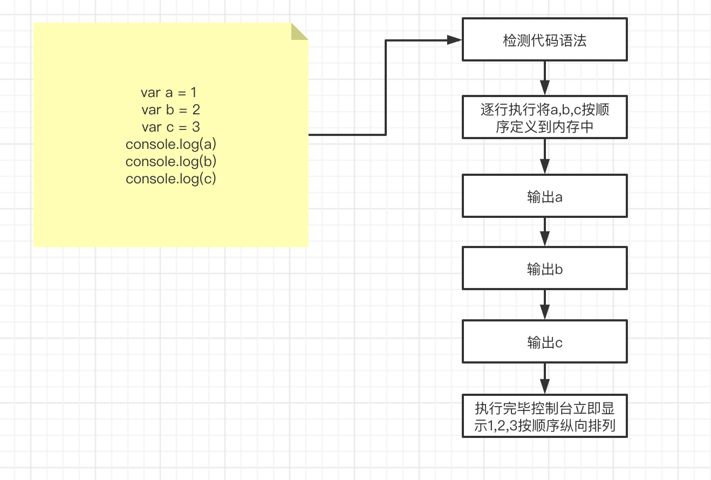
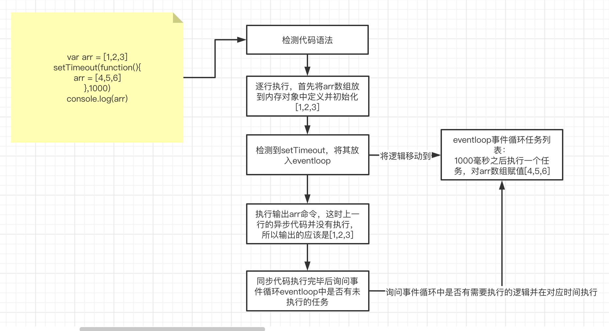
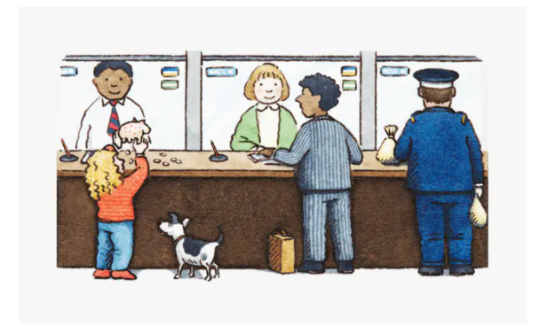

# WEB前端高级知识02

## 今日内容

1. 同步异步简介
2. 宏任务与微任务以及事件循环模型

# 1.同步异步简介

在前端领域有这么两个词汇是很常见又很容易困扰我们的存在。就是**同步（阻塞）**和**异步（非阻塞）**

## 1.1同步（阻塞）：

同步就是代码会严格按照上下左右顺序执行，也就是说同步代码里不存在同时触发的内容,后编写的代码永远都不会在先编写的代码前执行。并且如果是函数的话，两个函数调用一定是第一个函数先执行完毕才会开始执行第二个函数。比如for循环中虽然我们在控制台查看内容是瞬间打印的但是一定会按照顺序输出。这就是同步的意思。**阻塞**这个词也是一个道理。也就是说同步的代码如果中途有运行出错的地方，代码在这里就会中断不会向下进行，除非进行了异常捕获并处理异常，才能正常向下执行

举例

```js
var a = 0;
console.log(a) //这里会输出0
console.log(b) //这里不会输出1
var b = 1
```

```js 
function a(){
  console.log(1)
}
function b(){
  console.log(2)
}
b()
a()
//输出2 1
```

## 1.2异步（非阻塞）

异步和非阻塞是一种非同步的实现流程，异步代码将我们的代码运行分为两部分，第一部分是同步代码部分，会按照顺序执行，第二部分是异步代码事件循环队列。在执行同步代码的时候会按顺序正常执行。如果其中包含异步代码部分，会将异步代码部分加载到事件循环队列中暂时不执行。等待同步代码全部执行完毕之后，检测事件循环队列中是否有本次需要执行的代码，如果有就执行。以这样的形式保证在同步逻辑中不需要等待异步形式的代码。

示例

```js
var arr = [1,2,3]
setTimeout(function(){
  arr = [4,5,6]
},2000)
console.log(arr)//这里会打出[1,2,3]
```

## 1.3同步异步的执行流程图

### 1.3.1同步的代码执行流程图



### 1.3.2异步代码的执行流程图



我们根据两个图可以明白同步异步的代码是在逐行解析时产生差异的。同步代码一定按顺序执行，异步代码是逐行执行同步代码的时候先放到eventLoop中保存，在同步代码全部执行之后，询问eventLoop中是否有未执行的任务，并在该执行他的时候进行执行。

也就是说**js是单线程异步模型**

## 1.4单线程模型

首先要了解单线程和多线程的区别。

### 1.4.1单线程同步案例

我们举个例子

```js
//单线程同步
function a(){
  for(let i = 0;i<100;i++){
    console.log('a',i)
  }
}
function b(){
  for(let i = 0;i<100;i++){
    console.log('b',i)
  }
}
a()
b()
//运行他的结果应该是先输出a0-a99
//然后输出的是b0-b99
```
上面是一个非常典型的同步案例，先执行一个循环再执行一个循环

```js
//单线程异步1
console.log(1)
setTimeout(function(){
  console.log(2)
},1000)
setTimeout(function(){
  console.log(3)
},1000)
console.log(4)
//执行会输出1，4，2，3
```

上面是异步的基础案例，会按照异步代码后输出的形式执行，就算setTimeout中的时间设置为0也是最后输出2，3这就是我们上面介绍的eventLoop原理

### 1.4.2 单线程异步案例

接下来我们看一下单线程异步的经典案例

```js
setTimeout(function(){
  for(let i = 0;i<100000;i++){
    console.log('a',i)
  }
},1000)
setTimeout(function(){
  for(let i = 0;i<100000;i++){
    console.log('b',i)
  }
},1000)
//执行该代码我们会发现当前两个setTimeout虽然都是1000毫秒之后执行，但是两个循环一定是先等待第一个a循环结束之后才会执行b循环，并且时间会远远超过1秒
```

上面就是单线程异步的典型模型。这个案例告诉我们js默认是单线程异步模型，虽然能实现异步代码，但是所有的异步代码都是在一个事件队列中，异步代码之间仍然遵循顺序执行，所以两个循环不管设置多少秒之执行他们一定需要保证第一个setTimeout执行完毕之后才会触发第二个执行。这就是单线程的意思。

## 1.5 多线程模型

如果是多线程会是什么样子呢？

打开案例中的[worker.html]()

使用vscode中的open with live server

然后查看控制台输出结果，并查看代码。

> 总结：
>
> 我们发现这个案例也是两个很大的循环，但是使用了多线程之后我们发现了两个线程的循环是一起执行的。这个就是多线程和单线程异步的区别。单线程异步相当于将同步代码先执行，执行完所有同步代码之后再执行异步代码，所以他们永远是在一个线程里执行的，这里可以参考[async.html]()查看了解。
>
> 多线程是将两个单线程的代码片段同时分两个运行环境进行执行，这样执行时两个代码环境互相没有干扰。你可以理解为去银行开卡，如果单线程相当于只有一个窗口，这样所有办卡的人都需要等待第一个人将填写信息->开卡->发卡流程走完才能走自己的填写信息->开卡->发卡。二多线程相当于多个窗口营业，这样就能实现几个人同时执行填写信息->开卡->发卡，这也就是为什么可以在多线程中实现两个for循环能并列打印

了解了多线程之后我们再了解一下多线程在前端的使用场景。多线程在前端的使用并不多，如果使用js开发pc客户端的时候会涉及到渲染线程和主线程两个线程，用来在不同的线程同时处理客户端的不同功能。在网页开发中如果有涉及到大规模运算时我们为了避免页面卡顿可以将大规模运算放在单独的线程中进行然后通过postMessage来将结果同步到主线程中。

# 2、微任务、宏任务和Event-Loop

首先强调，JavaScript本身是一个单线程的脚本语言。多线程是后续更新中加入的。

所以就是说在一行代码执行的过程中，必然不会存在同时执行的另一行代码，就像使用`alert()`以后进行疯狂`console.log`，如果没有关闭弹框，控制台是不会显示出一条`log`信息的。

亦或者有些代码执行了大量计算，比方说在前端暴力破解密码之类的鬼操作，这就会导致后续代码一直在等待，页面处于假死状态，因为前边的代码并没有执行完。

所以如果全部代码都是同步执行的，这会引发很严重的问题，比方说我们要从远端获取一些数据，难道要一直循环代码去判断是否拿到了返回结果么？*就像去饭店点餐，肯定不能说点完了以后就去后厨催着人炒菜的，会被揍的。*

于是就有了异步事件的概念，注册一个回调函数，比如说发一个网络请求，我们告诉主程序等到接收到数据后通知我，然后我们就可以去做其他的事情了。

然后在异步完成后，会通知到我们，但是此时可能程序正在做其他的事情，所以即使异步完成了也需要在一旁等待，等到程序空闲下来才有时间去看哪些异步已经完成了，可以去执行。

*比如说打了个车，如果司机先到了，但是你手头还有点儿事情要处理，这时司机是不可能自己先开着车走的，一定要等到你处理完事情上了车才能走。*





## 2.1微任务与宏任务的区别

这个就像去银行办业务一样，先要取号进行排号。
一般上边都会印着类似：“您的号码为XX，前边还有XX人。”之类的字样。

因为柜员同时职能处理一个来办理业务的客户，这时每一个来办理业务的人就可以认为是银行柜员的一个`宏任务`来存在的，当柜员处理完当前客户的问题以后，选择接待下一位，广播报号，也就是下一个宏任务的开始。
多个宏任务合在一起就可以认为说有一个任务队列在这，里边是当前银行中所有排号的客户。
**任务队列中的都是已经完成的异步操作，而不是说注册一个异步任务就会被放在这个任务队列中，就像在银行中排号，如果叫到你的时候你不在，那么你当前的号牌就作废了，柜员会选择直接跳过进行下一个客户的业务处理，等你回来以后还需要重新取号**

而且一个宏任务在执行的过程中，是可以添加一些微任务的，就像在柜台办理业务，你前边的一位老大爷可能在存款，在存款这个业务办理完以后，柜员会问老大爷还有没有其他需要办理的业务，这时老大爷想了一下：“最近P2P爆雷有点儿多，是不是要选择稳一些的理财呢”，然后告诉柜员说，要办一些理财的业务，这时候柜员肯定不能告诉老大爷说：“您再上后边取个号去，重新排队”。
所以本来快轮到你来办理业务，会因为老大爷临时添加的“**理财业务**”而往后推。
也许老大爷在办完理财以后还想 **再办一个信用卡**？或者 **再买点儿纪念币**？
无论是什么需求，只要是柜员能够帮她办理的，都会在处理你的业务之前来做这些事情，这些都可以认为是微任务。

> 这就说明：你大爷永远是你大爷
> **在当前的微任务没有执行完成时，是不会执行下一个宏任务的。**

所以就有了那个经常在面试题、各种博客中的代码片段：

```js
setTimeout((_) => console.log(4));

      new Promise((resolve) => {
        resolve();
        console.log(1);
      }).then((_) => {
        console.log(3);
      });

      console.log(2);
```

`setTimeout`就是作为宏任务来存在的，而`Promise.then`则是具有代表性的微任务，上述代码的执行顺序就是按照序号来输出的。

**所有会进入的异步都是指的事件回调中的那部分代码**
也就是说`new Promise`在实例化的过程中所执行的代码都是同步进行的，而`then`中注册的回调才是异步执行的。
在同步代码执行完成后才回去检查是否有异步任务完成，并执行对应的回调，而微任务又会在宏任务之前执行。
所以就得到了上述的输出结论`1、2、3、4`。

*+部分表示同步执行的代码*

```js
+setTimeout(_ => {
-  console.log(4)
+})

+new Promise(resolve => {
+  resolve()
+  console.log(1)
+}).then(_ => {
-  console.log(3)
+})

+console.log(2)
复制代码
```

本来`setTimeout`已经先设置了定时器（相当于取号），然后在当前进程中又添加了一些`Promise`的处理（临时添加业务,相当于大爷有新业务要办理，理财和p2p业务）。

所以进阶的，即便我们继续在`Promise`中实例化`Promise`，其输出依然会早于`setTimeout`的宏任务：

```js
setTimeout(_ => console.log(4))

new Promise(resolve => {
  resolve()
  console.log(1)
}).then(_ => {
  console.log(3)
  Promise.resolve().then(_ => {
    console.log('before timeout')
  }).then(_ => {
    Promise.resolve().then(_ => {
      console.log('also before timeout')
    })
  })
})

console.log(2)
复制代码
```

当然了，实际情况下很少会有简单的这么调用`Promise`的，一般都会在里边有其他的异步操作，比如`fetch`、`fs.readFile`之类的操作。
而这些其实就相当于注册了一个宏任务，而非是微任务。

*P.S. 在[Promise/A+的规范](https://promisesaplus.com/#notes)中，`Promise`的实现可以是微任务，也可以是宏任务，但是普遍的共识表示(至少`Chrome`是这么做的)，`Promise`应该是属于微任务阵营的*

所以，明白哪些操作是宏任务、哪些是微任务就变得很关键，这是目前业界比较流行的说法：

### 宏任务

| #                       | 浏览器 | Node |
| :---------------------- | :----: | :--: |
| `I/O`                   |   ✅    |  ✅   |
| `setTimeout`            |   ✅    |  ✅   |
| `setInterval`           |   ✅    |  ✅   |
| `setImmediate`          |   ❌    |  ✅   |
| `requestAnimationFrame` |   ✅    |  ❌   |


*有些地方会列出来`UI Rendering`，说这个也是宏任务，可是在读了[HTML规范文档](https://html.spec.whatwg.org/multipage/webappapis.html#event-loop-processing-model)以后，发现这很显然是和微任务平行的一个操作步骤*
*`requestAnimationFrame`姑且也算是宏任务吧，`requestAnimationFrame`在[MDN的定义](https://developer.mozilla.org/zh-CN/docs/Web/API/Window/requestAnimationFrame)为，下次页面重绘前所执行的操作，而重绘也是作为宏任务的一个步骤来存在的，且该步骤晚于微任务的执行*

### 微任务

| #                            | 浏览器 | Node |
| :--------------------------- | :----: | :--: |
| `process.nextTick`           |   ❌    |  ✅   |
| `MutationObserver`           |   ✅    |  ❌   |
| `Promise.then catch finally` |   ✅    |  ✅   |


## 2.2 Event-Loop

上边一直在讨论 宏任务、微任务，各种任务的执行。
但是回到现实，`JavaScript`是一个单线程的语言，同一时间不能处理多个任务，所以何时执行宏任务，何时执行微任务？我们需要有这样的一个判断逻辑存在。

每办理完一个业务，柜员就会问当前的客户，是否还有其他需要办理的业务。***（检查还有没有微任务需要处理）***
而客户明确告知说没有事情以后，柜员就去查看后边还有没有等着办理业务的人。***（结束本次宏任务、检查还有没有宏任务需要处理）***
这个检查的过程是持续进行的，每完成一个任务都会进行一次，而这样的操作就被称为`Event Loop`。*(这是个非常简易的描述了，实际上会复杂很多)*

打开 `async-demo`项目，模拟宏任务队列和微任务队列

- 左侧蓝色代码是同步代码，橘色是异步代码
- 点run，看右侧的入栈和出栈，运行日志，微任务队列，宏任务队列
- 运行结果能看出，微任务先执行放入队列，再放宏任务，执行微任务，再执行宏任务。

可以自己添加代码测试队列


> 最后我们查看案例中的[demo.html]()
>
> 代码，运行查看打印顺序，最后总结js的执行顺序就是
>
> 先执行同步代码，后执行异步代码，异步代码又分为宏任务和微任务
>
> 每个代码块中的微任务都会在他的下一个宏任务之前执行
>
> 我们平时在同步代码中的promise相当于所有宏任务之前的微任务，每个宏任务中还可以写promise微任务，他会在下一个宏任务之前将当前的宏任务中所有的微任务全部执行完毕，再继续执行

## 2.3 在浏览器中的表现

在上边简单的说明了两种任务的差别，以及`Event Loop`的作用，那么在真实的浏览器中是什么表现呢？
首先要明确的一点是，宏任务必然是在微任务之后才执行的（因为微任务实际上是宏任务的其中一个步骤）

`I/O`这一项感觉有点儿笼统，有太多的东西都可以称之为`I/O`，点击一次`button`，上传一个文件，与程序产生交互的这些都可以称之为`I/O`。

假设有这样的一些`DOM`结构：

```
<style>
  #outer {
    padding: 20px;
    background: #616161;
  }

  #inner {
    width: 100px;
    height: 100px;
    background: #757575;
  }
</style>
<div id="outer">
  <div id="inner"></div>
</div>
复制代码
<script>
const $inner = document.querySelector('#inner')
const $outer = document.querySelector('#outer')

function handler () {
  console.log('click') // 直接输出

  Promise.resolve().then(_ => console.log('promise')) // 注册微任务

  setTimeout(_ => console.log('timeout')) // 注册宏任务

  requestAnimationFrame(_ => console.log('animationFrame')) // 注册宏任务

  $outer.setAttribute('data-random', Math.random()) // DOM属性修改，触发微任务
}

new MutationObserver(_ => {//注册微任务
  console.log('observer')
}).observe($outer, {
  attributes: true
})

$inner.addEventListener('click', handler)
$outer.addEventListener('click', handler)
</script>
复制代码
```

如果点击`#inner`，其执行顺序一定是：`click` -> `promise` -> `observer` -> `click` -> `promise` -> `observer` -> `animationFrame` -> `animationFrame` -> `timeout` -> `timeout`。

如果点击#outer,其执行的顺序是：click->promise->observer->animationFrame->timeout

因为一次`I/O`创建了一个宏任务，也就是说在这次任务中会去触发`handler`。
按照代码中的注释，在同步的代码已经执行完以后，这时就会去查看是否有微任务可以执行，然后发现了`Promise`和`MutationObserver`两个微任务，遂执行之。
因为`click`事件会冒泡，所以对应的这次`I/O`会触发两次`handler`函数(*一次在`inner`、一次在`outer`*)，所以会优先执行冒泡的事件(*早于其他的宏任务*)，也就是说会重复上述的逻辑。
在执行完同步代码与微任务以后，这时继续向后查找有木有宏任务。
需要注意的一点是，因为我们触发了`setAttribute`，实际上修改了`DOM`的属性，这会导致页面的重绘，而这个`set`的操作是同步执行的，也就是说`requestAnimationFrame`的回调会早于`setTimeout`所执行。


# 3、async/await函数

因为，`async/await`本质上还是基于`Promise`的一些封装，而`Promise`是属于微任务的一种。所以在使用`await`关键字与`Promise.then`效果类似：

```js
setTimeout(_ => console.log(4))

async function main() {
  console.log(1)
  await Promise.resolve()
  console.log(3)
  //改成Promise的原生写法应为
  /*
  	new Promise(resolve => {
  		console.log(1)
  	}).then(()=>{
  		console.log(3)
  	})
  */
}
main()
console.log(2)
复制代码
```

**async函数在await之前的代码都是同步执行的，可以理解为await之前的代码属于`new Promise`时传入的代码，await之后的所有代码都是在`Promise.then`中的回调**

## 结尾

我们下面来通过另外两个md文件来结合实际的面试题的案例来应用一下我们学会的同步异步概念