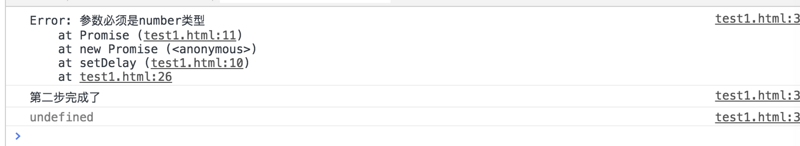
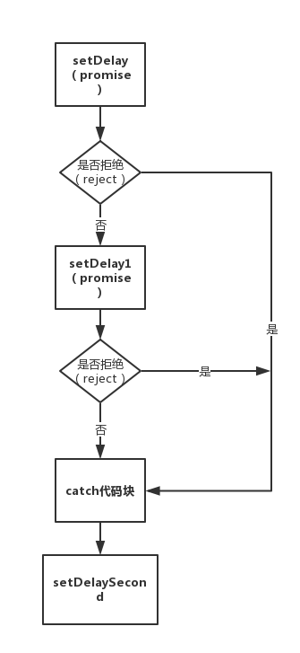

# WEB前端高级知识03

# Promise及Async/Await

# 一、为什么有Async/Await？

我们都知道已经有了`Promise`的解决方案了，为什么还要ES7提出新的Async/Await标准呢？

答案其实也显而易见：`Promise`虽然跳出了异步嵌套的怪圈，用链式表达更加清晰，但是我们也发现如果有大量的异步请求的时候，流程复杂的情况下，会发现充满了屏幕的`then`，看起来非常吃力，而ES7的Async/Await的出现就是为了解决这种复杂的情况。

首先，我们必须了解`Promise`。

# 二、Promise简介

## 2.1 Promise实例

什么是Promise，很多人应该都知道基础概念？直接看下面的代码（**全文的例子都是基于`setDelaySecond`和`setDelay`两个函数，请务必记住**）：

```js
const setDelay = (millisecond) => {
  return new Promise((resolve, reject)=>{
      if (typeof millisecond != 'number') reject(new Error('参数必须是number类型'));
      setTimeout(()=> {
        resolve(`我延迟了${millisecond}毫秒后输出的`)
      }, millisecond)
  })
}
```

我们把一个Promise封装在一个函数里面同时返回了一个Promise，这样比较规范。

可以看到定义的Promise有两个参数，`resolve`和`reject`。

- `resolve`：将异步的执行从`pending(请求)`变成了`resolve(成功返回)`，是个函数执行返回。
- `reject`：顾名思义“拒绝”，就是从请求变成了"失败"，是个函数可以执行返回一个结果，但我们这里推荐大家返回一个错误`new Error()`。

> 上述例子，你可以`reject('返回一个字符串')`，随便你返回，但是我们还是**建议返回一个Error对象，这样更加清晰是“失败的”，这样更规范一点**。

## 2.2 Promise的then和catch

我们通过Promise的原型方法`then`拿到我们的返回值：

```js
setDelay(2000)
.then((result)=>{
    console.log(result) // 输出“我延迟了2000毫秒后输出的”
})
```

输出下列的值：“我延迟了2000毫秒后输出的”。

如果出错呢？那就用`catch`捕获：

```js
setDelay('我是字符串')
.then((result)=>{
    console.log(result) // 不进去了
})
.catch((err)=>{
    console.log(err) // 输出错误：“参数必须是number类型”
})
```

是不是很简单？好，现在我增加一点难度，如果多个`Promise`执行会是怎么样呢？

## 2.3 Promise相互依赖（耦合度高）

我们再写一个Promise,注意第6行代码依赖上一个promise：

```js
const setDelaySecond = (seconds) => {
  return new Promise((resolve, reject)=>{
      if (typeof seconds != 'number' || seconds > 10) reject(new Error('参数必须是number类型，并且小于等于10'));
      setTimeout(()=> {
        console.log(`先是setDelaySeconds函数输出，延迟了${seconds}秒，一共需要延迟${seconds+2}秒`)
        resolve(setDelay(2000)) // 这里依赖上一个Promise
      }, seconds * 1000)
  })
}
```

现在参考案例中的[demo5.html]()

在下一个需要依赖的`resolve`去返回另一个Promise，会发生什么呢？我们执行一下：

```js
setDelaySecond(3).then((result)=>{
  console.log(result)
}).catch((err)=>{
  console.log(err);
})
```

你会发现结果是先执行：**“先是setDelaySeconds输出，延迟了3秒，一共需要延迟5秒”**

再执行`setDelay`的`resolve`：**“我延迟了2000毫秒后输出的”**。的确做到了依次执行的目的。

有人说，我不想耦合性这么高，想先执行`setDelay`函数再执行`setDelaySecond`，但不想用上面那种写法，可以吗，答案是当然可以。

这种写法耦合度比较高，所以我们平时都是采用`链式调用`的方式来将不同的promise之间的依赖关系切断，放到.then中处理 

## 2.4 Promise链式写法

我们查看[demo6.html]()

首先先改写一下`setDelaySecond`，拒绝依赖，降低耦合性，两个promise就没有任何关系了。

```js
const setDelaySecond = (seconds) => {
  return new Promise((resolve, reject)=>{
      if (typeof seconds != 'number' || seconds > 10) reject(new Error('参数必须是number类型，并且小于等于10'));
      setTimeout(()=> {
        resolve(`我延迟了${seconds}秒后输出的，是第二个函数`)
      }, seconds * 1000)
  })
}
```

先执行`setDelay`在执行`setDelaySecond`，只需要在第一个`then`的结果中**返回下一个Promise就可以一直链式写下去了，相当于依次执行**：

```js
setDelaySecond(2).then(res => {
  console.log(res)
  return setDelay(2000)
}).then(res => {
  console.log(res)
})
```

发现确实达到了可喜的链式（终于脱离异步嵌套苦海，哭），可以看到`then`的链式写法非常优美。

### 2.4.1 链式写法需要注意的地方

这里一定要提到一点：

`then`式链式写法的本质其实是一直**往下传递返回一个新的Promise**，也就是说**then在下一步接收的是上一步返回的Promise**，理解这个对于后面的细节非常重要！！

那么并不是这么简单，then的返回我们可以看出有2个参数(都是回调)：

- 第一个回调是resolve的回调，也就是第一个参数用得最多，拿到的是上一步的`Promise`成功`resolve`的值。
- 第二个回调是reject的回调，用的不多，但是大家不要写错了，通常是拿到上一个的错误，那么这个错误处理和catch有什么区别和需要注意的地方呢？

我们修改上面的代码：

```js
setDelay(2000)//参数大于10会出错
.then((result)=>{
  console.log(result)
  console.log('我进行到第一步的');
  return setDelaySecond(20)
})
.then((result)=>{
  console.log('我进行到第二步的');
  console.log(result);
}, (_err)=> {
  console.log('我出错啦，进到这里捕获错误，但是不经过catch了');
})
.then((result)=>{
  console.log('我还是继续执行的！！！！')
})
.catch((err)=>{
  console.log(err);
})
```

可以看到输出结果是：进到了`then`的第二个参数（reject）中去了，而且最重要的是！不再经过`catch`了。

那么我们把catch挪上去，写到`then`错误处理前：

```js
setDelay(2000)//参数大于10会出错
.then((result)=>{
  console.log(result)
  console.log('我进行到第一步的');
  return setDelaySecond(20)
})
.catch((err)=>{ // 挪上去了
  console.log(err); // 这里catch到上一个返回Promise的错误
})
.then((result)=>{
  console.log('我进行到第二步的');
  console.log(result);
}, (_err)=> {
  console.log('我出错啦，但是由于catch在我前面，所以错误早就被捕获了，我这没有错误了');
})
.then((result)=>{
  console.log('我还是继续执行的！！！！')
})
```

可以看到先经过`catch`的捕获，后面就没错误了。

可以得出需要注意的：

- `catch`写法是针对于整个链式写法的错误捕获的，而`then`第二个参数是针对于上一个返回`Promise`的。
- 两者的优先级：就是**看谁在链式写法的前面**，在前面的先捕获到错误，后面就没有错误可以捕获了，链式前面的优先级大，而且两者都不是`break`， 可以继续执行后续操作不受影响。

### 2.4.2 链式写法的错误处理

上述已经写好了关于then里面三个回调中第二个回调（reject）会与catch冲突的问题，那么我们实际写的时候，参数捕获的方式基本写得少，catch的写法会用到更多。

既然有了很多的Promise，那么我需不需要写很多catch呢？

答案当然是：**不需要！**，哪有那么麻烦的写法，只需要在末尾`catch`一下就可以了，因为链式写法的错误处理具有“冒泡”特性，**链式中任何一个环节出问题，都会被`catch`到，同时在某个环节后面的代码就不会执行了**。

既然说到这里，我们把`catch`移到第一个链式的返回里面会发生什么事呢？看下面代码：

```js
setDelay('2000')
.then((result)=>{
  console.log('第一步完成了');
  console.log(result)
  return setDelaySecond(3)
})
.catch((err)=>{ // 这里移到第一个链式去，发现上面的不执行了，下面的继续执行
  console.log(err);
})
.then((result)=>{
  console.log('第二步完成了');
  console.log(result);
})
```

惊喜的发现，**链式继续走下去了**！！输出如下（undefined是因为上一个then没有返回一个Promise）：



重点来了！敲黑板！！**链式中的`catch`并不是终点！！catch完如果还有then还会继续往下走！**不信的话可以把第一个`catch`在最后面的那个例子后面再加几个`then`，你会发现**并不会跳出链式执行**。

如果顺序执行`setDelay，setDelay1,setDelaySecond`，按照上述的逻辑，流程图可以概括如下：



`catch`只是捕获错误的一个链式表达，并不是break！

所以，**catch放的位置也很有讲究**，一般放在一些重要的、必须catch的程序的最后。**这些重要的程序中间一旦出现错误，会马上跳过其他后续程序的操作直接执行到最近的catch代码块，但不影响catch后续的操作！！！！

到这就不得不体一个ES2018标准新引入的**Promise的`finally`**，表示在catch后必须肯定会默认执行的的操作。这里不多展开，细节可以参考：[Promise的finally](http://es6.ruanyifeng.com/#docs/promise#Promise-prototype-finally)

### 2.4.3 Promise链式中间想返回自定义的值

其实很简单，用`Promise`的原型方法`resolve`即可：

```
setDelay(2000).then((result)=>{
  console.log('第一步完成了');
  console.log(result);
  let message = '这是我自己想处理的值'; 
  return Promise.resolve(message) // 这里返回我想在下一阶段处理的值
})
.then((result)=>{
  console.log('第二步完成了');
  console.log(result); // 这里拿到上一阶段的返回值
  //return Promise.resolve('这里可以继续返回')
})
.catch((err)=>{
  console.log(err);
})
```

### 2.4.4 如何跳出或停止Promise链式

不同于一般的`function`的`break`的方式，如果你是这样的操作：`func().then().then().then().catch()`的方式，你想在第一个`then`就跳出链式，后面的不想执行了，不同于一般的`break;return null;return false`等操作，可以说，如何停止Promise链，是一大难点，是整个Promise最复杂的地方。

 **1.用链式的思维想，我们拒绝掉某一链，那么不就是相当于直接跳到了catch模块吗？**

我们是不是可以直接“拒绝“掉达到停止的目的？

Demo7.html

```js
setDelay(2000)
.then((result)=>{
  console.log(result)
  console.log('我进行到第一步的');
  return setDelaySecond(1)
})
.then((result)=>{
  console.log('我进行到第二步的');
  console.log(result);
  console.log('我主动跳出循环了');
  return Promise.reject('跳出循环的信息') // 这里返回一个reject,主动跳出循环了
})
.then((result)=>{
  console.log('我不执行');
})
.catch((mes)=>{
  console.dir(mes)
  console.log('我跳出了');
})
```

但是很容易看到缺点：有时候你并不确定是因为错误跳出的，还是主动跳出的，所以我们可以加一个标志位：

```js
return Promise.reject({
    isNotErrorExpection: true // 返回的地方加一个标志位，判断是否是错误类型，如果不是，那么说明可以是主动跳出循环的
}) 
```

或者根据上述的代码判断catch的地方输出的类型是不是属于错误对象的，是的话说明是错误，不是的话说明是主动跳出的，你可以自己选择（这就是为什么要统一错误reject的时候输出new Error('错误信息')的原因，规范！）

当然你也可以直接抛出一个错误跳出：

```js
throw new Error('错误信息') // 直接跳出，那就不能用判断是否为错误对象的方法进行判断了
```

**2.那有时候我们有这个需求：catch是放在中间（不是末尾），而同时我们又不想执行catch后面的代码，也就是链式的绝对中止，应该怎么办？**

我们看这段代码：

```js
setDelay(2000)
.then((result)=>{
  console.log(result)
  console.log('我进行到第一步的');
  return setDelaySecond(1)
})
.then((result)=>{
  console.log('我进行到第二步的');
  console.log(result);
  console.log('我主动跳出循环了');
  return Promise.reject('跳出循环的信息') // 这里直接调用Promise原型方法返回一个reject,主动跳出循环了
})
.then((result)=>{
  console.log('我不执行');
})
.catch((mes)=>{
  console.dir(mes)
  console.log('我跳出了');
})
.then((res)=>{
    console.log('我不想执行，但是却执行了'); // 问题在这，上述的终止方法治标不治本。
})
```

这时候最后一步`then`还是执行了，整条链都其实没有本质上的跳出，那应该怎么办呢？

**敲黑板！！重点来了！**我们看[Promise/A+](https://promisesaplus.com/)规范可以知道：

> A promise must be in one of three states: pending, fulfilled, or rejected.

Promise其实是有三种状态的：**pending，resolve，rejected**，那么我们一直在讨论`resolve和rejected`这2个状态，是不是忽视了`pending`这个状态呢？pending状态顾名思义就是请求中的状态，成功请求就是resolve，失败就是reject，其实他就是个中间过渡状态。

而我们上面讨论过了，**`then`的下一层级其实得到的是上一层级返回的Promise对象，也就是说原Promise对象与新对象状态保持一致**。那么重点来了，如果你想在这一层级进行终止，是不是直接让它永远都`pending`下去，那么后续的操作不就没了吗？是不是就达到这个目的了？？觉得有疑问的可以参考[Promise/A+](https://promisesaplus.com/)规范。

我们直接看代码：

```
setDelay(2000)
.then((result)=>{
  console.log(result)
  console.log('我进行到第一步的');
  return setDelaySecond(1)
})
.then((result)=>{
  console.log(result);
  console.log('我主动跳出循环了');
  // return Promise.reject('跳出循环的信息')
  // 重点在这
  return new Promise(()=>{console.log('后续的不会执行')}) // 这里返回的一个新的Promise，没有resolve和reject，那么会一直处于pending状态，因为没返回啊，那么这种状态就一直保持着，中断了这个Promise
})
.then((result)=>{
  console.log('我不执行');
})
.catch((mes)=>{
  console.dir(mes)
  console.log('我跳出了');
})
.then((res)=>{
  console.log('我也不会执行')
})
```

这样就解决了上述，错误跳出而导致无法完全终止Promise链的问题。

但是！随之而来也有一个问题，那就是可能会导致**潜在的内存泄漏**，因为我们知道这个一直处于pending状态下的Promise会一直处于被挂起的状态，而我们具体不知道浏览器的机制细节也不清楚，一般的网页没有关系，但大量的复杂的这种pending状态势必会导致内存泄漏，具体的没有测试过，后续可能会跟进测试（nodeJS或webapp里面不推荐这样），而我通过查询也难以找到答案，这篇文章可以推荐看一下：[从如何停掉 Promise 链说起](https://github.com/xieranmaya/blog/issues/5)。可能对你有帮助在此种情况下如何做。

当然一般情况下是不会存在泄漏，只是有这种风险，无法取消Promise一直是它的痛点。而上述两个奇妙的取消方法要具体情形具体使用。

## 2.8 Promise.all()

Promise.all()可以将不同的promise按照其最后执行完毕的那一个为基准，将放置在all()中的所有promise的返回同时处理。

其实就相当于假设我有多个基于promise封装的延时函数，我想保证他们所有全部执行完毕之后再做其他的业务，那么就可以通过promise.all来实现等待所有的promise执行完毕

参考[demo8.html]()

```js
//promise.all相当于统一处理了
    //多个promise任务，保证处理的这些所有promise
    //对象的状态全部变成为fulfilled之后才会出发all的
    //.then函数来保证将防止在all中的所有任务的结果返回
    let p1 = new Promise(resolve => {
      setTimeout(() => {
        resolve('第一个promise执行完毕')
      },1000)
    })
    let p2 = new Promise(resolve => {
      setTimeout(() => {
        resolve('第二个promise执行完毕')
      },2000)
    })
    let p3 = new Promise(resolve => {
      setTimeout(() => {
        resolve('第三个promise执行完毕')
      },3000)
    })
    Promise.all([p1,p3,p2]).then(res => {
      console.log(res)
    })
```


总结：

> Promise.all主要用于批量处理多个不同的Promise任务
>
> 这些任务的特点是不知道具体哪个多久能完成
>
> all能保证让这些所有输入的任务状态全部变成为fulfilled之后
>
> 再将所有的任务结果拿到来保证我们在all的.then函数中得到的就是之前所有未知任务的结果
>
> 用来保证任务的顺序
>
> Promise.all([promise对象,promise对象,promise对象...]).then(res=>{
>
> res也是数组按照参数输入的顺序和上面的的数组一一对应  
>
> })

##  2.9Promise.race()

Promise.race()根据名称分析，其实就是竞争的意思，他能实现的功能是，如果有多个promise的任务定义了，如果使用.race可以实现将这些任务中最快完成的那个任务直接返回。

参考[demo9.html]()

> Promise.race([promise对象,promise对象,...]).then(res => {
>
> ​	res为所有任务中最先变更状态的那个任务的参数
>
> })

## 2.10Promise.resolve(值)

他相当于promise对象中内置的resolve函数，在promise中可以直接使用Promise.resolve来让promise状态直接变更

## 2.11Promise.reject(值)

他相当于promise对象中内置的reject函数，在promise中可以直接将状态变成为拒绝，常用于跳出链式调用的.then

# 三、async/await介绍

## 3.1 基于Promise的Async/await

什么是`async/await`呢？可以总结为一句话：**async/await是一对好基友，缺一不可，他们的出生是为Promise服务的**。可以说async/await是Promise的衍生物，进化版。 

为什么要有`async/await`存在呢？

前文已经说过了，为了解决大量复杂不易读的Promise异步的问题，才出现的改良版。

**这两个基友必须同时出现，缺一不可**，那么先说一下`async`：

```js
async function process() {
}
```

上面可以看出，**`async`必须声明的是一个function**，不要去声明别的，要是那样`await`就不理你了（报错）。

这样声明也是错的！

```
const async demo = function () {} // 错误
```

必须紧跟着`function`。接下来说一下它的兄弟`await`。

上面说到必须是个函数（function），**那么`await`就必须是在这个`async`声明的函数内部使用**，否则就会报错。

就算你这样写，也是错的。

```
let data = 'data'
demo  = async function () {
    const test = function () {
        await data
    }
}
```

必须是直系（作用域链不能隔代），这样会报错：`Uncaught SyntaxError: await is only valid in async function`。

讲完了基本规范，我们接下去说一下他们的本质。

通过[demo10.html]()简单了解一下async函数的基本现象


## 3.2 async的本质

敲黑板！！！很重要！**async声明的函数的返回本质上是一个Promise**。

什么意思呢？就是说你只要声明了这个函数是`async`，那么内部不管你怎么处理，它的返回肯定是个Promise。

看下列例子：

```js
(async function () {
    return '我是Promise'
})()
// 返回是Promise
//Promise {<resolved>: "我是Promise"}
```

你会发现返回是这个：`Promise {<resolved>: "我是Promise"}`。

自动解析成`Promise.resolve('我是Promise');`

等同于：

```
(async function () {
    return Promise.resolve('我是Promise');
})()
```

所以你想像一般`function`的返回那样，拿到返回值，原来的思维要改改了！你可以这样拿到返回值：

```
const demo = async function () {
    return Promise.resolve('我是Promise');
    // 等同于 return '我是Promise'
    // 等同于 return new Promise((resolve,reject)=>{ resolve('我是Promise') })
}
demo.then(result=>{
    console.log(result) // 这里拿到返回值
})
```

**上述三种写法都行，要看注释细节都写在里面了！！像对待Promise一样去对待async的返回值！！！**

好的接下去我们看`await`的干嘛用的.

## 3.3 await的本质与例子

await的本质是**可以提供等同于”同步效果“的等待异步返回能力的语法糖**。

这一句咋一看很别扭，好的不急，我们从例子开始看：

```js
const demo = async ()=>{
    let result = await new Promise((resolve, reject) => {
      setTimeout(()=>{
        resolve('我延迟了一秒')
      }, 1000)
    });
    console.log('我由于上面的程序还没执行完，先不执行“等待一会”');
}
// demo的返回当做Promise
demo().then(result=>{
  console.log('输出',result);
})
```

**await顾名思义就是等待一会**，只要`await`声明的函数还没有返回，**那么下面的程序是不会去执行的！！！**。这就是字面意义的等待一会（等待返回再去执行）。

那么你到这测试一下，你会发现输出是这个：`输出 undefined`。这是为什么呢？这也是我想强调的一个地方！！！

你在`demo`函数里面都没声明返回，哪来的`then`？所以正确写法是这样：

```js
const demo = async ()=>{
    let result = await new Promise((resolve, reject) => {
      setTimeout(()=>{
        resolve('我延迟了一秒')
      }, 1000)
    });
    console.log('我由于上面的程序还没执行完，先不执行“等待一会”');
    return result;
}
// demo的返回当做Promise
demo().then(result=>{
  console.log('输出',result); // 输出 我延迟了一秒
})
```

我推荐的写法是带上`then`，规范一点，当然你没有返回也是没问题的，`demo`会照常执行。下面这种写法是不带返回值的写法：

```js
const demo = async ()=>{
    let result = await new Promise((resolve, reject) => {
      setTimeout(()=>{
        resolve('我延迟了一秒')
      }, 1000)
    });
    console.log('我由于上面的程序还没执行完，先不执行“等待一会”');
}
demo();
```

所以可以发现，只要你用await声明的异步返回，是必须“等待”到有返回值的时候，代码才继续执行下去。

那事实是这样吗？你可以跑一下这段代码：

```js
const demo = async ()=>{
    let result = await setTimeout(()=>{
      console.log('我延迟了一秒');
    }, 1000)
    console.log('我由于上面的程序还没执行完，先不执行“等待一会”');
    return result
}
demo().then(result=>{
  console.log('输出',result);
})
```

你会发现，输出是这样的：

```
我由于上面的程序还没执行完，先不执行“等待一会”
输出 1
我延迟了一秒
```

奇怪，并没有await啊？`setTimeout`是异步啊，问题在哪？问题就在于`setTimeout`**这是个异步，但是不是`Promise`**！起不到“等待一会”的作用。

所以更准确的说法应该是**用await声明的Promise异步返回，必须“等待”到有返回值的时候，代码才继续执行下去。**

**请记住await是在等待一个Promise的异步返回**

当然这种等待的效果只存在于“异步”的情况，await可以用于声明一般情况下的传值吗？

事实是当然可以：

```js
const demo = async ()=>{
    let message = '我是声明值'
    let result = await message;
    console.log(result); 
    console.log('我由于上面的程序还没执行完，先不执行“等待一会”');
    return result
}
demo().then(result=>{
  console.log('输出',result);
})
```

输出：

```
我是声明值
我由于上面的程序还没执行完，先不执行“等待一会”
输出 我是声明值
```

这里只要注意一点：`then`的执行总是最后的。

## **容易写错的练习**

我们在这里做两个Promise改造成async和await的易错练习

第一步：

```js
let p = new Promise(resolve=>{
				resolve(123)
			})
			let p1 = new Promise(resolve=>{
				resolve(456)
			})
			async function test(){
				let res = await p;
				console.log(res);
			}
			async function test1(){
				let res1 = await p1;
				console.log(res1);
			}
			test(); 
			test1();
```

第二步：

```js
let p = new Promise(resolve=>{
  resolve(123)
})
let p1 = new Promise(resolve=>{
  resolve(456)
})
async function test(){
  let res = await p;
  console.log(res);
  setTimeout(function() {
    console.log(1);
  }, 0);
  console.log(3);
}
async function test1(){
  let res1 = await p1;
  console.log(res1);
  setTimeout(function() {
    console.log(2);
  }, 0);
  console.log(4);
}
test(); 
test1();
```

第三步：

```js
let p = new Promise((resolve) => {
  resolve(123);
});
let p1 = new Promise((resolve) => {
  resolve(456);
});
async function test() {
  let res = await p;
  console.log(res);
  setTimeout(() => {
    console.log(1);
  }, 0);
  let a = 5;
  //在执行test和test1的时候
  //微任务队列只有test和test1两个任务
  //先执行test函数的内容
  //执行发现test函数中又有了一个promise任务
  //就需要将他插入到微任务队列
  //所以他就会放到test1这个任务之后
  new Promise((resolve) => resolve(a)).then((res) => {
    console.log(res);
    console.log(3);
  });
  //等同写法
  // await a
  // console.log(a)
  // console.log(3)
  console.log(7);
}
async function test1() {
  let res1 = await p1;
  console.log(res1);
  setTimeout(() => {
    console.log(2);
  }, 0);
  let a = 6;
  new Promise((resolve) => resolve(a)).then((res) => {
    console.log(res);
    console.log(4);
  });
  console.log(8);
}
test();
test1();
```


> 总结：
>
> async修饰的函数相当于一个promise对象
>
> await可以控制promise中等待执行的过程，让他之后的代码都可以等await后面的promise状态变更后才执行。
>
> 同时await关键字只要写入就相当于创建了一个promise对象
>
> await下一行的代码都相当于promise的.then中的内容
>
> 也就是说只要在async中有await就相当于创建了一个微任务，一定会按照eventLoop队列的执行顺序去执行代码

## 3.4 async/await错误处理

因为async函数返回的是一个Promise，所以我们可以在外面`catch`住错误。

```js
const demo = async ()=>{
  const result = await setDelay(1000);
  console.log(result);
  console.log(await setDelaySecond(2));
  console.log(await setDelay(1000));
  console.log('完成了');
}
demo().catch(err=>{
    console.log(err);
})
```

在async函数的`catch`中捕获错误，当做一个Pormise处理，**同时你不想用这种方法，可以使用`try...catch`语句：**

```
(async ()=>{
  try{
    const result = await setDelay(1000);
    console.log(result);
    console.log(await setDelaySecond(2));
    console.log(await setDelay(1000));
    console.log('完成了');
  } catch (e) {
    console.log(e); // 这里捕获错误
  }
})()
```

当然这时候你就不需要在外面`catch`了。

通常我们的`try...catch`数量不会太多，几个最多了，**如果太多了，说明你的代码肯定需要重构了，一定没有写得非常好。还有一点就是try...catch通常只用在需要的时候，有时候不需要catch错误的地方就可以不写。**

有人会问了，我`try...catch`好像只能包裹代码块，如果我需要拆分开分别处理，**不想因为一个的错误就整个process都crash掉了**，那么难道我要写一堆`try...catch`吗？我就是别扭，我就是不想写`try...catch`怎嘛办？下面有一种很好的解决方案，仅供参考：

我们知道await后面跟着的肯定是一个`Promise`那是不是可以这样写？

```
(async ()=>{
  const result = await setDelay(1000).catch(err=>{
      console.log(err)
  });
  console.log(result);
  const result1 = await setDelaySecond(12).catch(err=>{
      console.log(err)
  })
  console.log(result1);
  console.log(await setDelay(1000));
  console.log('完成了');
})()
```

这样输出：

```
我延迟了1000毫秒后输出的
Error: 参数必须是number类型，并且小于等于10
    at Promise (test4.html:19)
    at new Promise (<anonymous>)
    at setDelaySecond (test4.html:18)
    at test4.html:56
undefined
我延迟了1000毫秒后输出的
完成了
```

是不是就算有错误，也不会影响后续的操作，是不是很棒？**当然不是，你说这代码也忒丑了吧，乱七八糟的，写得别扭await又跟着catch**。那么我们可以改进一下，封装一下提取错误的代码函数：

```
// to function
function to(promise) {
   return promise.then(data => {
      return [null, data];
   })
   .catch(err => [err]); // es6的返回写法
}
```

返回的是一个数组，第一个是错误，第二个是异步结果，使用如下：

```
(async ()=>{
   // es6的写法，返回一个数组(你可以改回es5的写法觉得不习惯的话)，第一个是错误信息，第二个是then的异步返回数据，这里要注意一下重复变量声明可能导致问题（这里举例是全局，如果用let，const，请换变量名）。
  [err, result] = await to(setDelay(1000)) 
   // 如果err存在就是有错，不想继续执行就抛出错误
  if (err) throw new Error('出现错误，同时我不想执行了');
  console.log(result);
  [err, result1] = await to(setDelaySecond(12))
   // 还想执行就不要抛出错误
  if (err) console.log('出现错误，同时我想继续执行', err);
  console.log(result1);
  console.log(await setDelay(1000));
  console.log('完成了');
})()
```

## 3.5 async/await的中断（终止程序）

首先我们要明确的是，`Promise`**本身是无法中止的**，`Promise`本身**只是一个状态机**，存储三个状态（pending，resolved，rejected），一旦发出请求了，**必须闭环，无法取消**，之前处于pending状态只是一个挂起请求的状态，并不是取消，一般不会让这种情况发生，只是用来临时中止链式的进行。

中断（终止）的本质在链式中只是挂起，并不是本质的取消`Promise`请求，那样是做不到的，`Promise`也没有`cancel`的状态。

不同于`Promise`的链式写法，写在async/await中想要中断程序就很简单了，因为语义化非常明显，其实就和一般的`function`写法一样，想要中断的时候，直接`return`一个值就行，`null`，空，`false`都是可以的。看例子：

```js
let count = 6;
const demo = async ()=>{
  const result = await setDelay(1000);
  console.log(result);
  const result1 = await setDelaySecond(count);
  console.log(result1);
  if (count > 5) {
      return '我退出了，下面的不进行了';
    // return; 
    // return false; // 这些写法都可以
    // return null;
  }
  console.log(await setDelay(1000));
  console.log('完成了');
};
demo().then(result=>{
  console.log(result);
})
.catch(err=>{
  console.log(err);
})
```

实质就是直接`return`返回了一个`Promise`，相当于`return Promise.resolve('我退出了下面不进行了')`，当然你也可以返回一个“拒绝”：`return Promise.reject(new Error('拒绝'))`那么就会进到错误信息里去。

 **async函数实质就是返回一个Promise！**

