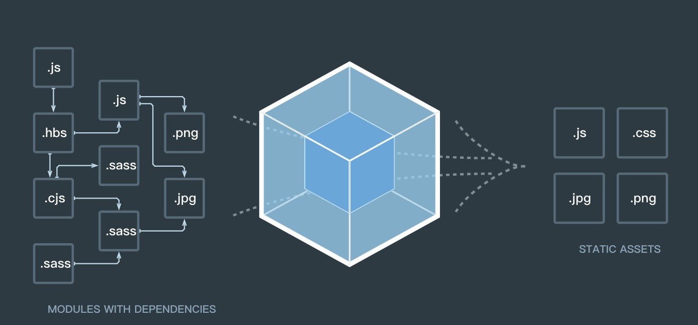

# Webpack基础


## 1.webpack介绍

> 前言，webpack是大前端时代的一个核心的支撑物，也就是说如果没有webpack也就就没有大前端时代

### 1.1什么是webpack

在过去的脚手架项目学习过程中，我们通过创建vue或jsx文件完成项目的开发和构建，但是这些文件本身是无法被浏览器识别并解析的，他们之所以能工作就是通过webpack环境来编译和构建的。

> 定义：
>
> webpack是一个本地的编译环境，他可以把浏览器不识别的文件类型或语法，通过loader和plugin等插件转换成浏览器能识别的html，css和javascript并实时编译和输出

### 1.2webpack的简介

本质上，*webpack* 是一个现代 JavaScript 应用程序的*静态模块打包器(module bundler)*。当 webpack 处理应用程序时，它会递归地构建一个*依赖关系图(dependency graph)*，其中包含应用程序需要的每个模块，然后将所有这些模块打包成一个或多个 *bundle*。

我们来通过图片理解一下webpack的核心功能



本质上，webpack就是一个加工工厂，将左侧复杂的文件类型和语法转换成右侧的web页面可用的语法和文件

### 1.3webpack的基本使用方式

```sh
npm i webpack -D #安装webpack核心文件
```

```sh
npm i webpack-cli -D #安装webpack脚手架工具
```

### 1.4创建一个简单的webpack项目

首先在案例文件夹中创建一个文件夹`webpack01`在文件夹上右键使用命令行打开

```sh
npm init #将其初始化为npm项目，并声称package.json
```

然后安装webpack和webpack-cli

安装完毕之后我们创建src文件夹并且在src文件夹之下创建index.js文件结构如下

```sh
├── package-lock.json #package的相关锁定依赖
├── package.json #项目依赖核心描述文件
├── src #源代码文件夹
    └── index.js #项目内容
```

在index.js中创建如下内容

```js
const name = 'hello webpack'
```

在项目根目录下创建webpack.config.js文件

```js
//webpack.config.js
const path = require('path')//引入path模块
module.exports = {
	entry:{//entry表示webpack编译的入口文件，代表当前我们项目中使用的源代码部分的文件路径和依赖名称
		index:'./src/index.js' //index代表构建时生成的js依赖名称，他的值代表编译之前要扫描的文件路径
	},
	output:{//output代表构建完毕后生成的依赖的配置对象
    //path代表生成的js文件要放置的文件路径
		path:path.resolve(__dirname,'dist'),
    //filename代表生成的js文件要生成的名称[name]相当于从entry中获取的
    //名称，就是entry中配置的key
		filename:'[name].bundle.js'
	}
}
```

在package.json中配置webpack编译要执行的指令

```json
{
  "name": "webpack01",
  "version": "1.0.0",
  "description": "",
  "main": "index.js",
  "scripts": {
    "test": "echo \"Error: no test specified\" && exit 1",
    //该注释在package.json中使用时要删掉，package.json不允许使用注释
    //build为webpack运行命令，执行npm run build时会执行该命令
    //该命令的意义为通过webpack运行webpack.config.js文件的配置参数，并展示颜色和过程
    //运行后webpack就会编译entry中配置的js文件并输出到output中配置的路径内
    "build": "webpack --config webpack.config.js --color --progress"
  },
  "author": "oracle",
  "license": "ISC",
  "devDependencies": {
    "webpack": "^5.1.3",
    "webpack-cli": "^4.0.0"
  }
}

```

以上操作完成之后在项目根目录下运行

```sh
npm run build
```

然后我们发现在index.bundle.js中什么都没有，这时我们将index.js改造成如下效果

```js
const name = 'hello webpack'
console.log(name)
```

我们在运行`npm run build`查看结果这时输出的结果为

```js
console.log("hello webpack");
```

然后我们在做一步操作

index.js的代码改为如下效果

```js
const name = 'hello webpack'
if(name.indexOf('hello')!=-1){
  console.log(name)
}
```

然后运行并查看

然后我们可以查看命令行中的日志，并且查看项目中dist文件夹生成的index.bundle.js文件内容

> 总结：
>
> 通过以上案例我们可以将webpack理解成一个加工厂，他的工作就是将我们写的js以及其他代码进行一次修改之后再输出到指定的位置。
>

## 2.webpack的用法

### 2.1配合loader使用的基础

#### 2.1.1babel-loader

了解了webpack的基本使用之后我们在js代码中增加一段逻辑

```js
//src/index.js
const name = 'hello webpack'
console.log(name)
let d = new Promise((resolve,reject) => {
	setTimeout(()=>{
		resolve('hello')
	},1000)
})
d.then(res => {
	console.log(res)
})
const arr = [1,2]
arr.map(item => {
	console.log(item)
})
```

在这里我们增加了一段promise代码，然后再次执行

```sh
npm run build
```

查看生成的代码后我们发现Promise和es6的循环都是原样输出的只是做了代码混淆并没有其他的变化

那么这个构建对我们来说其实是一次无意义的构建。因为Promise和es6以后的语法并不是所有浏览器都支持的

**webpack存在的意义不光是构建代码，还要在构建代码的过程中解决兼容性的问题**

这里我们就需要学习一个新的功能loader。

我们先看一下官方对loader的介绍：

*loader* 让 webpack 能够去处理那些非 JavaScript 文件（webpack 自身只理解 JavaScript）。loader 可以将所有类型的文件转换为 webpack 能够处理的有效[模块](https://www.webpackjs.com/concepts/modules)，然后你就可以利用 webpack 的打包能力，对它们进行处理。

本质上，webpack loader 将所有类型的文件，转换为应用程序的依赖图（和最终的 bundle）可以直接引用的模块。

> 我们在这里可以对他做一个最初步的理解，就是loader可以帮我们解决javascript兼容性的问题，还可以让浏览器本来不能执行的代码变成浏览器能执行的js代码

这里就需要使用一个叫做babel-loader的插件

1. 安装babel-loader

   ```sh
   npm i babel-loader -D
   ```

2. 在webpack中使用loader

   ```js
   const path = require('path')
   module.exports = {
   	entry:{
   		index:'./src/index.js'
   	},
   	output:{
   		path:path.resolve(__dirname,'dist'),
   		filename:'[name].bundle.js'
   	},
   	module:{
   		rules:[
   			{
           //test代表当前的loader扫描的文件类型
   				test:/\.js$/,
           //use代表对当前文件类型应用的loader是什么
   				use:{loader:'babel-loader'}
   			}
   		]
   	}
   }
   ```

3. 运行

   ```sh
   npm run build
   ```


然后我们发现结果还是原样输出的**(并且这里可能会发生错误)**仅仅是混淆了一部分代码。这是因为光有babel-loader是不够的

所以接下来我们要把babel的核心包配置起来

```sh
npm i @babel/core -D
```

```sh
npm i @babel/preset-env -D
```

```sh
npm i core-js -s
```

执行完以下操作之后我们在项目根目录创建一个名为.babelrc的文件

> 该文件的作用是用来让babel可以根据我们代码中使用的语法来决定是否将代码做兼容性处理

```json
//.babelrc 配置babel/preset-env用来驱动core-js来解析Promise等包
{
	"presets":[
		[
			"@babel/preset-env",
			{
				"useBuiltIns": "usage",//设置为自动检测es6以后的语法并按需引入相关库
				"corejs":3//使用core-js3版本的源码库
			}
		]
	]
}
```

在创建.browserslistrc文件

> browserslistrc文件用来描述我们当前的项目要兼容的浏览器的范围，babel会根据需要兼容的浏览器范围自动的进行代码的转译，这样我们就不需要考虑当前写的js是否在我们想要兼容的浏览器中可以使用，因为我们设置浏览器范围之后babel就会输出成这个范围内的浏览器都能正常执行的代码

```json
> 0.25% 
last 2 versions
```

browserlist配置说明

| 例子                       | 说明                                                    |
| :------------------------- | :------------------------------------------------------ |
| > 1%                       | 全球超过1%人使用的浏览器                                |
| > 5% in US                 | 指定国家使用率覆盖                                      |
| last 2 versions            | 所有浏览器兼容到最后两个版本根据 CanIUse.com 追踪的版本 |
| Firefox ESR                | 火狐最新版本                                            |
| Firefox > 20               | 指定浏览器的版本范围                                    |
| not ie <=8                 | 方向排除部分版本                                        |
| Firefox 12.1               | 指定浏览器的兼容到指定版本                              |
| unreleased versions        | 所有浏览器的beta测试版本                                |
| unreleased Chrome versions | 指定浏览器的测试版本                                    |
| since 2013                 | 2013年之后发布的所有版本                                |

使用了如下配置之后我们在执行

```sh
npm run build
```

这时我们查看编译后的文件，发现代码混合进来很多的混淆函数，并且我们查看最下方可以找到我们自己编写的部分代码，然后我们查看webpack构建时输出的日志

```sh
asset index.bundle.js 20.2 KiB [emitted] [minimized] (name: index)
runtime modules 939 bytes 4 modules
modules by path ./node_modules/core-js/internals/*.js 41.7 KiB 79 modules
modules by path ./node_modules/core-js/modules/*.js 14.5 KiB
  ./node_modules/core-js/modules/es.array.map.js 790 bytes [built] [code generated]
  ./node_modules/core-js/modules/es.object.to-string.js 395 bytes [built] [code generated]
  ./node_modules/core-js/modules/es.promise.js 13.4 KiB [built] [code generated]
./src/index.js 399 bytes [built] [code generated]
webpack 5.1.3 compiled successfully in 1601 ms

```

ECMAScript 的迅速成长以及浏览器的频繁更新换代，每年会出现新的api，core-js 就是提供新语法api一个集合库.

这里我们看他从core-js中拿出了map和promise的包，我们可以在构建出来的代码中搜索promise和map发现有很多地方对promise和map做了声明。

这就是babel根据我们在browserslistrc中定义的兼容范围来决定的构建结果，为了兼容> 0.25%使用率的浏览器并且兼容到最后两个版本，babel为了防止部分浏览器对Promise和map循环不兼容，他引用了core-js中单独对map循环和Promise库的代码这样就算浏览器不兼容map循环和promise对象，也能直接调用core-js中实现的promise和map循环，这个就是babel的作用。

接下来我们在学习一下如何使用browserslist，我们可以在当前的目录下在命令行执行

```sh
npx browserslist #用来查看当前项目的.browserslistrc文件中的配置描述所兼容的浏览器列表
```

执行之后控制台就会出现一系列的浏览器名称，这个就是我们当前配置的这个范围所兼容的所有浏览器，我们可以改造一下browserslist将它设置为

```sh
chrome > 80
```

这个配置代表只兼容chrome浏览器80版本以上的，然后我们执行

```sh
npx browserslist
```

看一下当前输出的浏览器列表

```sh
oracle@oracledeMacBook-Pro webpack01 % npx browserslist
chrome 86
chrome 85
chrome 84
chrome 83
chrome 81

```

只有chrome81-86，这代表我们当前的项目只需要支持chrome浏览器81-86版本就可以

这时我们再执行一次

```sh
npm run build
```

在看生成的index.bundle.js

发现代码又变成原样输出了，这是因为如果只支持chrome80以上版本，他的浏览器本身就支持es6以后的js语法所以代码不需要对他进行依赖库的补充。

以上就是在webpack中应用babel-loader并且根据想要兼容的浏览器范围自动构建兼容性代码的方法。

### 2.2配合plugin使用的基础

当我们已经解决了js的兼容性问题之后再考虑一个问题，我们使用webpack一定会配合项目去使用，这样的话如果只能编译js文件是完全没有用的，因为只有js文件我们没法在本地直接运行，需要依赖html页面当作运行javascript代码的容器，这样我们才能实现边开发边看结果。

想要让我们写的js不光能编译还能执行就需要使用webpack另一个功能：plugins


> plugins简介：
>
> 插件是 webpack 的[支柱](https://github.com/webpack/tapable)功能。webpack 自身也是构建于，你在 webpack 配置中用到的**相同的插件系统**之上！
>
> 插件目的在于解决 [loader](https://www.webpackjs.com/concepts/loaders) 无法实现的**其他事**。

#### 2.2.1html-webpack-plugin

我们学习第一个plugin：html-webpack-plugin，他可以将我们定义的js文件打包构建生成html与js混合的项目。首先我们要安装他

```sh
npm i html-webpack-plugin -D
```

安装完成之后在webpack.conig.js文件中饮用他并且配置到plugins中

```js
//webpack.config.js
const HtmlWebpackPlugin = require('html-webpack-plugin')
```

然后我们在项目根目录下创建public文件夹

并在public文件夹内部创建index.html文

然后在module,entry,output的同级别位置添加

```js
plugins:[
  new HtmlWebpackPlugin({
    template:'./public/index.html',//html原始模版位置
    filename:'index.html',//生成的html文件名
    //生成的html文件中引用的js依赖模块，这里填写的就是在entry中定义的key
    //也就是说如下配置相当于在index.html中引用了src/index.js
    chunks:['index']
  })
]
```

做了如下操作之后我们再执行

```sh
npm run build
```

查看结果，这次我们的dist文件夹中多生成了一个html文件，我们查看他的源代码，发现这个html文件自动引入了index.bundle.js并且运行他可以自动执行index.js文件。

完成此步骤之后我们回想vue，react等脚手架的结构。我们这里的index.html就是当时我们项目中的index.html这里的index.js就是项目中的main.js，学习这里我们就能理解为什么当时脚手架中不需要在index.html中引入任何依赖就可以关联到js文件了。因为他们都是通过html-webpack-plugin实现的。

### 2.3resolve的使用

resolve是webpack提供的一个用来解析文件以及引用路径的模块。

例如我们在过去的脚手架中使用import引用文件时，不需要写文件的后缀就可以实现引用对应的模块

再例如如果引用的文件是某个文件夹中的index.js如test/index.js，我们可以直接引用到该文件夹即可，如import xxx from './test'。

还有我们可以通过

```js
import xxx from '@/components/xxx'
```

这种@的形式来当作绝对路径进行模块的引用。

这些能力都是通过resolve对象进行解析的。

他的配置方式如下,在webpack.config.js中添加如下代码，

```js
//resolve是与entry，plugins等平级的属性，是webpack的解析模块
resolve:{
  //extensions用来定义后缀列表，在这里定义的后缀的文件类型在import引用时就不需要填写后缀
  extensions:['.js','.jsx','.vue','.less','.sass'],
  //alias代表引用路径的别名，如下配置代表import中如果存在@符号的路径
  //@符号就会被解释为从电脑根目录到当前项目的src，所以如果引用models/user-model.js
  //只需要import userModel from '@/models/user-model.js'就相当于从根目录到user-model.js的全路径
  alias:{
    '@':path.resolve(__dirname,'src')
  }
}
```

我们现在配置完resolve之后在src中创建一个model文件夹并且在其中创建一个user-model.js文件

```js
//model/user-model.js
export default {
	namespaced:true,
	state:{
		list:[]
	}
}
```

然后我们在index.js中进行引用，增加如下代码

```js
//index.js
import userModel from  '@/model/user-model'
console.log(userModel)
```

然后我们通过

```sh
npm run build
```

进行打包，这回我们直接运行生成的index.html文件，查看控制台是否打印了userModel对象的内容，如果打印出了结果就说明我们定义的别名和全路径的代号都生效了

### 2.4样式处理

完成了上述功能之后我们的webpack环境已经可以解决开发和代码的初步编译了，下面我们学习一下如何在webpack环境中使用css样式。

首先我们在src中创建一个index.css文件

```css
/*index.css*/
.test{
	display: flex;
	flex-direction: column;
	justify-content: center;
}
```

然后我们尝试在index.js中通过import引用css文件

```js
import '@/index.css'
```

然后执行

```js
npm run build
```

这里会产生如下错误

```sh
Module parse failed: Unexpected token (1:0)
You may need an appropriate loader to handle this file type, currently no loaders are configured to process this file. See https://webpack.js.org/concepts#loaders
> .test{
| 	display: flex;
| 	flex-direction: column;
 @ ./src/index.js 2:0-21

```

这是因为我们的webpack目前只认识js文件，因为我们在loader中仅仅对js文件做了兼容性处理。

他还不能识别css文件并加以处理。

如果想在js中引入css样式需要通过style-loader和css-loader

```sh
npm i style-loader -D #安装style-loader，style-loader是处理style样式的，他用来将样式文件通过js动态的添加到html的head标签中来实现样式加载
npm i css-loader -D #安装css-loader，css-loader是处理css样式文件的
```

安装完毕之后我们需要在webpack的module中的rules内部添加css文件的loader

```js
//webpack.config.js
//将这段代码添加到module中的rules中
{
  test:/\.css$/,//检测css结尾的文件
    //这里的loader是有顺序的，固定写法，先放style-loader，后放css-loader,loader的加载顺序是倒着加载的，所以会先执行css-loader将css样式代码转成js代码，然后执行style-loader将js中的样式动态添加到网页中
    use:[
      {loader:'style-loader'}, //使用style-loader用来将style样式追加到js代码中
      {loader:'css-loader'} //使用css-loader用来解析css文件
    ]
}
```

完成之后我们在执行

```sh
npm run build
```

这里我们在看打包构建的index.bundle.js，发现内部有处理样式的js文件

但是这个结果并不是我们预期想要的结果因为css样式文件我们想要通过单独的方式抽取到外面

与js混合的话会造成index.bundle.js单文件过大。

这里我们还需要使用一个plugin来处理css的分离：mini-css-extract-plugin

```sh
npm i mini-css-extract-plugin -D
```

然后我们在webpack.config.js中引用

```js
const MiniCssExtractPlugin = require('mini-css-extract-plugin')
```

然后需要改造css-loader部分的代码改造为如下

```js
{
  test:/\.css$/,
    use:[

      //{loader:'style-loader'},
      MiniCssExtractPlugin.loader,//这里必须将MiniCssExtractPlugin放在这个位置并且提取css之后不需要使用style-loader
      {loader:'css-loader'},

    ]
}
```

最后一步是将MiniCssExtractPlugin注册到plugins中

```js
//将它放入plugins中
new MiniCssExtractPlugin({
  filename:'[name].css'//这里的[name]获取的还是entry中的key
})
```

完成之后我们执行

```sh
npm run build
```

然后发现打包构建出来的文件多了一个index.css并且查看html文件发现已经将css自动引入了。

#### 2.4.1 css兼容性处理

css在各浏览器的兼容性也是存在差异的，有些浏览器处理的样式需要单独的增加浏览厂商的前缀才能展示正确的样式，这里我们可以通过一个叫做postcss-loader的loader来处理css兼容性问题

所以我们需要安装postcss-loader和postcss 以及postcss-preset-env三个组件

```sh
npm i postcss-loader postcss postcss-preset-env -D
```

然后在webpack.config.js中配置postcss-loader，改造module如下

```js
{
  test:/\.css$/,
    use:[
      //{loader:'style-loader'},
      MiniCssExtractPlugin.loader,
      {loader:'css-loader'},
      {loader:'postcss-loader'}//postcss-loader安装在最后
    ]
}
```

然后在根目录创建postcss.config.js

```js
//postcss.config.js这里默认插件使用postcss-preset-env
module.exports = {
	plugins: {
		'postcss-preset-env': {},
	}
}
```

然后我们运行

```sh
npm run build
```

然后查看index.css，发现并没有任何变化，这是因为我们刚才把browserslistrc改成了chrome > 80

postcss-loader同样是根据浏览器兼容范围决定的css补全，这个范围的css不需要考虑兼容性

所以我们将browserslistrc改成

```sh
> 0.25%
last 2 versions
```

让他变成兼容使用率大于0.25%的浏览器并且兼容到每款浏览器的最后两个版本，这里可以使用`npx browserslist`来看一下当前的浏览器列表

这回我们在通过npm run build来查看得到的index.css这里我们发现

```css
.test{
	display: -webkit-box;
	display: -ms-flexbox;
	display: flex;
	-webkit-box-orient: vertical;
	-webkit-box-direction: normal;
	    -ms-flex-direction: column;
	        flex-direction: column;
	-webkit-box-pack: center;
	    -ms-flex-pack: center;
	        justify-content: center;
}

```

生成的css样式变成了带前缀的样式表，这样我们就可以实现兼容更多的浏览器了。

#### 2.4.2 css压缩

但是还有一点不足的地方，我们来看一下当前的css打包的结果并不是压缩效果，而是纵向展示的，这样我们的css文件会比压缩文件大

所以我们应该使用css压缩技术来让他和js效果一样

这里需要安装postcss的插件cssnano

```sh
npm i cssnano -D
```

安装完成后改造postcss.config.js

```js
module.exports = {
	plugins: {
		'postcss-preset-env': {},
		'cssnano':{}
	}
}
```

然后我们接着打包构建

```sh
npm run build
```

完成后发现现在的css可以压缩了

### 2.5 样式处理sass处理

在src中创建一个index.scss

```sass
.o-test{
	display: flex;
	justify-content: center;
	.o-item{
		flex-grow: 1;
	}
}
```

然后我们在index.js中引入index.scss

```js
import '@/index.scss'
```


然后执行

```sh
npm run build
```

执行之后发现报错。这是因为我们只处理了css样式但是scss文件webpack仍然不认识

那么这时候我们就需要将scss也添加到module中如下,与css处理完全一样

```js
{
  test:/\.scss$/,
    use:[
      //{loader:'style-loader'},
      MiniCssExtractPlugin.loader,
      {loader:'css-loader'},
      {loader:'postcss-loader'}
    ]
}
```

然后运行

```sh
npm run build
```

当我们运行完毕发现，打包构建没有问题，但是生成的index.css中的css样式o-test还是嵌套语法，这样的嵌套格式网页是无法直接解析的。

所以这里我们需要引入另外一个loader：sass-loader

并且还需要一同安装sass和dart-sass

```sh
npm i sass-loader -D
npm i sass -D
npm i dart-sass -D
```


然后我们改造scss文件的处理

```js
{
  test:/\.scss$/,
    use:[
      //{loader:'style-loader'},
      MiniCssExtractPlugin.loader,
      {loader:'css-loader'},
      {loader:'postcss-loader'},
      {loader:'sass-loader'}//使用sass-loader来编译sass语法
    ]
}
```

这样操作完毕之后我们再执行一次

```sh
npm run build
```

再次查看生成的index.css文件，这时o-test的嵌套语法被解析成了css的子代选择器形式并且也补全了兼容性样式。这就是sass-loader处理scss文件的办法。

### 2.6代码压缩

我们学习的这个压缩插件并不是普通的代码混淆压缩，而是采用gzip的形式对文件进一步压缩，这样可以实现在网页中进行压缩传输更加的节省流量,[CompressionWebpackPlugin](https://www.webpackjs.com/plugins/compression-webpack-plugin/)

首先安装压缩插件

```sh
npm i compression-webpack-plugin -D
```

然后我们在webpack.config.js中引入

```js
const CompressionPlugin = require("compression-webpack-plugin");
```

然后我们在plugin中加入这个插件

```sh
new CompressionPlugin({
  algorithm: "gzip",//采用gzip的方式压缩代码
  test: /\.js$|\.html$|\.css$/, //要压缩的文件有js和html还有css类型
  threshold: 10240, //当文件尺寸超过10kb的时候会被压缩代码
  minRatio: 0.8 //压缩比例默认为0.8
})
```

然后我们运行

```sh
npm run build
```

再看dist的结果

## 3.loader的运行原理*（了解性学习）

loader其实就是在webpack开始工作的时候读取了我们配置loader的文件并且将它们的源码输入到loader中，在loader中做的操作就是拿到源码，做简单的处理并返回，从而交给下一个loader

我们打开webpack02的项目，查看webpack.config.js

这里我们对js文件使用了两个loader，这次使用的loader不是下载的，而是本地文件路径，所以我们找到loader中的代码

查看两个loader中的代码。

这两个loader中的代码就是自定义loader的最基本的格式，

loader是一个函数，参数就是配置的文件的源代码，会以字符串的形式得到，我们可以通过处理字符串来改变代码的内容

return之后源代码就交给下一个loader处理直到loader全处理完最后交给webpack，生成到output配置的路径中。

这里loader执行的顺序是按照数组配置的倒序执行的所以先执行p-loader1在执行p-loader

我们可以看到在p-loader1中我们对代码进行了替换，将所有的let和const替换成了var，然后第二个loader执行的时候得到的

source就是替换完之后的样子。这就是loader处理代码的过程。

## 4.plugin的运行原理*（了解性学习）

plugin与loader的功能不同，他并不是用于处理不同文件类型的代码存在的，他主要用于在webpack不同的生命周期阶段

处理一些复杂的操作，比如html-webpack-plugin就是在webpack处理完js和css之后将生成的文件，动态的添加到template文件的结构中

并输出新的html文件。具体的生命周期拦截方式以及创建方式我们可以参考webpack03